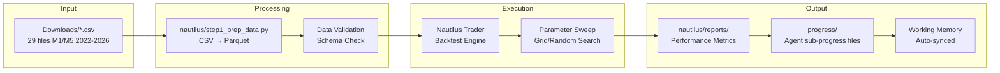
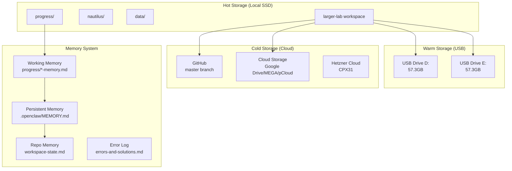
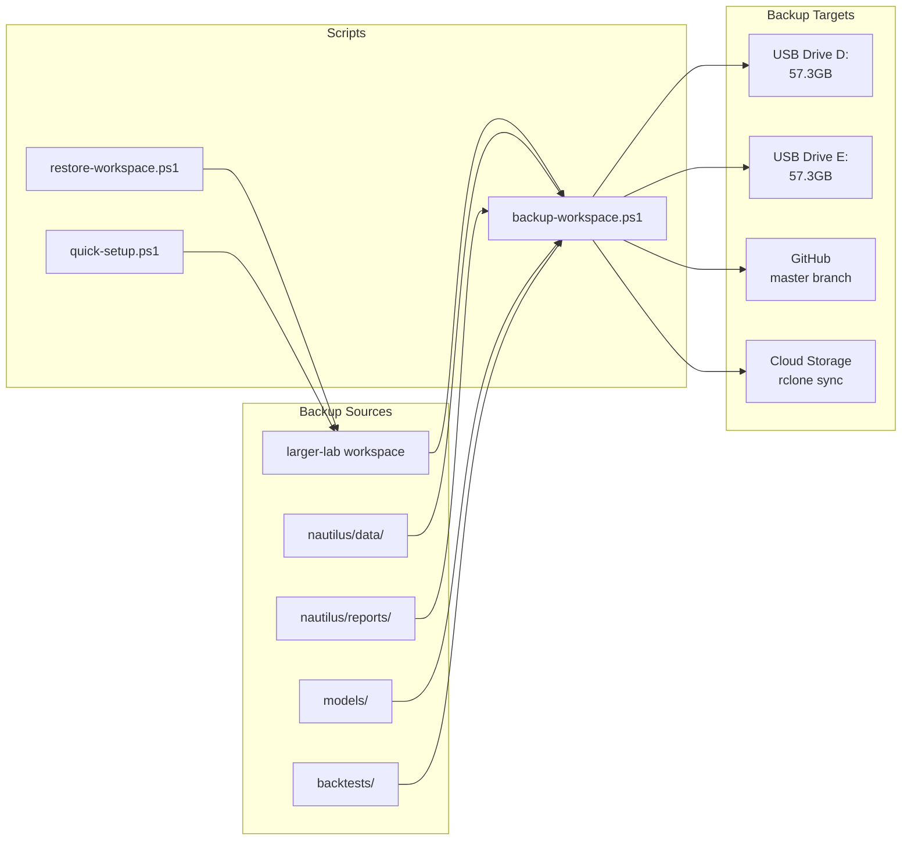
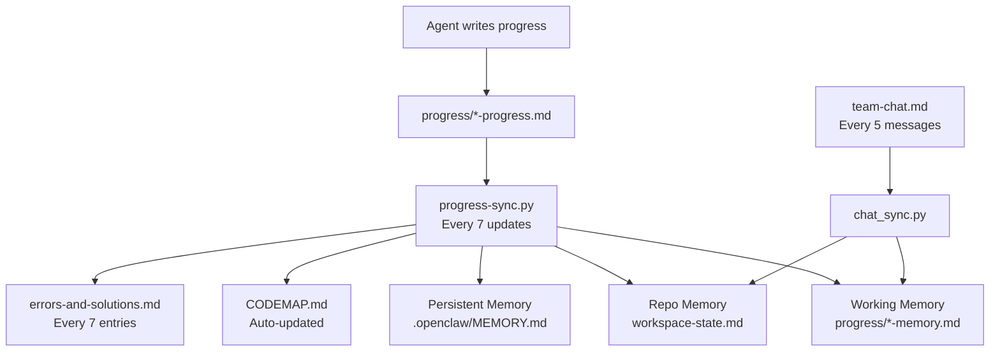

# Data Pipeline + Storage Architecture

> **Purpose:** Data flow, storage layers, and backup architecture.
> **Updated:** 2026-05-18 | GitHub cleanup complete (47 tmp files removed)

## Data Pipeline

## Storage Architecture

## Backup & Restore

## Memory Sync Flow

