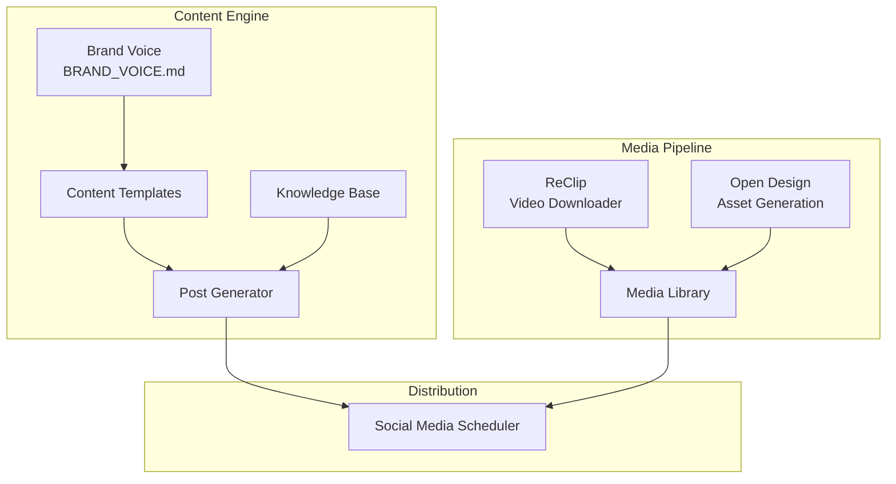

# 🌐 Content Farm

> **Status:** Building | **Components:** ReClip + Open Design

---

## Overview

Content Farm is the content generation and distribution system. It produces, processes, and distributes content across multiple channels.

---

## Architecture



---

## Components

### Content Engine (`../content-engine/`)
- **Brand Voice:** `BRAND_VOICE.md` — Core truth, positioning, voice characteristics
- **Templates:** `templates/` — Content templates for different formats
- **Posts:** `posts/` — Generated content
- **Knowledge:** `knowledge/` — Research and reference material

### ReClip (`sites/reclip/`)
Self-hosted video downloader. Fork of [averygan/reclip](https://github.com/averygan/reclip).

- **Backend:** Python + Flask (~150 lines)
- **Frontend:** Vanilla HTML/CSS/JS
- **Engine:** yt-dlp + ffmpeg
- **Sites:** 1000+ supported (YouTube, TikTok, Instagram, Twitter, etc.)

```bash
cd sites/reclip
pip install -r requirements.txt
python app.py
# Open http://localhost:8899
```

### Open Design (`design/open-design/`)
Agent-native design workspace. Fork of [nexu-io/open-design](https://github.com/nexu-io/open-design).

- **Skills:** 100+ built-in
- **Design Systems:** 150 brand-grade DESIGN.md systems
- **Plugins:** 261 official plugins
- **Outputs:** Prototypes, decks, images, video, HyperFrames
- **Agents:** Claude Code, Codex, Cursor, OpenClaw, Hermes, and 17+ more

---

## Content Pillars

1. **RESULTS (Proof)** — Backtest numbers, live trading stats, win rates
2. **LIFESTYLE (Freedom)** — What this knowledge buys: time, choice, independence

## Voice Characteristics

- **Tone:** Confident but not arrogant. Teacher, not preacher.
- **Language:** Simple words for complex ideas. No jargon without explanation.
- **Energy:** Calm authority. We don't hype. The data hypes itself.
- **Perspective:** First person plural ("we discovered") for team credibility.

---

## Related Documents

- `../content-engine/BRAND_VOICE.md` — Brand voice guide
- `../ARCHITECTURE.md` — Full system architecture
