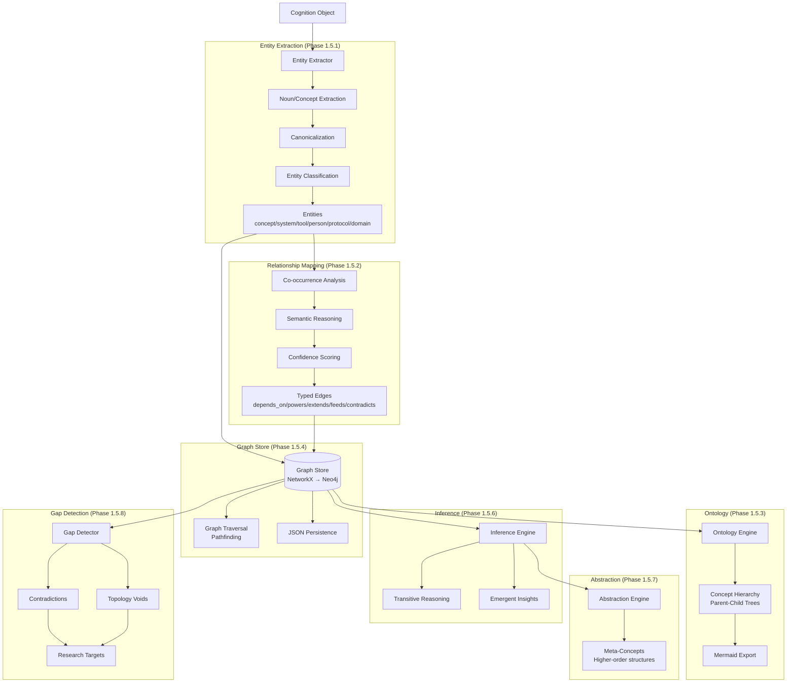

# 🕸️ Knowledge Graph — Phase 1.5

> **Status:** Complete | **Components:** Entities + Relationships + Graph Store + Ontology

---

## Overview

The Knowledge Graph engine transforms semantic retrieval into conceptual cognition. It builds entity-relationship topology from parsed content, enabling inference, abstraction, and gap detection.

---

## Architecture



---

## Entity Types

| Type | Description | Example |
|------|-------------|---------|
| `concept` | Abstract idea | "semantic memory", "vector cognition" |
| `system` | Software system | "OCE", "SRRA", "OpenAlex" |
| `framework` | Methodology | "Phase 1.2", "Parser Router" |
| `tool` | Specific tool | "markitdown", "codegraph" |
| `protocol` | Standard/protocol | "MCP", "REST" |
| `domain` | Knowledge domain | "AI", "Quant Finance" |
| `person` | Author, researcher | Paper authors |

## Relationship Types

| Type | Meaning | Example |
|------|---------|---------|
| `depends_on` | Dependency | OCE → observer_runtime |
| `powers` | Capability | markitdown → Parser Router |
| `extends` | Inheritance | OCE → SRRA |
| `related_to` | Soft association | semantic memory ↔ vector cognition |
| `supports` | Evidence | test results → engine validation |
| `contradicts` | Semantic conflict | finding A ↔ finding B |
| `feeds` | Data flow | OpenAlex → research ingestion |
| `abstracts` | Conceptual compression | vector DB + embeddings → semantic cognition |

---

## Usage

```python
from core.knowledge.graph import EntityExtractor, RelationshipMapper, GraphStore, OntologyEngine

# Extract entities
extractor = EntityExtractor()
entities = extractor.extract(text, source_ref="paper_123")

# Map relationships
mapper = RelationshipMapper()
relationships = mapper.map_relationships(entities, text)

# Store in graph
graph = GraphStore()
for entity in entities:
    graph.add_entity(entity)
for rel in relationships:
    graph.add_relationship(rel)

# Query
path = graph.find_path("OpenAlex", "OCE")
# → ["OpenAlex", "research ingestion", "Cognition Objects", "Semantic Memory", "Knowledge Graph", "OCE"]

# Ontology
ontology = OntologyEngine(graph_store=graph)
tree = ontology.build_ontology()
mermaid = ontology.to_mermaid()

# Gap detection
gaps = ontology.detect_gaps()
```

---

## Graph Queries

```python
# Find path between concepts
path = graph.find_path("OpenAlex", "OCE")

# Get neighbors
neighbors = graph.get_neighbors("semantic memory")

# Get all entities in domain
entities = graph.query_nodes(domain="AI Systems")

# Get all relationships
edges = graph.get_all_relationships()
```

---

## Persistence

Graph is stored as JSON for portability:

```python
graph.save("graph.json")  # Save
graph.load("graph.json")  # Load
```

For production scaling, the GraphStore supports Neo4j backend.

---

## Related Documents

- `../README.md` — Core cognition substrate
- `../../semantic/README.md` — Semantic memory layer
- `../../research/README.md` — Research mesh
- `../../../ARCHITECTURE.md` — Full system architecture
