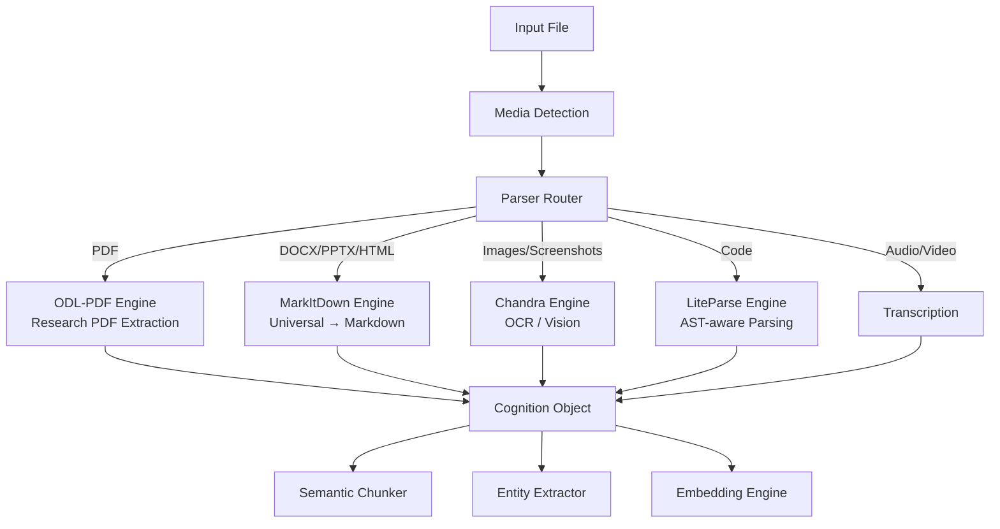

# 📄 Parser Orchestration — Phase 1.2

> **Status:** Complete | **Engines:** 4 | **Output:** Cognition Objects

---

## Overview

The Parser Orchestration layer routes incoming files to the appropriate extraction engine based on media type. All outputs are normalized to Cognition Objects for the semantic memory pipeline.

---

## Architecture



---

## Engines

### MarkItDown (`markitdown/`)
**Source:** [microsoft/markitdown](https://github.com/microsoft/markitdown)  
**Purpose:** Universal file → Markdown conversion  
**Supports:** PDF, DOCX, PPTX, XLSX, HTML, EPUB, images, audio

### ODL-PDF (`odl-pdf/`)
**Source:** [opendataloader-project/opendataloader-pdf](https://github.com/opendataloader-project/opendataloader-pdf)  
**Purpose:** Research PDF extraction  
**Supports:** Layout parsing, table extraction, citation parsing, abstract extraction

### LiteParse (`liteparse/`)
**Source:** [run-llama/liteparse](https://github.com/run-llama/liteparse)  
**Purpose:** Code + web parsing  
**Supports:** AST-aware code parsing, web extraction, chunking

### Chandra (`chandra/`)
**Source:** [datalab-to/chandra](https://github.com/datalab-to/chandra)  
**Purpose:** OCR / image text extraction  
**Supports:** Images, screenshots, vision context

---

## Cognition Object Schema

Every parsed document produces a Cognition Object:

```python
@dataclass
class CognitionObject:
    object_id: str           # UUID
    source_path: str         # Original file path
    source_type: str         # pdf, docx, image, code, etc.
    source_hash: str         # SHA-256 for dedup
    raw_text: str            # Extracted raw text
    markdown: str            # Normalized markdown
    summary: str             # Semantic summary
    concepts: list[str]      # Key concepts
    tags: list[str]          # Semantic taxonomy tags
    links: list[str]         # Wiki-links to other objects
    title: str               # Document title
    authors: list[str]       # Authors (research papers)
    abstract: str            # Abstract (research papers)
    citations: list[str]     # Citations (research papers)
    embedding: list[float]   # Vector embedding (Phase 1.3)
```

---

## Usage

```python
from core.parser.orchestration import ParserRouter

router = ParserRouter()
cog_obj = router.route("/path/to/document.pdf")

print(cog_obj.title)
print(cog_obj.summary)
print(cog_obj.concepts)
print(cog_obj.to_obsidian_markdown())
```

---

## Related Documents

- `../semantic/README.md` — Semantic memory layer
- `../knowledge/graph/README.md` — Knowledge graph
- `../../ARCHITECTURE.md` — Full system architecture
