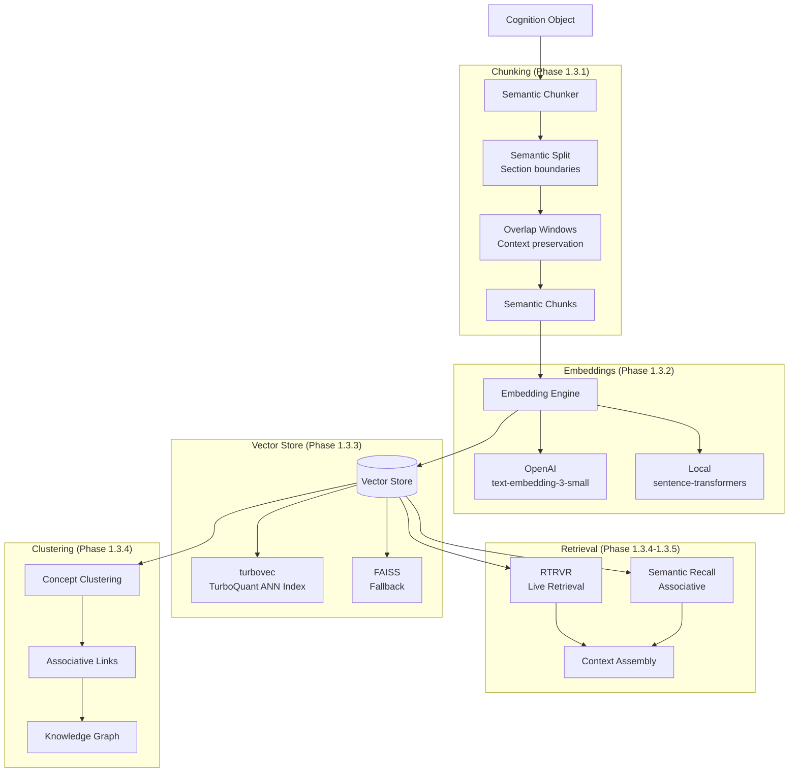

# 🧠 Semantic Memory — Phase 1.3

> **Status:** Complete | **Components:** Chunking + Embeddings + Vector Store

---

## Overview

The Semantic Memory layer transforms parsed documents into searchable, meaning-linked cognition. It's the bridge between raw content and the knowledge graph.

---

## Architecture



---

## Chunking Engine

Splits documents into semantically meaningful units with overlap windows.

```python
from core.semantic.chunking import SemanticChunker

chunker = SemanticChunker(
    max_chunk_tokens=512,
    overlap_tokens=64,
)
chunks = chunker.chunk(text, source_object_id="...")
```

**Rules:**
- Split on markdown headings (##, ###)
- Split on paragraph boundaries (double newline)
- Respect max chunk size (512 tokens default)
- Add overlap windows (64 tokens default)
- Never split mid-sentence

---

## Embedding Engine

Pluggable embedding backend supporting OpenAI and local models.

```python
from core.semantic.embeddings import EmbeddingEngine

# OpenAI (default)
engine = EmbeddingEngine(backend="openai", model="text-embedding-3-small")

# Local fallback
engine = EmbeddingEngine(backend="local", model="all-MiniLM-L6-v2")

# Single text
vector = engine.embed("semantic memory is meaning-linked cognition")

# Batch
vectors = engine.embed_batch(["text1", "text2", "text3"])
```

---

## Vector Store

**Primary:** turbovec (TurboQuant ANN index)  
**Fallback:** FAISS

```python
from core.semantic.vector import VectorStore

store = VectorStore(backend="turbovec")
store.add(vectors, metadata)
results = store.search(query_vector, k=10)
```

---

## Retrieval

Two retrieval modes:

1. **RTRVR (Live Retrieval):** Real-time semantic search for active queries
2. **Semantic Recall:** Associative recall by conceptual similarity

```python
from core.semantic.retrieval import retrieve

results = retrieve(
    query="How does semantic memory work?",
    max_results=10,
    mode="associative",  # or "live"
)
```

---

## Related Documents

- `../parser/README.md` — Parser orchestration
- `../knowledge/graph/README.md` — Knowledge graph
- `../../ARCHITECTURE.md` — Full system architecture
