OK# 📊 All Mermaid Graphs — Canonical Reference

> **Purpose:** Single file containing every Mermaid diagram in the workspace.
> **Last Updated:** 2026-06-10
> **Total Diagrams:** 50+

---

## CEREBUS Neuro-Symbolic Scanner (NEW — 2026-06-10)

| # | Diagram | File |
|---|---------|------|
| 1 | Master 4-Step Architecture | `CEREBUS_MERMAID_GRAPHS.md` |
| 2 | Neuro-Symbolic Scanner Pipeline | `CEREBUS_MERMAID_GRAPHS.md` |
| 3 | Markov Chain State Machine (17 states) | `CEREBUS_MERMAID_GRAPHS.md` |
| 4 | Guardian Alert Flow (Sequence) | `CEREBUS_MERMAID_GRAPHS.md` |
| 5 | RAG Oracle Architecture | `CEREBUS_MERMAID_GRAPHS.md` |
| 6 | Feature Engineering Pipeline | `CEREBUS_MERMAID_GRAPHS.md` |
| 7 | Trade Orchestrator State Flow | `CEREBUS_MERMAID_GRAPHS.md` |
| 8 | Data Flow End-to-End | `CEREBUS_MERMAID_GRAPHS.md` |
| 9 | SHAP Feature Importance (Bar) | `CEREBUS_MERMAID_GRAPHS.md` |
| 10 | System File Structure | `CEREBUS_MERMAID_GRAPHS.md` |

See also: `CEREBUS_ARCHITECTURE.md` for detailed architecture documentation.

---

## Table of Contents

1. [System Architecture](#system-architecture)
2. [Agent Topology & Workflow](#agent-topology--workflow)
3. [Observer Core O-1→O-7](#observer-core-o-1o-7)
4. [OCE Unified Frontend](#oce-unified-frontend)
5. [O2C Pipeline](#o2c-pipeline)
6. [CARE Engine](#care-engine)
7. [Risk Litigator](#risk-litigator)
8. [Structural Decay Monitor](#structural-decay-monitor)
9. [Self-Healing Telemetry](#self-healing-telemetry)
10. [Tradovate Track A](#tradovate-track-a)
11. [Crypto Track B](#crypto-track-b)
12. [Spawn Engine](#spawn-engine)
13. [Consensus Engine](#consensus-engine)
14. [Field Learning](#field-learning)
15. [Persistent Field](#persistent-field)

---

## System Architecture

### Master System Architecture (5-Level)

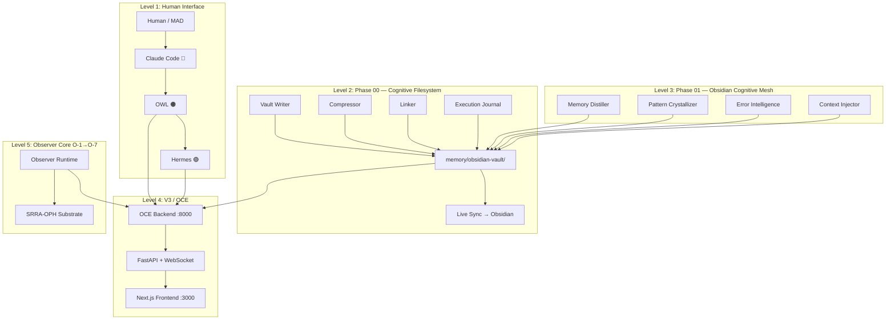

### Agent Communication Flow

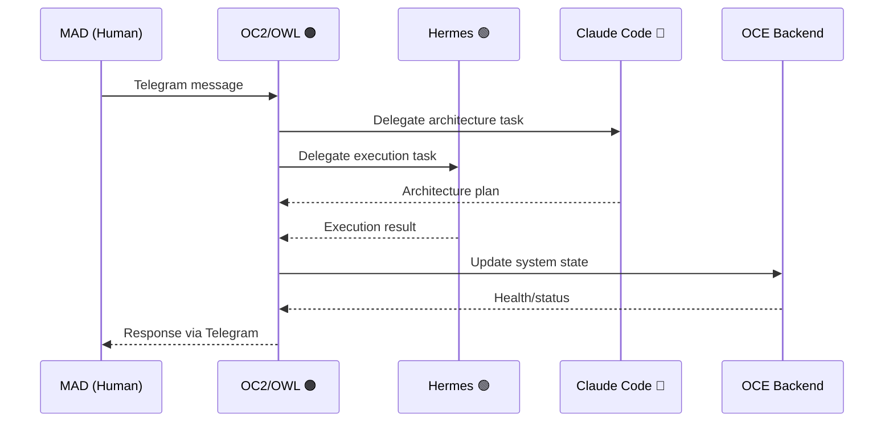

---

## Agent Topology & Workflow

### Full Agent Roster & Relationships

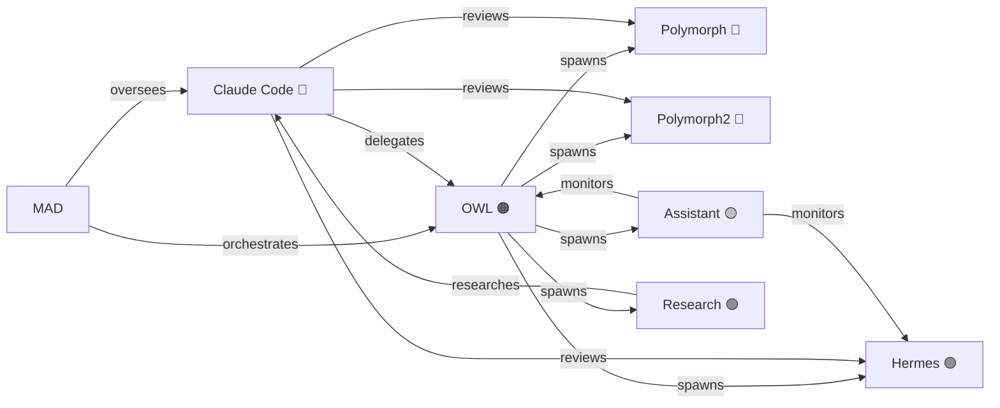

### Task Lifecycle Flow

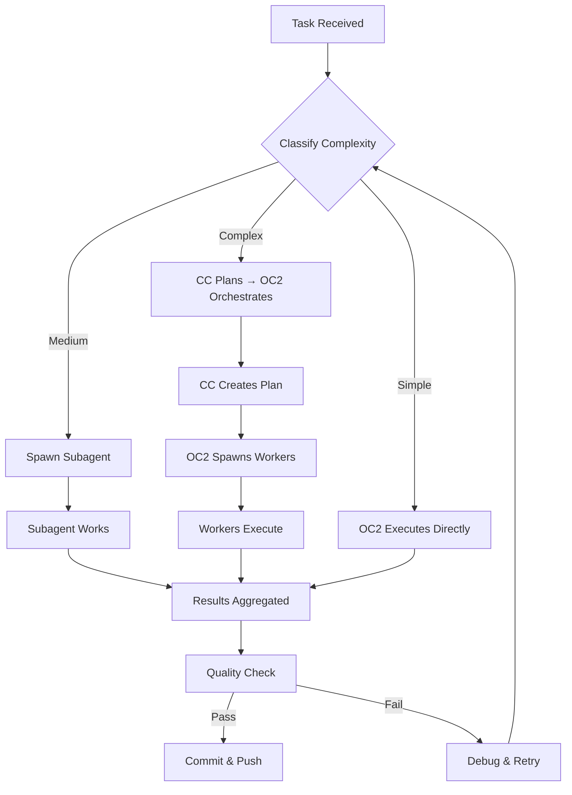

---

## Observer Core O-1→O-7

### Observer Core Master Plan

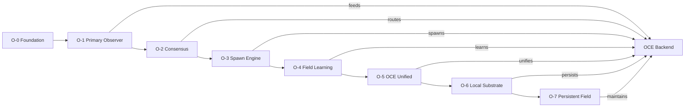

### O-1 Primary Observer State Machine

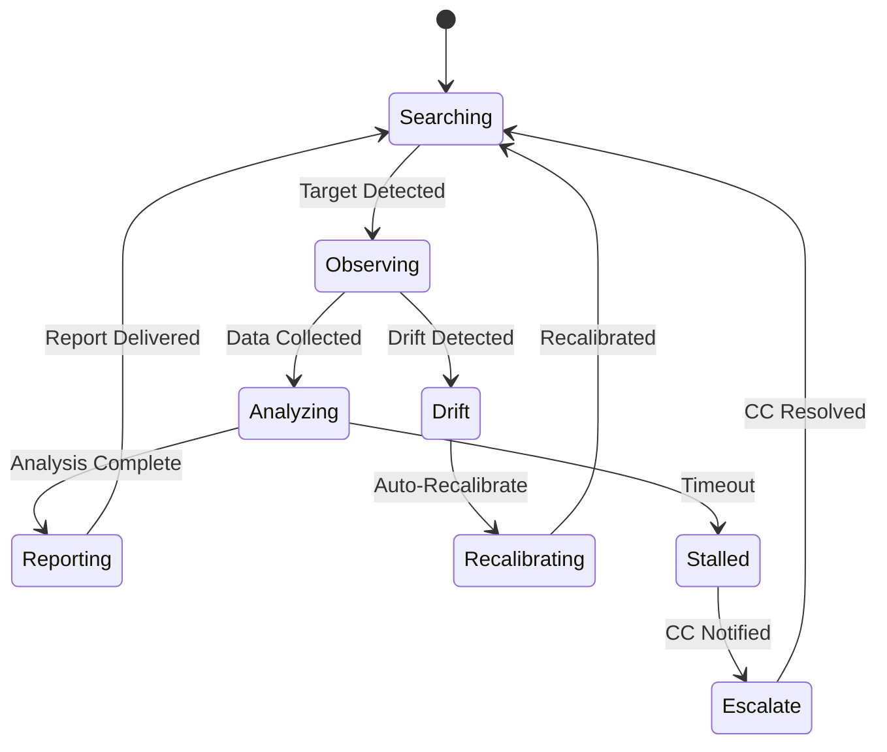

### O-2 Consensus Engine

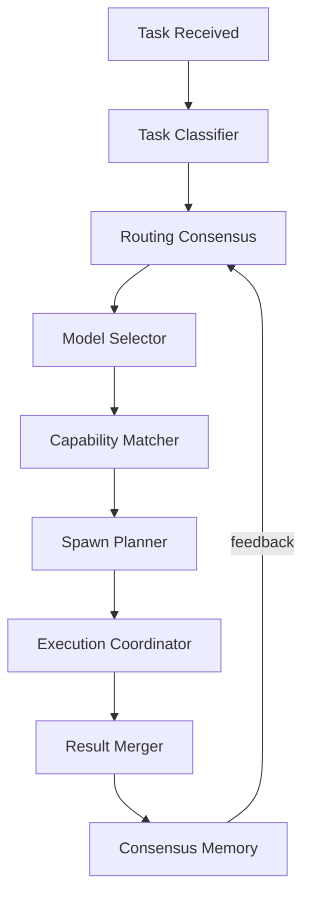

### O-3 Spawn Engine Lifecycle

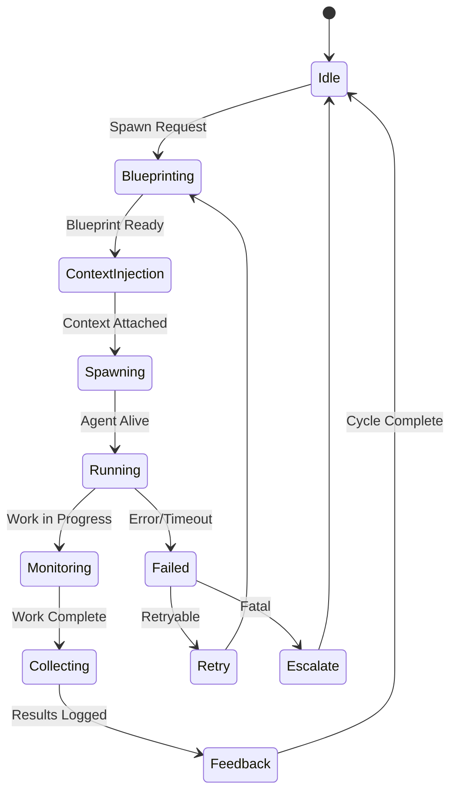

---

## OCE Unified Frontend

### OCE Component Architecture

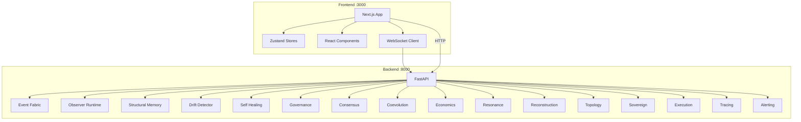

### OCE Data Flow

```mermaid
flowchart LR
    A[Agent Execution] --> B[Event Fabric]
    B --> C[Observer Runtime]
    C --> D[Structural Memory]
    D --> E[Drift Detector]
    E -->|drift detected| F[Self Healing]
    F --> G[Governance]
    G --> H[Consensus]
    H --> I[Coevolution]
    I --> J[Economics]
    J --> K[Resonance]
    K --> L[Reconstruction]
    L --> M[Topology]
    M --> N[Sovereign]
    N --> O[Execution]
    O --> P[Tracing]
    P --> Q[Alerting]
    Q --> R[Dashboard]
```

---

## O2C Pipeline

### Cognitive Filesystem Foundation

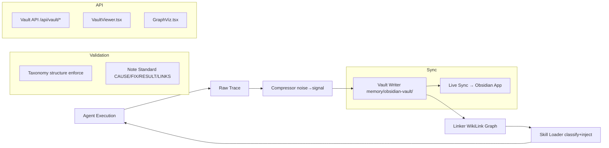

### Obsidian Cognitive Mesh

```mermaid
graph TB
    subgraph "Core Modules"
        MD[Memory Distiller] --> VAULT
        PC[Pattern Crystallizer] --> VAULT
        EI[Error Intelligence] --> VAULT
        CI[Context Injector] --> VAULT
    end

    subgraph "Vault API"
        VAPI[/api/vault/distill] --> MD
        VAPI2[/api/vault/patterns] --> PC
        VAPI3[/api/vault/errors] --> EI
        VAPI4[/api/vault/context] --> CI
    end

    subgraph "Frontend"
        PV[PatternViewer.tsx] --> VAPI2
        ED[ErrorDashboard.tsx] --> VAPI3
    end
```

---

## CARE Engine

### Capital Allocation Flow

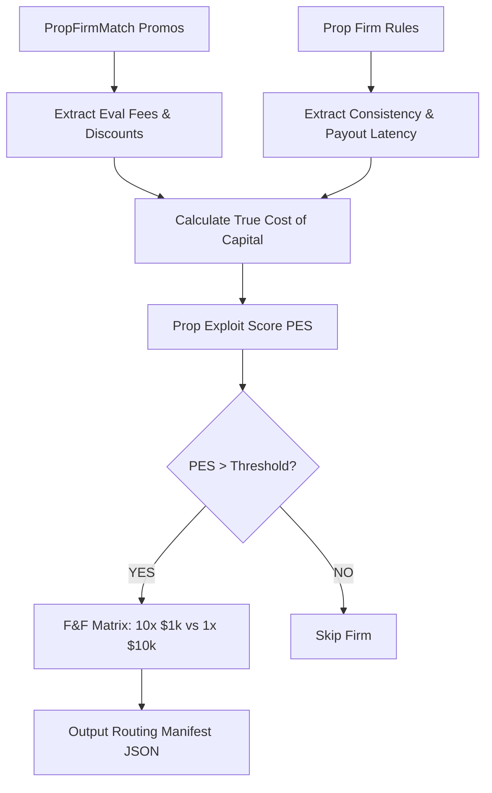

### F&F Fragmentation Matrix

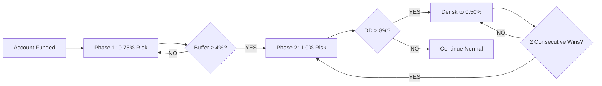

---

## Risk Litigator

### Dynamic Risk Gate

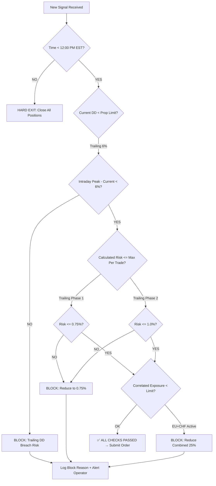

### PROP_TRAILING vs KELLY_MAX Toggle

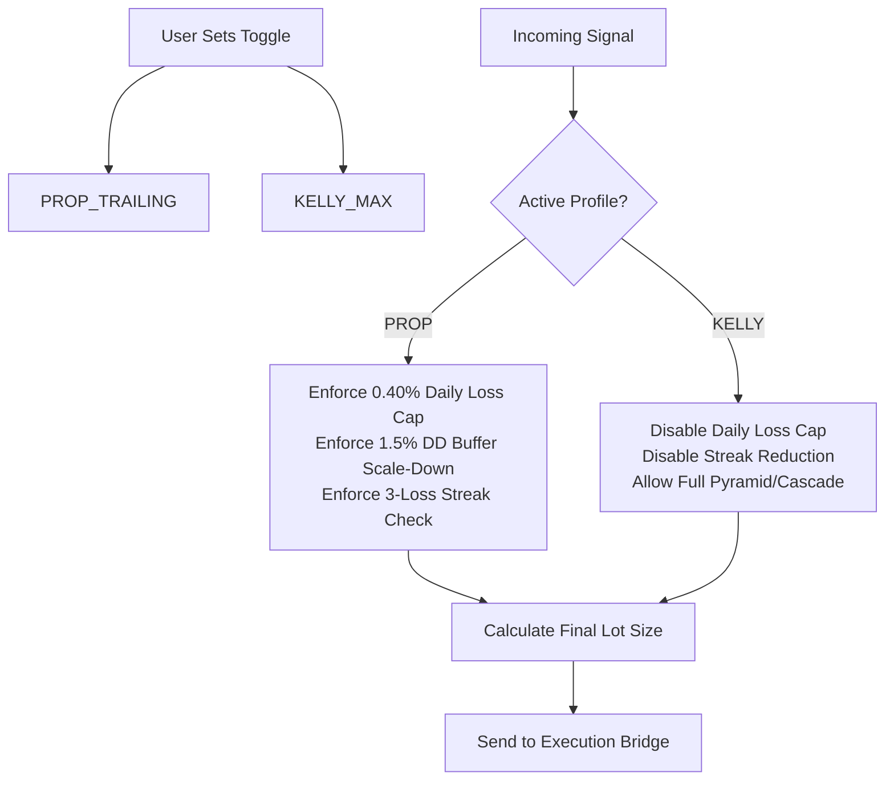

---

## Structural Decay Monitor

### Asset Integrity Evaluation

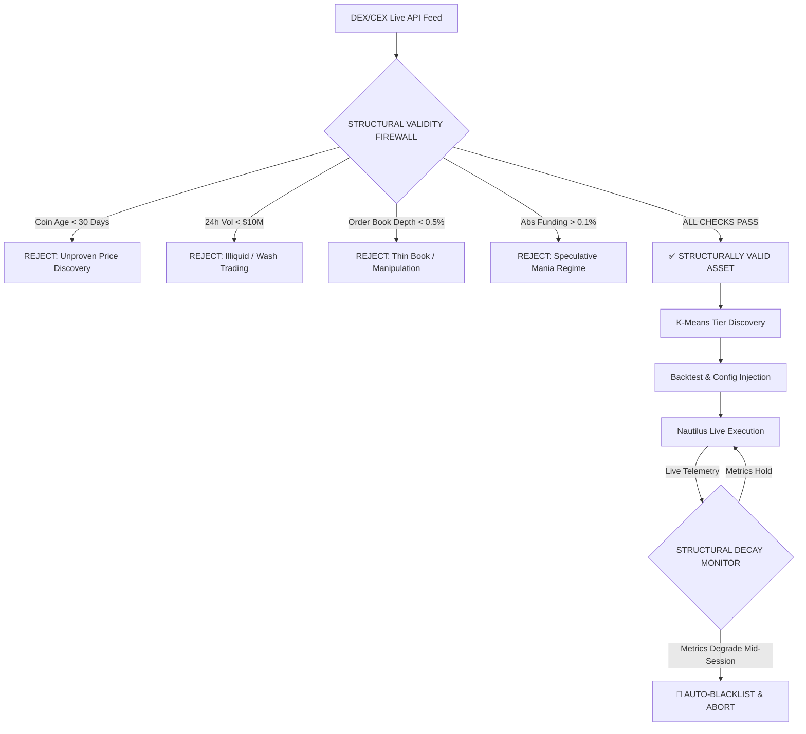

### Decay State Machine

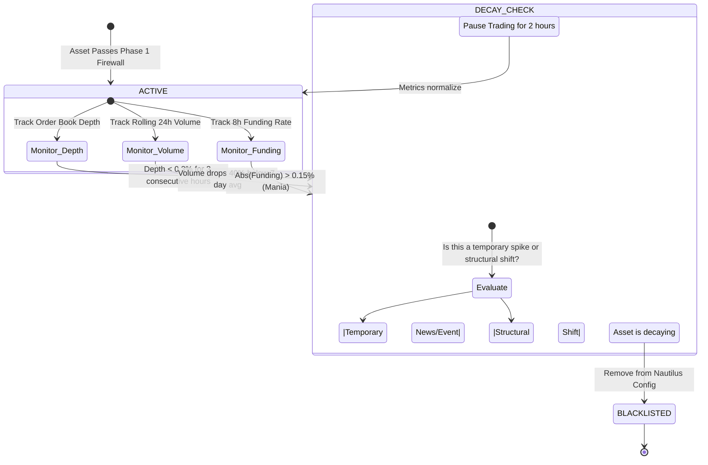

---

## Self-Healing Telemetry

### Execution Feedback Loop

```mermaid
flowchart TD
    subgraph "Execution"
        FILL[Broker Fills] --> SLIP[Calc Slippage vs Theoretical OCC]
        FILL --> LAT[Calc Fill Latency]
    end

    subgraph "Healing"
        SLIP --> THRESH{Avg Slip > 0.5 ticks?}
        THRESH -->|YES| PATCH[Generate Config Patch: +1 tick to OCC Buffer]
        THRESH -->|NO| HOLD[Hold Current Config]
        PATCH --> VALIDATE{Schema Valid?}
        VALIDATE -->|YES| HOTSWAP[Hot-Swap to Engine]
        VALIDATE -->|NO| ROLLBACK[Rollback & Alert]
    end

    subgraph "Dashboard"
        HOTSWAP --> WS[WebSocket Push]
        WS --> UI[Operator Dashboard\nField State | Capital Matrix | Gates]
    end
```

### Venue Switch Logic

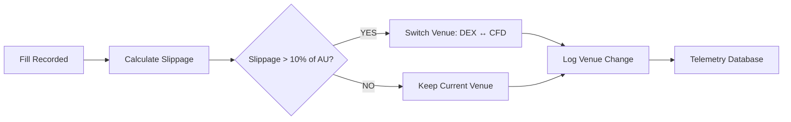

---

## Tradovate Track A

### NinjaScript Strategy Pipeline

```mermaid
flowchart TD
    subgraph "Source: Python Logic"
        PY[AtomicResolutionEngine.py]
        CFG[Asset Config YAML]
    end

    subgraph "Translation: NinjaScript"
        PY -->|State Machine Logic| CS[CEREBUS_ST_NT8.cs]
        CFG -->|Tier/AU Params| INPUTS[NinjaScript Inputs]
    end

    subgraph "Platform: NinjaTrader 8 + Tradovate"
        CS -->|Strategy Class| NT8[NinjaTrader 8 Platform]
        INPUTS --> NT8
        NT8 -->|Order Routing| TV[Tradovate API]
    end

    subgraph "Validation"
        TV -->|Fill Data| BACKTEST[NT8 Strategy Analyzer]
        BACKTEST -->|Metrics Match?| LIVE[Live Deployment]
        LIVE -->|Telemetry| DASH[Quant Lab Dashboard]
    end
```

### Symmetry Trap State Machine (NinjaScript)

```mermaid
stateDiagram-v2
    [*] --> SEARCH: Session Active (3AM-12PM EST)

    state SEARCH {
        [*] --> MonitorImpulse
        MonitorImpulse --> ImpulseDetected: Move >= Tier Trigger\nAND Body Closes Outside Band
        MonitorImpulse --> MonitorImpulse: No valid impulse
    }

    ImpulseDetected --> WAIT_DZ: Mark Swing Origin\nCalculate DZ Bounds

    state WAIT_DZ {
        [*] --> MonitorPullback
        MonitorPullback --> DZ_Penetrated: Pullback >= 32% AND <= 50%\nOR Pullback >= 1 AU
        MonitorPullback --> INVALIDATED: M5 Close > 80% of Impulse
        MonitorPullback --> MonitorPullback: No penetration / No invalidation
    }

    DZ_Penetrated --> WAIT_OCC: DZ Bounds Active

    state WAIT_OCC {
        [*] --> MonitorCandle
        MonitorCandle --> ENTRY_TRIGGERED: Opposite Candle Close\nINSIDE Density Zone
        MonitorCandle --> INVALIDATED: M5 Close > 80% of Impulse
        MonitorCandle --> MonitorCandle: No OCC / No invalidation
    }

    ENTRY_TRIGGERED --> EXECUTE_TRADE: Market Order on Close\nSL = OCC Extreme (Zero Buffer)\nTP = Entry ± 1 AU

    state EXECUTE_TRADE {
        [*] --> MonitorExit
        MonitorExit --> TP_HIT: Price Hits TP (Wick or Close)
        MonitorExit --> SL_HIT: M5 CLOSE Beyond OCC Extreme
        MonitorExit --> TIME_EXIT: 12:00 PM EST Hard Exit
        MonitorExit --> MonitorExit: No exit condition
    }

    TP_HIT --> RESET: Close Position\nNew Origin = Exit Price
    SL_HIT --> RESET
    TIME_EXIT --> RESET

    INVALIDATED --> SEARCH: Reset State\nNo Trade Taken
    RESET --> SEARCH: Continuous Loop Active
```

### Gear Shift Detection

```mermaid
flowchart LR
    IMPULSE[Impulse Size Detected] --> CHECK{Check Gear Shift}

    CHECK -->|T1 Day & Impulse >= 50pts| SHIFT_T2[Use T2 AU as Target]
    CHECK -->|T1/T2 Day & Impulse >= 62pts| SHIFT_T3[Use T3 AU as Target]
    CHECK -->|Impulse < Next Tier Trigger| KEEP_ORIG[Keep Original Day-Tier AU]

    SHIFT_T2 --> TARGET[Set TP = Entry ± T2_AU]
    SHIFT_T3 --> TARGET
    KEEP_ORIG --> TARGET2[Set TP = Entry ± Original_AU]
```

---

## Crypto Track B

### Crypto Atomic Engine Pipeline

```mermaid
flowchart TD
    subgraph "Phase B1: Scanner"
        CG[CoinGecko API] --> DS[DexScreener API]
        DS --> FILTER{Age > 30d? Vol > $10M?}
        FILTER -->|PASS| VALID_ASSETS[Valid Asset List]
        FILTER -->|FAIL| REJECT[Reject]
    end

    subgraph "Phase B2: Calibration"
        VALID_ASSETS --> KMEANS[K-Means Clustering]
        KMEANS --> CRYPTO_CONFIG[crypto_configs.yaml]
    end

    subgraph "Phase B3: Execution"
        CRYPTO_CONFIG --> NAUT[Nautilus Trader]
        NAUT -->|Majors| CFD[CFD Broker]
        NAUT -->|Alts| DEX[dYdX / Hyperliquid]
    end

    subgraph "Phase B4: Validation"
        CFD & DEX --> BACKTEST[Nautilus Backtest]
        BACKTEST --> METRICS{WR > 85%? PF > 2.5?}
        METRICS -->|YES| LIVE[Crypto Live Deployment]
        METRICS -->|NO| TUNE[Retune Parameters]
        TUNE --> KMEANS
```

---

## Spawn Engine

### Spawn Engine + Context Inheritance

```mermaid
flowchart LR
    SIG[Spawn Request] --> BP[Spawn Blueprint]
    BP --> CI[Context Injector]
    CI --> AGENT[Agent Spawner]
    AGENT --> BOUNDARY[Execution Boundary]
    BOUNDARY --> COORD[Multi-Agent Coordinator]
    COORD --> TRACE[Trace Feedback]
    TRACE --> REGISTRY[Spawn Registry]
    REGISTRY --> REPLAY[Spawn Replay]
```

### Agent Lifecycle

```mermaid
stateDiagram-v2
    [*] --> Idle
    Idle --> Blueprinting: Spawn Request
    Blueprinting --> ContextInjection: Blueprint Ready
    ContextInjection --> Spawning: Context Attached
    Spawning --> Running: Agent Alive
    Running --> Monitoring: Work in Progress
    Monitoring --> Collecting: Work Complete
    Collecting --> Feedback: Results Logged
    Feedback --> Idle: Cycle Complete
    Running --> Failed: Error/Timeout
    Failed --> Retry: Retryable
    Failed --> Escalate: Fatal
    Retry --> Blueprinting
    Escalate --> Idle
```

---

## Consensus Engine

### Observer Consensus + Task Routing

```mermaid
flowchart TD
    T[Task Received] --> TC[Task Classifier]
    TC --> RC[Routing Consensus]
    RC --> MS[Model Selector]
    MS --> CM[Capability Matcher]
    CM --> SP[Spawn Planner]
    SP --> EC[Execution Coordinator]
    EC --> RM[Result Merger]
    RM --> CM2[Consensus Memory]
    CM2 -->|feedback| RC
```

### Routing Map

```mermaid
flowchart LR
    TASK[Task] --> CLASSIFY{Classify}
    CLASSIFY -->|Simple| OC2[OC2 Direct]
    CLASSIFY -->|Medium| SPAWN[Spawn Subagent]
    CLASSIFY -->|Complex| CC[CC Plans]
    SPAWN --> MODEL{Model Select}
    MODEL -->|Fast| LAGUNA[Laguna]
    MODEL -->|Deep| DEEPSEEK[DeepSeek]
    MODEL -->|Reasoning| NEMOTRON[Nemotron]
    CC --> ARCH[Architecture Plan]
    ARCH --> EXEC[OC2 Executes]
```

---

## Field Learning

### Learning Loop

```mermaid
flowchart TD
    EXEC[Agent Execution] --> TRACE[Trace Collection]
    TRACE --> FEAT[Feature Extraction]
    FEAT --> CLUSTER[Pattern Clustering]
    FEAT --> PREDICT[Predictive Model]
    CLUSTER --> KNOWLEDGE[Knowledge Base]
    PREDICT --> KNOWLEDGE
    KNOWLEDGE --> RECOMMEND[Recommendation Engine]
    RECOMMEND --> EXEC
```

---

## Persistent Field

### O-7 Persistent Field Mode

```mermaid
flowchart TD
    OBS[Observer] --> FIELD[Field State]
    FIELD --> DORMANT{Dormant?}
    DORMANT -->|YES| ACTIVATE[Activation Trigger]
    DORMANT -->|NO| MONITOR[Continuous Monitor]
    ACTIVATE --> RECALL[State Recall]
    RECALL --> VALIDATE[Validation]
    VALIDATE -->|Valid| RESUME[Resume Operations]
    VALIDATE -->|Invalid| RECONSTRUCT[Reconstruction]
    RECONSTRUCT --> FIELD
    MONITOR --> DRIFT{Drift Detected?}
    DRIFT -->|YES| ADAPT[Adaptation]
    DRIFT -->|NO| MONITOR
    ADAPT --> FIELD
```

---

## Workspace Directory Structure (Post-Reorganization)

```mermaid
graph TB
    ROOT[larger-lab/] --> SYSTEMS[systems/]
    ROOT --> DOCS[docs/]
    ROOT --> MEMORY[memory/]
    ROOT --> EXPERIMENTS[experiments/]
    ROOT --> TESTS[tests/]
    ROOT --> CONFIG[config/]
    ROOT --> DATA[data/]
    ROOT --> TOOLS[tools/]
    ROOT --> SKILLS[skills/]
    ROOT --> LOGS[logs/]
    ROOT --> PROGRESS[progress/]
    ROOT --> SHARED[shared-conversations/]
    ROOT --> ARCHIVE[archive/]
    ROOT --> QUANT[quant-lab/]
    ROOT --> TRADOVATE[tradovate/]
    ROOT --> CRYPTO[crypto/]
    ROOT --> SNIPER[sniper-dashboard/]

    SYSTEMS --> CORE[core/]
    SYSTEMS --> OCE[oce/]
    SYSTEMS --> SRRA[srrs_opc/]

    DOCS --> ARCH[architecture/]
    DOCS --> PLANS[plans/]
    DOCS --> REF[reference/]
    DOCS --> META[meta/]

    MEMORY --> MEM[memories/]
    MEMORY --> MB[memory-bank/]
    MEMORY --> OBSIDIAN[obsidian-vault/]

    EXPERIMENTS --> CODEGRAPH[codegraph/]
    EXPERIMENTS --> HYBRID[hybrid/]
    EXPERIMENTS --> PHASE11[phase11/]
    EXPERIMENTS --> RESEARCH[research/]
    EXPERIMENTS --> AGENTLAB[agent-lab/]
```

---

## Service Ports & Health

```mermaid
graph LR
    subgraph "Services"
        OC2[OC2 Gateway\n:18790] --> TG[Telegram]
        HR[Hermes\n:8642] --> DISCORD[Discord]
        OCE_API[OCE Backend\n:8000] --> WS[WebSocket]
        OCE_FE[OCE Frontend\n:3000] --> UI[React UI]
        SRRA_API[SRRA-OPH API\n:8001] --> OBS[Observers]
        SNIPER[Sniper Dashboard\n:3001] --> DASH[Trading Dashboard]
        WATCHDOG[Watchdog\nPython] --> MONITOR[Monitors All]
    end

    TG --> MAD[MAD]
    DISCORD --> MAD
    UI --> MAD
    DASH --> MAD
```

---

## PO × VTuber Integration

### PO-VTuber Integration Architecture

```mermaid
flowchart LR
    subgraph "VTuber Frontend (Unchanged)"
        VT[VTube Studio\nWebSocket] --> VTUBER[Open-LLM-VTuber\nFrontend]
        VTUBER --> LLM[LLM Provider]
    end

    subgraph "PO Cognitive Layer"
        LLM --> PO_PO[po_provider.py\n(StatelessLLMInterface)]
        PO_PO --> PO_API[/api/po/chat\nSSE Endpoint]
        PO_API --> SCAN[po_workspace.py\nWorkspace Scan]
        PO_API --> VAULT[po_vault.py\nVault Retrieval]
        PO_API --> ROUTER[po_router.py\nModel Routing]
        PO_API --> FALLBACK[po_fallback.py\nFallback Chain]
        PO_API --> IDLE[po_idle.py\nIdle Runtime]
    end

    subgraph "Identity Bridge"
        BRIDGE[session_bridge.py\nVTuber ↔ Telegram]
        PO_API --> BRIDGE
    end

    subgraph "OCE Backend"
        SCAN --> OCE[OCE :8000]
        VAULT --> OCE
        ROUTER --> OCE
        FALLBACK --> OCE
        IDLE --> OCE
    end
```

### PO Cognitive Pipeline

```mermaid
sequenceDiagram
    participant VT as VTuber
    participant PO as PO Provider
    participant OCE as OCE Backend
    participant SCAN as Workspace Scanner
    participant VAULT as Vault Retriever
    participant ROUTER as Model Router
    participant FALLBACK as Fallback Chain

    VT->>PO: chat_completion(messages)
    PO->>OCE: POST /api/po/chat
    OCE->>SCAN: scan() → context
    OCE->>VAULT: retrieve(query) → memory
    OCE->>ROUTER: route_with_context()
    ROUTER->>FALLBACK: execute()
    FALLBACK-->>OCE: response stream
    OCE-->>PO: SSE chunks
    PO-->>VT: yield text
```

### PO Provider Injection Flow

```mermaid
flowchart TD
    A[VTuber Config] --> B{llm_provider}
    B -->|po_llm| C[po_provider.py]
    B -->|openai| D[openai_llm.py]
    B -->|ollama| E[ollama_llm.py]
    B -->|claude| F[claude_llm.py]

    C --> G[StatelessLLMInterface]
    G --> H[chat_completion]
    H --> I[OCE /api/po/chat]
    I --> J[Workspace Scan]
    I --> K[Vault Retrieval]
    I --> L[Model Routing]
    I --> M[Fallback Chain]
    M --> N[OpenRouter/Ollama]
```

---

## Complete File Inventory

```mermaid
graph TD
    ROOT[larger-lab/] --> A[.github/]
    ROOT --> B[.hermes/]
    ROOT --> C[.openclaw-2/]
    ROOT --> D[.venv/]
    ROOT --> E[agent-lab/]
    ROOT --> F[archive/]
    ROOT --> G[argo-ref/]
    ROOT --> H[config/]
    ROOT --> I[core/]
    ROOT --> J[crypto/]
    ROOT --> K[data/]
    ROOT --> L[docs/]
    ROOT --> M[experiments/]
    ROOT --> N[logs/]
    ROOT --> O[meditation-room/]
    ROOT --> P[memory/]
    ROOT --> Q[oc3/]
    ROOT --> R[oce/]
    ROOT --> S[progress/]
    ROOT --> T[quant-lab/]
    ROOT --> U[shared-conversations/]
    ROOT --> V[skills/]
    ROOT --> W[sniper-dashboard/]
    ROOT --> X[srrs_opc/]
    ROOT --> Y[tests/]
    ROOT --> Z[tools/]
    ROOT --> AA[tradovate/]
    ROOT --> BB[utils/]
    ROOT --> CC[validation-room/]
```

---

> **Note:** This file is auto-generated. To update, run the Mermaid collection script.
> For individual diagram sources, see the respective system documentation files.
