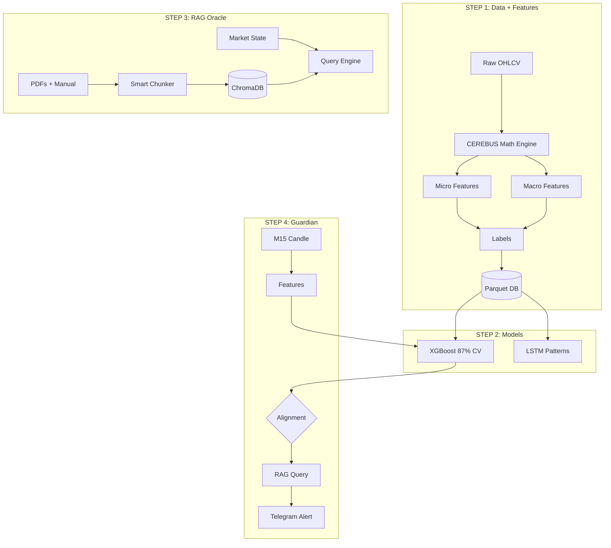
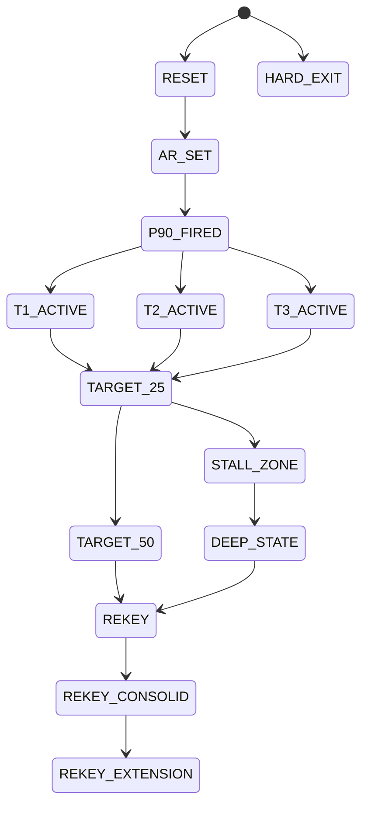
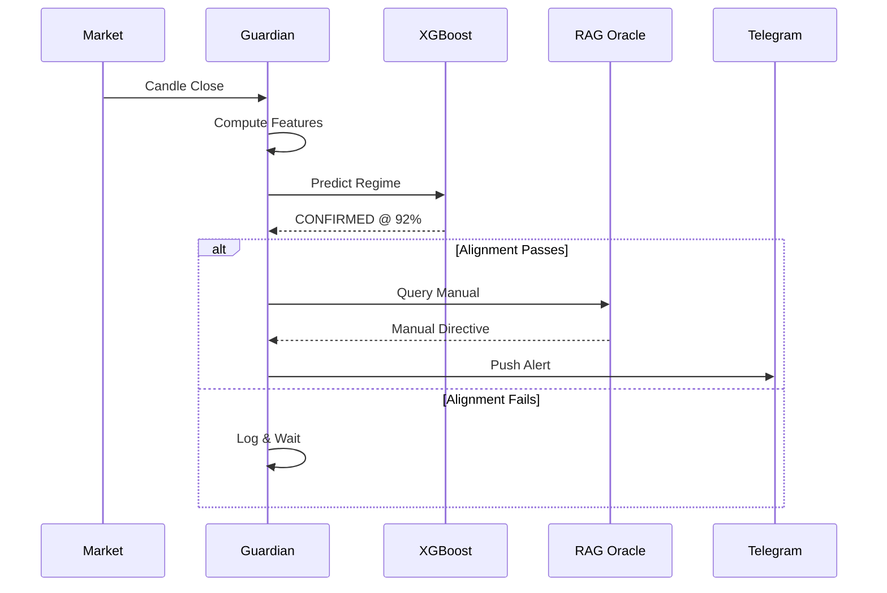
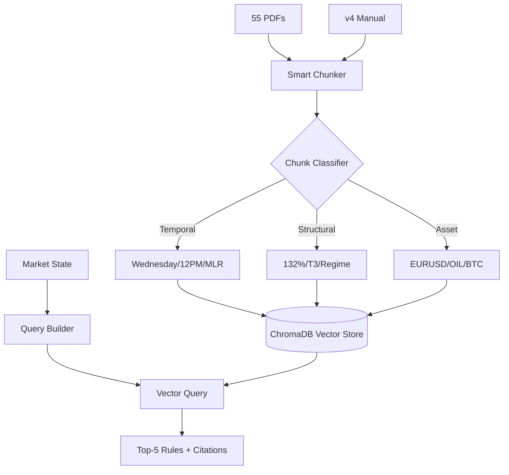
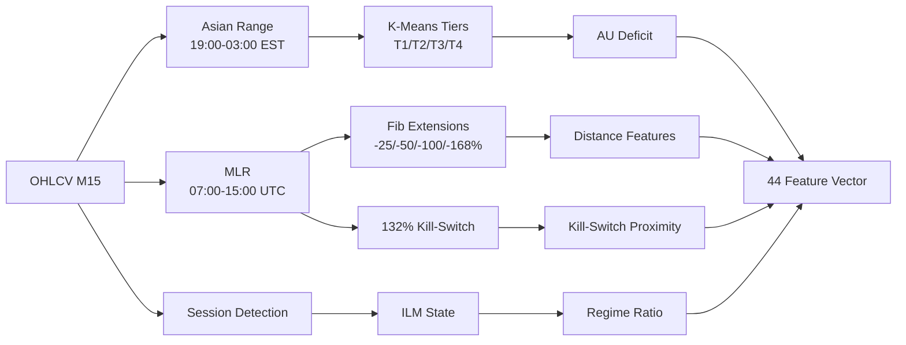
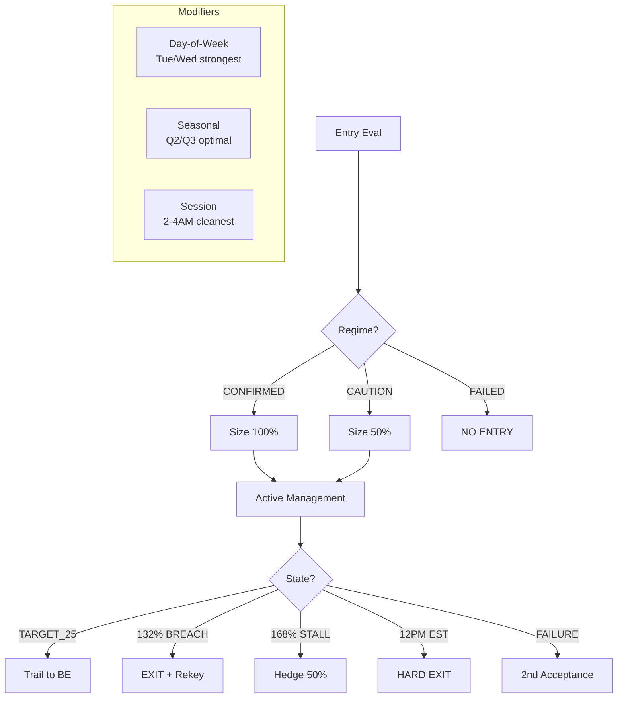
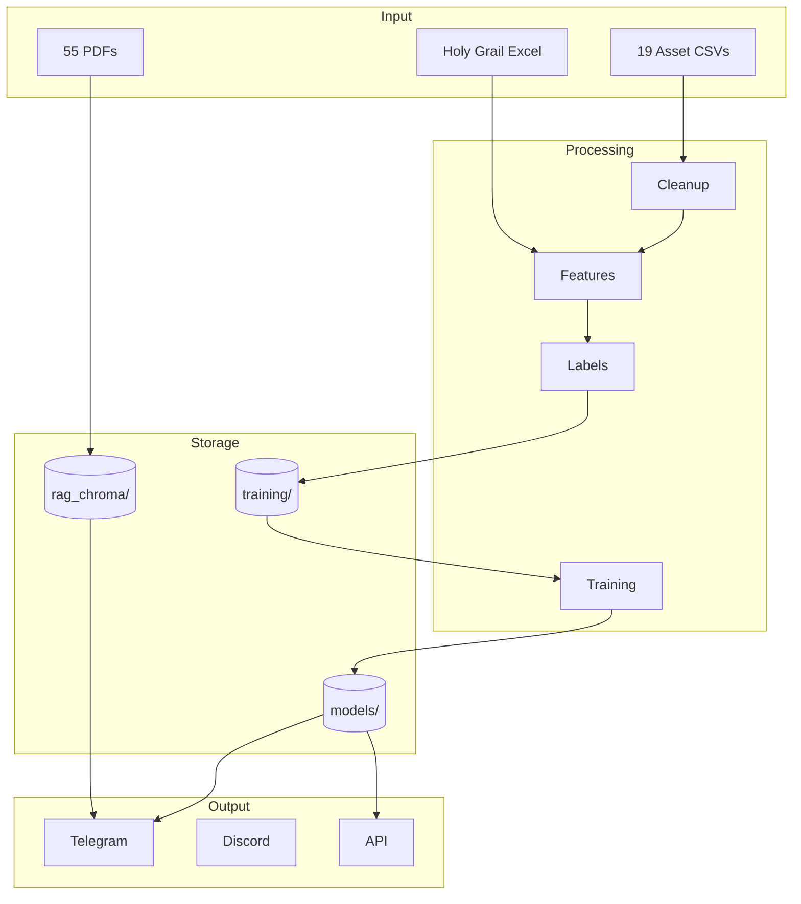
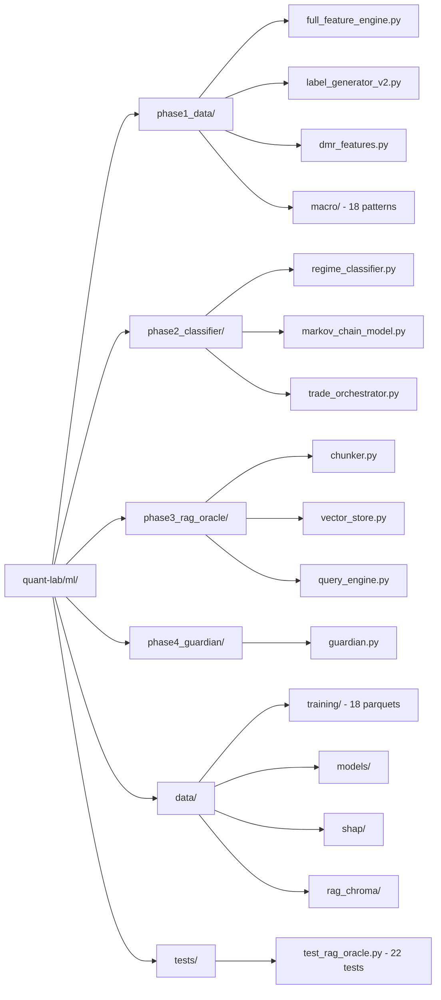

# CEREBUS Neuro-Symbolic Scanner — Mermaid Graphs

> **Purpose:** All Mermaid diagrams for the CEREBUS build.
> **Last Updated:** 2026-06-10

---

## 1. Master 4-Step Architecture



---

## 2. Neuro-Symbolic Scanner Pipeline

```mermaid
flowchart LR
    A[Raw Data] --> B[Data Cleanup]
    B --> C[Feature Engineering<br/>48 features]
    C --> D[Label Generation<br/>Forward-looking]
    D --> E[Training Data<br/>5.3M samples]
    E --> F[XGBoost Training<br/>TimeSeriesSplit CV]
    F --> G[SHAP Analysis<br/>Physics Check]
    G --> H[Model Saved]
    H --> I[Guardian Pipeline<br/>Live Scanning]
    I --> J[Alignment Check]
    J --> K[RAG Oracle Query]
    K --> L[Alert Dispatch]
```



---

## 3. Markov Chain State Machine



---

## 4. Guardian Alert Flow



---

## 5. RAG Oracle Architecture



---

## 6. Feature Engineering Pipeline



---

## 7. Trade Orchestrator State Flow



---

## 8. Data Flow (End-to-End)



---

## 9. SHAP Feature Importance

```mermaid
bar title SHAP Mean Absolute Values (Top 10)
    x-axis: Features
    y-axis: Mean |SHAP|
    dist_to_132_pips: 0.149
    dist_to_mlr_low_pips: 0.071
    fib_sequence_state: 0.059
    dist_to_50_pips: 0.028
    dist_to_25_pips: 0.028
    dist_to_168_pips: 0.027
    dist_to_100_pips: 0.015
    hour_est: 0.013
    hours_since_mlr: 0.012
    day_of_week: 0.011
```

---

## 10. System File Structure


