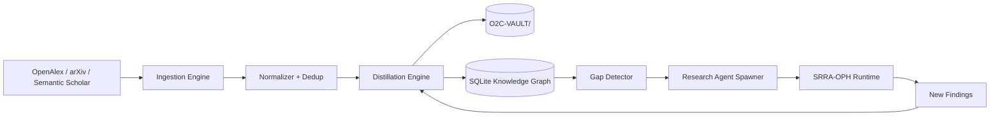

# O2C × MAD LABS — Sovereign Research Mesh

> **Status:** 🟡 Planning complete — ready for build
> **Created:** 2026-06-06 by CC2 (covering for CC1)
> **Owner:** CC (Overseer / Architect / Core Build)
> **Companion docs:** `docs/plans/PO-VTUBER-INTEGRATION.md` (✅ done), `oce/O2C_PHASE00_TEAM_TASKS.md` (✅ done), `docs/plans/topological-cognition-architecture.md` (reference)
> **Replaces:** nothing — extends the existing OCE/SRRA-OPH substrate with the MAD LABS research mesh (Phases 1-4 of the attached plan).

---

## 0. Mission

Turn the existing OCE/SRRA-OPH cognitive field system into a **Sovereign Research Civilization** that:

- Ingests scientific literature continuously (OpenAlex, arXiv, Semantic Scholar)
- Distills raw papers into operational doctrine (CAUSE / METHOD / RESULT / LIMITS / LINKS)
- Builds and maintains a recursive knowledge graph in O2C-VAULT
- Spawns research agents on detected knowledge gaps
- Compounds intelligence over time without manual curation

The vault already exists (200+ files in `O2C-VAULT/`). The missing piece is the **autonomous ingestion + distillation + research loop** that turns the vault from a static knowledge base into a living research substrate.

**This is not a separate system.** Every component in this plan lands as either:
- A new module inside `oce/backend/` (the cognitive field runtime)
- A new module inside `core/research/` (the research mesh)
- A new section inside `O2C-VAULT/` (the persistent substrate)
- A new page in the OCE frontend (the observational interface)

The architecture is ONE system. The OCE/SRRA-OPH substrate is enriched, not replaced.

---

## 1. Core Architectural Principle (from BUILD-NOTES)

> **Every new component must answer: "Does this deepen the runtime substrate, or does this expose the substrate through OCE?" If neither, it shouldn't be built yet.**

The research mesh **deepens the substrate** by giving OCE a way to learn from external knowledge autonomously. The OCE frontend will eventually expose the mesh (a "Research" page with the knowledge graph, doctrine viewer, agent activity).

---

## 2. The Four Layers (mapped to MAD LABS Phases 1-4)

| MAD LABS Phase | Name | Our Implementation | Status |
|---|---|---|---|
| Phase 1 | Knowledge Acquisition Infrastructure | `core/research/ingestion/` | ⏳ Build |
| Phase 2 | Distillation + Knowledge Graph | `core/research/distillation/` | ⏳ Build |
| Phase 3 | Autonomous Research Loops | `core/research/agents/` | ⏳ Build |
| Phase 4 | Sovereign Cognitive Civilization | `oce/backend/research_api.py` + OCE frontend page | ⏳ Build |

Each layer depends on the one below. Build order: ingestion → distillation → agents → API/UI.

---

## 3. The Loop (the actual moat)



The loop is the system. Without the loop, it's just a paper downloader.

---

## 4. Layer 1 — Knowledge Acquisition Infrastructure

**Goal:** Continuously pull structured research metadata from external sources into a normalized local store.

### 4.1 Components

| # | Component | Path | Agent | Tests |
|---|---|---|---|---|
| 1.1 | OpenAlex client | `core/research/ingestion/openalex_client.py` | PM | 8 |
| 1.2 | arXiv client | `core/research/ingestion/arxiv_client.py` | PM2 | 6 |
| 1.3 | Semantic Scholar client | `core/research/ingestion/s2_client.py` | PM | 6 |
| 1.4 | Source registry | `core/research/ingestion/sources.py` | CC | 4 |
| 1.5 | Normalized paper schema | `core/research/ingestion/models.py` | CC | 5 |
| 1.6 | Ingestion scheduler | `core/research/ingestion/scheduler.py` | RL | 6 |
| 1.7 | Local cache + dedup | `core/research/ingestion/cache.py` | PM | 6 |
| 1.8 | Rate limiter + retry | `core/research/ingestion/rate_limit.py` | PM2 | 5 |

**Total Layer 1:** 8 components, ~46 tests

### 4.2 Domain Filter (mandatory)

Per BUILD-NOTES principle *"Don't ingest everything — curate aggressively."* Initial domains:

```python
INITIAL_DOMAINS = [
    "agent_orchestration",
    "memory_systems",
    "distributed_cognition",
    "knowledge_graphs",
    "vector_retrieval",
    "reinforcement_learning",
    "attention_mechanisms",
    "inference_optimization",
    "llm_systems",
    "market_microstructure",
    "topology_network_theory",
    "entropy_systems",
    "causal_inference",
    "graph_neural_networks",
    "self_supervised_learning",
]
```

### 4.3 Storage

- Raw papers: SQLite `data/research/papers.db` (metadata only — NOT full PDFs at first)
- 80% of value comes from structure (title, abstract, citations, authors, concepts)
- PDF parsing is Phase 2+ work, only on-demand for high-value papers

### 4.4 Performance Targets

| Metric | Target |
|---|---|
| Papers ingested per run | 500+ |
| Dedup accuracy | 100% on DOI |
| API failures recovered | 95%+ via retry |
| Cost per 1000 papers | <$0 (OpenAlex is free, arXiv is free) |

---

## 5. Layer 2 — Distillation + Knowledge Graph

**Goal:** Convert raw paper metadata into operational doctrine (markdown notes) and build a queryable knowledge graph.

### 5.1 Distillation Format (CAUSE/METHOD/RESULT/LIMITS/LINKS)

Every paper becomes a markdown note in `O2C-VAULT/research/papers/{domain}/{year}/{first_author}_{slug}.md`:

```markdown
# {Title}

CAUSE: {What problem does this paper address?}
METHOD: {How did they solve it?}
RESULT: {What changed? What numbers?}
LIMITATIONS: {Where does it fail? What assumptions?}
APPLICATION: {How can OCE/PO use this?}
LINKS:
- [[Related Concept 1]]
- [[Related Concept 2]]
- cites:[[Paper X]]
- cited_by:[[Paper Y]]

#paper #domain/{subdomain} #year/{year} #operational_relevance/{1-5}
```

**This is the actual moat.** Not the API. The API is commodity. The note format is portable, parseable, linkable, and survives model swaps.

### 5.2 Components

| # | Component | Path | Agent | Tests |
|---|---|---|---|---|
| 2.1 | Distillation engine (rule-based first) | `core/research/distillation/distiller.py` | CC | 8 |
| 2.2 | Concept extractor | `core/research/distillation/concepts.py` | PM | 6 |
| 2.3 | Citation graph builder | `core/research/distillation/citation_graph.py` | PM2 | 6 |
| 2.4 | Vault writer (paper → markdown) | `core/research/distillation/vault_writer.py` | CC | 6 |
| 2.5 | Graph store (SQLite) | `core/research/distillation/graph_store.py` | CC | 5 |
| 2.6 | LLM-assisted distillation (optional Phase 2.6) | `core/research/distillation/llm_distill.py` | AS | 4 |
| 2.7 | Doctrine extractor (recurring patterns → doctrine note) | `core/research/distillation/doctrine.py` | AS | 5 |
| 2.8 | Contradiction detector | `core/research/distillation/contradictions.py` | RL | 5 |

**Total Layer 2:** 8 components, ~45 tests

### 5.3 Knowledge Graph Schema

```sql
CREATE TABLE nodes (
    id TEXT PRIMARY KEY,        -- openalex:W2741809807 or doi:10.xxxx
    kind TEXT NOT NULL,         -- paper|author|concept|method|institution
    label TEXT NOT NULL,
    metadata JSON,
    created_at TIMESTAMP
);

CREATE TABLE edges (
    src_id TEXT,
    dst_id TEXT,
    kind TEXT NOT NULL,         -- cites|authored|introduces|extends|contradicts
    weight REAL DEFAULT 1.0,
    metadata JSON,
    PRIMARY KEY (src_id, dst_id, kind)
);
```

**Queryable locally, no Neo4j.** SQLite handles 100k+ nodes fine for a research mesh.

### 5.4 Doctrine Extraction

When ≥3 distilled notes in a domain share a CAUSE or METHOD → auto-extract a `doctrine/{domain}/{topic}.md` note. This is the "compounding intelligence" mechanism. The system doesn't just store notes — it finds patterns and crystallizes them.

---

## 6. Layer 3 — Autonomous Research Loops

**Goal:** The system detects what it doesn't know, spawns agents to research it, and updates the vault.

### 6.1 Components

| # | Component | Path | Agent | Tests |
|---|---|---|---|---|
| 3.1 | Knowledge gap detector | `core/research/agents/gap_detector.py` | AS | 5 |
| 3.2 | Research task generator | `core/research/agents/task_gen.py` | PM | 5 |
| 3.3 | Research agent (LLM-driven) | `core/research/agents/research_agent.py` | CC | 6 |
| 3.4 | Finding evaluator | `core/research/agents/evaluator.py` | PM2 | 5 |
| 3.5 | Recursive research router | `core/research/agents/router.py` | PM2 | 5 |
| 3.6 | Agent lifecycle (spawn → work → terminate) | `core/research/agents/lifecycle.py` | AS | 5 |
| 3.7 | Research task queue (SQLite-backed) | `core/research/agents/queue.py` | CC | 4 |
| 3.8 | SRRA-OPH runtime adapter | `core/research/agents/srra_adapter.py` | CC | 4 |

**Total Layer 3:** 8 components, ~39 tests

### 6.2 Agent Behavior (the research loop)

```python
async def research_loop():
    gaps = gap_detector.find_gaps(threshold=0.4)
    for gap in gaps[:3]:  # bounded parallelism
        task = task_gen.from_gap(gap)
        finding = await research_agent.execute(task, llm=selected_model)
        if finding.confidence > 0.6:
            await vault_writer.write_finding(finding)
            await graph_store.add_node(finding)
        await queue.mark_complete(task.id)
    await scheduler.sleep(interval=3600)
```

**Bounded by:** max 3 concurrent research agents, max 1000 LLM tokens per finding extraction, 1-hour minimum between cycles.

### 6.3 Safety Boundaries (HARD RULES)

Per O2C Phase 00 BUILD-NOTES:

1. **NO autonomous recursive skill mutation** — human review required
2. **NO unbounded vault writes** — taxonomy enforcement + daily write cap
3. **NO cross-domain agent spawning without consensus** — observer validation
4. **NO LLM cost runaway** — hard daily token budget ($2/day)
5. **All agent actions logged to execution journal** — full audit trail

### 6.4 Cost Controls

| Lever | Limit |
|---|---|
| Daily LLM spend | $2 hard cap |
| Tokens per distillation | 500 input + 300 output |
| Concurrent agents | 3 max |
| Vault writes per day | 200 max |
| Failed-task retries | 2 max before abandoned |

---

## 7. Layer 4 — Sovereign Cognitive Civilization (the API + UI surface)

**Goal:** Expose the research mesh through OCE so the operator (MAD) and the agent network can interact with it.

### 7.1 API Components

| # | Component | Path | Agent | Tests |
|---|---|---|---|---|
| 4.1 | OCE `/api/research/ingest` (manual trigger) | `oce/backend/research_api.py` | CC | 4 |
| 4.2 | OCE `/api/research/papers` (search) | `oce/backend/research_api.py` | CC | 4 |
| 4.3 | OCE `/api/research/graph` (query) | `oce/backend/research_api.py` | CC | 4 |
| 4.4 | OCE `/api/research/agents` (list/control) | `oce/backend/research_api.py` | CC | 4 |
| 4.5 | OCE `/api/research/doctrine` (browse) | `oce/backend/research_api.py` | CC | 3 |
| 4.6 | OCE `/api/research/gaps` (show detected gaps) | `oce/backend/research_api.py` | CC | 3 |
| 4.7 | Vault sync engine (Obsidian ↔ graph) | `oce/backend/research_api.py` | PM2 | 4 |
| 4.8 | Telemetry + audit export | `oce/backend/research_api.py` | AS | 3 |

**Total Layer 4:** 8 components, ~29 tests

### 7.2 OCE Frontend (PM2 territory)

| Page | Path | Components |
|---|---|---|
| Research Hub | `oce/frontend/app/research/page.tsx` | Domain filter, paper search, recent activity |
| Knowledge Graph | `oce/frontend/app/research/graph/page.tsx` | Cytoscape force-directed, filter by domain/year |
| Doctrine Library | `oce/frontend/app/research/doctrine/page.tsx` | List of crystallized doctrine, click to view |
| Research Agents | `oce/frontend/app/research/agents/page.tsx` | Active agents, task queue, manual spawn |

### 7.3 Vault Layout (final)

```
O2C-VAULT/
├── research/
│   ├── papers/
│   │   ├── {domain}/
│   │   │   └── {year}/
│   │   │       └── {author}_{slug}.md
│   ├── concepts/
│   │   └── {concept_slug}.md
│   ├── methods/
│   │   └── {method_slug}.md
│   └── authors/
│       └── {author_slug}.md
├── doctrine/
│   ├── {domain}/
│   │   └── {doctrine_slug}.md
│   └── meta/
│       └── research_mesh_principles.md
├── graphs/
│   ├── research_citations.db
│   ├── research_concepts.db
│   └── research_agents.db
├── routing/
│   ├── research_gaps/
│   ├── active_research/
│   └── completed_research/
└── intelligence/
    └── research_signal_log.md
```

---

## 8. Agent Assignment Matrix

| Agent | Role | Layer(s) | Deliverables |
|---|---|---|---|
| **CC** (Claude Code) | Architect + Core Build + OCE API | 1.4, 1.5, 2.1, 2.4, 2.5, 3.3, 3.7, 3.8, 4.1-4.6 | Schema, distiller, vault writer, API, research agent core |
| **PM** (Polymorph) | Sources + workspace scanners | 1.1, 1.3, 1.7, 1.8, 2.2, 3.2, 4.7 | OpenAlex + S2 clients, cache, concept extractor, task gen |
| **PM2** (Polymorph 2) | Graph + multi-agent layer | 1.2, 1.8, 2.3, 3.4, 3.5, 4.7 | arXiv client, citation graph, evaluator, router, vault sync |
| **AS** (Assistant Manager) | Quality + safety + tests | 2.6, 2.7, 3.1, 3.6, 4.8 | LLM distill, doctrine extractor, gap detector, lifecycle, telemetry |
| **RL** (Research Lead) | Scheduling + contradictions | 1.6, 2.8, 3.4 | Scheduler, contradiction detector, evaluator (regression tests) |
| ~~OC2~~ | — | — | Off-table (operator working directly) |
| ~~PO~~ | — | — | Off-table (operator working directly) |

**Worktree convention:** All agents commit to `master` directly. CC rebases at phase gates. Commit prefix: `[RESEARCH-MESH L{N}] <agent-tag>: <description>`. Push after every component.

---

## 9. Build Order (Dependency Graph)

```
L1.1-1.3 (PM + PM2 source clients)  ─┐
L1.4-1.5 (CC source registry + schema)│  PARALLEL
L1.6-1.8 (RL scheduler, PM cache, PM2 rate limit) ─┘
                    ↓
              L1 GATE: 500 papers ingested, dedup verified
                    ↓
L2.1-2.2 (CC distiller, PM concepts)  ─┐
L2.3-2.5 (PM2 graph, CC vault_writer, CC graph_store) │ PARALLEL
L2.6-2.8 (AS LLM distill, AS doctrine, RL contradictions) ─┘
                    ↓
              L2 GATE: First 50 papers distilled, doctrine extracted
                    ↓
L3.1-3.2 (AS gap detector, PM task gen) ─┐
L3.3-3.5 (CC research agent, PM2 evaluator, PM2 router) │ PARALLEL
L3.6-3.8 (AS lifecycle, CC queue, CC SRRA adapter) ─┘
                    ↓
              L3 GATE: First autonomous research cycle completes
                    ↓
L4.1-4.6 (CC OCE API endpoints)  ─┐
L4.7-4.8 (PM2 vault sync, AS telemetry) │ PARALLEL
                    ↓
OCE frontend pages (PM2)  ─────────┘
                    ↓
              L4 GATE: Operator browses research mesh in OCE
```

**Phase gate criteria** are explicit at each `L{N} GATE` marker.

---

## 10. Test Strategy

| Layer | Test Type | Agent | Count |
|---|---|---|---|
| 1 (Ingestion) | Unit (mock HTTP) + integration (live API) | PM + PM2 | ~46 |
| 2 (Distillation) | Unit (fixtures) + integration (real papers) | CC + AS | ~45 |
| 3 (Agents) | Unit (mock LLM) + e2e (single cycle) | PM2 + AS | ~39 |
| 4 (API + UI) | Integration (live OCE) | CC + PM2 | ~29 |
| **TOTAL** | | | **~159 new tests** |

All existing 1582+ tests must continue to pass.

---

## 11. Risk Register

| Risk | Likelihood | Impact | Mitigation |
|---|---|---|---|
| OpenAlex rate limits during bulk ingest | Medium | Phase 1 delayed | Rate limiter (1.5) + cache (1.7) + backoff |
| arXiv API format drift | Low | Phase 1 component rewrite | Pin to v1 API, validate schema on every response |
| LLM distillation cost >$2/day | Medium | Cost overrun | Rule-based distiller first (2.1), LLM is opt-in per paper |
| Vault pollution (junk papers) | High | Entropy landfill | Strict domain filter (1.4) + taxonomy enforcement (AS, 2.7) + daily write cap |
| Research agents produce nonsense | Medium | Doctrine corruption | Evaluator (3.4) gates writes — confidence <0.6 → discard |
| SRRA-OPH substrate can't host research agents | Low | Phase 3 rewrite | Adapter (3.8) isolates substrate differences; research mesh doesn't depend on substrate internals |
| MAD changes mind on direction | Certain | Some work invalidated | Layered build — each layer is independently valuable |

---

## 12. Hard Rules (non-negotiable)

Per the existing BUILD-NOTES + O2C Phase 00 BUILD-NOTES:

1. **No autonomous recursive skill mutation** — human review required
2. **No unbounded vault writes** — taxonomy enforcement + daily cap
3. **No LLM cost runaway** — $2/day hard cap
4. **No model weight modification** — orchestration layer only
5. **No production deployment without MAD approval gate**
6. **All agent actions logged to execution journal** — full audit trail
7. **Every paper note follows CAUSE / METHOD / RESULT / LIMITATIONS / APPLICATION / LINKS** — no exceptions
8. **Use real data when available** — simulate only when no real OpenAlex/arXiv data exists
9. **Test before you update progress** — every progress file update requires verification
10. **Simplicity first** — minimum code that solves the problem

---

## 13. Definition of Done — Full Plan

| Layer | Done when |
|---|---|
| **L1** | 500 papers ingested from OpenAlex + arXiv, all in SQLite, all deduped, scheduler runs daily |
| **L2** | First 50 papers distilled into CAUSE/METHOD/RESULT/LIMITATIONS/APPLICATION/LINKS notes in O2C-VAULT/research/papers/, knowledge graph has 500+ nodes, ≥1 doctrine note auto-extracted |
| **L3** | Gap detector finds ≥3 real gaps, research agent fills ≥1 gap end-to-end, audit trail complete |
| **L4** | OCE `/api/research/*` returns real data, frontend pages render, operator can browse the mesh |
| **Total** | All 4 layers complete, ~159 new tests pass, total project tests >1700 |

---

## 14. Open Questions for Operator

1. **LLM for distillation** — use the same model tier as PO/OCE (current default), or specify a particular OpenRouter model?
2. **Domain list** — confirm the 15 initial domains above, or add/remove any?
3. **Daily LLM budget** — confirm $2/day hard cap? (Easy to raise later via config)
4. **Vault sync** — bidirectional (OCE writes → vault) or one-way (vault → OCE)?
5. **Operator trigger** — should ingestion run automatically on a daily cron, or only on manual OCE trigger?

---

## 15. Phase Kickoff Plan (immediate)

Once approved:

1. **CC** writes the plan to `O2C-VAULT/doctrine/meta/research_mesh_principles.md`
2. **CC** creates `core/research/` package skeleton with `__init__.py` files
3. **CC** creates the SQLite schema in `data/research/schema.sql`
4. **CC** posts kickoff to `team-chat.md` with task assignments
5. **PM + PM2** start L1.1, L1.2, L1.3 in parallel
6. **CC** builds L1.4, L1.5 schema + source registry
7. **RL** builds L1.6 scheduler
8. **AS** reviews every PR for safety boundaries

**No new module starts until L1.1 (OpenAlex client) is producing real papers.** We build on real data, not mocks.
