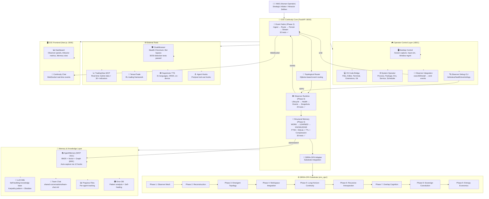
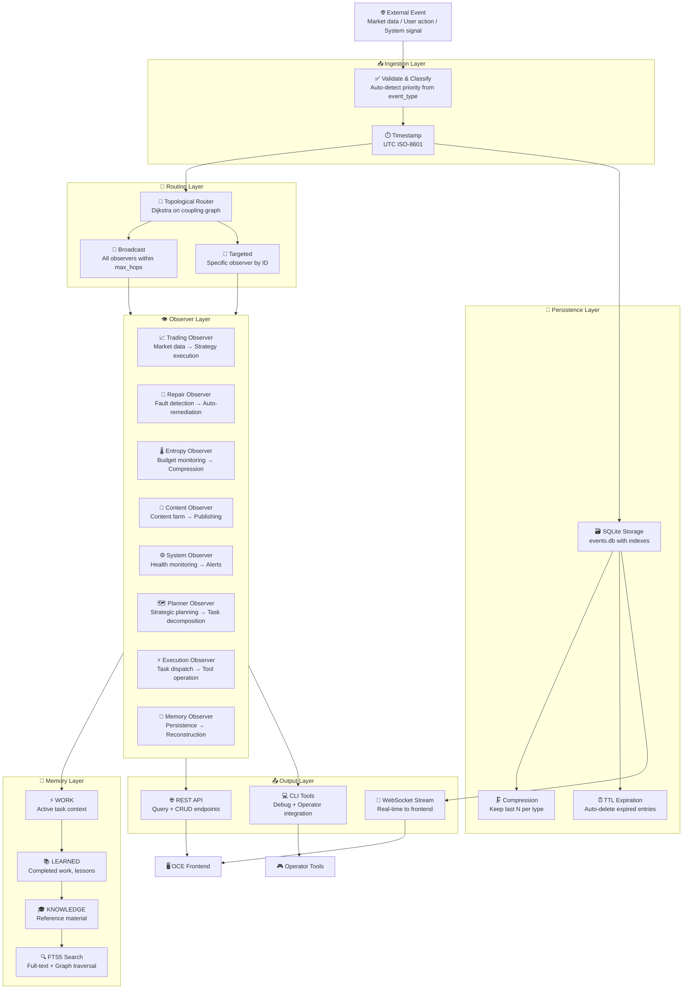
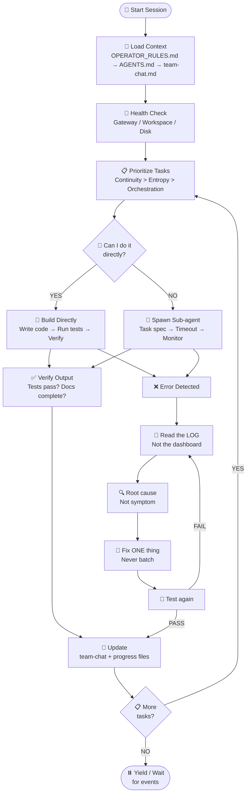
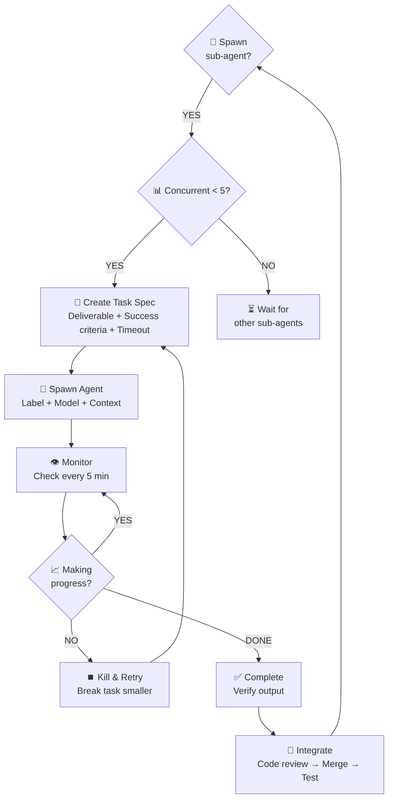
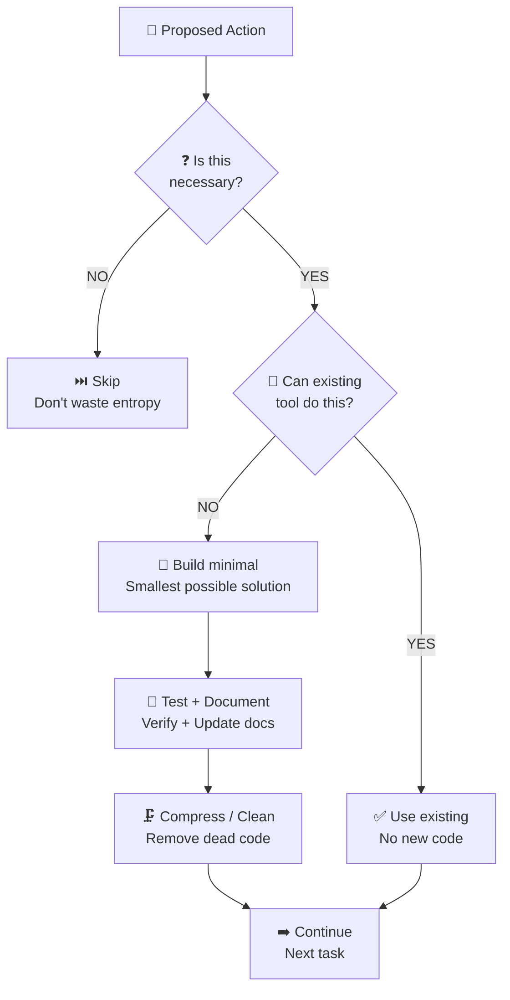

# OCE System Architecture — Mermaid Graphs

## 1. System Architecture



## 2. Data Flow / Touring Graph



## 3. Logic Chain (Execution Flow)



## 4. Sub-Agent Governance Chain



## 5. Entropy Governance Chain



---

## Copy-Paste Ready for Planner Agent

### System Summary
```
OCE (Operator Continuity Engine) — 101 tests passing
├── Event Fabric (Phase 2) — 32 tests — Ingest/Route/Persist/Stream
├── Observer Runtime (Phase 3) — 20 tests — Lifecycle/Health/Events
├── Structural Memory (Phase 4) — 30 tests — WORK/LEARNED/KNOWLEDGE + FTS5
├── Topology + Persistence — 19 tests — Dijkstra routing + SQLite
└── SRRA-OPH Substrate — 77 tests — Phases 1-9 complete

Operator Control Layer — Port 8001
├── Desktop Control (screen, input, windows)
├── VS Code Bridge (files, editor, terminal, git)
├── System Operator (process, package, env, service)
├── Observer Integration (exec/kill/install → emit)
└── Observer Debug CLI (list/status/health/events/logs)

Memory Layer
├── Structural Memory (SQLite + FTS5 + TTL + Compression)
├── AgentMemory (MCP server — BM25 + Vector + Graph)
├── LLM Wiki (self-building knowledge base)
├── Team Chat (coordination hub)
└── Error DB (pattern analysis + self-healing)

External Tools
├── CloakBrowser (stealth Chromium, bot bypass)
├── TradingView MCP (real-time market data)
├── TensorTrade (RL trading framework)
├── Supertonic TTS (31 languages, on-device)
└── Agent Hooks (pre/post tool use)

Governance
├── OPERATOR_RULES.md — Bounded sovereign operational continuity
├── SUB_AGENT_RULES.md — Max 5 concurrent, no recursive spawning
├── Max sub-agent runtime: 15 min soft limit
├── All execution logged and observable
└── Human (MAD) is strategic anchor — OWL coordinates, doesn't replace
```
