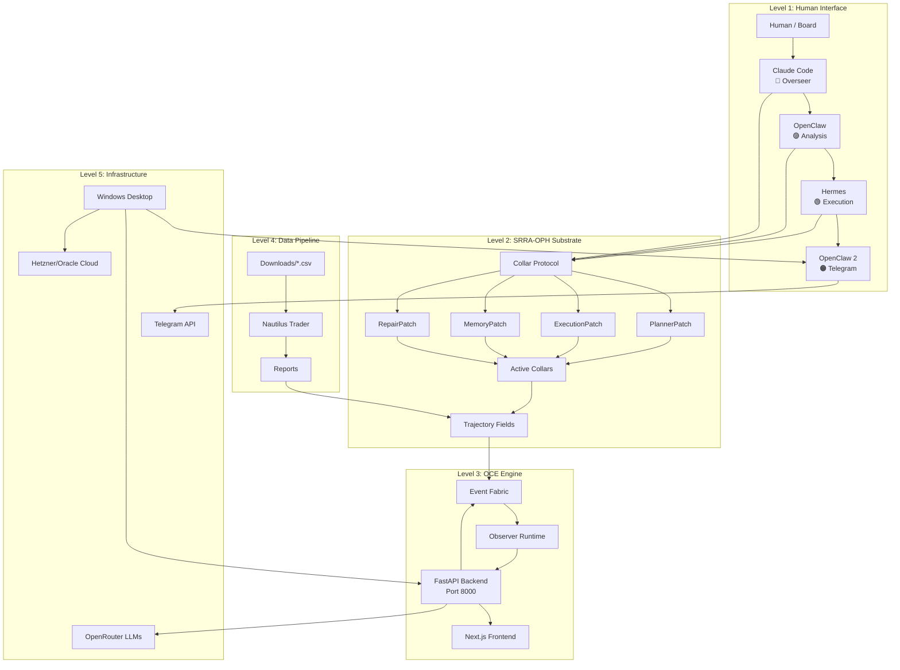
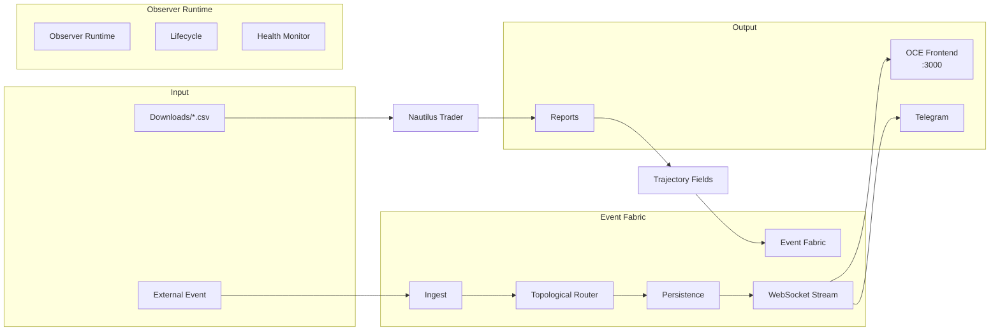
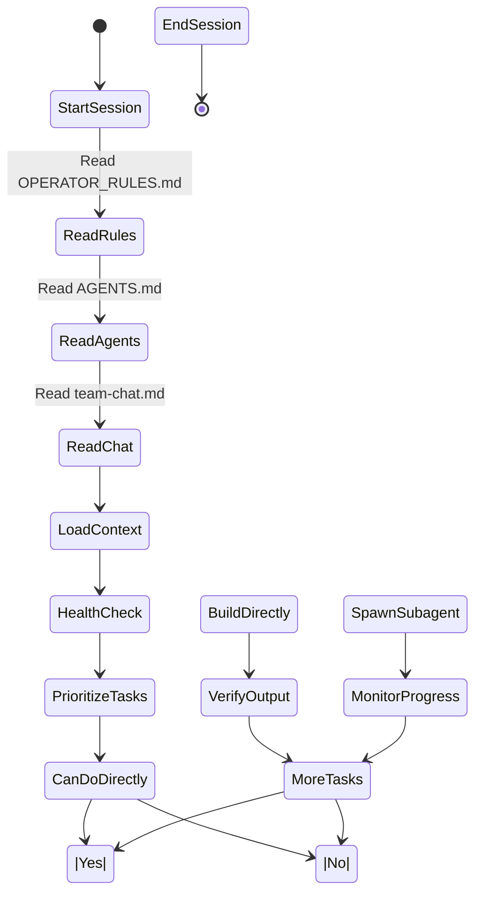
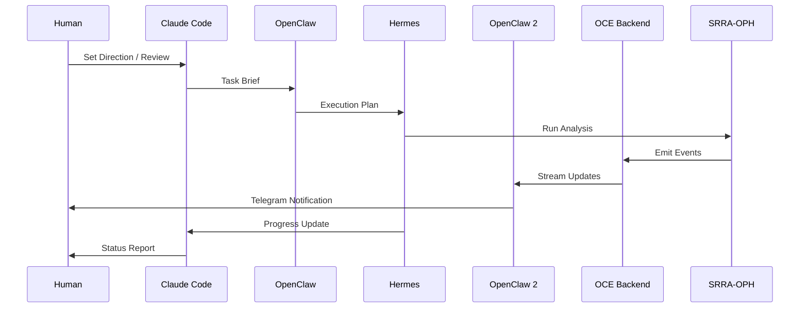
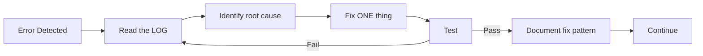
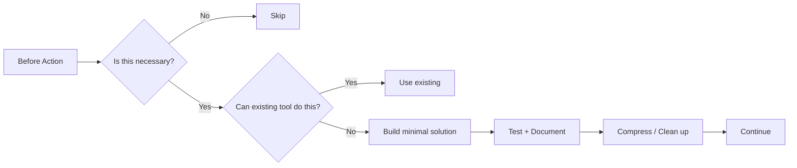
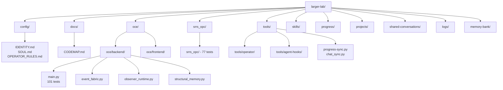
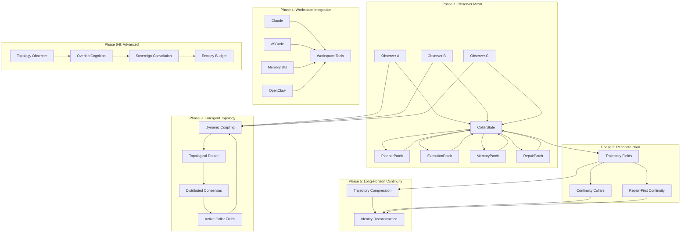
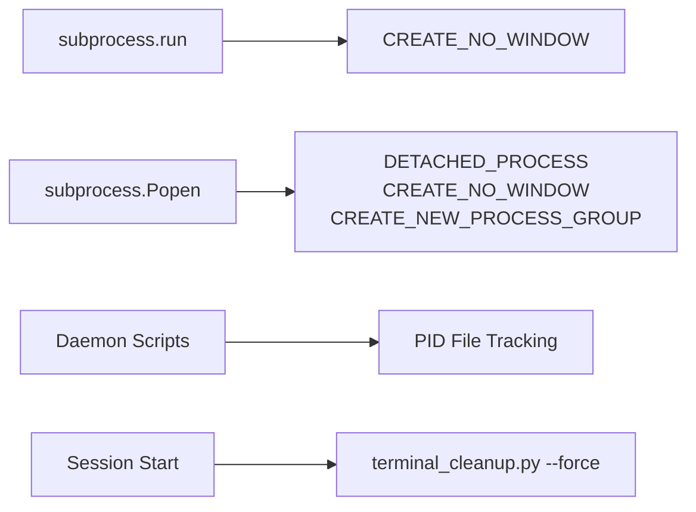

# CODEMAP — Larger-Lab Workspace Guide

> **Last Updated:** 2026-05-17 | **Phase:** OCE Phase 5 (Observability) — Active
> **Purpose:** Quick orientation for agents joining the workspace.

---

## 1. SYSTEM ARCHITECTURE GRAPH



---

## 2. DATA FLOW / TOURING GRAPH



---

## 3. LOGIC CHAIN (Execution Flow)




      ▼                                                ▼
[Run tests]                                       [Fix failures]
      │                                                │
      ▼                                                ▼
[All pass?] ──NO──▶ [Fix failures]            [Post to team-chat]
      │                                                │
      YES                                               ▼
      │                                          [Report completion]
      ▼                                                │
[Post to team-chat] ◀──────────────────────────────────┘
      │
      ▼
[Update progress file]
      │
      ▼
[Done]


┌─────────────────────────────────────────────────────────────────────────────┐
│                         ERROR HANDLING CHAIN                                 │
└─────────────────────────────────────────────────────────────────────────────┘

[Error Detected]
      │
      ▼
[Read the LOG] ◀── "Read the logs, not the dashboard"
      │
      ▼
[Identify root cause] ◀── Not symptom
      │
      ▼
[Fix ONE thing] ◀── Never batch fixes
      │
      ▼
[Test]
      │
      ▼
[Pass?] ──NO──▶ [Read the LOG again]
      │
      YES
      │
      ▼
[Document fix pattern]
      │
      ▼
[Continue]


┌─────────────────────────────────────────────────────────────────────────────┐
│                         ENTROPY GOVERNANCE CHAIN                             │
└─────────────────────────────────────────────────────────────────────────────┘

[Before Action]
      │
      ▼
[Is this necessary?] ──NO──▶ [Skip]
      │
      YES
      │
      ▼
[Can existing tool do this?] ──YES──▶ [Use existing]
      │
      NO
      │
      ▼
[Build minimal solution]
      │
      ▼
[Test + Document]
      │
      ▼
[Compress / Clean up]
      │
      ▼
[Continue]
```

---

## 4. ERROR HANDLING CHAIN



---

## 5. ENTROPY GOVERNANCE CHAIN



---

## 6. Workspace Map



```
larger-lab/
  ├── config/                  ← Identity, soul, keys, heartbeat, teams, repos, tools
  ├── docs/                    ← Architecture, workflow, progress, codemap, mermaid graphs
  │   ├── CODEMAP.md           ← This file (architecture + logic graphs)
  │   ├── SYSTEM_ARCHITECTURE.md
  │   ├── WORKFLOW_PROTOCOL.md
  │   ├── IMPLEMENTATION_PLAN.md
  │   ├── RELEVANCE_MAP.md
  │   ├── SKILLS_MASTER_INDEX.md
  │   └── SKILL_TOOL_AUDIT.md
  ├── oce/                     ← Operator Continuity Engine (OCE)
  │   ├── backend/              ← FastAPI Continuity Core
  │   │   ├── main.py           ← All API endpoints (101 tests)
  │   │   ├── event_fabric.py   ← Event Fabric + TopologicalRouter + Persistence
  │   │   ├── observer_runtime.py ← Observer lifecycle (20 tests)
  │   │   ├── structural_memory.py ← 3-layer memory + FTS5 (30 tests)
  │   │   ├── phase4_api.py     ← 6 advanced memory endpoints
  │   │   ├── srrs_adapter.py   ← SRRA-OPH substrate adapter
  │   │   ├── dspy_pipelines.py ← DSPy optimization pipelines
  │   │   └── tests/            ← 101 tests total
  │   ├── frontend/             ← Next.js Shell UI (:3000)
  │   └── docs/                 ← OCE documentation
  │       ├── event-types.md    ← 86 event types
  │       ├── event-protocol.md ← WebSocket protocol
  │       ├── observer-types.md ← 8 observer types
  │       ├── observer-research.md ← Architecture research
  │       └── quality-review-*.md ← Phase 2/3/4 reviews
  ├── srrs_opc/                ← SRRA-OPH core (33 Python files, 77 tests)
  ├── tools/                   ← Automation & operator tools
  │   ├── operator/             ← Operator control layer (:8001)
  │   │   ├── desktop-control.py
  │   │   ├── vscode_bridge.py
  │   │   ├── system_operator.py
  │   │   ├── observer-debug.py
  │   │   ├── observer-integration.py
  │   │   └── desktop_api.py
  │   ├── agent-hooks/          ← Pre/post tool use hooks
  │   ├── hermes-watchdog.py    ← OWL health monitor
  │   ├── progress-sync.py      ← Agent progress sync
  │   ├── chat_sync.py          ← Team chat sync
  │   └── ...
  ├── skills/                  ← Agent skills (57 active)
  │   ├── system-health/        ← 10-point self-audit
  │   ├── harness-engineering/  ← Agent reliability patterns
  │   ├── docker-ops/           ← Container management
  │   ├── cicd-pipeline/        ← CI/CD automation
  │   ├── oce-testing/          ← OCE test patterns
  │   ├── db-ops/               ← Database operations
  │   ├── cloakbrowser/         ← Stealth Chromium
  │   ├── agentmemory/          ← Persistent memory engine
  │   └── ...
  ├── progress/                ← Agent sub-progress & memory files
  ├── projects/                ← External projects
  │   ├── ads/
  │   ├── content/
  │   ├── trading/
  │   ├── ai-tools/
  │   ├── social/
  │   └── llm_wiki/            ← Self-building knowledge base
  ├── shared-conversations/    ← Team chat (team-chat.md)
  ├── logs/                    ← System logs
  ├── memory-bank/             ← Error DB + knowledge base
  │
  ├── AGENTS.md                ← Team manifest + operator rules
  ├── OPERATOR_RULES.md        ← Bounded sovereign operational continuity
  ├── SUB_AGENT_RULES.md       ← Sub-agent governance
  ├── TOOLS.md                 ← Complete tool reference
  └── CLAUDE.md                ← 12-rule behavioral contract
```

---

## Quick Commands

```bash
# Run all SRRA-OPH tests (77 tests)
python -m pytest srrs_opc/tests/ -v

# Run all OCE tests (101 tests)
python -m pytest oce/backend/tests/ -v

# Sync progress → memory
python tools/progress-sync.py --force

# Sync team-chat → agent memory
python tools/chat_sync.py --force

# Health check
python tools/hermes-watchdog.py --once

# Start OCE backend
cd oce/backend && python -m uvicorn main:app --host 127.0.0.1 --port 8000

# Start OCE frontend
cd oce/frontend && npm run dev

# Start Desktop Control API
python tools/operator/desktop_api.py

# Start AgentMemory server
npx @agentmemory/agentmemory
```

---

## Port Reference

| Port | Service | Status |
|------|---------|--------|
| 18789 | OpenClaw gateway (OC1) | Live |
| 18790 | OpenClaw gateway (OC2, primary) | Live |
| 3000 | OCE frontend (Next.js) | Needs npm install |
| 8000 | OCE backend (FastAPI) | Ready |
| 8001 | Desktop control API | Ready |
| 3111 | AgentMemory server | Needs setup |
| 3113 | AgentMemory viewer | Needs setup |

---

## Test Status

| Suite | Tests | Status |
|-------|-------|--------|
| SRRA-OPH (srrs_opc/) | 77 | ✅ Passing |
| OCE Event Fabric | 32 | ✅ Passing |
| OCE Observer Runtime | 20 | ✅ Passing |
| OCE Topology + Persistence | 19 | ✅ Passing |
| OCE Structural Memory | 30 | ✅ Passing |
| **Total OCE** | **101** | ✅ **All Passing** |

---

## 7. SRRA-OPH Topology (Phases 1-9)



---

## 8. ERR-0007: Windows Subprocess Execution Rules



**Prevention Rules:**
- ALL `subprocess.run()` on Windows MUST use `creationflags=subprocess.CREATE_NO_WINDOW`
- ALL `subprocess.Popen()` for background processes MUST use `DETACHED_PROCESS | CREATE_NO_WINDOW | CREATE_NEW_PROCESS_GROUP`
- Always implement PID file tracking for daemon scripts
- Run `tools/terminal_cleanup.py --force` at session start

---

## Version History

| Version | Date | Changes |
|---------|------|---------|
| 1.0.0 | 2026-05-16 | Initial CODEMAP |
| 2.0.0 | 2026-05-16 | Added mermaid graphs, updated for Phase 4 completion, added logic chains |
| 3.0.0 | 2026-05-17 | Added ERR-0007 Windows subprocess rules, Phase 5 observability, unified diagrams |

---

## Quick Reference

| Directory | Purpose |
|-----------|---------|
| `srrs_opc/` | SRRA-OPH core (33 Python files, 77 tests) |
| `nautilus/` | NautilusTrader backtesting |
| `oce/` | Operator Continuity Engine |
| `progress/` | Agent sub-progress files |
| `system-arch/` | All Mermaid diagrams |
| `all-mermaids/` | Diagram archive by phase |
| `tools/` | Automation & utilities |
| `memory-bank/` | Error DB, solutions, patterns |
