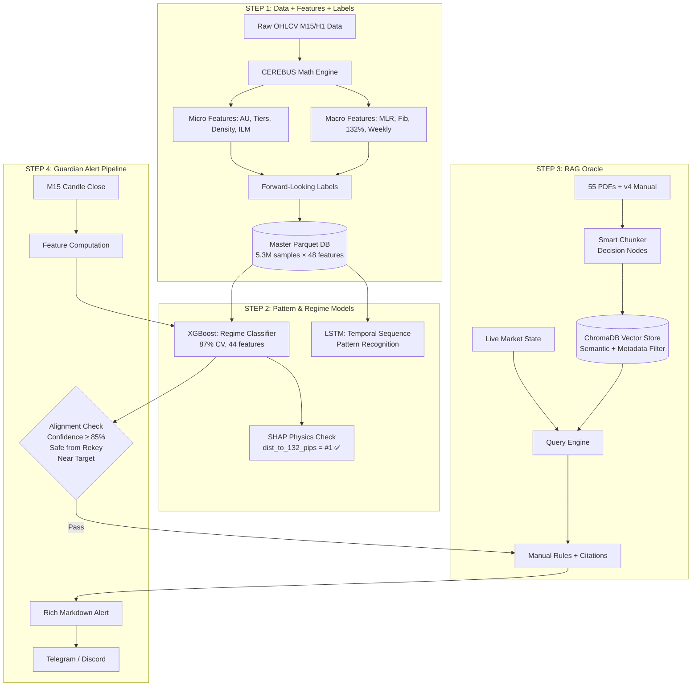
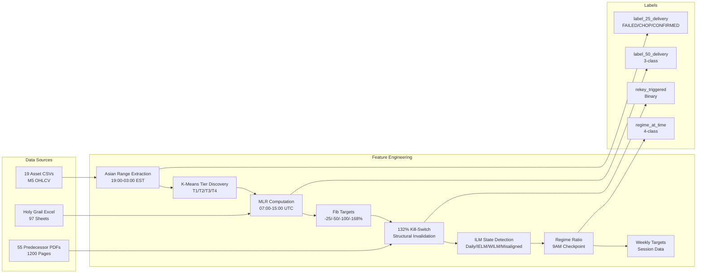
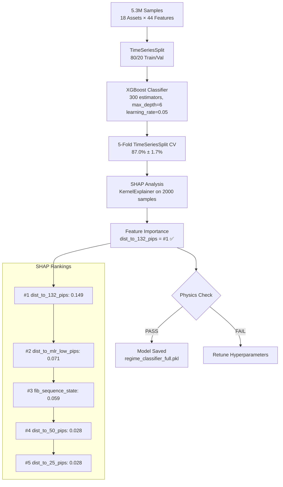
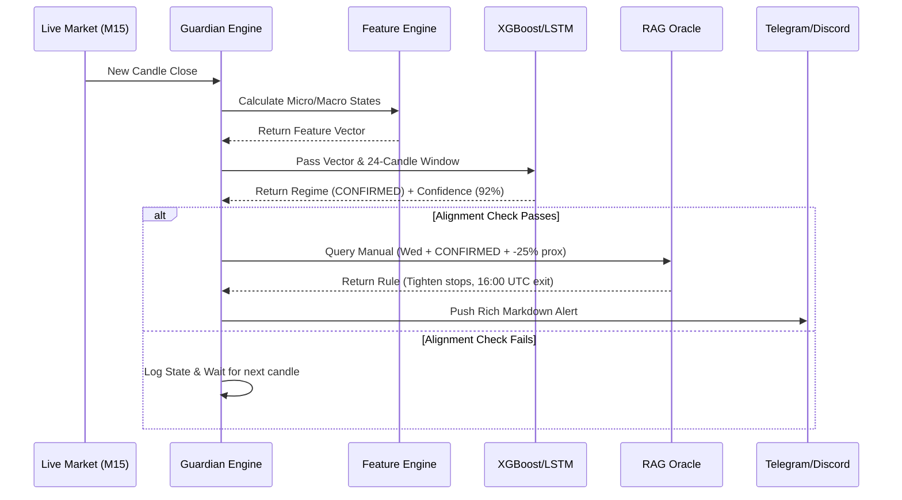
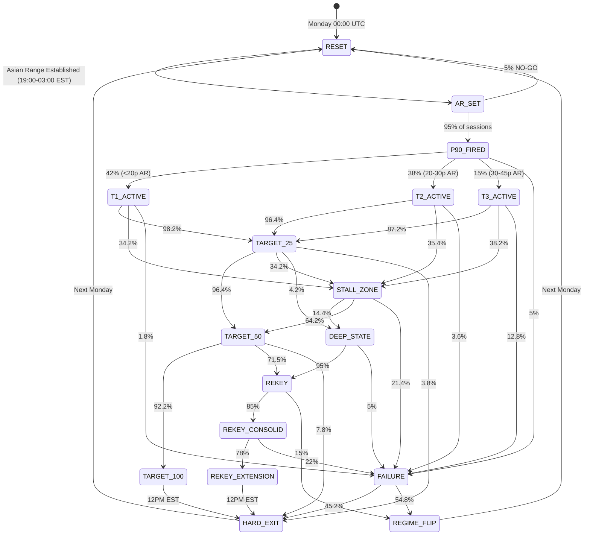
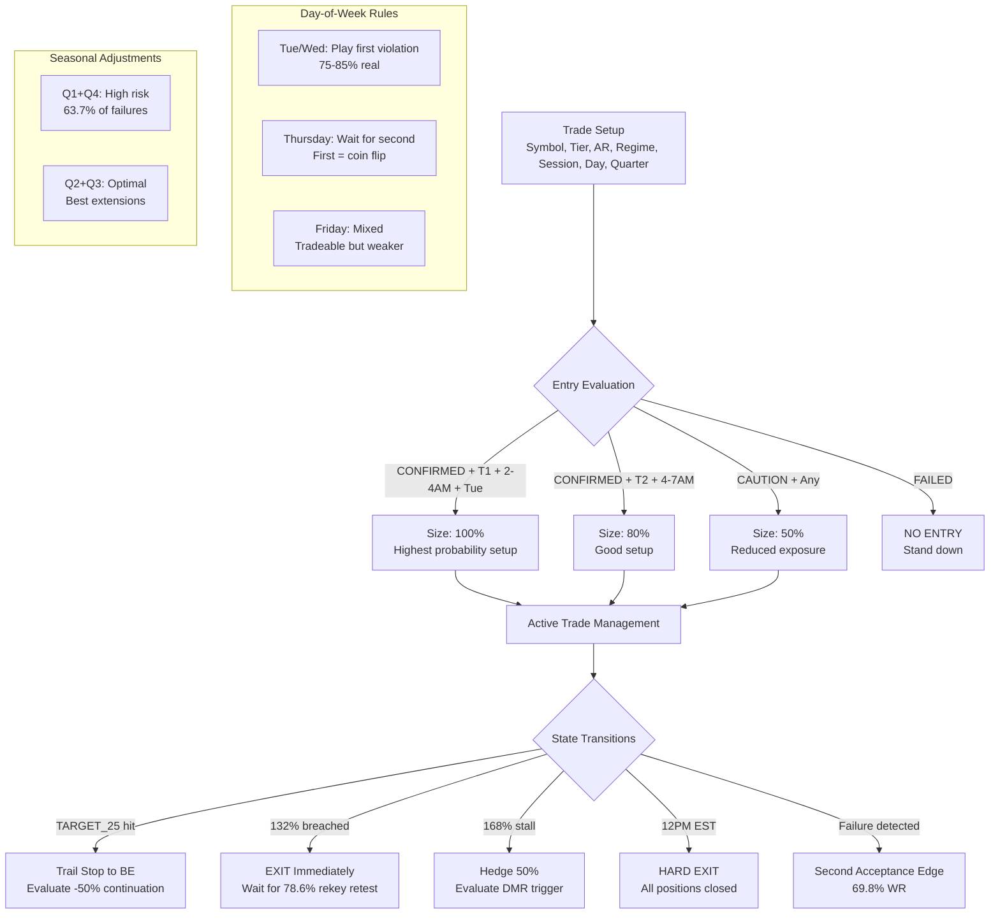
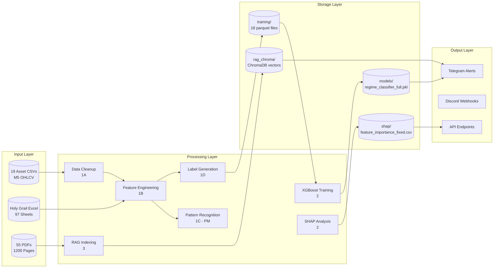
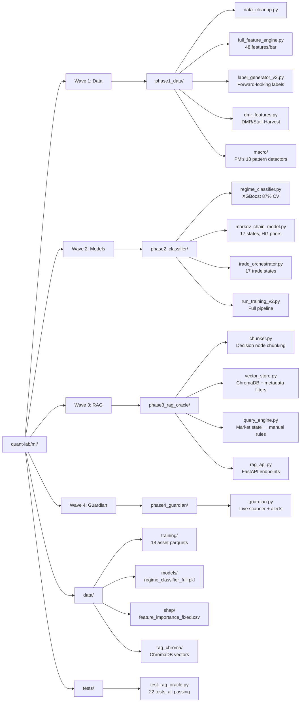

# CEREBUS Neuro-Symbolic Scanner — Architecture

> **Version:** v1.0 | **Date:** 2026-06-10 | **Status:** Wave 1-3 Complete
> **Source:** CEREBUS BUILD.txt + CEREBUS v4 Manual + ST_TIERS_AND_AU.pdf

---

## Table of Contents

1. [Master Architecture (4-Step Stack)](#master-architecture)
2. [Wave 1: Data + Features + Labels](#wave-1-data--features--labels)
3. [Wave 2: Model Training](#wave-2-model-training)
4. [Wave 3: RAG Oracle + Guardian](#wave-3-rag-oracle--guardian)
5. [Markov Chain State Machine](#markov-chain-state-machine)
6. [Trade Orchestrator](#trade-orchestrator)
7. [Data Flow Diagram](#data-flow-diagram)
8. [File Structure](#file-structure)

---

## Master Architecture

---

## Wave 1: Data + Features + Labels

---

## Wave 2: Model Training

---

## Wave 3: RAG Oracle + Guardian

---

## Markov Chain State Machine

---

## Trade Orchestrator

---

## Data Flow Diagram

---

## File Structure

---

## Key Metrics

| Component | Metric | Value |
|-----------|--------|-------|
| Training Data | Samples | 5.3M |
| Training Data | Features | 44 |
| Training Data | Assets | 18 |
| XGBoost | CV Accuracy | 87.0% ± 1.7% |
| XGBoost | Val Accuracy | 86.7% |
| SHAP | #1 Feature | dist_to_132_pips (0.149) |
| RAG | Chunks | 55 PDFs + manual |
| RAG | Tests | 22/22 passing |
| Markov | States | 17 |
| Orchestrator | Trade States | 17 |
