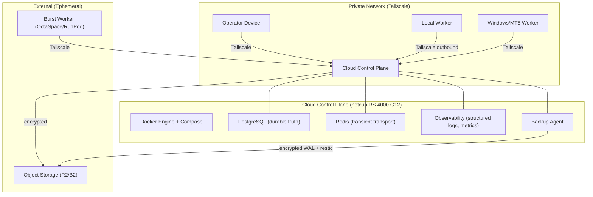

# Cloud Ground Architecture — Target Topology

**Document ID:** B1-ARCH-TOPO-001
**Version:** 1.0
**Status:** SPECIFIED — B1-I1 static documentation
**Constitutional reference:** OCE Constitution 1.1 §12, Block 1 Cloud Ground Plan 1.0 §7

---

## Target System Overview

The OCE Cloud Ground establishes a single-operator, private, durable control plane that removes the operator's computer as the sole host and source of operational truth.

## Key Properties

1. **Always-on control plane:** Single netcup RS 4000 G12 (12 dedicated cores, 32 GB ECC, 1 TB NVMe)
2. **Private network:** Tailscale-only access — no public ports during Block 1
3. **Durable truth:** PostgreSQL stores all accepted state; Redis is transport/cache only
4. **Artifact portability:** S3-compatible object storage with hash-addressed manifests
5. **Worker isolation:** Workers receive task-scoped credentials; no direct DB/Redis/SSH access
6. **Backup:** Encrypted off-server backup with tested restore proof
7. **No Kubernetes:** Docker Compose for service supervision
8. **No public ingress:** All services private until separately approved

## Service Map

| Service | Container | Internal Port | Public Port | Network | Health Check |
|---------|-----------|--------------|-------------|---------|--------------|
| PostgreSQL | postgres:16.4 | 5432 | NONE | private | pg_isready |
| Redis | redis:7.4 | 6379 | NONE | private | redis-cli ping |
| Observability | (future B1-I5) | TBD | NONE | private | TBD |

## Resource Boundary

| Component | CPU | Memory | Disk | Network |
|-----------|-----|--------|------|---------|
| PostgreSQL | up to 4 cores | up to 8 GB | up to 200 GB | private only |
| Redis | up to 1 core | up to 2 GB | ephemeral | private only |
| Observability | up to 2 cores | up to 4 GB | up to 50 GB | private only |
| System overhead | 2 cores reserved | 4 GB reserved | 100 GB reserved | Tailscale |
| Worker staging | up to 3 cores | up to 8 GB | 200 GB staging | outbound only |

**Total must not exceed:** 12 cores, 32 GB, 1 TB minus headroom.

## Design Constraints

- PostgreSQL is truth; Redis is transport
- Workers are disposable executors
- Restore is the proof of backup
- Pinned, reproducible, reversible
- No service uses `latest` tags
- No privileged containers
- No Docker socket mounts
- All secrets via environment injection or mounted files — never hardcoded
