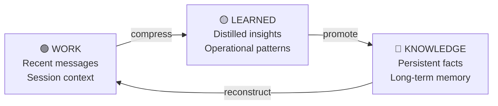
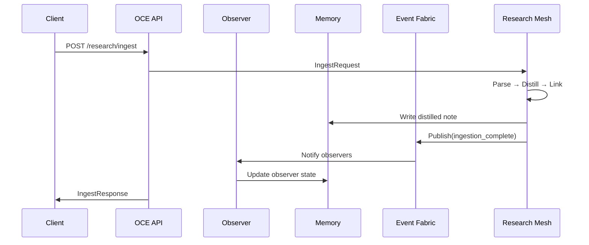

# 🧠 OCE Backend Architecture

> **Last Updated:** 2026-06-12 | **Version:** 1.0.0 | **Tests:** 492/492 passing | **Health:** 94/100

---

## Overview

OCE (Observer Core Environment) is the central cognition runtime built on FastAPI. It provides 30+ modules for agent orchestration, memory management, event processing, research ingestion, and autonomous operation.

**Entry Point:** `oce/backend/main.py`  
**API Prefix:** `/api/v1/*`  
**Port:** 8000 (backend), 3000 (frontend)

---

## System Architecture

```mermaid
graph TB
    subgraph "FastAPI Application"
        MAIN[main.py] --> ROUTES[API Routes]
        MAIN --> MIDDLEWARE[CORS + Exception Handlers]
        MAIN --> LIFECYCLE[Startup/Shutdown Hooks]
    end
    
    subgraph "Core Runtime"
        OBSERVER[observer_runtime.py] --> OBS_STATE[Observer State]
        MEMORY[structural_memory.py] --> MEM_LAYERS[3-Tier Memory]
        EVENTS[event_fabric.py] --> EVENT_BUS[Event Bus]
        DRIFT[drift_detector.py] --> DRIFT_STATE[Drift State]
    end
    
    subgraph "Agent System"
        PO[po_api.py] --> PO_AGENT[Primary Observer]
        PO_IDLE[po_idle.py] --> PO_RUNTIME[PO Idle Runtime]
        SPAWN[spawn_engine.py] --> AGENT_LIFECYCLE[Agent Lifecycle]
        CONSENSUS[consensus_engine.py] --> VOTING[Voting System]
    end
    
    subgraph "Research Mesh"
        RESEARCH_API[research_api.py] --> RESEARCH[Research Endpoints]
        RESEARCH --> INGEST[Ingestion]
        RESEARCH --> DISTILL[Distillation]
        RESEARCH --> GRAPH[Knowledge Graph]
        RESEARCH --> GAPS[Gap Detection]
    end
    
    subgraph "ML Pipeline"
        ML_API[ml_api.py] --> REGIME[Regime Classifier]
        ML_API --> SHAP[SHAP Explainability]
        ML_API --> PARAMS[Parameter Overlay]
        ML_API --> ENTRY[Entry Quality]
    end
    
    subgraph "Governance"
        GOV[governance_engine.py] --> PROPOSALS[Proposals]
        GOV --> VOTING_GOV[Voting]
        ECON[economics_engine.py] --> RESOURCE_ALLOC[Resource Allocation]
    end
    
    subgraph "Operations"
        EXEC[execution_engine.py] --> TASKS[Task Execution]
        TRACING[tracing_engine.py] --> SPAN[Distributed Tracing]
        ALERTS[alerting_engine.py] --> NOTIFY[Notifications]
        METRICS[metrics_collector.py] --> STATS[System Metrics]
        SELFHEAL[self_healing_engine.py] --> REPAIR[Auto-Repair]
    end
    
    subgraph "External Interfaces"
        VAULT_API[vault_api.py] --> OBSIDIAN[(Obsidian Vault)]
        TOPOLOGY[topology_api.py] --> TOPO_INSPECT[Topology Inspection]
        RESONANCE[resonance_api.py] --> FIELD[Resonance Field]
        RECONSTRUCT[reconstruction_api.py] --> MEM_RECON[Memory Reconstruction]
        SOVEREIGN[sovereign_api.py] --> SOVEREIGN_OPS[Sovereign Operations]
    end
```



---

## API Endpoints

### Research Mesh (`/api/v1/research/*`)

| Endpoint | Method | Description |
|----------|--------|-------------|
| `/research/health` | GET | Research mesh health status |
| `/research/ingest` | POST | Trigger paper ingestion |
| `/research/papers` | POST | Search papers |
| `/research/graph` | POST | Query knowledge graph |
| `/research/agents` | GET | List/control research agents |
| `/research/doctrine` | GET | Browse doctrine notes |
| `/research/gaps` | GET | Show detected knowledge gaps |
| `/research/stats` | GET | Research mesh statistics |
| `/research/config` | GET/PUT | Get/set configuration |

### ML Pipeline (`/api/v1/ml/*`)

| Endpoint | Method | Description |
|----------|--------|-------------|
| `/ml/regime` | GET | Current regime classification |
| `/ml/shap` | GET | SHAP feature importance |
| `/ml/params` | GET | Optimized parameters |
| `/ml/entry` | POST | Entry quality assessment |

### Observer (`/api/v1/observers/*`)

| Endpoint | Method | Description |
|----------|--------|-------------|
| `/observers` | GET | List all observers |
| `/observers/{id}` | GET | Get observer state |
| `/observers/{id}/drift` | GET | Get drift status |

### Vault (`/api/v1/vault/*`)

| Endpoint | Method | Description |
|----------|--------|-------------|
| `/vault/write` | POST | Write note to vault |
| `/vault/compress` | POST | Compress vault notes |
| `/vault/validate` | GET | Validate vault structure |

### Execution (`/api/v1/execution/*`)

| Endpoint | Method | Description |
|----------|--------|-------------|
| `/execution/tasks` | GET | List execution tasks |
| `/execution/tasks` | POST | Create execution task |
| `/execution/journal` | GET | View execution journal |

---

## Module Reference

### Core Modules

#### `observer_runtime.py`
Manages observer lifecycle, state transitions, and continuity preservation.

```python
class ObserverRuntime:
    - create_observer(config: ObserverConfig) -> Observer
    - get_observer(id: str) -> ObserverState
    - update_state(id: str, delta: dict) -> ObserverState
    - detect_drift(id: str) -> DriftReport
    - repair_observer(id: str) -> RepairResult
```

#### `structural_memory.py`
3-tier memory system: WORK (recent), LEARNED (distilled), KNOWLEDGE (persistent).

```python
class StructuralMemory:
    - write(entry: MemoryEntry, layer: MemoryLayer)
    - query(query: str, layers: list[MemoryLayer]) -> list[MemoryEntry]
    - compress(source: MemoryLayer, target: MemoryLayer)
    - get_stats() -> MemoryStats
```

#### `event_fabric.py`
Event routing, persistence, and topological routing.

```python
class EventFabric:
    - publish(event: Event) -> None
    - subscribe(event_type: str, handler: Callable) -> None
    - get_history(filter: EventFilter) -> list[Event]

class TopologicalRouter:
    - route(event: Event, topology: Topology) -> list[Agent]
```

### Agent Modules

#### `po_idle.py`
Autonomous idle runtime for PO. Runs vault sync, memory distillation, telemetry emission on a 5-min cadence.

```python
class POIdleRuntime:
    - start() -> None
    - stop() -> None
    - tick() -> TickReport
```

#### `consensus_engine.py`
Multi-agent consensus reasoning.

```python
class ConsensusEngine:
    - propose(proposal: Proposal) -> Vote
    - vote(vote: Vote) -> ConsensusResult
    - get_consensus(topic: str) -> ConsensusState
```

### Memory Layers



---

## Data Flow



---

## Configuration

Key environment variables:

| Variable | Default | Description |
|----------|---------|-------------|
| `OCE_PORT` | 8000 | API server port |
| `OCE_CORS_ORIGINS` | localhost:3000 | Allowed CORS origins |
| `VAULT_PATH` | ~/Downloads/o2c | Obsidian vault path |
| `OPENROUTER_API_KEY` | — | OpenRouter API key |
| `TELEGRAM_BOT_TOKEN` | — | Telegram bot token |

---

## Testing

```bash
# Run all OCE backend tests
python -m pytest oce/backend/tests/ -v

# Run specific module tests
python -m pytest oce/backend/tests/test_structural_memory.py -v

# Run with coverage
python -m pytest oce/backend/tests/ --cov=oce/backend --cov-report=html
```

**Current:** 492/492 tests passing

---

## Related Documents

- `../ARCHITECTURE.md` — Full system architecture
- `O2C_PHASE00_BUILD-NOTES.md` — OCE build notes
- `O2C_PHASE00_TEAM_TASKS.md` — Team task assignments
- `../docs/plans/O2C-RESEARCH-MESH.md` — Research mesh plan
