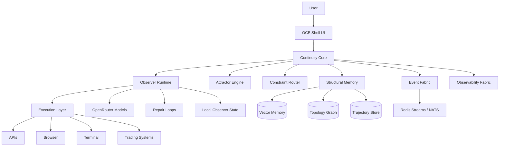

# Operator Continuity Engine (OCE)

> **Version:** 1.0  
> **Purpose:** Persistent operational interface for SRRA-OPH substrate  
> **Status:** Phase 1 — OCE Continuity Shell (In Planning)

## Overview

The OCE is a **persistent continuity shell** that coordinates reconstructive observer ecology through event-driven cognition infrastructure. It provides the user-facing interface to the SRRA-OPH substrate.

## Architecture

## Tech Stack

| Layer | Tech |
|-------|------|
| Frontend | Next.js |
| Backend | FastAPI |
| WebSocket | Socket.IO |
| Auth | Simple local auth (initially) |
| State | Redis |
| Model Routing | OpenRouter |
| Orchestration | Python asyncio |

## Phases

| Phase | Goal | Status |
|-------|------|--------|
| Phase 1 | OCE continuity shell | 🔄 Planning |
| Phase 2 | Event fabric | Pending |
| Phase 3 | Observer runtime | Pending |
| Phase 4 | Structural memory | Pending |
| Phase 5 | Observability | Pending |
| Phase 6 | Execution substrate | Pending |
| Phase 7 | Attractor governance | Pending |
| Phase 8 | Reconstruction intelligence | Pending |
| Phase 9 | Adaptive evolution | Pending |

## Team Tasks

See `TEAM_TASKS.md` for detailed task breakdown and assignments.