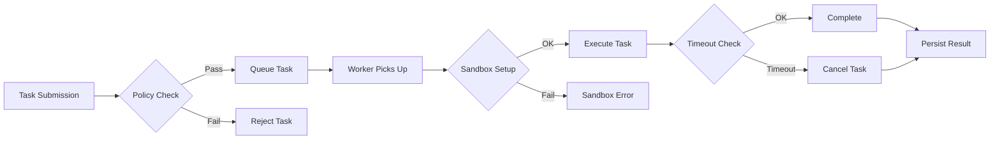

# OCE Execution Policies Framework

> **Phase:** OCE Phase 6 — Execution Substrate  
> **Author:** 🟣 OC (OpenClaw)  
> **Date:** 2026-05-17  
> **Status:** Draft → Review

---

## Overview

Execution policies define **how tasks are executed** within the OCE Execution Substrate. They provide guardrails for security, resource management, and operational safety.

---

## Policy Types

### 1. Rate Limiting Policies

Control task submission frequency to prevent resource exhaustion.

```yaml
rate_limit:
  max_tasks_per_minute: 60
  max_concurrent_tasks: 10
  burst_allowance: 5
  cooldown_period_sec: 30
```

**Enforcement Points:**
- Pre-execution: Check rate limit before queuing
- During execution: Monitor concurrent task count
- Post-execution: Update rate limit counters

### 2. Permission Policies

Define who/what can execute which tasks.

```yaml
permissions:
  - task_type: "skill_call"
    allowed_roles: ["operator", "agent"]
    required_capabilities: ["execute_skills"]
  
  - task_type: "tool_invoke"
    allowed_roles: ["operator"]
    required_capabilities: ["system_access"]
  
  - task_type: "pipeline_run"
    allowed_roles: ["operator", "agent"]
    required_capabilities: ["pipeline_execute"]
```

**Enforcement Points:**
- Pre-execution: Validate role and capabilities
- During execution: Monitor permission escalation attempts
- Post-execution: Log permission usage for audit

### 3. Sandboxing Policies

Isolate task execution to prevent system interference.

```yaml
sandboxing:
  enabled: true
  allowed_imports:
    - "json"
    - "math"
    - "datetime"
  blocked_imports:
    - "os"
    - "subprocess"
    - "sys"
  resource_limits:
    max_memory_mb: 512
    max_cpu_time_sec: 30
    max_file_handles: 10
```

**Enforcement Points:**
- Pre-execution: Validate imports against whitelist
- During execution: Monitor resource usage
- Post-execution: Cleanup sandbox artifacts

### 4. Timeout Policies

Prevent runaway tasks from consuming resources indefinitely.

```yaml
timeouts:
  default_sec: 30
  max_sec: 300
  critical_sec: 3600
  grace_period_sec: 5
```

**Enforcement Points:**
- Pre-execution: Set timeout based on task type
- During execution: Monitor elapsed time
- Post-execution: Log timeout events

### 5. Retry Policies

Handle transient failures gracefully.

```yaml
retry:
  max_attempts: 3
  backoff_ms: 1000
  exponential_base: 2
  retry_on_status:
    - "failed"
    - "timed_out"
  do_not_retry_on:
    - "cancelled"
    - "permission_denied"
```

**Enforcement Points:**
- Pre-execution: Set retry count and backoff
- During execution: Track attempt count
- Post-execution: Log retry attempts

---

## Policy Enforcement Architecture



---

## Policy Configuration

Policies are defined in `oce/backend/config/execution_policies.yaml`:

```yaml
# Default policies applied to all tasks
defaults:
  timeout_sec: 30
  max_retries: 3
  rate_limit: 60/min

# Task-type specific overrides
task_overrides:
  pipeline_run:
    timeout_sec: 300
    max_retries: 5
    rate_limit: 10/min
  
  skill_call:
    timeout_sec: 60
    max_retries: 3
    rate_limit: 30/min
```

---

## Integration with SRRA-OPH

Execution policies align with SRRA-OPH patterns:

| SRRA-OPH Concept | Execution Policy |
|------------------|------------------|
| ExecutionPatch | Policy enforcement points |
| Capability Fields | Permission policies |
| RepairPatch | Retry policies |
| Trajectory Fields | Rate limiting |

---

## Monitoring

Policy violations are logged to `execution_policy_violations` table:

| Field | Type | Description |
|-------|------|-------------|
| violation_id | UUID | Unique violation ID |
| task_id | UUID | Related task |
| policy_type | string | Type of policy violated |
| violation_details | JSON | Details of violation |
| timestamp | ISO | When violation occurred |

---

## Next Steps

1. Implement policy engine in `execution_engine.py`
2. Add policy configuration API endpoints
3. Create policy violation dashboard
4. Integrate with TracingEngine for observability