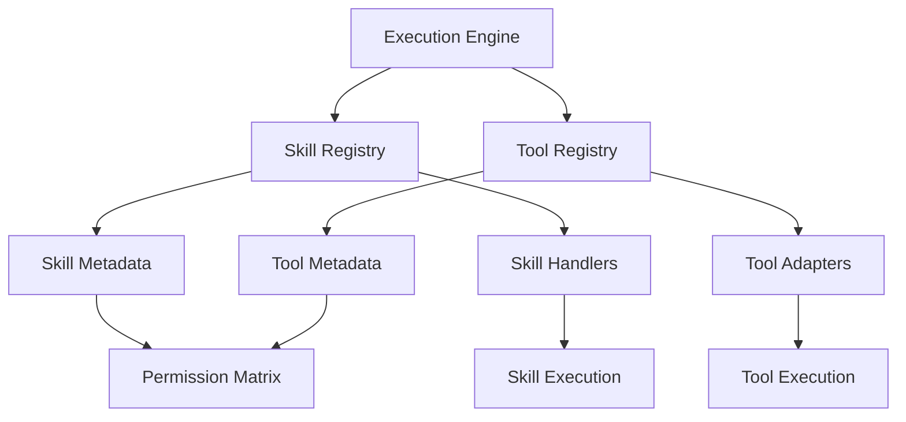

# OCE Skill/Tool Registry Specification

> **Phase:** OCE Phase 6 — Execution Substrate  
> **Author:** 🟣 OC (OpenClaw)  
> **Date:** 2026-05-17  
> **Status:** Draft → Review

---

## Overview

The Skill/Tool Registry is the **catalog of executable capabilities** available to the OCE Execution Substrate. It enables:

1. **Discovery** — Find available skills and tools
2. **Invocation** — Execute skills/tools with proper parameters
3. **Permission Management** — Control access to capabilities
4. **Observability** — Track usage and performance

---

## Registry Architecture



---

## Skill Registration

### Skill Definition Schema

```python
@dataclass
class SkillDefinition:
    skill_id: str
    name: str
    description: str
    version: str
    category: str  # "trading", "repair", "entropy", "content", "system"
    handler: Callable
    input_schema: Dict[str, Any]  # JSON Schema
    output_schema: Dict[str, Any]  # JSON Schema
    required_capabilities: List[str]
    timeout_sec: int = 30
    max_retries: int = 3
```

### Registration Example

```python
# Register a skill
registry.register_skill(
    skill_id="calculate_sma",
    name="Simple Moving Average",
    description="Calculate SMA for a price series",
    category="trading",
    handler=calculate_sma_handler,
    input_schema={
        "type": "object",
        "properties": {
            "prices": {"type": "array", "items": {"type": "number"}},
            "period": {"type": "integer", "minimum": 1}
        },
        "required": ["prices", "period"]
    },
    required_capabilities=["market_data"]
)
```

---

## Tool Registration

### Tool Definition Schema

```python
@dataclass
class ToolDefinition:
    tool_id: str
    name: str
    description: str
    version: str
    category: str  # "file", "network", "system", "database"
    adapter: Callable
    input_schema: Dict[str, Any]
    output_schema: Dict[str, Any]
    permission_level: str  # "read", "write", "admin"
    sandbox_required: bool = True
```

### Registration Example

```python
# Register a tool
registry.register_tool(
    tool_id="read_file",
    name="File Reader",
    description="Read file contents",
    category="file",
    adapter=read_file_adapter,
    input_schema={
        "type": "object",
        "properties": {
            "path": {"type": "string"}
        },
        "required": ["path"]
    },
    permission_level="read",
    sandbox_required=True
)
```

---

## Capability Declarations

Each skill/tool declares required capabilities:

```yaml
capabilities:
  market_data:
    description: "Access to market data feeds"
    permission_level: "read"
  
  system_access:
    description: "Execute system commands"
    permission_level: "admin"
  
  pipeline_execute:
    description: "Run DSPy pipelines"
    permission_level: "write"
  
  execute_skills:
    description: "Invoke registered skills"
    permission_level: "read"
```

---

## Invocation Protocol

### Skill Invocation

```python
# Via Execution Engine
task = ExecutionTask(
    task_type="skill_call",
    payload={
        "skill_id": "calculate_sma",
        "parameters": {
            "prices": [100, 101, 99, 102, 103],
            "period": 3
        }
    }
)
result = await execution_engine.submit_task(task)
```

### Tool Invocation

```python
# Via Execution Engine
task = ExecutionTask(
    task_type="tool_invoke",
    payload={
        "tool_id": "read_file",
        "parameters": {
            "path": "/data/prices.csv"
        }
    }
)
result = await execution_engine.submit_task(task)
```

---

## Registry API Endpoints

| Endpoint | Method | Description |
|----------|--------|-------------|
| `/registry/skills` | GET | List all registered skills |
| `/registry/skills/{id}` | GET | Get skill details |
| `/registry/tools` | GET | List all registered tools |
| `/registry/tools/{id}` | GET | Get tool details |
| `/registry/categories` | GET | List all categories |
| `/registry/search` | POST | Search by capability |

---

## Built-in Skills

| Skill ID | Category | Description |
|----------|----------|-------------|
| `calculate_sma` | trading | Simple Moving Average |
| `calculate_ema` | trading | Exponential Moving Average |
| `detect_anomaly` | entropy | Anomaly detection |
| `compress_memory` | system | Memory compression |
| `generate_report` | content | Report generation |

---

## Built-in Tools

| Tool ID | Category | Description |
|---------|----------|-------------|
| `read_file` | file | Read file contents |
| `write_file` | file | Write file contents |
| `http_request` | network | HTTP client |
| `sqlite_query` | database | SQLite query executor |
| `run_command` | system | Shell command executor |

---

## Integration with SRRA-OPH

The registry aligns with SRRA-OPH patterns:

| SRRA-OPH Concept | Registry Mapping |
|------------------|------------------|
| ExecutionPatch | Skill/tool invocation |
| Capability Fields | Required capabilities |
| MemoryPatch | Registry persistence |
| RepairPatch | Retry/fallback logic |

---

## Next Steps

1. Implement registry in `execution_engine.py`
2. Add registration API endpoints
3. Create registry UI component
4. Document skill/tool development guide