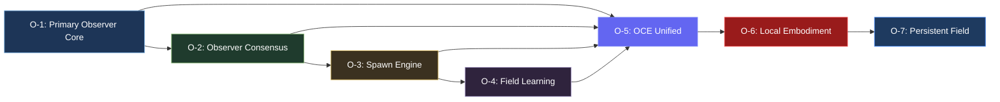

# OBSERVER CORE + OCE UNIFIED — TEAM TASKS

> **Created:** 2026-05-26
> **Status:** Ready for Task Assignment
> **Total Phases:** 7 (O-1 through O-7)
> **Total Components:** 70+ backend + 40+ frontend
> **Total Tests:** 40+

---

## EXECUTION ORDER

**Phases must be completed sequentially.** Each phase builds on the previous phase's output.

---

## PHASE O-1: PRIMARY OBSERVER CORE

**Status:** 🔴 Not Started | **Estimated:** 3-4 days | **Tests:** 6

### Backend Tasks (Python)

| Task # | Component | File | Description | Checkpoint |
|--------|-----------|------|-------------|------------|
| O1-B1 | PrimaryObserver | `core/observer/primary_observer.py` | Main orchestration interface. Receives user input, analyzes intent, gathers runtime state | Observer responds to test messages |
| O1-B2 | ObserverState | `core/observer/observer_state.py` | Persistent observer state management | State persists across restarts |
| O1-B3 | RuntimeAwareness | `core/observer/runtime_awareness.py` | Maintains awareness of topology, active observers, entropy | Detects runtime mutations |
| O1-B4 | ContinuityMemory | `core/observer/continuity_memory.py` | Operational continuity memory (NOT chat memory) | Stores workflow evolution |
| O1-B5 | TaskIntentAnalyzer | `core/observer/task_intent_analyzer.py` | Classifies task domain and complexity | Classifies 5 task types correctly |
| O1-B6 | ContextDistiller | `core/observer/context_distiller.py` | Compresses relevant field state for spawned agents | Produces low-noise context |
| O1-B7 | EventAwareness | `core/observer/event_awareness.py` | Observes runtime events | Captures all event types |
| O1-B8 | ObserverSession | `core/observer/observer_session.py` | Session continuity management | Sessions persist correctly |
| O1-B9 | ObserverLifecycle | `core/observer/observer_lifecycle.py` | Heartbeat, healthcheck, recovery | Recovery restores continuity |

### Frontend Tasks (TypeScript/React)

| Task # | Component | File | Description | Checkpoint |
|--------|-----------|------|-------------|------------|
| O1-F1 | ChatPanel | `components/chat/ChatPanel.tsx` | Enhanced Primary Observer chat interface | Chat renders and responds |
| O1-F2 | ExecutionFeed | `components/chat/ExecutionFeed.tsx` | Live execution visibility in chat | Shows live execution events |
| O1-F3 | ReplaySummary | `components/chat/ReplaySummary.tsx` | Replay summaries in chat | Displays replay summaries |
| O1-F4 | ArtifactViewer | `components/chat/ArtifactViewer.tsx` | Artifacts/results panel | Shows generated artifacts |
| O1-F5 | ObserverConsole | `components/observer/ObserverConsole.tsx` | Primary Observer interface panel | Panel displays observer state |
| O1-F6 | ObserverStatus | `components/observer/ObserverStatus.tsx` | Observer alive state + health | Shows health metrics |
| O1-F7 | ContinuityPanel | `components/observer/ContinuityPanel.tsx` | Continuity state display | Displays continuity score |
| O1-F8 | RuntimeSummary | `components/observer/RuntimeSummary.tsx` | Current runtime awareness | Shows runtime state |
| O1-F9 | ObserverHealthPanel | `components/observer/ObserverHealthPanel.tsx` | Observer health metrics | Health metrics update live |
| O1-F10 | observerStore | `stores/observerStore.ts` | Zustand store for observer state | State syncs across components |

### Tests

| Test # | Name | Description | Pass Criteria |
|--------|------|-------------|---------------|
| O1-T1 | Continuity test | 24hr persistent observer session | No continuity loss over 24hr |
| O1-T2 | Runtime awareness test | Inject topology mutation, entropy spike, observer failure | All events detected |
| O1-T3 | Task analysis test | Feed coding, research, orchestration, repair tasks | Correct classification |
| O1-T4 | Context distillation test | Spawn multiple tasks, verify low-noise context | Context < 500 tokens |
| O1-T5 | Restart recovery test | Crash observer, verify continuity restored | Full recovery in < 5s |
| O1-T6 | OCE integration test | Live panels, event sync, runtime updates | Real-time updates work |

---

## PHASE O-2: OBSERVER CONSENSUS + TASK ROUTING

**Status:** 🔴 Not Started | **Estimated:** 4-5 days | **Tests:** 7 | **Depends on:** O-1

### Backend Tasks (Python)

| Task # | Component | File | Description | Checkpoint |
|--------|-----------|------|-------------|------------|
| O2-B1 | ObserverConsensus | `consensus/observer_consensus.py` | Coordinate distributed observer decision-making | Consensus reached on test tasks |
| O2-B2 | TaskClassifier | `consensus/task_classifier.py` | Determine task type (9 categories) | Classifies all 9 types |
| O2-B3 | RoutingConsensus | `consensus/routing_consensus.py` | Determine best orchestration path | Routes to correct observers |
| O2-B4 | ComplexityScorer | `consensus/complexity_scorer.py` | Estimate operational complexity (4 levels) | Scores match expected |
| O2-B5 | SpawnPlanner | `consensus/spawn_planner.py` | Generate task orchestration blueprint | Valid spawn plans produced |
| O2-B6 | ModelSelector | `consensus/model_selector.py` | Choose best cognition provider | Selects appropriate models |
| O2-B7 | CapabilityMatcher | `consensus/capability_matcher.py` | Determine required capabilities | Matches capabilities correctly |
| O2-B8 | ConsensusMemory | `consensus/consensus_memory.py` | Store orchestration outcome history | History persists correctly |
| O2-B9 | ObserverSpecialization | `consensus/observer_specialization.py` | Allow observers to specialize | Specialization improves routing |
| O2-B10 | ConsensusReplay | `consensus/consensus_replay.py` | Replay observer decisions | Replays accurately |

### Frontend Tasks (TypeScript/React)

| Task # | Component | File | Description | Checkpoint |
|--------|-----------|------|-------------|------------|
| O2-F1 | ConsensusPanel | `components/consensus/ConsensusPanel.tsx` | Observer consensus flow visualization | Shows consensus flow |
| O2-F2 | RoutingMap | `components/consensus/RoutingMap.tsx` | Orchestration routing visualization | Routes display correctly |
| O2-F3 | SpawnBlueprintView | `components/consensus/SpawnBlueprintView.tsx` | Spawn plan display | Shows spawn blueprint |
| O2-F4 | ObserverSpecializationMap | `components/consensus/ObserverSpecializationMap.tsx` | Specialization visualization | Shows specialization |
| O2-F5 | ConsensusReplayPanel | `components/consensus/ConsensusReplayPanel.tsx` | Orchestration history replay | Replays decisions |
| O2-F6 | CapabilityInspector | `components/consensus/CapabilityInspector.tsx` | Capability display | Shows capabilities |
| O2-F7 | consensusStore | `stores/consensusStore.ts` | Zustand store for consensus state | State syncs correctly |

### Tests

| Test # | Name | Description | Pass Criteria |
|--------|------|-------------|---------------|
| O2-T1 | Task classification test | Feed 9 task types | 95% accuracy |
| O2-T2 | Routing stability test | 100 repeated orchestration requests | Consistent routing |
| O2-T3 | Model selection test | Large coding, lightweight, research tasks | Correct model selection |
| O2-T4 | Entropy routing test | Overloaded runtime conditions | Graceful degradation |
| O2-T5 | Consensus replay test | Replay orchestration history | Accurate replay |
| O2-T6 | Specialization test | Extended orchestration workloads | Specialization improves |
| O2-T7 | Spawn planning test | Bounded execution scopes | Valid spawn plans |

---

## PHASE O-3: SPAWN ENGINE + CONTEXT INHERITANCE

**Status:** 🔴 Not Started | **Estimated:** 5-6 days | **Tests:** 8 | **Depends on:** O-2

### Backend Tasks (Python)

| Task # | Component | File | Description | Checkpoint |
|--------|-----------|------|-------------|------------|
| O3-B1 | AgentSpawner | `spawn/agent_spawner.py` | Main orchestration execution layer | Spawns agents successfully |
| O3-B2 | SpawnBlueprint | `spawn/spawn_blueprint.py` | Formal orchestration schema | Valid blueprints created |
| O3-B3 | ContextInjector | `spawn/context_injector.py` | Inject field continuity into spawned agents | Context inherited correctly |
| O3-B4 | OpenRouterGateway | `spawn/openrouter_gateway.py` | Unified cognition-provider layer | Routes to all providers |
| O3-B5 | AgentLifecycle | `spawn/agent_lifecycle.py` | Manage agent states | All states work |
| O3-B6 | ExecutionBoundary | `spawn/execution_boundary.py` | Prevent orchestration chaos | Boundaries enforced |
| O3-B7 | MultiAgentCoordinator | `spawn/multi_agent_coordinator.py` | Coordinate multiple agents | Coordination works |
| O3-B8 | TraceFeedback | `spawn/trace_feedback.py` | Feed traces back to field memory | Traces captured |
| O3-B9 | SpawnReplay | `spawn/spawn_replay.py` | Replay spawned agent behavior | Replays correctly |
| O3-B10 | SpawnRegistry | `spawn/spawn_registry.py` | Maintain active-agent awareness | Registry accurate |

### Frontend Tasks (TypeScript/React)

| Task # | Component | File | Description | Checkpoint |
|--------|-----------|------|-------------|------------|
| O3-F1 | SpawnMonitor | `components/spawn/SpawnMonitor.tsx` | Active spawned agents display | Shows active agents |
| O3-F2 | AgentLifecyclePanel | `components/spawn/AgentLifecyclePanel.tsx` | Agent lifecycle states | States update live |
| O3-F3 | ContextInjectionView | `components/spawn/ContextInjectionView.tsx` | Context injection display | Shows injected context |
| O3-F4 | ExecutionBoundaryView | `components/spawn/ExecutionBoundaryView.tsx` | Execution boundaries display | Shows boundaries |
| O3-F5 | MultiAgentFlowGraph | `components/spawn/MultiAgentFlowGraph.tsx` | Multi-agent coordination | Shows coordination |
| O3-F6 | SpawnReplayPanel | `components/spawn/SpawnReplayPanel.tsx` | Spawn decision replay | Replays decisions |
| O3-F7 | RuntimeLoadPanel | `components/spawn/RuntimeLoadPanel.tsx` | Runtime load display | Shows load metrics |
| O3-F8 | spawnStore | `stores/spawnStore.ts` | Zustand store for spawn state | State syncs correctly |

### Tests

| Test # | Name | Description | Pass Criteria |
|--------|------|-------------|---------------|
| O3-T1 | Basic spawn test | Spawn coding, research, orchestration agents | All spawn types work |
| O3-T2 | Context inheritance test | Verify topology awareness | Context inherited |
| O3-T3 | Execution boundary test | Attempt out-of-scope access | Access denied |
| O3-T4 | Multi-agent coordination test | 3-agent cooperative workflow | Coordination succeeds |
| O3-T5 | Lifecycle stability test | 24hr spawn lifecycle | No lifecycle failures |
| O3-T6 | Trace feedback test | Routing metrics update | Metrics update |
| O3-T7 | Failover test | Model timeout, provider failure | Failover works |
| O3-T8 | Spawn storm test | High-frequency task bursts | Handles bursts |

---

## PHASE O-4: OPERATIONAL TRACE + FIELD LEARNING

**Status:** 🔴 Not Started | **Estimated:** 4-5 days | **Tests:** 8 | **Depends on:** O-3

### Backend Tasks (Python)

| Task # | Component | File | Description | Checkpoint |
|--------|-----------|------|-------------|------------|
| O4-B1 | TraceCollector | `learning/trace_collector.py` | Capture all operational traces | All traces captured |
| O4-B2 | OperationalReplay | `learning/operational_replay.py` | Replay orchestration history | Replays accurately |
| O4-B3 | WorkflowDistiller | `learning/workflow_distiller.py` | Extract stable patterns | Patterns extracted |
| O4-B4 | RoutingLearning | `learning/routing_learning.py` | Improve future routing | Routing improves |
| O4-B5 | FailureAnalyzer | `learning/failure_analyzer.py` | Study orchestration failures | Failures analyzed |
| O4-B6 | TopologyLearning | `learning/topology_learning.py` | Understand topology effects | Learning works |
| O4-B7 | ObserverEvolution | `learning/observer_evolution.py` | Allow observer specialization | Evolution tracked |
| O4-B8 | PatternMemory | `learning/pattern_memory.py` | Store stable knowledge | Patterns stored |
| O4-B9 | WorkflowMemory | `learning/workflow_memory.py` | Track long-horizon continuity | Memory persists |
| O4-B10 | OperationalScoring | `learning/operational_scoring.py` | Quantify orchestration quality | Scores calculated |
| O4-B11 | AdaptationEngine | `learning/adaptation_engine.py` | Apply controlled adaptation | Safe adaptation |

### Frontend Tasks (TypeScript/React)

| Task # | Component | File | Description | Checkpoint |
|--------|-----------|------|-------------|------------|
| O4-F1 | OperationalReplay | `components/learning/OperationalReplay.tsx` | Orchestration history replay | Replays correctly |
| O4-F2 | WorkflowEvolution | `components/learning/WorkflowEvolution.tsx` | Workflow pattern evolution | Shows evolution |
| O4-F3 | RoutingLearningMap | `components/learning/RoutingLearningMap.tsx` | Routing improvement visualization | Shows improvement |
| O4-F4 | FailureAnalysisPanel | `components/learning/FailureAnalysisPanel.tsx` | Failure analysis display | Shows analysis |
| O4-F5 | TopologyEvolutionView | `components/learning/TopologyEvolutionView.tsx` | Topology learning visualization | Shows evolution |
| O4-F6 | ObserverEvolutionMap | `components/learning/ObserverEvolutionMap.tsx` | Specialization evolution | Shows evolution |
| O4-F7 | PatternMemoryView | `components/learning/PatternMemoryView.tsx` | Stable patterns display | Shows patterns |
| O4-F8 | AdaptationMonitor | `components/learning/AdaptationMonitor.tsx` | Adaptation tracking | Tracks adaptation |
| O4-F9 | learningStore | `stores/learningStore.ts` | Zustand store for learning state | State syncs correctly |

### Tests

| Test # | Name | Description | Pass Criteria |
|--------|------|-------------|---------------|
| O4-T1 | Trace integrity test | 100 orchestration workflows | All traces captured |
| O4-T2 | Replay reconstruction test | Replay task chains | Accurate reconstruction |
| O4-T3 | Routing learning test | Repeated task families | Quality improves |
| O4-T4 | Failure analysis test | Inject failures | Failures detected |
| O4-T5 | Topology learning test | Extended workloads | Patterns emerge |
| O4-T6 | Observer evolution test | Long-horizon sessions | Specialization improves |
| O4-T7 | Adaptation stability test | Gradual adaptation | No destabilization |
| O4-T8 | Long-horizon memory test | Restart system | Continuity preserved |

---

## PHASE O-5: OCE UNIFIED OPERATIONAL OBSERVATORY

**Status:** 🔴 Not Started | **Estimated:** 3-4 days | **Tests:** 12 | **Depends on:** O-1, O-2, O-3, O-4

### Integration Tasks

| Task # | Task | Description | Checkpoint |
|--------|------|-------------|------------|
| O5-I1 | Merge state stores | Move topologyStore, timelineStore, entropyStore, repairStore, continuityStore from SRRA-OPH to OCE | Stores unified |
| O5-I2 | Move visualization components | Move all topology/, entropy/, repair/, timeline/ components from SRRA-OPH to OCE | Components migrated |
| O5-I3 | Create Layer System | Build LayerSwitcher, modify layout.tsx for three layers | Layers work |
| O5-I4 | Update navigation | Replace separate app navigation with in-app layer navigation | Navigation unified |
| O5-I5 | Unify WebSocket | Merge LiveDataProvider with SRRA-OPH's WebSocket connections | Single connection |
| O5-I6 | Theme unification | Switch OCE to dark observatory theme | Theme consistent |
| O5-I7 | Build observer components | ObserverConsole, ObserverStatus, ContinuityPanel, RuntimeSummary, ObserverHealthPanel | All components work |
| O5-I8 | Build consensus components | ConsensusPanel, RoutingMap, SpawnBlueprintView, ConsensusReplayPanel | All components work |
| O5-I9 | Build spawn components | SpawnMonitor, AgentLifecyclePanel, ContextInjectionView, MultiAgentFlowGraph | All components work |
| O5-I10 | Build learning components | OperationalReplay, WorkflowEvolution, RoutingLearningMap, FailureAnalysisPanel | All components work |
| O5-I11 | Build persistence components | PersistentFieldView, RuntimeHeartbeatPanel, DormantStateMonitor, DriftAnalysisPanel | All components work |
| O5-I12 | Performance validation | 60fps idle, 30fps under load, no memory leaks | Performance targets met |

### Tests

| Test # | Name | Description | Pass Criteria |
|--------|------|-------------|---------------|
| O5-T1 | Layer switching test | L1/L2/L3 toggle works | Smooth transitions |
| O5-T2 | State sync test | All stores sync via WebSocket | Real-time sync |
| O5-T3 | Theme test | Dark theme applied consistently | Theme correct |
| O5-T4 | Navigation test | Single navigation works | Navigation works |
| O5-T5 | WebSocket test | Single connection handles all events | No duplicate events |
| O5-T6 | Component migration test | All migrated components work | All functional |
| O5-T7 | Store merge test | Merged stores work correctly | No data loss |
| O5-T8 | Panel expand/collapse test | Panels expand/collapse smoothly | Smooth animation |
| O5-T9 | Performance test | Idle performance | 60fps idle |
| O5-T10 | Load performance test | Under load performance | 30fps under load |
| O5-T11 | Memory leak test | Extended operation | No leaks |
| O5-T12 | Integration test | Full system integration | All layers work |

---

## PHASE O-6: LOCAL EXECUTION SUBSTRATE

**Status:** 🔴 Not Started | **Estimated:** 4-5 days | **Tests:** 8 | **Depends on:** O-5

### Backend Tasks (Python)

| Task # | Component | File | Description | Checkpoint |
|--------|-----------|------|-------------|------------|
| O6-B1 | LocalRuntime | `substrate/local_runtime.py` | Central local execution substrate | Executes tasks |
| O6-B2 | FilesystemAwareness | `substrate/filesystem_awareness.py` | Structured machine memory awareness | Tracks changes |
| O6-B3 | TerminalOrchestrator | `substrate/terminal_orchestrator.py` | All terminal execution management | Executes safely |
| O6-B4 | ProcessObserver | `substrate/process_observer.py` | Real-time process awareness | Tracks processes |
| O6-B5 | ApplicationBridge | `substrate/application_bridge.py` | Controlled application interaction | Bridges work |
| O6-B6 | EnvironmentModel | `substrate/environment_model.py` | Live machine-state awareness | Model accurate |
| O6-B7 | RuntimeInspector | `substrate/runtime_inspector.py` | Inspect live operational conditions | Inspections work |
| O6-B8 | PermissionLayer | `substrate/permission_layer.py` | Enforce operational boundaries | Boundaries enforced |
| O6-B9 | ExecutionSandbox | `substrate/execution_sandbox.py` | Safe execution zones | Sandboxes work |
| O6-B10 | MachineStateGraph | `substrate/machine_state_graph.py` | Machine as topology | Graph accurate |
| O6-B11 | RecoveryController | `substrate/recovery_controller.py` | Handle runtime recovery | Recovery works |

### Frontend Tasks (TypeScript/React)

| Task # | Component | File | Description | Checkpoint |
|--------|-----------|------|-------------|------------|
| O6-F1 | MachineStateView | `components/substrate/MachineStateView.tsx` | Live machine state display | Shows state |
| O6-F2 | ProcessGraph | `components/substrate/ProcessGraph.tsx` | Process topology visualization | Shows processes |
| O6-F3 | RuntimeInspector | `components/substrate/RuntimeInspector.tsx` | Runtime telemetry display | Shows telemetry |
| O6-F4 | FilesystemTopology | `components/substrate/FilesystemTopology.tsx` | Filesystem as topology | Shows filesystem |
| O6-F5 | SandboxMonitor | `components/substrate/SandboxMonitor.tsx` | Sandbox monitoring | Monitors sandboxes |
| O6-F6 | EnvironmentModelView | `components/substrate/EnvironmentModelView.tsx` | Environment model display | Shows model |
| O6-F7 | TerminalExecutionPanel | `components/substrate/TerminalExecutionPanel.tsx` | Terminal execution display | Shows execution |
| O6-F8 | RecoveryTimeline | `components/substrate/RecoveryTimeline.tsx` | Recovery operations timeline | Shows timeline |

### Tests

| Test # | Name | Description | Pass Criteria |
|--------|------|-------------|---------------|
| O6-T1 | Filesystem awareness test | Track repo mutations | Changes tracked |
| O6-T2 | Terminal orchestration test | Bounded execution | Safe execution |
| O6-T3 | Process monitor test | Hung processes | Detected and handled |
| O6-T4 | Environment model test | Switch projects | Model updates |
| O6-T5 | Sandbox test | Out-of-scope execution | Access denied |
| O6-T6 | Machine topology test | Complex workflows | Graph updates |
| O6-T7 | Recovery test | Observer crash | Recovery succeeds |
| O6-T8 | Long horizon embodiment test | 72hr operational session | Stable operation |

---

## PHASE O-7: PERSISTENT FIELD MODE

**Status:** 🔴 Not Started | **Estimated:** 5-7 days | **Tests:** 8 | **Depends on:** O-6

### Backend Tasks (Python)

| Task # | Component | File | Description | Checkpoint |
|--------|-----------|------|-------------|------------|
| O7-B1 | PersistentRuntime | `persistence/persistent_runtime.py` | Always-on orchestration substrate | Runtime persistent |
| O7-B2 | ObserverPersistence | `persistence/observer_persistence.py` | Ensure observers never lose continuity | Continuity maintained |
| O7-B3 | PassiveAwareness | `persistence/passive_awareness.py` | Background environmental awareness | Awareness passive |
| O7-B4 | EnvironmentalMonitor | `persistence/environmental_monitor.py` | Observe machine + workflow ecosystem | Monitoring works |
| O7-B5 | ContinuityPreserver | `persistence/continuity_preserver.py` | Preserve long-horizon continuity | Continuity preserved |
| O7-B6 | DormantStateManager | `persistence/dormant_state_manager.py` | Control active/dormant states | States transition |
| O7-B7 | AutonomousRepair | `persistence/autonomous_repair.py` | Bounded self-stabilization | Repair bounded |
| O7-B8 | RuntimeHeartbeat | `persistence/runtime_heartbeat.py` | Maintain field continuity pulse | Heartbeat steady |
| O7-B9 | PersistentScheduler | `persistence/persistent_scheduler.py` | Manage background tasks | Tasks scheduled |
| O7-B10 | RecoveryPersistence | `persistence/recovery_persistence.py` | Preserve continuity during failure | Recovery preserves |
| O7-B11 | LongHorizonMemory | `persistence/long_horizon_memory.py` | Maintain persistent identity | Memory persists |
| O7-B12 | OperationalDriftDetector | `persistence/operational_drift_detect.py` | Detect degradation patterns | Drift detected |

### Frontend Tasks (TypeScript/React)

| Task # | Component | File | Description | Checkpoint |
|--------|-----------|------|-------------|------------|
| O7-F1 | PersistentFieldView | `components/persistence/PersistentFieldView.tsx` | Persistent field state display | Shows state |
| O7-F2 | RuntimeHeartbeatPanel | `components/persistence/RuntimeHeartbeatPanel.tsx` | Field continuity pulse | Shows heartbeat |
| O7-F3 | DormantStateMonitor | `components/persistence/DormantStateMonitor.tsx` | Dormant/active transitions | Shows transitions |
| O7-F4 | ObserverPersistenceView | `components/persistence/ObserverPersistenceView.tsx` | Observer persistence status | Shows status |
| O7-F5 | DriftAnalysisPanel | `components/persistence/DriftAnalysisPanel.tsx` | Operational drift detection | Shows drift |
| O7-F6 | LongHorizonTimeline | `components/persistence/LongHorizonTimeline.tsx` | Long-horizon continuity | Shows timeline |
| O7-F7 | AutonomousRepairView | `components/persistence/AutonomousRepairView.tsx` | Self-stabilization display | Shows repair |
| O7-F8 | RecoveryContinuityPanel | `components/persistence/RecoveryContinuityPanel.tsx` | Recovery continuity | Shows recovery |
| O7-F9 | persistenceStore | `stores/persistenceStore.ts` | Zustand store for persistence state | State syncs |

### Tests

| Test # | Name | Description | Pass Criteria |
|--------|------|-------------|---------------|
| O7-T1 | Persistent runtime test | 7-day continuous operation | Stable for 7 days |
| O7-T2 | Observer recovery test | Crash observers, processes | Recovery succeeds |
| O7-T3 | Dormant state test | Idle runtime periods | Passive state entered |
| O7-T4 | Autonomous repair test | Hung tasks, entropy spikes | Repair bounded |
| O7-T5 | Machine reboot test | Restart machine | Continuity restored |
| O7-T6 | Drift detection test | Slow degradation | Drift detected |
| O7-T7 | Long-horizon memory test | Multi-week workflows | Memory persists |
| O7-T8 | Stress test | Persistent observers + agents + monitoring | Stable under stress |

---

## TASK ASSIGNMENT MATRIX

| Agent | Phases | Focus |
|-------|--------|-------|
| 🔵 CC (Claude Code) | O-1, O-5 | Architecture, frontend integration |
| 🟠 OC2 (OWL) | O-2, O-3 | Consensus, spawn engine |
| 🟡 AS (Assistant Manager) | O-4, O-7 | Learning, persistence |
| 🔴 PM (Polymorph) | O-6 | Local substrate |
| 🟢 RL (Research Lead) | O-4 | Workflow distiller, pattern memory |

---

## SUCCESS CRITERIA

1. **All 40+ tests pass** across all phases
2. **Single unified OCE frontend** running on :3000
3. **Primary Observer** handles all user orchestration
4. **Observer Consensus** routes tasks correctly
5. **Spawn Engine** inherits context properly
6. **Field Learning** improves routing over time
7. **Local Embodiment** controls machine execution
8. **Persistent Field** maintains 7-day continuity