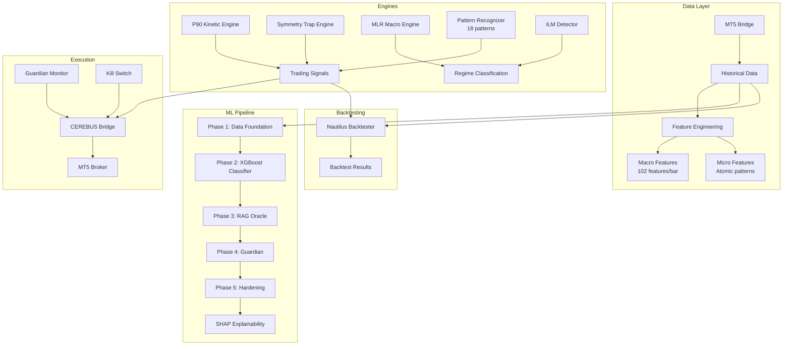
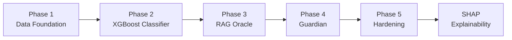

# 📈 Quant Lab Architecture — CEREBUS Neuro-Symbolic Scanner

> **Last Updated:** 2026-06-12 | **Tests:** 120/120 passing | **Status:** Wave 1-3 Complete

---

## Overview

Quant Lab is the quantitative trading engine and ML pipeline. It implements the CEREBUS Neuro-Symbolic Scanner — a multi-engine trading system combining pattern recognition, macro-micro analysis, and ML-based regime classification.

**Entry Point:** `quant-lab/ml/cerebus_runner.py`  
**Engines:** P90 Kinetic + Symmetry Trap Structural  
**ML Pipeline:** 5 phases (Data → Classifier → RAG → Guardian → Hardening)

---

## System Architecture



---

## Trading Engines

### P90 Kinetic Engine (`engines/p90_engine_good.py`)
- **Type:** Impulse → Pullback → OCC Confirmation
- **Edge:** 85.4% WR standalone
- **Parameters:** Adaptive triggers, 4PM cutoff, FLOOR/CEILING tiers

### Symmetry Trap Engine (`engines/symmetry_trap.py`)
- **Type:** Structural/atomic engine
- **Edge:** 91.1% WR
- **Parameters:** Zero-buffer impulse extreme SL

### Dual-Engine Convergence
- **When both align:** 94-95% WR
- **Signal filtering:** Both engines must confirm

---

## ML Pipeline (5 Phases)



### Phase 1: Data Foundation (`ml/phase1_data/pipeline.py`)
- Historical data ingestion from MT5
- Feature engineering (macro + micro)
- Data normalization and cleaning

### Phase 2: XGBoost Classifier (`ml/phase2_classifier/regime_classifier.py`)
- Regime classification (trending/mean-reversion/range)
- Cross-validation with walk-forward
- Feature importance ranking

### Phase 3: RAG Oracle (`ml/phase3_rag_oracle/`)
- Retrieval-augmented generation for trade context
- Knowledge graph integration
- Historical pattern matching

### Phase 4: Guardian (`ml/phase4_guardian/`)
- Real-time trade monitoring
- Risk management overlay
- Kill switch activation

### Phase 5: Hardening (`ml/phase5_hardening/`)
- Adversarial testing
- Edge case handling
- Production hardening

---

## Pattern Recognizer (18 Patterns)

| Pattern | Type | Description |
|---------|------|-------------|
| Alpha 3-Leg | Macro | 3-leg impulse pattern |
| Beta 3-Leg | Macro | Variant 3-leg pattern |
| AB-CD | Macro | AB-CD harmonic pattern |
| NY Sweep | Macro | New York session sweep |
| Gamma | Macro | Gamma impulse pattern |
| Rekey 132 | Macro | Rekey 132 pattern |
| Rekey Sequence | Macro | Rekey sequence detection |
| OCC Extreme | Macro | OCC extreme pattern |
| ILM Zone | Macro | ILM zone detection |
| Density Zone | Macro | Density zone pattern |
| Wednesday Bifurcation | Macro | Wednesday-specific pattern |
| Hard Exit | Micro | Hard exit signal |
| Gear Shift | Micro | Gear shift pattern |
| Fib Retrace | Micro | Fibonacci retracement |
| Fib Extension | Micro | Fibonacci extension |
| Micro-Macro Phase | Micro | Phase transition detection |
| Kill Switch | Risk | Emergency exit |
| Regime Filter | Filter | Regime-based filtering |

---

## DTB Training Pipeline

| Phase | Scope | MAE | R² | Data |
|-------|-------|-----|-----|------|
| Phase 1 (Macro MLR) | 6062 weeks, 28 FX pairs | 2457 pips | 0.775 | Macro features |
| Phase 2 (Micro Atomic) | 15570 days | 17.2 pips | 0.294 | Micro features |
| Phase 3 (Merge BVP) | 15570 days | 17.1 pips | 0.296 | Merged |

**Known Issues:**
- Omega_L/L_actual zeroed (simplified proxy)
- Temporal decay not learned
- Loop detection needs fixing

---

## Key Files

| File | Purpose |
|------|---------|
| `engines/p90_engine_good.py` | P90 Kinetic Engine |
| `engines/symmetry_trap.py` | Symmetry Trap Engine |
| `ml/pattern_recognizer.py` | 18 pattern detectors |
| `ml/macro_feature_builder.py` | 102 macro features/bar |
| `ml/mlr_engine.py` | Vectorized MLR |
| `ml/kill_switch.py` | Kill switch system |
| `ml/ilm_detector.py` | ILM state detection |
| `ml/cerebus_runner.py` | CEREBUS runner |
| `ml/cerebus_watchdog.py` | CEREBUS watchdog |
| `ml/run_cerebus_live.py` | Live trading runner |
| `mt5/demo_bridge.py` | MT5 bridge |
| `mt5/deploy_config.py` | Deployment config |
| `backtest/` | Backtesting engine |

---

## THE BIBLE (Locked Parameters)

| Parameter | Value | Note |
|-----------|-------|------|
| AR gate | ar_max=60 | Session filter only, NOT tier classifier |
| T1 trigger | 10 pips | |
| Session cutoff | 4:00 PM EST | |
| DZ | flat 20-50% | All loops |
| Tier logic | By impulse size only | T1<20p, T2=20-30p, T3>30p |

---

## Testing

```bash
# Run CEREBUS tests
python -m pytest quant-lab/ml/tests/ -v

# Run backtest
python quant-lab/backtest/run_backtest.py

# Run live (requires MT5)
python quant-lab/ml/run_cerebus_live.py
```

**Tests:** 120/120 passing (Wave 1-3)

---

## Related Documents

- `CEREBUS_NEURO_SYMBOLIC_SCANNER_PLAN.md` — Full CEREBUS plan
- `CEREBUS_ONTOLOGY.md` — CEREBUS ontology
- `QUANTLAB_BIBLE.md` — Quant Lab bible
- `NAUTILUS_BACKTEST_PLAN.md` — Nautilus backtesting plan
- `../ARCHITECTURE.md` — Full system architecture
