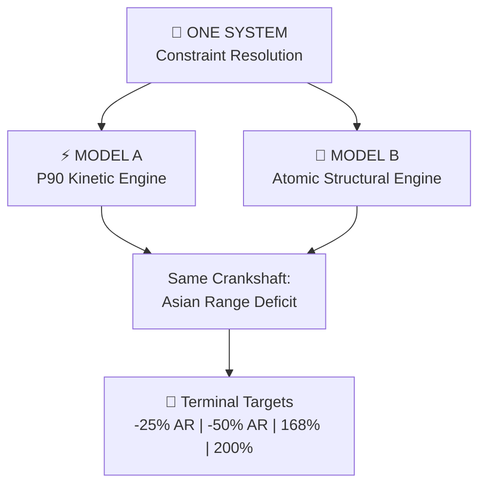
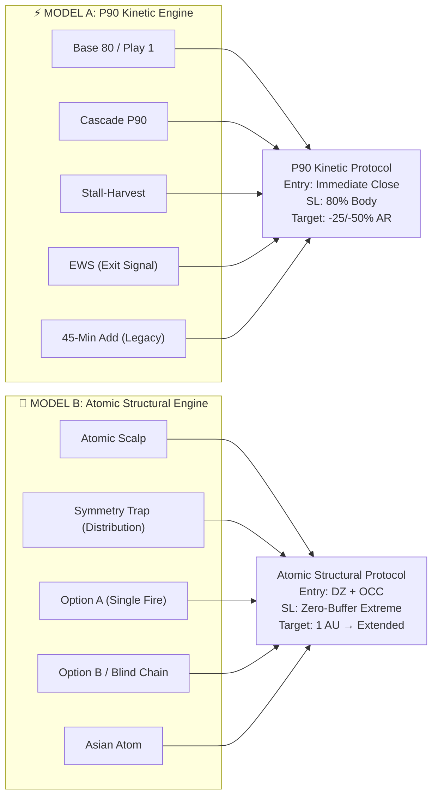
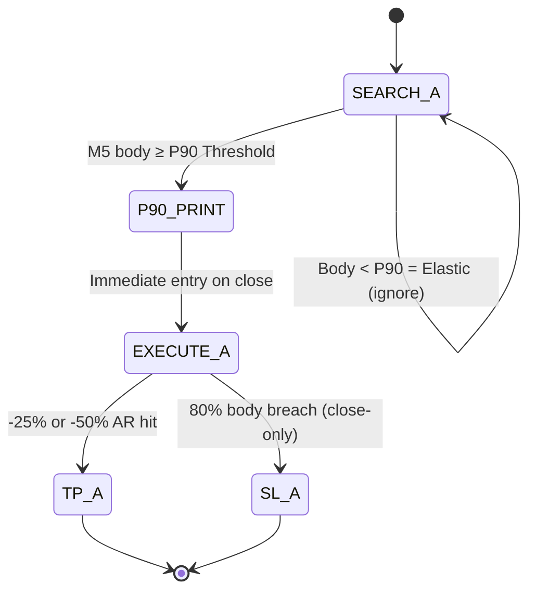
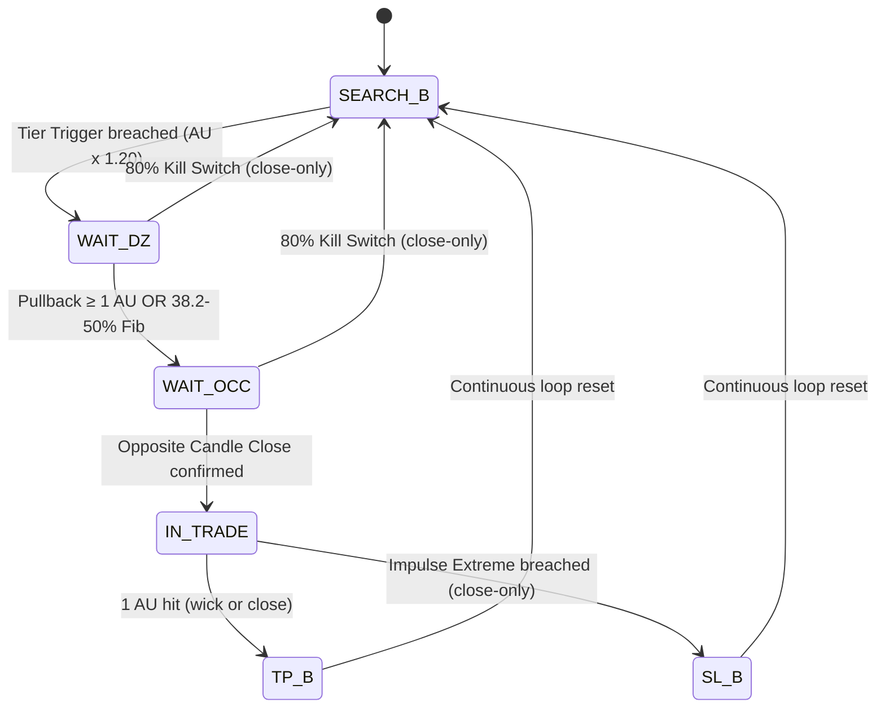
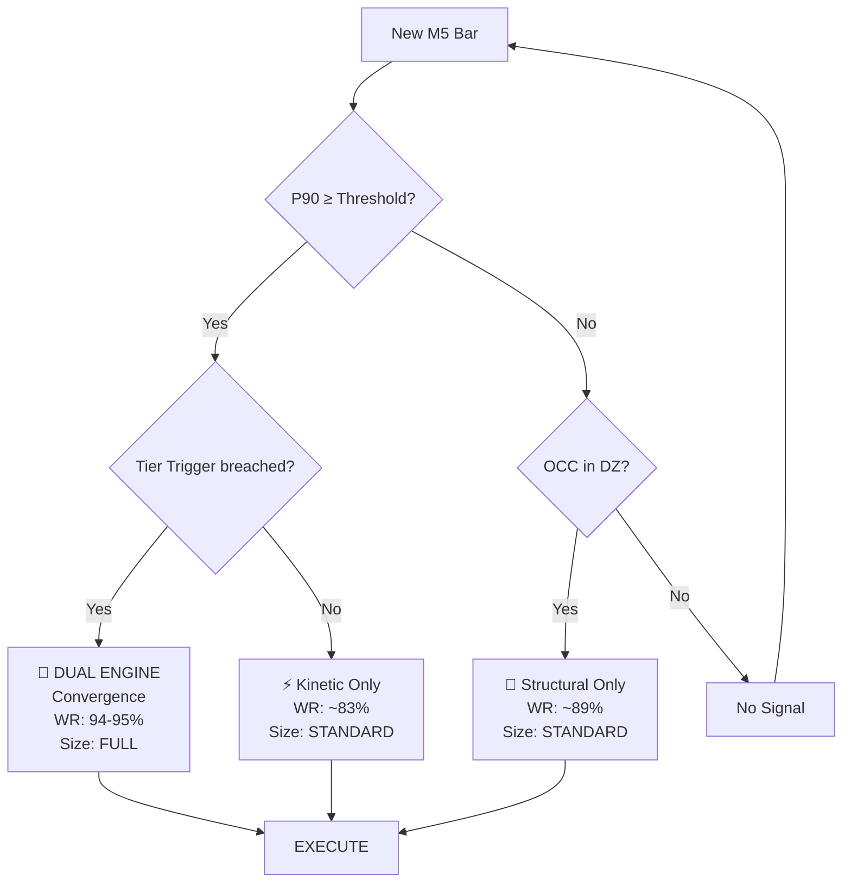
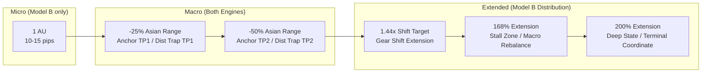
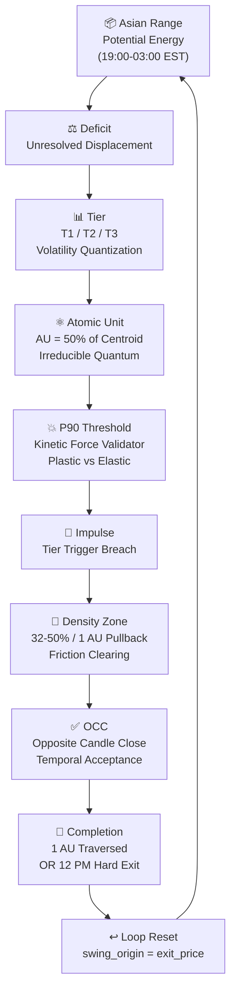
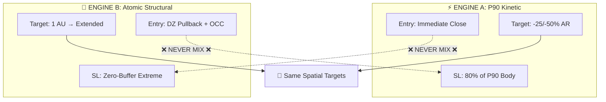
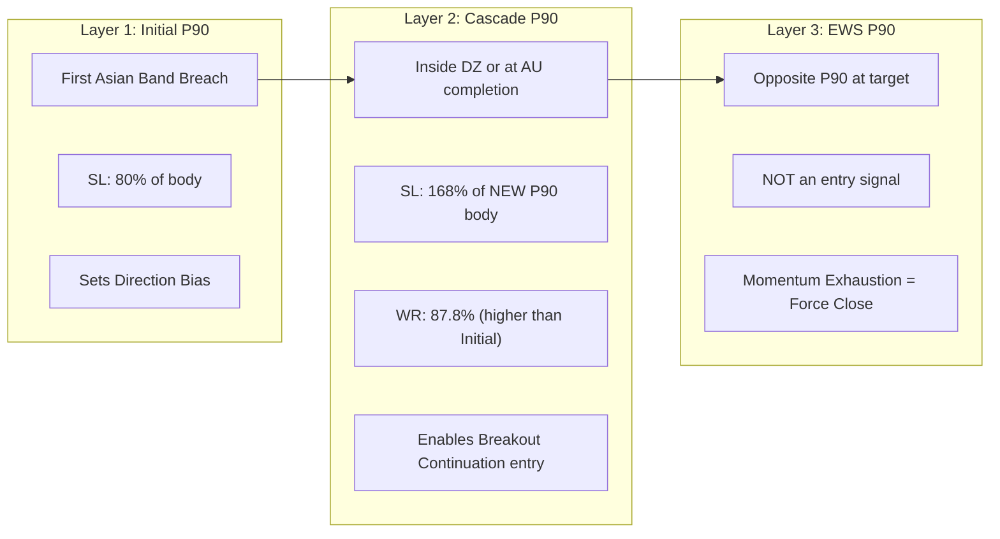
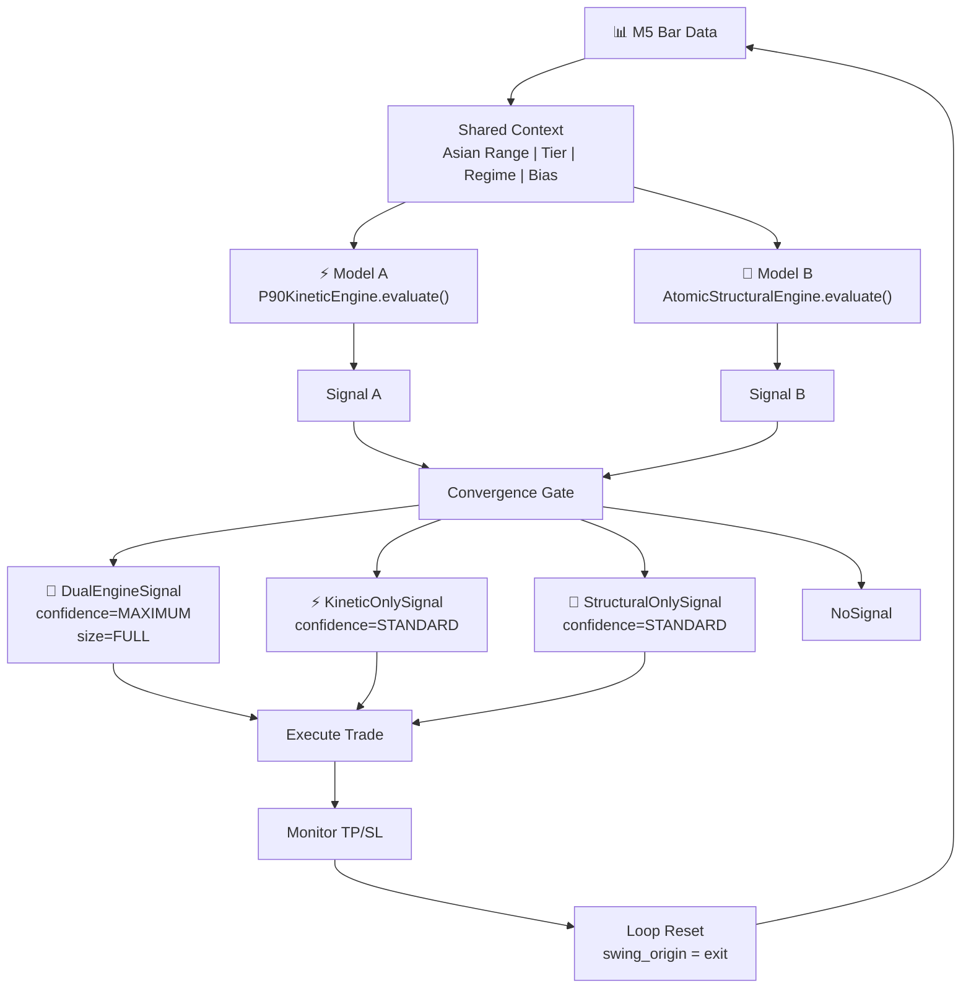

# CEREBUS Bipolar Motor — Mermaid Diagrams

## 1. System Overview — One System, Two Engines

## 2. Strategy Collapse Matrix — All 20+ Setups → 2 Engines

## 3. State Machine — Model A (P90 Kinetic)

## 4. State Machine — Model B (Atomic Structural)

## 5. Dual-Engine Convergence Logic

## 6. Target Interplay Hierarchy

## 7. Energy Conversion Hierarchy

## 8. Execution Isolation — The Great Demarcation

## 9. P90 Fractal Layers

## 10. Complete Agent Architecture

---

_Diagrams created: 2026-05-29 16:35 EDT. For agent ingestion alongside ontology suite._
