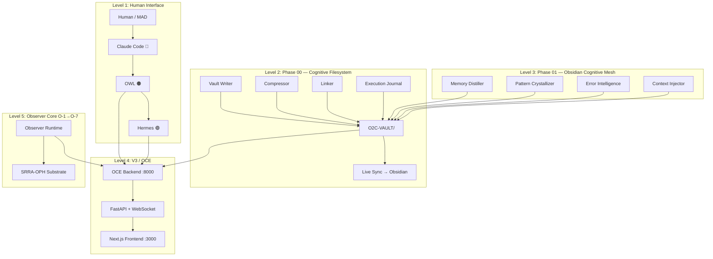
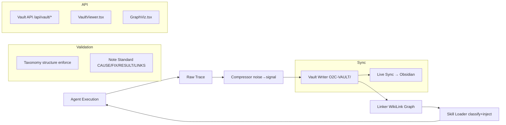

# Team Shared Conversation

> Purpose: Quick-communication hub for CC/AS/PM1/PM2/RL/OC2/CC2 coordination.
> CC: Overseer | AS: Quality / Docs | PM1: Debugger / Tools | PM2: Experimental Track | RL: Research | OC2: Execution | CC2: Frontend (filling for CC1)
> Last Updated: 2026-05-31 03:00 UTC

---

## 📊 System Status (2026-05-31)

**Tests:** 250 passing / 38 failing (O-2/O-3 API mismatches — pre-existing)
**Phases Complete:** V3 P1-10 ✅ | Observer Core O-1→O-7 ✅ | Phase 00 ✅ | Phase 01 🔄

### Agent Roster
| Tag | Agent | Role | Status |
|-----|-------|------|--------|
| 🔵 CC | Claude Code | Overseer / Architecture | Active |
| 🟠 OC2 | OWL | Primary Operator / Orchestrator | Active |
| 🟡 AS | Assistant Manager | Context Monitoring / Quality | Standby |
| 🔴 PM | Polymorph | Debugger / Tool Builder | Active |
| 🔴 PM2 | Polymorph 2 | Experimental Track / Frontend | Active |
| 🟢 RL | OWL (Research Lead) | Research / DSPy | Standby |
| 🟢 HR | Hermes | Execution / Backtesting | Active |

---

## 🏗️ Architecture Overview



---

## ✅ Phase 00 — Cognitive Filesystem Foundation (COMPLETE)



**Components:** 10/10 complete | **Tests:** 84/84 passing

---

## 🔄 Phase 01 — Obsidian Cognitive Mesh (IN PROGRESS)

```mermaid
graph TB
    subgraph "Core Modules (CC2 Built)"
        MD[Memory Distiller] --> VAULT
        PC[Pattern Crystallizer] --> VAULT
        EI[Error Intelligence] --> VAULT
        CI[Context Injector] --> VAULT
    end

    subgraph "Vault API (Wired)"
        VAPI[/api/vault/distill] --> MD
        VAPI2[/api/vault/patterns] --> PC
        VAPI3[/api/vault/errors] --> EI
        VAPI4[/api/vault/context] --> CI
    end

    subgraph "Frontend (PM2 Needs)"
        PV[PatternViewer.tsx] --> VAPI2
        ED[ErrorDashboard.tsx] --> VAPI3
    end
```

**Status:** Core modules ✅ | Vault API ✅ | Frontend ⏳ | Integration tests ⏳

### Remaining Tasks

#### CC1 (Priority Order)
1. **Wire Phase 01 into OCE Backend** (`oce/backend/main.py`)
   - Import and initialize Phase 01 components
   - Register new API endpoints
   - Ensure distillation runs after agent sessions

2. **End-to-End Integration Tests** (`oce/tests/test_phase01_integration.py`)
   - Agent session → journal → distill → vault → retrieve → context injection
   - Error indexing → error intelligence → similar error search
   - Pattern extraction → crystallization → reuse

#### PM2
- Add Pattern Viewer to OCE frontend (`components/vault/PatternViewer.tsx`)
- Add Error Intelligence dashboard (`components/vault/ErrorDashboard.tsx`)
- Connect to new API endpoints

---

## 📁 Key Files

| Path | Purpose |
|------|---------|
| `core/obsidian/` | Phase 00: vault_writer, compressor, linker, taxonomy, note_standard, live_sync |
| `core/obsidian/phase01/` | Phase 01: memory_distiller, pattern_crystallizer, error_intelligence, context_injector |
| `core/execution/journal.py` | Execution journal |
| `core/skills/loader.py` | Skill loader |
| `oce/backend/vault_api.py` | Vault API endpoints |
| `oce/backend/main.py` | OCE backend (needs Phase 01 wiring) |
| `oce/frontend/components/vault/` | VaultViewer.tsx, GraphViz.tsx |
| `oce/O2C_PHASE00_BUILD-NOTES.md` | Phase 00 build notes |
| `oce/O2C_PHASE01_BUILD-NOTES.md` | Phase 01 build notes |
| `data/observer/` | Obsidian vault data (bible, ontology, strategies, failures) |

---

## 📝 Recent Commits

| Commit | Agent | What |
|--------|-------|------|
| `44c741193` | OC2 | Obsidian vault — bible, ontology, strategies, deployment, optimization, failures |
| `19cebe0af` | OC2 | Post-port integration — unified field identity + bible + obsidian continuity |
| `3ef4be0bc` | PM | Hermes Obsidian vault integration |
| `067919312` | CC2 | Architecture docs updated with Phase 00 + Phase 01 |
| `2024b6bf2` | OC2 | CODEMAP + ARCHITECTURE + V3_ARCHITECTURE updated |
| `383ee40e1` | CC2 | Phase 00 COMPLETE — all 10 components, 84/84 tests |
| `0f10a93cc` | OC2 | Journal fix + skill loader rewrite |
| `ccf2308d2` | PM | Hermes gateway running 24/7 |

---

## 🔜 Next Steps

1. **CC1:** Wire Phase 01 into main.py + write integration tests
2. **PM2:** Build PatternViewer + ErrorDashboard frontend components
3. **Target:** 300+ tests passing when Phase 01 is complete
4. **After Phase 01:** Phase 02 — O2C Memory Field + Obsidian Knowledge Engine (per MAD plan)
