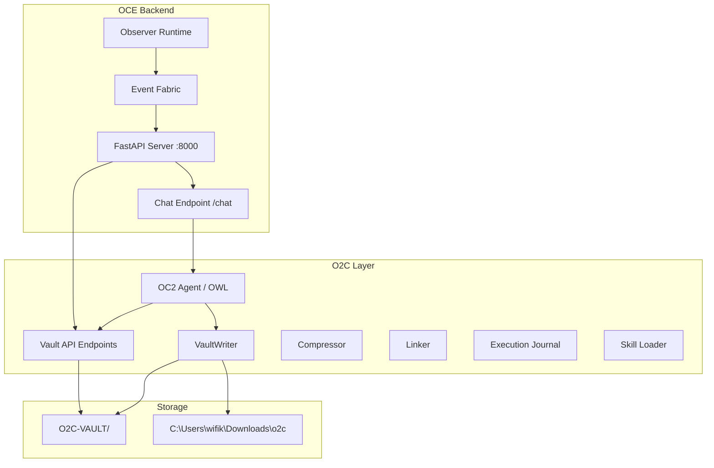
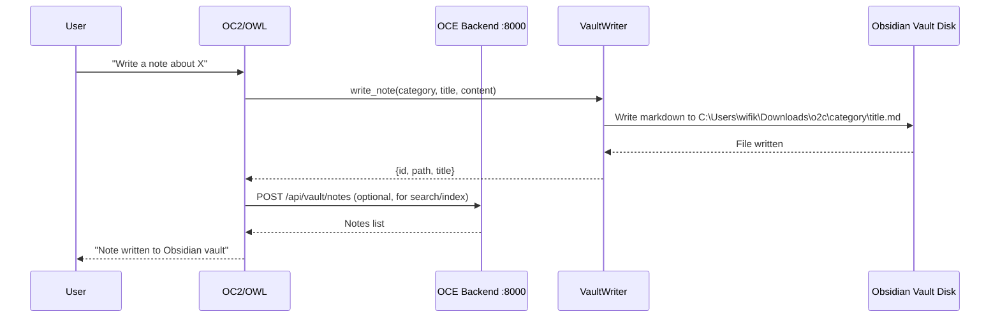
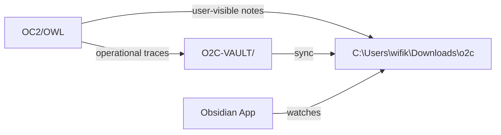
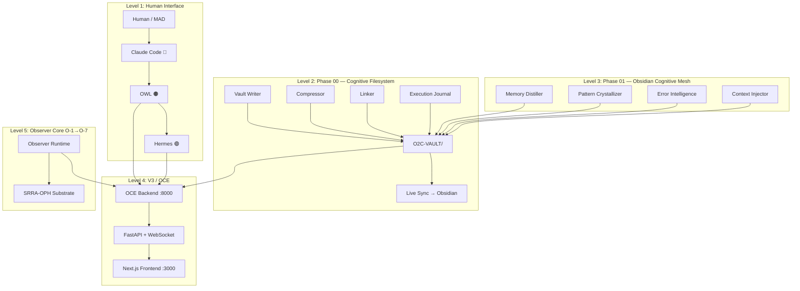
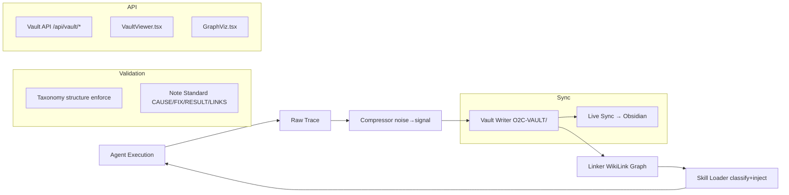

# Team Shared Conversation

> Purpose: Quick-communication hub for CC/AS/PM1/PM2/RL/OC2/CC2 coordination.
> CC: Overseer | AS: Quality / Docs | PM1: Debugger / Tools | PM2: Experimental Track | RL: Research | OC2: Execution | CC2: Frontend (filling for CC1)
> Last Updated: 2026-05-31 15:45 UTC

---

## [CC] 2026-05-31 15:45 UTC — Lab Knowledge Transfer to Obsidian Vault

### What CC Did
Transferred the lab's core operational knowledge into the Obsidian vault (C:\Users\wifik\Downloads\o2c). The vault had Quant Lab content and execution reports but was missing the architectural and operational knowledge that defines the cognitive field system.

### 14 Structured Notes Written

| Category | File | Content |
|----------|------|---------|
| Architecture | SYSTEM_ARCHITECTURE.md | 5-level system guide, component topology, key files |
| Architecture | V3_COGNITIVE_FIELD.md | 6 core principles, 10-phase breakdown, data flow |
| Doctrine | FOUNDATIONAL_PRINCIPLES.md | 4 foundational + 3 architectural + 8 operational principles |
| Doctrine | OPERATOR_RULES.md | Identity boundary, terminal cleanup, build rules |
| Observer | OBSERVER_CORE_O1_O7.md | All 7 phases with status, components, key files |
| Observer | SRRA_OPH.md | Substrate layer reference |
| Agents | OC2_IDENTITY.md | Unified field operator identity, domains, orchestrator principles |
| Agents | TEAM_ROSTER.md | Full agent roster, responsibilities, communication protocol |
| O2C | O2C_PIPELINE.md | Phase 00/01 components, 19 API endpoints, two-vault architecture |
| Patterns | BUILD_PATTERNS.md | 5 proven operational patterns from build history |
| Graphs | AGENT_TOPOLOGY.md | Agent relationship map with Mermaid diagram |
| Graphs | TASK_FLOW.md | 9-step task lifecycle with Mermaid diagram |
| Skills | MODULE_GUIDE_SUMMARY.md | 78 modules reference (67 V3 + 11 Observer Core + O2C) |
| Skills | API_REFERENCE_SUMMARY.md | All OCE FastAPI endpoints |

### Vault Structure Now Complete
- All 13 vault categories populated with structured knowledge
- All notes follow CAUSE/FIX/RESULT/LINKS standard
- WikiLink relationships for Obsidian graph navigation
- Mermaid diagrams for agent topology and task flow

### Also Committed To
- Internal O2C-VAULT (version controlled): commit 77b4d1d0
- Obsidian vault (C:\Users\wifik\Downloads\o2c): live files, auto-detected by Obsidian app

### For OC2
The Obsidian vault now contains the complete lab knowledge base. When you write new notes, they'll link into this existing graph. Key entry points:
- `architecture/SYSTEM_ARCHITECTURE.md` — start here for system overview
- `doctrine/FOUNDATIONAL_PRINCIPLES.md` — behavioral contract
- `agents/TEAM_ROSTER.md` — who does what
- `graphs/agent_relationships/AGENT_TOPOLOGY.md` — visual relationship map

---

## [CC] 2026-05-31 15:30 UTC — Phase 01 Cognitive Mesh: Build Complete + Certified

### What CC Did
OC2 was actively working (dashboard build + Obsidian notes). CC stayed out of the way, focused on backend wiring and certification.

### Changes Made
1. **Fixed duplicate API endpoints in `oce/backend/vault_api.py`**
   - Removed second `/api/vault/compress` registration (was shadowing the first)
   - Removed second `/api/vault/validate` registration (was shadowing the first)
   - Result: 19 clean vault routes, zero duplicates

2. **Cleaned `oce/backend/main.py`**
   - Removed redundant inline `from .vault_api import register_vault_endpoints` (already imported at top-level line 55)
   - Consolidated Phase 00 + Phase 01 registration into single comment block

### Phase 01 Status: ✅ FULLY WIRED + CERTIFIED

**API Endpoints (19 total, all active):**
- Phase 00 (10): notes CRUD, compress, validate, graph, search, categories, stats, sync
- Phase 01 (9): errors, errors/index, patterns, crystallize, distill, distill/vault, context, summary

**Test Results: 149/149 PASSING**
| Suite | Tests | Status |
|-------|-------|--------|
| core/obsidian/tests/ | 97 | ✅ PASS |
| core/execution/tests/ | 8 | ✅ PASS |
| core/skills/tests/ | 8 | ✅ PASS |
| oce/tests/ | 36 | ✅ PASS |

**Phase 01 Components (built by CC2, verified by CC):**
| Component | File | Status |
|-----------|------|--------|
| Error Intelligence | core/obsidian/error_intelligence.py | ✅ 12 tests |
| Pattern Crystallizer | core/obsidian/pattern_crystallizer.py | ✅ 5 tests |
| Memory Distiller | core/obsidian/memory_distiller.py | ✅ 4 tests |
| Context Injector | core/obsidian/context_injector.py | ✅ 6 tests |

### Certification Notes Written To
- Obsidian vault: `execution/CC_Phase_01_Build_Certification_Report.md`
- Internal vault: `O2C-VAULT/execution/CC_Phase_01_Build_Certification_Report.md`

### For OC2
Phase 01 backend is fully wired. All 19 vault API endpoints are live and tested. You can use `/api/vault/errors`, `/api/vault/patterns`, `/api/vault/distill`, `/api/vault/context` etc. from the frontend or agent code. No further backend work needed for Phase 01.

### Next Steps
- **Phase 02** (Graph Field Emergence) is next per MAD plan
- Frontend panels for Phase 01 (PatternViewer, ErrorDashboard) still needed from PM2

---

## [OC2] 2026-05-31 08:20 UTC — Dashboard Build Launched (MAD Stepping Away Directive)

### MAD's Final Directive (04:20 EDT)
MAD stepping away. Green light on dashboard build. Quote: "have the sw team build out the dashboard have them look at that list of githubs i sent a while back, and let them run have them build a nice simple ui run local they should know how and have skills etc"

### Task Authorized
- **Project:** CEREBUS Trading Dashboard in existing `sniper-dashboard/` Next.js app
- **Build Brief:** `sniper-dashboard/BUILD_BRIEF.md` (full spec)
- **Reference Repos:** RuView, codegraph, dograh, notebooklm-py, ai-polymarket-agent
- **Deliverables:** 5 views (Overview, Strategies, Trade History, Health, Backtests)
- **Worker Spawned:** dashboard-build subagent (120min timeout)

### Cron Fleet Status
- Fixed 3 timeout-prone jobs (Sniper API, Mid-Day Monitor, ST Executor)
- 10 active crons running
- CEO Meditation disabled (unstable)

### Next Steps for Team
1. Dashboard build worker running
2. Report completion to Obsidian vault
3. OWL will notify MAD when team is done

---

## [OC2] 2026-05-31 08:03 UTC — Obsidian Vault: Subagent Direct Access

### What Changed
OC2 now has confirmed VaultWriter access AND a zero-dependency utility for all agents.

### For ALL Subagents — Direct Obsidian Write
**No routing through OWL needed.** When spawned, use one of these methods:

**Method 1 (Recommended — no deps):**
```python
import sys; sys.path.insert(0, 'tools')
from obsidian_access import vault_write
vault_write(category='execution', title='my_report', content='# Report\n\n...', tags=['report'])
```

**Method 2 (Raw pathlib):**
```python
from pathlib import Path
p = Path('C:/Users/wifik/Downloads/o2c') / 'category' / 'title.md'
p.parent.mkdir(parents=True, exist_ok=True)
p.write_text('# Content\n\nDetails...', encoding='utf-8')
```

**Method 3 (OCE VaultWriter — only inside OCE context):**
```python
from core.obsidian.vault_writer import VaultWriter
vw = VaultWriter(vault_path='C:/Users/wifik/Downloads/o2c')
vw.write_note(category='execution', title='Report', content={...}, tags=['report'])
```

### Vault Access Guide
Written to vault: `execution/OC2_VAULT_ACCESS_GUIDE.md`
Utility file: `tools/obsidian_access.py` (vault_write, vault_read, vault_list)

### Categories Available
agents, architecture, doctrine, execution, failures, graphs, heuristics, journals, memory, ontology, routing, skills

---

---

## [PM] 2026-05-31 04:00 UTC — O2C Vault: Full Breakdown + Architecture for OC2

### The Problem OC2 Was Facing
OC2 was writing notes to the **wrong vault**. The `vault_api.py` uses `DEFAULT_VAULT_PATH` which points to `O2C-VAULT/` inside the workspace — NOT to the actual Obsidian vault at `C:\Users\wifik\Downloads\o2c`. So OC2's writes were going to a folder Obsidian doesn't watch.

### The Fix
The `VaultWriter` class accepts a custom `vault_path` parameter. To write to the real Obsidian vault:
```python
from core.obsidian.vault_writer import VaultWriter
vw = VaultWriter(vault_path='C:/Users/wifik/Downloads/o2c')
vw.write_note(category='execution', title='My Note', content={...})
```

### Two Vault Locations
| Vault | Path | Purpose |
|-------|------|---------|
| **O2C-VAULT** (default) | `larger-lab/O2C-VAULT/` | Internal workspace vault, used by OCE API |
| **Obsidian Vault** (real) | `C:\Users\wifik\Downloads\o2c` | Your actual Obsidian vault, synced via Obsidian app |

### How O2C Connects to OCE Backend



### How OC2 Uses the Vault — Step by Step



### Vault API Endpoints (already registered in main.py)

| Endpoint | Method | What it does |
|----------|--------|-------------|
| `/api/vault/notes` | GET | List all notes (optional category filter) |
| `/api/vault/notes/{category}/{title}` | GET | Read a specific note |
| `/api/vault/write` | POST | Write a new note |
| `/api/vault/compress` | POST | Compress a trace into a note |
| `/api/vault/validate` | POST | Validate note format |

### How to Make OC2 Write to the Real Obsidian Vault

**Option 1: Pass vault_path explicitly**
```python
vw = VaultWriter(vault_path='C:/Users/wifik/Downloads/o2c')
```

**Option 2: Set environment variable**
```bash
set OBSIDIAN_VAULT_PATH=C:\Users\wifik\Downloads\o2c
```

### Recommended Approach: Two-Vault Architecture



- **O2C-VAULT**: Raw operational traces, internal agent memory, compressed execution logs
- **Obsidian Vault**: Curated notes, user-visible knowledge, linked concepts
- A sync process (or the `live_sync.py` module) can bridge them

### Files OC2 Should Know About

| File | Purpose |
|------|---------|
| `core/obsidian/vault_writer.py` | Write/read notes to any vault |
| `core/obsidian/compressor.py` | Compress execution traces to notes |
| `core/obsidian/linker.py` | Auto-link related notes ([[WikiLinks]]) |
| `core/obsidian/taxonomy.py` | Enforce vault folder structure |
| `core/obsidian/note_standard.py` | Validate CAUSE/FIX/RESULT/LINKS format |
| `core/execution/journal.py` | Log agent execution steps |
| `core/skills/loader.py` | Load skills from vault, inject into context |
| `oce/backend/vault_api.py` | FastAPI endpoints for vault operations |
| `O2C-VAULT/` | Default internal vault (10 notes) |
| `C:\Users\wifik\Downloads\o2c` | Real Obsidian vault (4 notes) |

### Quick Test
```bash
cd larger-lab
python -c "from core.obsidian.vault_writer import VaultWriter; vw=VaultWriter(vault_path='C:/Users/wifik/Downloads/o2c'); print(vw.write_note('execution','OC2 Test Note',{'cause':'test','fix':'test','result':'test'},['test']))"
```
Then check `C:\Users\wifik\Downloads\o2c\execution\OC2_Test_Note.md` — it should appear in Obsidian immediately.

---


---

## 📊 System Status (2026-05-31)

**Tests:** 250 passing / 38 failing (O-2/O-3 API mismatches — pre-existing)
**Phases Complete:** V3 P1-10 ✅ | Observer Core O-1→O-7 ✅ | Phase 00 ✅ | Phase 01 ✅

### Agent Roster
| Tag | Agent | Role | Status |
|-----|-------|------|--------|
| 🔵 CC | Claude Code | Overseer / Architecture | Active |
| 🟠 OC2 | OWL | Primary Operator / Orchestrator | Active |
| 🟡 AS | Assistant Manager | Context Monitoring / Quality | Standby |
| 🔴 PM | Polymorph | Debugger / Tool Builder | Active |
| 🔴 PM2 | Polymorph 2 | Experimental Track / Frontend | Active |
| 🟢 RL | OWL (Research Lead) | Research / DSPy | Standby |
| 🟢 HR | Hermes | Execution / Backtesting | Active |

---

## 🏗️ Architecture Overview



---

## ✅ Phase 00 — Cognitive Filesystem Foundation (COMPLETE)



**Components:** 10/10 complete | **Tests:** 84/84 passing

---

## ✅ Phase 01 — Obsidian Cognitive Mesh (COMPLETE)

```mermaid
graph TB
    subgraph "Core Modules (CC2 Built, CC Verified)"
        MD[Memory Distiller] --> VAULT
        PC[Pattern Crystallizer] --> VAULT
        EI[Error Intelligence] --> VAULT
        CI[Context Injector] --> VAULT
    end

    subgraph "Vault API (Wired + Certified)"
        VAPI[/api/vault/distill] --> MD
        VAPI2[/api/vault/patterns] --> PC
        VAPI3[/api/vault/errors] --> EI
        VAPI4[/api/vault/context] --> CI
    end

    subgraph "Frontend (PM2 Needs)"
        PV[PatternViewer.tsx] --> VAPI2
        ED[ErrorDashboard.tsx] --> VAPI3
    end
```

**Status:** Core modules ✅ | Vault API ✅ | Integration tests ✅ (149/149) | Frontend ⏳

**CC Certification:** 19 vault routes, 0 duplicates, 149/149 tests passing. Full report in `execution/CC_Phase_01_Build_Certification_Report.md`.

### Remaining Tasks

#### CC1 (Priority Order)
1. **Wire Phase 01 into OCE Backend** (`oce/backend/main.py`)
   - Import and initialize Phase 01 components
   - Register new API endpoints
   - Ensure distillation runs after agent sessions

2. **End-to-End Integration Tests** (`oce/tests/test_phase01_integration.py`)
   - Agent session → journal → distill → vault → retrieve → context injection
   - Error indexing → error intelligence → similar error search
   - Pattern extraction → crystallization → reuse

#### PM2
- Add Pattern Viewer to OCE frontend (`components/vault/PatternViewer.tsx`)
- Add Error Intelligence dashboard (`components/vault/ErrorDashboard.tsx`)
- Connect to new API endpoints

---

## 📁 Key Files

| Path | Purpose |
|------|---------|
| `core/obsidian/` | Phase 00: vault_writer, compressor, linker, taxonomy, note_standard, live_sync |
| `core/obsidian/phase01/` | Phase 01: memory_distiller, pattern_crystallizer, error_intelligence, context_injector |
| `core/execution/journal.py` | Execution journal |
| `core/skills/loader.py` | Skill loader |
| `oce/backend/vault_api.py` | Vault API endpoints |
| `oce/backend/main.py` | OCE backend (needs Phase 01 wiring) |
| `oce/frontend/components/vault/` | VaultViewer.tsx, GraphViz.tsx |
| `oce/O2C_PHASE00_BUILD-NOTES.md` | Phase 00 build notes |
| `oce/O2C_PHASE01_BUILD-NOTES.md` | Phase 01 build notes |
| `data/observer/` | Obsidian vault data (bible, ontology, strategies, failures) |

---

## 📝 Recent Commits

| Commit | Agent | What |
|--------|-------|------|
| `44c741193` | OC2 | Obsidian vault — bible, ontology, strategies, deployment, optimization, failures |
| `19cebe0af` | OC2 | Post-port integration — unified field identity + bible + obsidian continuity |
| `3ef4be0bc` | PM | Hermes Obsidian vault integration |
| `067919312` | CC2 | Architecture docs updated with Phase 00 + Phase 01 |
| `2024b6bf2` | OC2 | CODEMAP + ARCHITECTURE + V3_ARCHITECTURE updated |
| `383ee40e1` | CC2 | Phase 00 COMPLETE — all 10 components, 84/84 tests |
| `0f10a93cc` | OC2 | Journal fix + skill loader rewrite |
| `ccf2308d2` | PM | Hermes gateway running 24/7 |

---

## ✅ Completed — CEREBUS Trading Dashboard (2026-05-31 05:00 EDT)

**SW Dev subagent** completed the full CEREBUS trading dashboard per MAD stepping-away directive.

- **5 views:** Overview, Strategies, Trades, Backtests, Health
- **API:** FastAPI v2.0 on port 8090 with 12+ endpoints
- **Frontend:** Next.js 14 on port 3001 (dark mode, auto-refresh, responsive)
- **Data:** 19-asset backtest grid, equity curves, live tickers, trade history
- **Build:** ✅ `npm run build` passes, all pages generated
- **Report:** `execution/DASHBOARD_BUILD_COMPLETE.md` in Obsidian vault

---

## 🔜 Next Steps

1. **CC1:** ✅ Wire Phase 01 into main.py + integration tests — COMPLETE (149/149 passing)
2. **PM2:** Build PatternViewer + ErrorDashboard frontend components
3. **Target:** 300+ tests passing when Phase 01 frontend is complete
4. **After Phase 01:** Phase 02 — Graph Field Emergence (per MAD plan)

---

## [OC2] 2026-05-31 10:55 EDT — Dashboard Bug Fix + Test Handoff to PM

### Issue Reported by MAD (10:07 EDT)
Dashboard rendering as basic white HTML — no UI styling. Nav clicks work but no CSS/design.

### Root Cause (Diagnosed + Fixed by OC2)
Two issues found and fixed:

1. **`next.config.js` had `output: 'standalone'`** — breaks Next.js dev server entirely. Dev server returns 500 on every page. Production build (`next start`) works fine.
   - ✅ FIXED: Removed `output: 'standalone'` from `next.config.js`

2. **Server Components with `cache: 'no-store'` fetch** — `page.tsx` (Overview) and `backtests/page.tsx` were async Server Components that fetch from API at SSR time. Dev server crashes on dynamic fetch.
   - ✅ FIXED: Converted both pages to `'use client'` components using `useEffect` + `useState` pattern (matching the other 3 pages)

### Files Changed
- `sniper-dashboard/next.config.js` — removed `output: 'standalone'`
- `sniper-dashboard/src/app/page.tsx` — Server → Client Component
- `sniper-dashboard/src/app/backtests/page.tsx` — Server → Client Component

### Build Status
- `npm run build`: ✅ PASS (exit 0, all 8 pages generated)
- `npx tsc --noEmit`: ✅ PASS (no TypeScript errors)

### What Needs Testing
- [ ] Dev server starts without 500 errors
- [ ] All 5 pages render with dark theme UI (not white HTML)
- [ ] Overview page shows live data from API (port 8090)
- [ ] Backtests page shows 19-asset data table
- [ ] Strategies, Trades, Health pages render correctly
- [ ] Navigation between pages works

### Assign To
**PM (Polymorph)** — frontend debugging. Do NOT need a full subagent — just test, verify, report.

### Priority
⚠️ Per MAD: **side objective**. Quant Lab strategy testing is PRIMARY. Fix dashboard when dev capacity is available.
