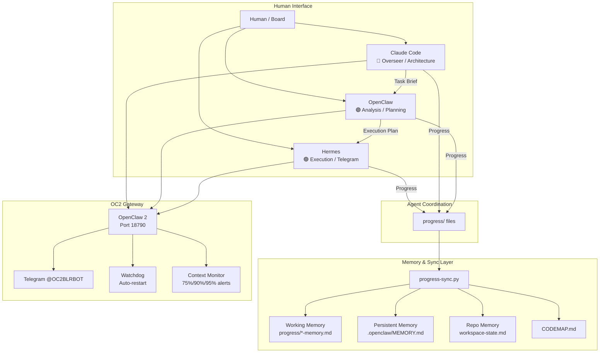
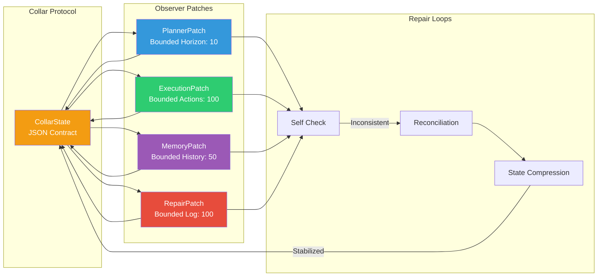
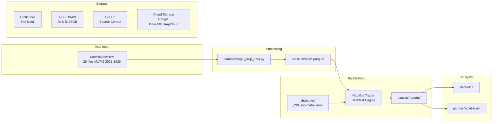
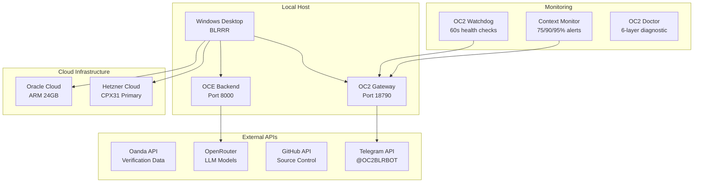

# System Overview — All Levels

> **Purpose:** High-level view of the entire larger-lab system.
> **Updated:** 2026-05-16

## Level 1: Human Interface + Agent Network



## Level 2: SRRA-OPH Substrate



## Level 3: OCE — Operator Continuity Engine

```mermaid
graph TB
    subgraph "User Layer"
        U[User] --> UI[OCE Shell UI<br/>Next.js Frontend]
    end

    subgraph "Continuity Core"
        UI --> API[FastAPI Backend<br/>Port 8000]
        API --> CHAT[/chat endpoint]
        API --> OBS[/observers endpoints]
        API --> EVT[/events endpoints]
        API --> ATTR[/attractor endpoint]
        API --> MEM[/memory endpoint]
        API --> WS[WebSocket /ws/events]
    end

    subgraph "Event Fabric"
        EF[Event Fabric Engine] --> ING[Ingest]
        EF --> ROUTE[Route]
        EF --> PERSIST[Persist]
        EF --> STREAM[Stream]
        ING --> VALIDATE[Validate + Classify]
        ROUTE --> TOPO[Topology-Aware Routing]
        PERSIST --> TRAJ[Trajectory Memory]
        STREAM --> WS
    end

    subgraph "Observer Runtime"
        OR[Observer Runtime] --> LIFECYCLE[Create/Activate/Suspend/Destroy]
        OR --> HEALTH[Entropy/Drift/Budget]
        OR --> STATE[State Persistence]
    end

    subgraph "SRRA-OPH Substrate"
        SRR[srrs_opc/] --> PATCHES[Observer Patches]
        SRR --> COLLAR[CollarLayer]
        SRR --> TOPO2[CollarTopologyEngine]
        SRR --> DRIFT[DriftDetector]
        SRR --> ENTROPY[EntropyBudgetManager]
    end

    API --> EF
    EF --> OR
    OR --> SRR
    SRR --> EF
```

## Level 4: Data + Trading Pipeline



## Level 5: Infrastructure + External Services


