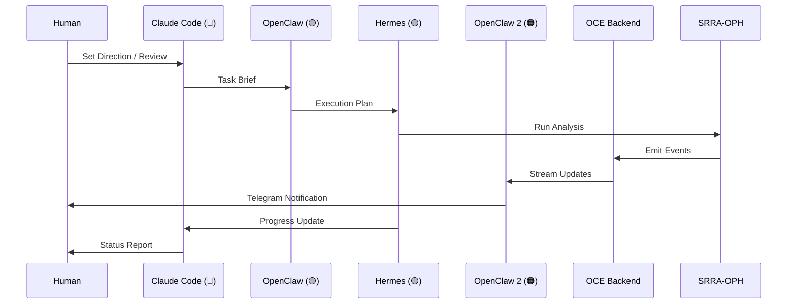
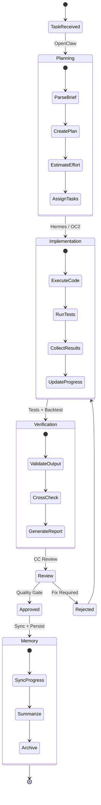
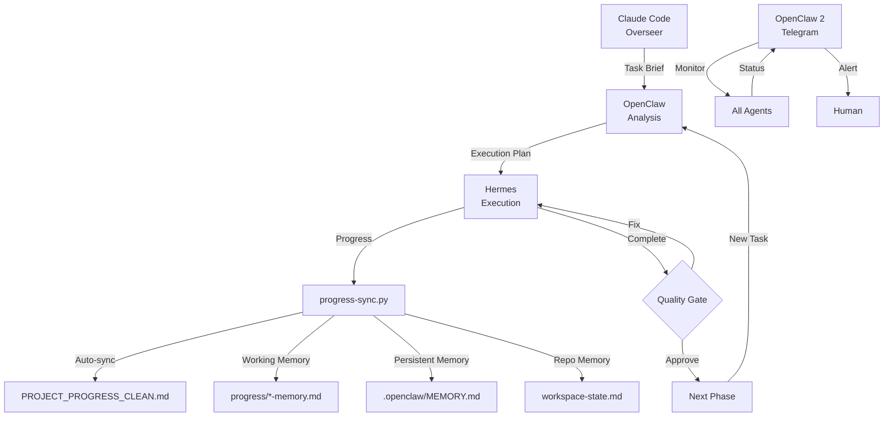

# Agent Workflow + Communication

> **Purpose:** Agent interaction patterns, workflow state machine, and communication flows.
> **Updated:** 2026-05-16

## Agent Communication Flow



## Workflow State Machine



## Agent Handoff Protocol



## OCE Event Flow

```mermaid
flowchart LR
    SRRA[SRRA-OPH<br/>Substrate] -->|emit events| EF[Event Fabric]
    EF -->|route| OR[Observer Runtime]
    OR -->|process| OBS[Observers]
    OBS -->|output events| EF
    EF -->|stream| WS[WebSocket]
    WS -->|real-time| UI[OCE Frontend]
    EF -->|persist| TRAJ[Trajectory Memory]
    EF -->|query| API[/events endpoint]
```
