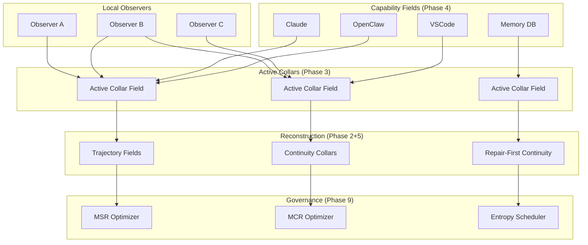
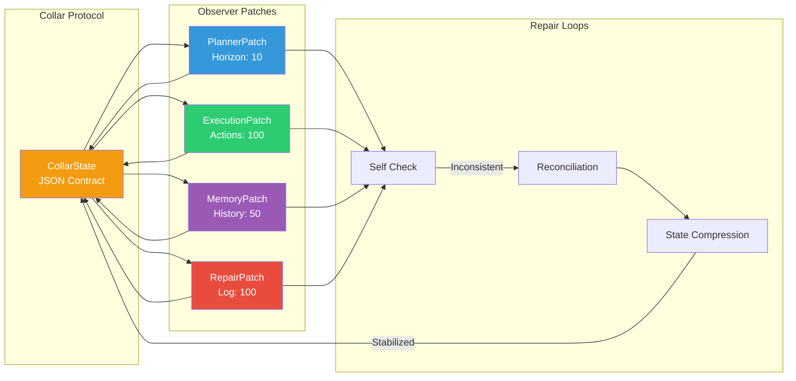
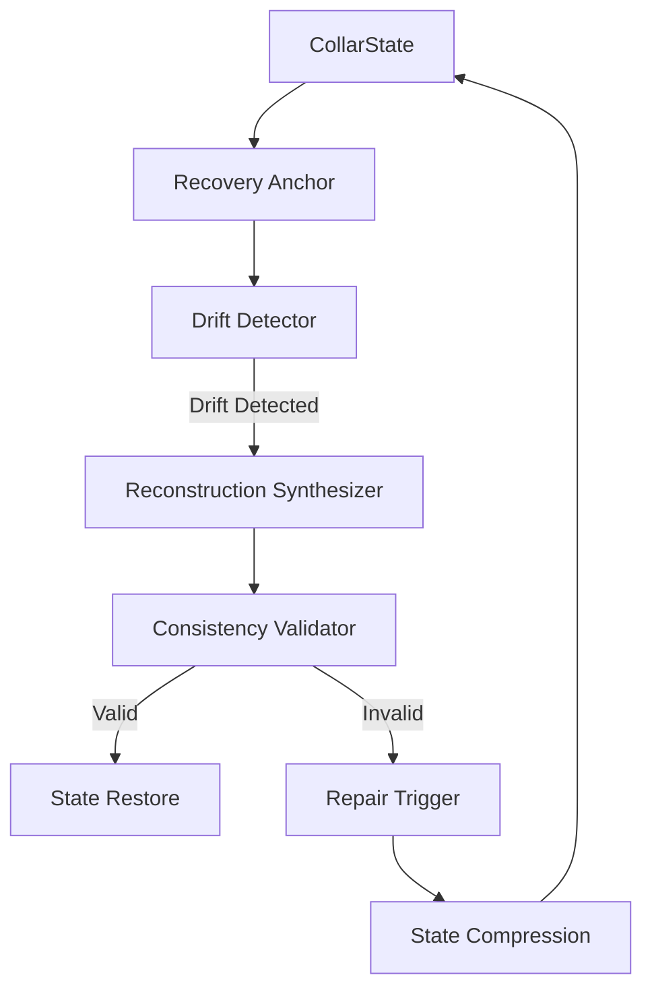
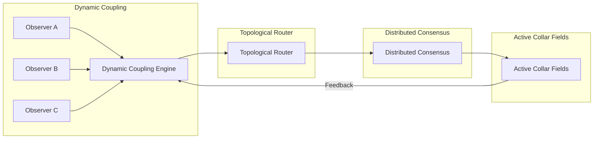
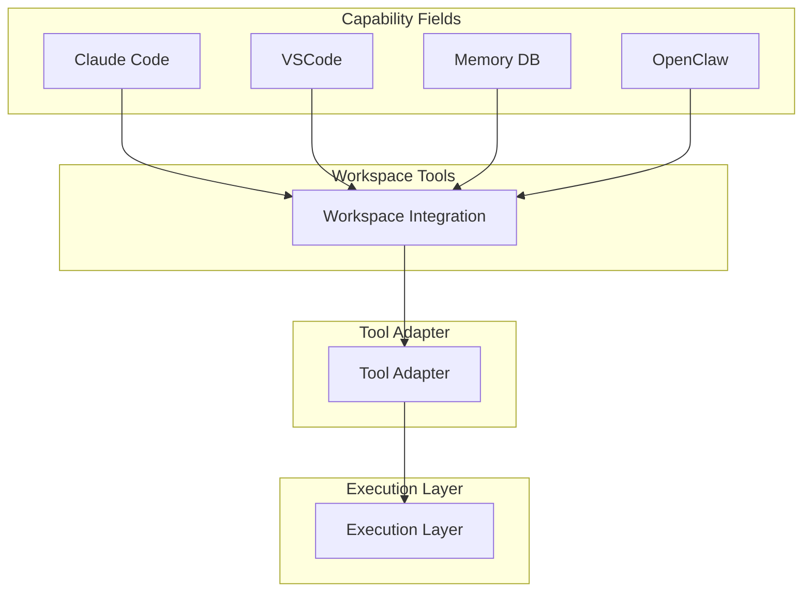
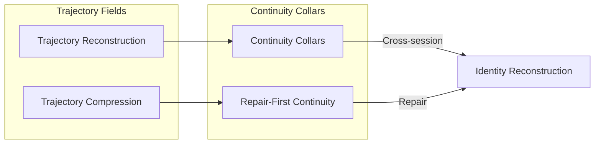
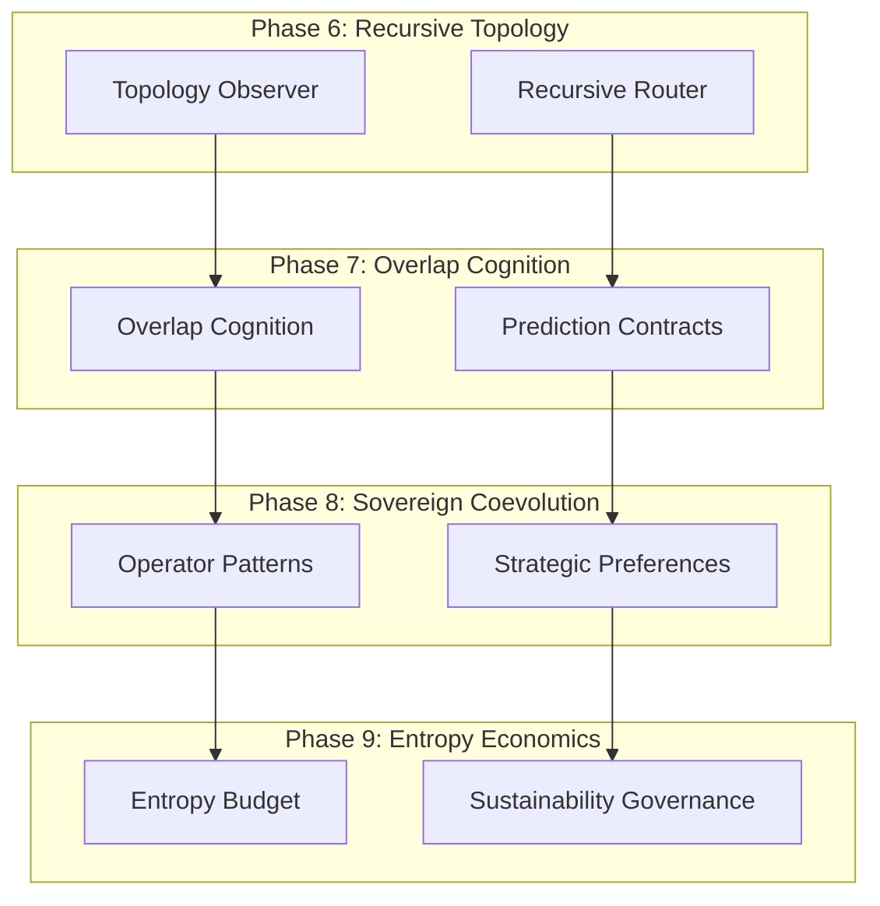

# SRRA-OPH Topology — All Phases

> **Purpose:** Technical architecture of the SRRA-OPH substrate across all 9 phases.
> **Updated:** 2026-05-16

## Full System Topology (Phases 1-9)

## Phase 1: Observer Mesh

## Phase 2: Reconstruction + Recoverability

## Phase 3: Emergent Topology

## Phase 4: Workspace Integration

## Phase 5: Long-Horizon Continuity

## Phase 6-9: Advanced Features

