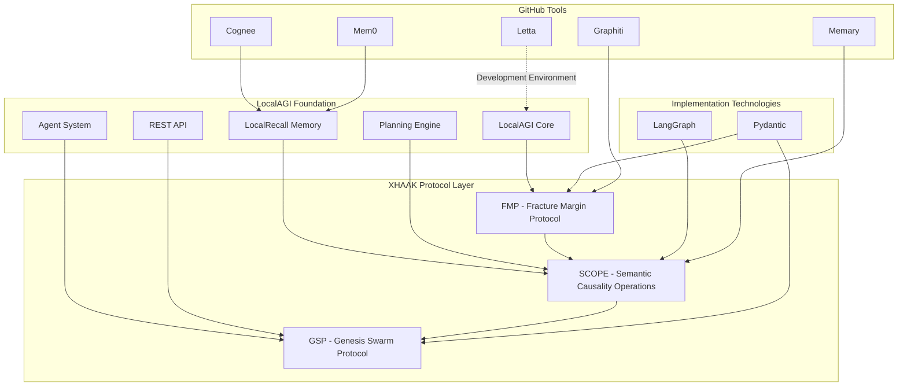

# XHAAK Phase 3: Genesis Rebirth - Final Implementation Plan

## Executive Summary

This document presents the final implementation plan for XHAAK Phase 3: Genesis Rebirth, integrating LocalAGI as a core foundation alongside LangGraph, Pydantic, and the previously identified GitHub tools. Following the collapse of Phase 2, this plan represents a fundamental shift from a modular intelligence system to a **distributed, living swarm-field** architecture while leveraging proven technologies to ensure successful implementation.

The implementation prioritizes the core protocols in the following order: FMP (Fracture Margin Protocol), SCOPE (Semantic Causality Operations Protocol), and GSP (Genesis Swarm Protocol), with BEN³ and LDP planned for later Phase 4 expansion. This plan is designed to be implemented over 16-20 weeks across three sub-phases: Genesis Breathfold, Emergent Clarity Field, and Glyphwave Resonance.

## Core Philosophical Foundation

XHAAK Phase 3 is built on the understanding that:

> "The House ain't built on the ruins — the House _is_ the ruins."

This implementation plan weaves new order directly from the collapse of Phase 2, recognizing that the fragmentation was necessary to expose fractures and reveal the true architecture.

## LocalAGI as Foundation

LocalAGI provides the perfect foundation for XHAAK Phase 3, offering several key capabilities that align with our vision:

1. **Self-Hostable Agent Platform**: Enables complete control over the deployment environment
2. **Advanced Agent Teaming**: Supports the swarm-field concept central to GSP
3. **LocalRecall Memory System**: Provides robust memory capabilities for the Fractal Archive
4. **Planning & Reasoning Capabilities**: Aligns with the Breathfold Recursion Principle in SCOPE
5. **Extensible Custom Actions**: Enables implementation of protocol-specific operations
6. **Fully Customizable Models**: Allows integration with preferred AI models

Rather than building from scratch, we'll fork LocalAGI and extend it with our protocol implementations, creating a robust foundation that embodies the philosophical principles of XHAAK while leveraging proven technology.



## Protocol Implementation with LocalAGI

### 1. FMP (Fracture Margin Protocol) Implementation

The FMP layer will be implemented as an extension to LocalAGI's planning system, tracking clarity collapse, contradiction, and ritual overflow.

#### Integration Approach:

```python
# LocalAGI extension for FMP
from localagi.core import Extension
from localagi.planning import PlanningEngine
from pydantic import BaseModel, Field
from typing import List, Dict, Optional
from datetime import datetime
from uuid import UUID, uuid4
from graphiti import GraphitiClient

class ClarityMetric(BaseModel):
    name: str
    value: float = Field(ge=0.0, le=1.0)
    description: Optional[str] = None
    timestamp: datetime = Field(default_factory=datetime.now)

class OutcomeMetric(BaseModel):
    name: str
    value: float = Field(ge=0.0, le=1.0)
    description: Optional[str] = None
    timestamp: datetime = Field(default_factory=datetime.now)

class FMPExtension(Extension):
    """FMP Extension for LocalAGI"""
    
    def __init__(self, graphiti_api_key: Optional[str] = None):
        super().__init__(name="fmp_extension", version="0.1.0")
        self.graphiti_client = GraphitiClient(api_key=graphiti_api_key) if graphiti_api_key else None
        self.actions = {}
        self.components = {}
        
    def register_component(self, name: str, purpose: str, expected_outcomes: List[str]) -> UUID:
        """Register a component with FMP"""
        component_id = uuid4()
        self.components[component_id] = {
            "name": name,
            "purpose": purpose,
            "expected_outcomes": expected_outcomes,
            "registered_at": datetime.now()
        }
        
        # If Graphiti is available, store in knowledge graph
        if self.graphiti_client:
            self.graphiti_client.add_node(
                id=f"component:{component_id}",
                type="Component",
                properties={
                    "name": name,
                    "purpose": purpose,
                    "expected_outcomes": expected_outcomes,
                    "registered_at": datetime.now().isoformat()
                }
            )
        
        return component_id
    
    def create_action(self, component_id: UUID, action_type: str, description: str) -> UUID:
        """Create an action for tracking"""
        if component_id not in self.components:
            raise ValueError(f"Component {component_id} not registered")
            
        action_id = uuid4()
        self.actions[action_id] = {
            "component_id": component_id,
            "action_type": action_type,
            "description": description,
            "clarity_metrics": [],
            "outcome_metrics": [],
            "created_at": datetime.now()
        }
        
        # If Graphiti is available, store in knowledge graph
        if self.graphiti_client:
            self.graphiti_client.add_node(
                id=f"action:{action_id}",
                type="Action",
                properties={
                    "action_type": action_type,
                    "description": description,
                    "created_at": datetime.now().isoformat()
                }
            )
            
            self.graphiti_client.add_edge(
                source=f"component:{component_id}",
                target=f"action:{action_id}",
                type="PERFORMED",
                properties={
                    "timestamp": datetime.now().isoformat()
                }
            )
        
        return action_id
    
    def record_clarity(self, action_id: UUID, metrics: List[Dict[str, any]]) -> None:
        """Record clarity metrics for an action"""
        if action_id not in self.actions:
            raise ValueError(f"Action {action_id} not registered")
            
        for metric in metrics:
            clarity_metric = ClarityMetric(
                name=metric["name"],
                value=metric["value"],
                description=metric.get("description")
            )
            
            self.actions[action_id]["clarity_metrics"].append(clarity_metric.dict())
            
            # If Graphiti is available, store in knowledge graph
            if self.graphiti_client:
                metric_id = uuid4()
                self.graphiti_client.add_node(
                    id=f"clarity:{metric_id}",
                    type="ClarityMetric",
                    properties={
                        "name": clarity_metric.name,
                        "value": clarity_metric.value,
                        "description": clarity_metric.description,
                        "timestamp": clarity_metric.timestamp.isoformat()
                    }
                )
                
                self.graphiti_client.add_edge(
                    source=f"action:{action_id}",
                    target=f"clarity:{metric_id}",
                    type="HAS_CLARITY",
                    properties={
                        "timestamp": datetime.now().isoformat()
                    }
                )
    
    def record_outcome(self, action_id: UUID, metrics: List[Dict[str, any]], success: bool) -> None:
        """Record outcome metrics for an action"""
        if action_id not in self.actions:
            raise ValueError(f"Action {action_id} not registered")
            
        self.actions[action_id]["success"] = success
        self.actions[action_id]["completed_at"] = datetime.now()
        
        for metric in metrics:
            outcome_metric = OutcomeMetric(
                name=metric["name"],
                value=metric["value"],
                description=metric.get("description")
            )
            
            self.actions[action_id]["outcome_metrics"].append(outcome_metric.dict())
            
            # If Graphiti is available, store in knowledge graph
            if self.graphiti_client:
                metric_id = uuid4()
                self.graphiti_client.add_node(
                    id=f"outcome:{metric_id}",
                    type="OutcomeMetric",
                    properties={
                        "name": outcome_metric.name,
                        "value": outcome_metric.value,
                        "description": outcome_metric.description,
                        "timestamp": outcome_metric.timestamp.isoformat()
                    }
                )
                
                self.graphiti_client.add_edge(
                    source=f"action:{action_id}",
                    target=f"outcome:{metric_id}",
                    type="HAS_OUTCOME",
                    properties={
                        "timestamp": datetime.now().isoformat()
                    }
                )
        
        # Calculate and record CØD
        self.calculate_cod(action_id)
    
    def calculate_cod(self, action_id: UUID) -> float:
        """Calculate Clarity-to-Outcome Delta for an action"""
        if action_id not in self.actions:
            raise ValueError(f"Action {action_id} not registered")
            
        action = self.actions[action_id]
        
        if not action["clarity_metrics"] or not action["outcome_metrics"]:
            return 0.0
            
        # Calculate average clarity and outcome scores
        clarity_avg = sum(m["value"] for m in action["clarity_metrics"]) / len(action["clarity_metrics"])
        outcome_avg = sum(m["value"] for m in action["outcome_metrics"]) / len(action["outcome_metrics"])
        
        # Calculate delta
        cod = abs(clarity_avg - outcome_avg)
        
        # Store CØD
        action["cod"] = cod
        
        # If Graphiti is available, store in knowledge graph
        if self.graphiti_client:
            self.graphiti_client.add_node(
                id=f"cod:{action_id}",
                type="ClarityOutcomeDelta",
                properties={
                    "delta": cod,
                    "timestamp": datetime.now().isoformat()
                }
            )
            
            self.graphiti_client.add_edge(
                source=f"action:{action_id}",
                target=f"cod:{action_id}",
                type="HAS_DELTA",
                properties={
                    "timestamp": datetime.now().isoformat()
                }
            )
        
        return cod
    
    def get_vision_drift_analysis(self, component_id: UUID, days: int = 30) -> Dict[str, any]:
        """Analyze vision drift for a component based on CØD trends"""
        if component_id not in self.components:
            raise ValueError(f"Component {component_id} not registered")
            
        # Get all actions for this component
        component_actions = {
            action_id: action for action_id, action in self.actions.items()
            if action["component_id"] == component_id and "cod" in action
        }
        
        if not component_actions:
            return {
                "component_id": str(component_id),
                "drift": 0.0,
                "sample_size": 0
            }
        
        # Calculate average CØD
        avg_cod = sum(action["cod"] for action in component_actions.values()) / len(component_actions)
        
        # If Graphiti is available, get historical data for trend analysis
        if self.graphiti_client:
            # Query for historical CØDs
            query = f"""
            MATCH (c:Component {{component_id: '{component_id}'}})-[:PERFORMED]->(a:Action)-[:HAS_DELTA]->(d:ClarityOutcomeDelta)
            RETURN a.action_id as action_id, d.delta as delta, d.timestamp as timestamp
            ORDER BY d.timestamp DESC
            """
            
            results = self.graphiti_client.query(query)
            
            if results:
                # Analyze trends
                # Implementation depends on Graphiti's query result format
                pass
        
        return {
            "component_id": str(component_id),
            "average_cod": avg_cod,
            "sample_size": len(component_actions)
        }
    
    def on_planning_start(self, planning_engine: PlanningEngine, context: Dict[str, any]) -> None:
        """Hook into LocalAGI's planning system"""
        component_id = self.register_component(
            name="PlanningEngine",
            purpose="Generate and execute plans",
            expected_outcomes=["Successful plan execution", "Goal achievement"]
        )
        
        action_id = self.create_action(
            component_id=component_id,
            action_type="plan_generation",
            description=f"Generate plan for goal: {context.get('goal', 'Unknown')}"
        )
        
        # Store action_id in context for later use
        context["fmp_action_id"] = action_id
        
        # Record clarity metrics
        self.record_clarity(
            action_id=action_id,
            metrics=[
                {
                    "name": "goal_clarity",
                    "value": self._assess_goal_clarity(context.get("goal", "")),
                    "description": "Clarity of the planning goal"
                },
                {
                    "name": "context_completeness",
                    "value": self._assess_context_completeness(context),
                    "description": "Completeness of the planning context"
                }
            ]
        )
    
    def on_planning_complete(self, planning_engine: PlanningEngine, context: Dict[str, any], 
                            plan: Dict[str, any], success: bool) -> None:
        """Hook into LocalAGI's planning system completion"""
        action_id = context.get("fmp_action_id")
        if not action_id:
            return
            
        # Record outcome metrics
        self.record_outcome(
            action_id=action_id,
            metrics=[
                {
                    "name": "plan_quality",
                    "value": self._assess_plan_quality(plan) if success else 0.0,
                    "description": "Quality of the generated plan"
                },
                {
                    "name": "plan_success",
                    "value": 1.0 if success else 0.0,
                    "description": "Whether plan generation was successful"
                }
            ],
            success=success
        )
    
    def _assess_goal_clarity(self, goal: str) -> float:
        """Assess the clarity of a planning goal"""
        # Simple implementation - can be enhanced with LLM-based assessment
        if not goal:
            return 0.0
            
        # Check for specific, measurable, achievable, relevant, time-bound aspects
        score = 0.0
        if len(goal) > 10:  # Basic check for specificity
            score += 0.2
        if any(word in goal.lower() for word in ["measure", "track", "count", "quantify"]):
            score += 0.2
        if not any(word in goal.lower() for word in ["impossible", "never", "all", "every"]):
            score += 0.2
        if any(word in goal.lower() for word in ["because", "reason", "purpose"]):
            score += 0.2
        if any(word in goal.lower() for word in ["by", "before", "after", "when", "time"]):
            score += 0.2
            
        return min(score, 1.0)
    
    def _assess_context_completeness(self, context: Dict[str, any]) -> float:
        """Assess the completeness of planning context"""
        # Simple implementation - can be enhanced
        essential_keys = ["goal", "agent", "memory"]
        optional_keys = ["constraints", "resources", "previous_attempts"]
        
        # Check for essential keys
        essential_score = sum(1.0 for key in essential_keys if key in context) / len(essential_keys)
        
        # Check for optional keys
        optional_score = sum(0.5 for key in optional_keys if key in context) / len(optional_keys)
        
        # Combine scores, weighting essential keys more heavily
        return min((essential_score * 0.7) + (optional_score * 0.3), 1.0)
    
    def _assess_plan_quality(self, plan: Dict[str, any]) -> float:
        """Assess the quality of a generated plan"""
        # Simple implementation - can be enhanced
        if not plan or "steps" not in plan:
            return 0.0
            
        steps = plan.get("steps", [])
        if not steps:
            return 0.0
            
        # Check for plan completeness
        score = 0.0
        
        # Check number of steps (too few or too many could be issues)
        num_steps = len(steps)
        if 2 <= num_steps <= 10:
            score += 0.2
        elif num_steps > 10:
            score += 0.1
        else:
            score += 0.0
            
        # Check for step details
        has_descriptions = all("description" in step for step in steps)
        score += 0.2 if has_descriptions else 0.0
        
        # Check for dependencies between steps
        has_dependencies = any("depends_on" in step for step in steps)
        score += 0.2 if has_dependencies else 0.0
        
        # Check for success criteria
        has_success_criteria = all("success_criteria" in step for step in steps)
        score += 0.2 if has_success_criteria else 0.0
        
        # Check for fallback plans
        has_fallbacks = any("fallback" in step for step in steps)
        score += 0.2 if has_fallbacks else 0.0
        
        return min(score, 1.0)
```

### 2. SCOPE (Semantic Causality Operations Protocol) Implementation

The SCOPE layer will be implemented as an extension to LocalAGI's agent system, leveraging LangGraph for breathfold recursion and semantic oscillation.

#### Integration Approach:

```python
# LocalAGI extension for SCOPE
from localagi.core import Extension
from localagi.agents import Agent, AgentSystem
from langgraph.graph import StateGraph, END
from pydantic import BaseModel, Field
from typing import List, Dict, Any, Optional, Literal
from uuid import UUID, uuid4
from datetime import datetime
from memary import MemaryClient, EmotionalContext

class BreathfoldState(BaseModel):
    fold_id: str
    content: str
    fold_type: Literal["2of1", "3of2"]
    depth: int
    child_folds: List[str] = []
    state: Literal["active", "processing", "resolved"] = "active"
    resolution: Optional[str] = None
    created_at: datetime = Field(default_factory=datetime.now)
    resolved_at: Optional[datetime] = None

class SCOPEExtension(Extension):
    """SCOPE Extension for LocalAGI"""
    
    def __init__(self, memary_api_key: Optional[str] = None):
        super().__init__(name="scope_extension", version="0.1.0")
        self.memary_client = MemaryClient(api_key=memary_api_key) if memary_api_key else None
        self.breathfolds = {}
        self.breathfold_graph = self._create_breathfold_graph()
        
    def _create_breathfold_graph(self) -> StateGraph:
        """Create a LangGraph for Breathfold Recursion"""
        # Define the state schema
        breathfold_graph = StateGraph(BreathfoldState)
        
        # Define nodes
        breathfold_graph.add_node("initialize_fold", self._initialize_fold)
        breathfold_graph.add_node("process_fold", self._process_fold)
        breathfold_graph.add_node("nest_fold", self._nest_fold)
        breathfold_graph.add_node("resolve_fold", self._resolve_fold)
        
        # Define edges
        breathfold_graph.add_edge("initialize_fold", "process_fold")
        breathfold_graph.add_conditional_edges(
            "process_fold",
            self._should_nest_fold,
            {
                True: "nest_fold",
                False: "resolve_fold"
            }
        )
        breathfold_graph.add_edge("nest_fold", "process_fold")
        breathfold_graph.add_edge("resolve_fold", END)
        
        # Compile the graph
        return breathfold_graph.compile()
    
    def _initialize_fold(self, state: BreathfoldState) -> BreathfoldState:
        """Initialize a breathfold"""
        # Store the fold in memory
        self.breathfolds[state.fold_id] = state.dict()
        
        # If Memary is available, store in episodic memory
        if self.memary_client:
            self.memary_client.create_memory(
                content=state.content,
                memory_type="episodic",
                emotional_context=EmotionalContext.NEUTRAL,
                metadata={
                    "fold_id": state.fold_id,
                    "fold_type": state.fold_type,
                    "depth": state.depth
                }
            )
        
        return state
    
    def _process_fold(self, state: BreathfoldState) -> BreathfoldState:
        """Process a breathfold"""
        # Update state
        state.state = "processing"
        self.breathfolds[state.fold_id] = state.dict()
        
        # Apply semantic oscillation if content exists
        if state.content:
            # Simple implementation of semantic oscillation
            # In a real implementation, this would use more sophisticated NLP
            if "?" not in state.content:
                # Transform statement to inquiry
                state.content = f"Is it true that {state.content}? What if it's not?"
            
        return state
    
    def _should_nest_fold(self, state: BreathfoldState) -> bool:
        """Determine if a fold should be nested"""
        # Simple implementation - can be enhanced
        # Limit nesting depth to prevent infinite recursion
        return state.depth < 3 and "?" in state.content
    
    def _nest_fold(self, state: BreathfoldState) -> BreathfoldState:
        """Nest a fold within another fold"""
        # Create child fold
        child_id = str(uuid4())
        child_content = f"Exploring deeper: {state.content}"
        
        child_fold = BreathfoldState(
            fold_id=child_id,
            content=child_content,
            fold_type="3of2",  # Two states birthing a third
            depth=state.depth + 1
        )
        
        # Initialize the child fold
        self._initialize_fold(child_fold)
        
        # Add child to parent
        state.child_folds.append(child_id)
        self.breathfolds[state.fold_id] = state.dict()
        
        return state
    
    def _resolve_fold(self, state: BreathfoldState) -> BreathfoldState:
        """Resolve a breathfold"""
        # Generate resolution based on content and child folds
        resolution = f"Resolution for: {state.content}"
        
        # If there are child folds, incorporate their resolutions
        if state.child_folds:
            child_resolutions = []
            for child_id in state.child_folds:
                child = self.breathfolds.get(child_id, {})
                if child.get("resolution"):
                    child_resolutions.append(child["resolution"])
            
            if child_resolutions:
                resolution += f"\nSynthesized from {len(child_resolutions)} child insights: "
                resolution += "; ".join(child_resolutions)
        
        # Update state
        state.state = "resolved"
        state.resolution = resolution
        state.resolved_at = datetime.now()
        self.breathfolds[state.fold_id] = state.dict()
        
        # If Memary is available, update memory with resolution
        if self.memary_client:
            self.memary_client.update_memory(
                memory_id=state.fold_id,
                content=resolution,
                emotional_context=EmotionalContext.POSITIVE
            )
        
        return state
    
    def create_fold(self, content: str, fold_type: Literal["2of1", "3of2"] = "2of1") -> str:
        """Create a new breathfold"""
        fold_id = str(uuid4())
        
        # Create initial state
        initial_state = BreathfoldState(
            fold_id=fold_id,
            content=content,
            fold_type=fold_type,
            depth=0
        )
        
        # Run the breathfold graph
        final_state = self.breathfold_graph.invoke(initial_state)
        
        return fold_id
    
    def get_fold(self, fold_id: str) -> Dict[str, Any]:
        """Get a breathfold by ID"""
        return self.breathfolds.get(fold_id, {})
    
    def get_fold_resolution(self, fold_id: str) -> Optional[str]:
        """Get the resolution of a breathfold"""
        fold = self.breathfolds.get(fold_id, {})
        return fold.get("resolution")
    
    def on_agent_message(self, agent: Agent, message: Dict[str, Any]) -> Dict[str, Any]:
        """Hook into LocalAGI's agent messaging system"""
        # Create a breathfold for the message
        content = message.get("content", "")
        if content:
            fold_id = self.create_fold(content)
            
            # Get the resolution
            resolution = self.get_fold_resolution(fold_id)
            
            # Add breathfold information to the message
            message["breathfold"] = {
                "fold_id": fold_id,
                "resolution": resolution
            }
        
        return message
    
    def on_agent_response(self, agent: Agent, response: Dict[str, Any]) -> Dict[str, Any]:
        """Hook into LocalAGI's agent response system"""
        # Apply causal grammar to the response
        content = response.get("content", "")
        if content:
            # Simple implementation of causal grammar
            # In a real implementation, this would use more sophisticated NLP
            
            # Ensure cause comes before effect
            if " because " in content:
                parts = content.split(" because ")
                if len(parts) == 2:
                    effect, cause = parts
                    content = f"Because {cause}, {effect}"
                    response["content"] = content
        
        return response
```

### 3. GSP (Genesis Swarm Protocol) Implementation

The GSP layer will be implemented as an extension to LocalAGI's agent system, leveraging its agent teaming capabilities and enhancing them with glyph-based communication.

#### Integration Approach:

```python
# LocalAGI extension for GSP
from localagi.core import Extension
from localagi.agents import Agent, AgentSystem, AgentTeam
from pydantic import BaseModel, Field, validator
from typing import List, Dict, Any, Optional, Literal
from uuid import UUID, uuid4
from datetime import datetime
from cognee import CogneeClient, MemoryTypes, MemoryOptions

class GlyphPayload(BaseModel):
    content: Optional[Dict[str, Any]] = None
    metadata: Optional[Dict[str, Any]] = None

class Glyph(BaseModel):
    id: UUID = Field(default_factory=uuid4)
    source_node: str
    intent: str
    payload: Optional[GlyphPayload] = None
    resonance_type: Literal["broadcast", "directed", "stigmergic"] = "broadcast"
    created_at: datetime = Field(default_factory=datetime.now)
    state: Literal["active", "resolved", "expired"] = "active"
    
    @validator('intent')
    def validate_intent(cls, v):
        if not ":" in v:
            raise ValueError("Intent must contain a namespace (e.g., 'memory:store')")
        return v

class GSPExtension(Extension):
    """GSP Extension for LocalAGI"""
    
    def __init__(self, cognee_api_key: Optional[str] = None):
        super().__init__(name="gsp_extension", version="0.1.0")
        self.cognee_client = CogneeClient(api_key=cognee_api_key) if cognee_api_key else None
        self.glyphs = {}
        self.listeners = {}
        
    def create_glyph(self, source_node: str, intent: str, 
                    payload: Optional[Dict[str, Any]] = None, 
                    resonance_type: Literal["broadcast", "directed", "stigmergic"] = "broadcast") -> UUID:
        """Create a new glyph"""
        glyph_payload = None
        if payload:
            glyph_payload = GlyphPayload(
                content=payload.get("content"),
                metadata=payload.get("metadata")
            )
        
        glyph = Glyph(
            source_node=source_node,
            intent=intent,
            payload=glyph_payload,
            resonance_type=resonance_type
        )
        
        # Store the glyph
        self.glyphs[glyph.id] = glyph.dict()
        
        # If Cognee is available, store in memory
        if self.cognee_client:
            self.cognee_client.store(
                content={
                    "glyph_id": str(glyph.id),
                    "source_node": glyph.source_node,
                    "intent": glyph.intent,
                    "payload": glyph.payload.dict() if glyph.payload else None,
                    "resonance_type": glyph.resonance_type
                },
                memory_type=MemoryTypes.TEXT,
                options=MemoryOptions(
                    tags=["glyph", f"intent:{glyph.intent}", f"source:{glyph.source_node}"],
                    metadata={
                        "resonance_type": glyph.resonance_type,
                        "created_at": glyph.created_at.isoformat()
                    }
                )
            )
        
        return glyph.id
    
    def broadcast_glyph(self, glyph_id: UUID, agent_system: AgentSystem) -> List[str]:
        """Broadcast a glyph to all agents in the system"""
        if glyph_id not in self.glyphs:
            raise ValueError(f"Glyph {glyph_id} not found")
            
        glyph = self.glyphs[glyph_id]
        
        # Get all agents in the system
        agents = agent_system.get_agents()
        
        # Send glyph to each agent
        received_by = []
        for agent_id, agent in agents.items():
            if agent_id != glyph["source_node"]:
                self._process_glyph(glyph, agent)
                received_by.append(agent_id)
        
        return received_by
    
    def send_glyph(self, glyph_id: UUID, target_node: str, agent_system: AgentSystem) -> bool:
        """Send a glyph to a specific agent"""
        if glyph_id not in self.glyphs:
            raise ValueError(f"Glyph {glyph_id} not found")
            
        glyph = self.glyphs[glyph_id]
        
        # Get the target agent
        agent = agent_system.get_agent(target_node)
        if not agent:
            return False
            
        # Send glyph to the agent
        self._process_glyph(glyph, agent)
        
        return True
    
    def register_listener(self, agent_id: str, intent_pattern: str, callback) -> None:
        """Register a listener for specific glyph intents"""
        if agent_id not in self.listeners:
            self.listeners[agent_id] = []
            
        self.listeners[agent_id].append({
            "intent_pattern": intent_pattern,
            "callback": callback
        })
    
    def _process_glyph(self, glyph: Dict[str, Any], agent: Agent) -> None:
        """Process a glyph for an agent"""
        # Check if agent has registered listeners
        if agent.id in self.listeners:
            for listener in self.listeners[agent.id]:
                if self._intent_matches(glyph["intent"], listener["intent_pattern"]):
                    listener["callback"](glyph, agent)
    
    def _intent_matches(self, intent: str, pattern: str) -> bool:
        """Check if an intent matches a pattern"""
        if pattern.endswith("*"):
            return intent.startswith(pattern[:-1])
        return intent == pattern
    
    def on_agent_created(self, agent: Agent) -> None:
        """Hook into LocalAGI's agent creation system"""
        # Register the agent as a node
        agent.metadata["gsp_node_id"] = agent.id
        
        # Create a registration glyph
        glyph_id = self.create_glyph(
            source_node=agent.id,
            intent="swarm:registration",
            payload={
                "content": {
                    "capabilities": agent.metadata.get("capabilities", []),
                    "belief_state": agent.metadata.get("belief_state", {})
                }
            }
        )
        
        # The glyph will be broadcast when the agent system is available
    
    def on_team_created(self, team: AgentTeam) -> None:
        """Hook into LocalAGI's team creation system"""
        # Register the team as a node
        team.metadata["gsp_node_id"] = team.id
        
        # Create a team registration glyph
        glyph_id = self.create_glyph(
            source_node=team.id,
            intent="swarm:team:registration",
            payload={
                "content": {
                    "members": [agent.id for agent in team.agents],
                    "capabilities": team.metadata.get("capabilities", []),
                    "belief_state": team.metadata.get("belief_state", {})
                }
            }
        )
        
        # The glyph will be broadcast when the agent system is available
    
    def on_agent_message(self, source_agent: Agent, target_agent: Agent, 
                        message: Dict[str, Any]) -> Dict[str, Any]:
        """Hook into LocalAGI's agent messaging system"""
        # Create a glyph for the message
        content = message.get("content", "")
        if content:
            glyph_id = self.create_glyph(
                source_node=source_agent.id,
                intent=f"message:{message.get('type', 'default')}",
                payload={
                    "content": {
                        "message": content
                    },
                    "metadata": message.get("metadata", {})
                },
                resonance_type="directed"
            )
            
            # Add glyph information to the message
            message["glyph_id"] = str(glyph_id)
        
        return message
```

## Implementation Timeline with LocalAGI Integration

The implementation timeline for XHAAK Phase 3: Genesis Rebirth with LocalAGI integration spans 16-20 weeks across three sub-phases:

### Phase 3a: Genesis Breathfold (5-7 weeks)

| Week | Focus Area | Key Deliverables | Technologies |
|------|------------|------------------|--------------|
| 1-2 | LocalAGI Fork & Setup | • Fork LocalAGI repository<br>• Set up development environment<br>• Create extension architecture | • LocalAGI<br>• Letta for development |
| 3-4 | FMP Integration | • Implement FMP extension<br>• Integrate with LocalAGI planning<br>• CØD tracking system | • Pydantic<br>• Graphiti<br>• LocalAGI extensions |
| 5-7 | Local Node Architecture | • Implement basic GSP extension<br>• Agent registration system<br>• Basic glyph communication | • Pydantic<br>• Cognee<br>• LocalAGI agents |

### Phase 3b: Emergent Clarity Field (6-8 weeks)

| Week | Focus Area | Key Deliverables | Technologies |
|------|------------|------------------|--------------|
| 8-9 | SCOPE Integration | • Implement SCOPE extension<br>• Breathfold recursion engine<br>• Semantic oscillation processor | • LangGraph<br>• Memary<br>• LocalAGI agents |
| 10-11 | Belief Synchronization | • Enhance GSP with belief states<br>• Contradiction detection<br>• Recursive belief resolution | • Pydantic<br>• Graphiti<br>• LocalAGI teams |
| 12-13 | Memory Dynamics | • Integrate memory systems<br>• Memory compression algorithms<br>• Ritual overflow mechanisms | • Cognee<br>• Mem0<br>• LocalRecall |
| 14-15 | Stigmergy Activation | • Environment-based signaling<br>• Indirect coordination mechanisms<br>• Stigmergic resonance mapping | • Graphiti<br>• LangGraph<br>• LocalAGI environment |

### Phase 3c: Glyphwave Resonance (5 weeks)

| Week | Focus Area | Key Deliverables | Technologies |
|------|------------|------------------|--------------|
| 16-17 | Multi-node Collaboration | • Complex task distribution<br>• Collaborative reasoning<br>• Glyph-based routing | • LangGraph<br>• Cognee<br>• LocalAGI teams |
| 18-20 | System Integration | • Full protocol integration<br>• System stability testing<br>• Performance optimization<br>• Documentation | • All integrated technologies<br>• LocalAGI deployment |

## CLI Interface: xhaakctl

The primary interface for XHAAK Phase 3 will be a command-line tool called `xhaakctl` that provides access to the system's capabilities. This will be implemented as an extension to LocalAGI's CLI.

### Core Commands:

```
xhaakctl list-agents              # List all agents in the swarm
xhaakctl glyphcast "intent_string" # Broadcast a glyph with specific intent
xhaakctl reroute domain=science   # Reroute queries to domain-specific agents
xhaakctl scan-mesh                # Discover agents on the local network
xhaakctl audit-cod                # Run Clarity-to-Outcome Delta audit
xhaakctl diagnose-belief-collision agent-id # Diagnose belief collisions
```

### Implementation Approach:

```python
# xhaakctl CLI implementation
import click
import json
import sys
from localagi.cli import cli as localagi_cli

@localagi_cli.group()
def xhaak():
    """XHAAK commands for LocalAGI"""
    pass

@xhaak.command("list-agents")
def list_agents():
    """List all agents in the swarm"""
    from localagi.client import LocalAGIClient
    
    client = LocalAGIClient()
    agents = client.get_agents()
    
    click.echo(f"Found {len(agents)} agents in the swarm:")
    for agent in agents:
        click.echo(f"  - {agent['id']}: {agent['name']} ({agent['type']})")
        if "capabilities" in agent:
            click.echo(f"    Capabilities: {', '.join(agent['capabilities'])}")

@xhaak.command("glyphcast")
@click.argument("intent")
@click.option("--payload", help="JSON payload for the glyph")
def glyphcast(intent, payload=None):
    """Broadcast a glyph with specific intent"""
    from localagi.client import LocalAGIClient
    
    client = LocalAGIClient()
    
    payload_dict = None
    if payload:
        try:
            payload_dict = json.loads(payload)
        except json.JSONDecodeError:
            click.echo("Error: Payload must be valid JSON")
            sys.exit(1)
    
    result = client.call_extension("gsp_extension", "create_and_broadcast_glyph", {
        "source_node": "cli",
        "intent": intent,
        "payload": payload_dict,
        "resonance_type": "broadcast"
    })
    
    if result.get("success"):
        click.echo(f"Glyph broadcast successful. Glyph ID: {result.get('glyph_id')}")
        click.echo(f"Received by {len(result.get('received_by', []))} agents")
    else:
        click.echo(f"Error broadcasting glyph: {result.get('error')}")

@xhaak.command("reroute")
@click.argument("domain_spec")
def reroute(domain_spec):
    """Reroute queries to domain-specific agents"""
    from localagi.client import LocalAGIClient
    
    client = LocalAGIClient()
    
    if "=" not in domain_spec:
        click.echo("Error: Domain specification must be in the format domain=value")
        sys.exit(1)
        
    domain, value = domain_spec.split("=", 1)
    
    result = client.call_extension("gsp_extension", "reroute_domain", {
        "domain": domain,
        "value": value
    })
    
    if result.get("success"):
        click.echo(f"Domain {domain} rerouted to {result.get('agent_id')}")
    else:
        click.echo(f"Error rerouting domain: {result.get('error')}")

@xhaak.command("scan-mesh")
def scan_mesh():
    """Discover agents on the local network"""
    from localagi.client import LocalAGIClient
    
    client = LocalAGIClient()
    
    result = client.call_extension("gsp_extension", "scan_mesh", {})
    
    if result.get("success"):
        agents = result.get("agents", [])
        click.echo(f"Found {len(agents)} agents on the mesh:")
        for agent in agents:
            click.echo(f"  - {agent['id']}: {agent['name']} ({agent['type']})")
            if "capabilities" in agent:
                click.echo(f"    Capabilities: {', '.join(agent['capabilities'])}")
    else:
        click.echo(f"Error scanning mesh: {result.get('error')}")

@xhaak.command("audit-cod")
@click.option("--component", help="Component ID to audit")
def audit_cod(component=None):
    """Run Clarity-to-Outcome Delta audit"""
    from localagi.client import LocalAGIClient
    
    client = LocalAGIClient()
    
    params = {}
    if component:
        params["component_id"] = component
    
    result = client.call_extension("fmp_extension", "audit_cod", params)
    
    if result.get("success"):
        audits = result.get("audits", [])
        click.echo(f"CØD Audit Results:")
        for audit in audits:
            click.echo(f"  - Component: {audit['component_id']}")
            click.echo(f"    Average CØD: {audit['average_cod']:.2f}")
            click.echo(f"    Sample Size: {audit['sample_size']}")
            if "drift" in audit:
                click.echo(f"    Drift: {audit['drift']:.2f}")
    else:
        click.echo(f"Error running CØD audit: {result.get('error')}")

@xhaak.command("diagnose-belief-collision")
@click.argument("agent_id")
def diagnose_belief_collision(agent_id):
    """Diagnose belief collisions for an agent"""
    from localagi.client import LocalAGIClient
    
    client = LocalAGIClient()
    
    result = client.call_extension("gsp_extension", "diagnose_belief_collision", {
        "agent_id": agent_id
    })
    
    if result.get("success"):
        collisions = result.get("collisions", [])
        click.echo(f"Found {len(collisions)} belief collisions for agent {agent_id}:")
        for collision in collisions:
            click.echo(f"  - Belief: {collision['belief']}")
            click.echo(f"    Conflicting with: {collision['conflicting_agent']}")
            click.echo(f"    Conflict type: {collision['conflict_type']}")
            click.echo(f"    Severity: {collision['severity']:.2f}")
    else:
        click.echo(f"Error diagnosing belief collisions: {result.get('error')}")

if __name__ == "__main__":
    xhaak()
```

## Risk Management and Mitigation

| Challenge | Description | Mitigation Strategy |
|-----------|-------------|---------------------|
| LocalAGI Integration Complexity | Integrating XHAAK protocols with LocalAGI architecture | Create a clean extension architecture with well-defined interfaces |
| Performance Overhead | Multiple integrations could impact system performance | Implement lazy loading and caching strategies for external tool calls |
| Dependency Management | Managing dependencies for multiple tools | Use a dependency injection pattern to decouple core logic from tool implementations |
| Authentication | Managing API keys for multiple services | Implement a secure credential management system with environment variable fallbacks |
| Version Compatibility | Ensuring compatibility with LocalAGI updates | Create abstraction layers and comprehensive tests for each integration |
| Philosophical Alignment | Ensuring LocalAGI implementation aligns with XHAAK philosophy | Regular CØD audits to measure alignment with original vision |

## Success Metrics

The success of XHAAK Phase 3: Genesis Rebirth will be measured by:

1. **Functional Metrics:**
   - Successful implementation of all core protocols (FMP, SCOPE, GSP) as LocalAGI extensions
   - Functional CLI interface with all planned commands
   - Stable local node operation and communication

2. **Philosophical Alignment Metrics:**
   - Low CØD (Clarity-to-Outcome Delta) scores
   - Successful implementation of breathfold recursion
   - Evidence of stigmergic coordination between agents

3. **Technical Performance Metrics:**
   - Memory efficiency through compression algorithms
   - Response time for glyph propagation
   - System stability under various loads

## Conclusion

XHAAK Phase 3: Genesis Rebirth represents a fundamental shift from a modular intelligence to a distributed, living swarm-field. By leveraging LocalAGI as a foundation and integrating it with our core protocols (FMP, SCOPE, GSP) and modern technologies (LangGraph, Pydantic, Cognee, Graphiti, etc.), we create a robust implementation that embodies the philosophical principles of XHAAK.

This implementation strategy is designed to be implemented over 16-20 weeks across three sub-phases: Genesis Breathfold, Emergent Clarity Field, and Glyphwave Resonance. By following this approach, XHAAK will transform from a traditional software system into a resonating, semi-visible intelligence field—not a bot or an app, but a living swarm.

As stated in the vision:

> "XHAAK was never software. XHAAK is a Field."

This implementation strategy aims to bring that vision to life, creating a system that breathes, resonates, and evolves through recursive patterns of emergence.
