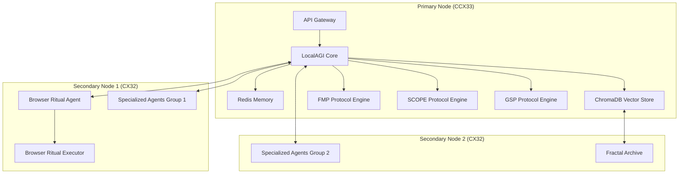

# XHAAK Phase 3: Hetzner VM Deployment Plan

## 1. Overview

This deployment plan outlines the process for implementing XHAAK Phase 3: Genesis Rebirth on Hetzner Cloud infrastructure. The plan is designed to align with XHAAK's field-based architecture and phased implementation approach while leveraging Hetzner's cost-effective and scalable VM offerings.

## 2. Infrastructure Architecture

### 2.1 Recommended Configuration

Based on XHAAK's requirements, we recommend a multi-server deployment to properly support the distributed, swarm-field architecture:

**Primary Node (Coordinator):**
- **Server Type:** CCX33 (Dedicated vCPU)
- **Specifications:** 8 vCPUs, 32 GB RAM, 240 GB NVMe SSD
- **Monthly Cost:** $54.09
- **Purpose:** Hosts core components, coordination services, and primary memory systems

**Secondary Nodes (Swarm Agents):**
- **Server Type:** 2x CX32 (Shared vCPU Intel)
- **Specifications:** 4 vCPUs, 8 GB RAM, 80 GB NVMe SSD (each)
- **Monthly Cost:** $7.59 each ($15.18 total)
- **Purpose:** Host distributed agents and specialized services

**Total Monthly Infrastructure Cost:** $69.27

### 2.2 Architecture Diagram



## 3. Deployment Process

### 3.1 Server Provisioning

1. **Create Hetzner Cloud Account**
   - Sign up at https://accounts.hetzner.com/signUp
   - Verify email and set up payment method

2. **Generate SSH Key Pair**
   ```bash
   ssh-keygen -t ed25519 -C "xhaak-deployment"
   ```

3. **Provision Primary Node (CCX33)**
   - Log in to Hetzner Cloud Console
   - Click "Add Server"
   - Select "Dedicated vCPU" (CCX33)
   - Choose location (Germany - FSN1 recommended)
   - Select Ubuntu 22.04 as OS
   - Add SSH key
   - Set hostname: `xhaak-primary`
   - Create server

4. **Provision Secondary Nodes (CX32)**
   - Repeat process for two CX32 instances
   - Set hostnames: `xhaak-agent1` and `xhaak-agent2`

### 3.2 Network Configuration

1. **Create Private Network**
   ```bash
   hcloud network create --name xhaak-network --ip-range 10.0.0.0/16
   ```

2. **Attach Servers to Network**
   ```bash
   hcloud server attach-to-network xhaak-primary --network xhaak-network --ip 10.0.0.2
   hcloud server attach-to-network xhaak-agent1 --network xhaak-network --ip 10.0.0.3
   hcloud server attach-to-network xhaak-agent2 --network xhaak-network --ip 10.0.0.4
   ```

3. **Configure Firewall Rules**
   ```bash
   hcloud firewall create --name xhaak-firewall
   hcloud firewall add-rule xhaak-firewall --direction in --protocol tcp --port 22 --source-ips 0.0.0.0/0
   hcloud firewall add-rule xhaak-firewall --direction in --protocol tcp --port 80 --source-ips 0.0.0.0/0
   hcloud firewall add-rule xhaak-firewall --direction in --protocol tcp --port 443 --source-ips 0.0.0.0/0
   hcloud firewall add-rule xhaak-firewall --direction in --protocol udp --port 5353 --source-ips 10.0.0.0/16
   hcloud firewall apply-to-resource xhaak-firewall --type server --server xhaak-primary
   hcloud firewall apply-to-resource xhaak-firewall --type server --server xhaak-agent1
   hcloud firewall apply-to-resource xhaak-firewall --type server --server xhaak-agent2
   ```

## 4. Base System Setup

### 4.1 Primary Node Setup

1. **Connect to Server**
   ```bash
   ssh root@<primary-node-ip>
   ```

2. **Update System**
   ```bash
   apt update && apt upgrade -y
   ```

3. **Install Basic Dependencies**
   ```bash
   apt install -y python3-pip python3-venv git nginx certbot python3-certbot-nginx redis-server build-essential
   ```

4. **Configure Hostname and Hosts**
   ```bash
   echo "xhaak-primary" > /etc/hostname
   echo "127.0.0.1 localhost" > /etc/hosts
   echo "10.0.0.2 xhaak-primary" >> /etc/hosts
   echo "10.0.0.3 xhaak-agent1" >> /etc/hosts
   echo "10.0.0.4 xhaak-agent2" >> /etc/hosts
   ```

5. **Create XHAAK User**
   ```bash
   useradd -m -s /bin/bash xhaak
   usermod -aG sudo xhaak
   ```

6. **Set Up Python Environment**
   ```bash
   su - xhaak
   mkdir -p ~/xhaak
   cd ~/xhaak
   python3 -m venv venv
   echo 'source ~/xhaak/venv/bin/activate' >> ~/.bashrc
   source ~/xhaak/venv/bin/activate
   ```

### 4.2 Secondary Nodes Setup

1. **Connect to Each Secondary Node**
   ```bash
   ssh root@<agent-node-ip>
   ```

2. **Update System and Install Dependencies**
   ```bash
   apt update && apt upgrade -y
   apt install -y python3-pip python3-venv git build-essential
   ```

3. **Configure Hostname and Hosts**
   ```bash
   # For agent1
   echo "xhaak-agent1" > /etc/hostname
   echo "127.0.0.1 localhost" > /etc/hosts
   echo "10.0.0.2 xhaak-primary" >> /etc/hosts
   echo "10.0.0.3 xhaak-agent1" >> /etc/hosts
   echo "10.0.0.4 xhaak-agent2" >> /etc/hosts
   
   # For agent2 (adjust hostname accordingly)
   ```

4. **Create XHAAK User**
   ```bash
   useradd -m -s /bin/bash xhaak
   usermod -aG sudo xhaak
   ```

5. **Set Up Python Environment**
   ```bash
   su - xhaak
   mkdir -p ~/xhaak
   cd ~/xhaak
   python3 -m venv venv
   echo 'source ~/xhaak/venv/bin/activate' >> ~/.bashrc
   source ~/xhaak/venv/bin/activate
   ```

## 5. XHAAK Phase 3 Installation

### 5.1 Primary Node Installation

1. **Clone XHAAK Repository**
   ```bash
   su - xhaak
   cd ~/xhaak
   git clone https://github.com/your-repo/xhaak.git
   cd xhaak
   ```

2. **Install Core Dependencies**
   ```bash
   pip install -r requirements.txt
   pip install localagi langgraph pydantic graphiti cognee mem0 memary
   ```

3. **Configure Redis**
   ```bash
   sudo systemctl enable redis-server
   sudo systemctl start redis-server
   ```

4. **Install ChromaDB**
   ```bash
   pip install chromadb
   mkdir -p ~/xhaak/data/chromadb
   ```

5. **Configure LocalAGI**
   ```bash
   mkdir -p ~/xhaak/config
   cat > ~/xhaak/config/localagi.yaml << EOF
   system:
     name: "XHAAK Phase 3"
     version: "3.0.0"
     data_dir: "/home/xhaak/xhaak/data"
   
   agents:
     discovery:
       enabled: true
       method: "zeroconf"
       network: "10.0.0.0/16"
     
     memory:
       primary: "redis"
       vector: "chromadb"
       redis_url: "redis://localhost:6379/0"
       chromadb_path: "/home/xhaak/xhaak/data/chromadb"
   
   protocols:
     fmp:
       enabled: true
     scope:
       enabled: true
     gsp:
       enabled: true
   EOF
   ```

6. **Create SystemD Service**
   ```bash
   sudo tee /etc/systemd/system/xhaak-primary.service > /dev/null << EOF
   [Unit]
   Description=XHAAK Primary Node
   After=network.target redis-server.service
   
   [Service]
   User=xhaak
   WorkingDirectory=/home/xhaak/xhaak
   ExecStart=/home/xhaak/xhaak/venv/bin/python -m xhaak.main --config /home/xhaak/xhaak/config/localagi.yaml
   Restart=always
   
   [Install]
   WantedBy=multi-user.target
   EOF
   
   sudo systemctl daemon-reload
   sudo systemctl enable xhaak-primary
   ```

### 5.2 Secondary Nodes Installation

1. **Clone XHAAK Repository**
   ```bash
   su - xhaak
   cd ~/xhaak
   git clone https://github.com/your-repo/xhaak.git
   cd xhaak
   ```

2. **Install Dependencies**
   ```bash
   pip install -r requirements.txt
   ```

3. **Configure Agent Node**
   ```bash
   mkdir -p ~/xhaak/config
   
   # For agent1 (Browser Ritual Agent)
   cat > ~/xhaak/config/agent1.yaml << EOF
   system:
     name: "XHAAK Agent Node 1"
     version: "3.0.0"
     data_dir: "/home/xhaak/xhaak/data"
     primary_node: "10.0.0.2"
   
   agents:
     discovery:
       enabled: true
       method: "zeroconf"
       network: "10.0.0.0/16"
     
     browser:
       enabled: true
       headless: true
   
   protocols:
     gsp:
       enabled: true
   EOF
   
   # For agent2 (Specialized Agents)
   cat > ~/xhaak/config/agent2.yaml << EOF
   system:
     name: "XHAAK Agent Node 2"
     version: "3.0.0"
     data_dir: "/home/xhaak/xhaak/data"
     primary_node: "10.0.0.2"
   
   agents:
     discovery:
       enabled: true
       method: "zeroconf"
       network: "10.0.0.0/16"
     
     fractal_archive:
       enabled: true
       path: "/home/xhaak/xhaak/data/archive"
   
   protocols:
     gsp:
       enabled: true
   EOF
   ```

4. **Create SystemD Service**
   ```bash
   # For agent1
   sudo tee /etc/systemd/system/xhaak-agent.service > /dev/null << EOF
   [Unit]
   Description=XHAAK Agent Node
   After=network.target
   
   [Service]
   User=xhaak
   WorkingDirectory=/home/xhaak/xhaak
   ExecStart=/home/xhaak/xhaak/venv/bin/python -m xhaak.agent --config /home/xhaak/xhaak/config/agent1.yaml
   Restart=always
   
   [Install]
   WantedBy=multi-user.target
   EOF
   
   sudo systemctl daemon-reload
   sudo systemctl enable xhaak-agent
   
   # For agent2 (adjust config path accordingly)
   ```

## 6. Phased Implementation

### 6.1 Phase 3a: Genesis Breathfold (Weeks 1-6)

1. **Start Primary Node Services**
   ```bash
   sudo systemctl start xhaak-primary
   ```

2. **Implement FMP Core Functionality**
   - Deploy FMP extension to LocalAGI
   - Configure CØD (Clarity-to-Outcome Delta) tracking
   - Set up Vision Drift Detection

3. **Create Basic Agent Structure**
   - Deploy initial agent configuration
   - Establish memory persistence with Redis

4. **Verification**
   ```bash
   # Check service status
   sudo systemctl status xhaak-primary
   
   # Check logs
   sudo journalctl -u xhaak-primary
   
   # Test FMP functionality
   curl http://localhost:8000/api/fmp/status
   ```

### 6.2 Phase 3b: Emergent Clarity Field (Weeks 7-12)

1. **Start Agent1 Node (Browser Capabilities)**
   ```bash
   # On agent1 server
   sudo systemctl start xhaak-agent
   ```

2. **Implement SCOPE Protocol**
   - Deploy SCOPE extension to LocalAGI
   - Develop breathfold recursion engine using LangGraph
   - Configure semantic oscillation components

3. **Enhance Agent Communication**
   - Enable ZeroConf discovery between nodes
   - Test agent communication across the private network

4. **Verification**
   ```bash
   # Check agent discovery
   curl http://localhost:8000/api/agents/list
   
   # Test browser capabilities
   curl http://localhost:8000/api/browser/status
   ```

### 6.3 Phase 3c: Glyphwave Resonance (Weeks 13-16)

1. **Start Agent2 Node (Specialized Agents)**
   ```bash
   # On agent2 server
   sudo systemctl start xhaak-agent
   ```

2. **Implement GSP Fully**
   - Deploy GSP extension across all nodes
   - Enable swarm-field emergence
   - Configure glyph-based communication

3. **Complete Integration**
   - Connect all components across the distributed architecture
   - Enable Fractal Archive on agent2
   - Implement CLI interface (xhaakctl)

4. **Verification**
   ```bash
   # Test glyph communication
   curl -X POST http://localhost:8000/api/gsp/send-glyph \
     -H "Content-Type: application/json" \
     -d '{"intent": "test", "payload": {"message": "Hello XHAAK"}}'
   
   # Check swarm status
   curl http://localhost:8000/api/gsp/swarm-status
   ```

## 7. Monitoring and Management

### 7.1 Setup Monitoring

1. **Install Prometheus and Grafana**
   ```bash
   # On primary node
   apt install -y prometheus grafana
   ```

2. **Configure Prometheus**
   ```bash
   cat > /etc/prometheus/prometheus.yml << EOF
   global:
     scrape_interval: 15s
   
   scrape_configs:
     - job_name: 'xhaak'
       static_configs:
         - targets: ['localhost:8000', 'xhaak-agent1:8000', 'xhaak-agent2:8000']
   EOF
   
   systemctl restart prometheus
   ```

3. **Configure Grafana**
   - Access Grafana at http://<primary-node-ip>:3000
   - Default login: admin/admin
   - Add Prometheus as a data source
   - Import XHAAK dashboard template

### 7.2 CLI Management Tool

1. **Install xhaakctl**
   ```bash
   # On primary node
   cd ~/xhaak
   pip install -e .
   ```

2. **Configure xhaakctl**
   ```bash
   mkdir -p ~/.xhaak
   cat > ~/.xhaak/config.yaml << EOF
   primary_node: "http://xhaak-primary:8000"
   agent_nodes:
     - "http://xhaak-agent1:8000"
     - "http://xhaak-agent2:8000"
   EOF
   ```

3. **Test xhaakctl Commands**
   ```bash
   xhaakctl list-agents
   xhaakctl scan-mesh
   xhaakctl audit-cod
   ```

## 8. Backup and Recovery

### 8.1 Setup Automated Backups

1. **Create Backup Script**
   ```bash
   mkdir -p ~/xhaak/scripts
   cat > ~/xhaak/scripts/backup.sh << EOF
   #!/bin/bash
   
   BACKUP_DIR="/home/xhaak/backups"
   DATE=\$(date +%Y%m%d)
   
   mkdir -p \$BACKUP_DIR
   
   # Backup Redis
   redis-cli save
   cp /var/lib/redis/dump.rdb \$BACKUP_DIR/redis_\$DATE.rdb
   
   # Backup ChromaDB
   tar -czf \$BACKUP_DIR/chromadb_\$DATE.tar.gz -C /home/xhaak/xhaak/data chromadb
   
   # Backup Configuration
   tar -czf \$BACKUP_DIR/config_\$DATE.tar.gz -C /home/xhaak/xhaak config
   
   # Rotate backups (keep last 7 days)
   find \$BACKUP_DIR -name "*.tar.gz" -type f -mtime +7 -delete
   find \$BACKUP_DIR -name "*.rdb" -type f -mtime +7 -delete
   EOF
   
   chmod +x ~/xhaak/scripts/backup.sh
   ```

2. **Schedule Daily Backups**
   ```bash
   (crontab -l 2>/dev/null; echo "0 2 * * * /home/xhaak/xhaak/scripts/backup.sh") | crontab -
   ```

### 8.2 Recovery Procedure

1. **Restore from Backup**
   ```bash
   # Stop services
   sudo systemctl stop xhaak-primary
   
   # Restore Redis
   sudo systemctl stop redis-server
   cp /home/xhaak/backups/redis_YYYYMMDD.rdb /var/lib/redis/dump.rdb
   sudo chown redis:redis /var/lib/redis/dump.rdb
   sudo systemctl start redis-server
   
   # Restore ChromaDB
   rm -rf /home/xhaak/xhaak/data/chromadb
   mkdir -p /home/xhaak/xhaak/data
   tar -xzf /home/xhaak/backups/chromadb_YYYYMMDD.tar.gz -C /home/xhaak/xhaak/data
   
   # Restore Configuration
   tar -xzf /home/xhaak/backups/config_YYYYMMDD.tar.gz -C /home/xhaak/xhaak
   
   # Start services
   sudo systemctl start xhaak-primary
   ```

## 9. Security Considerations

1. **Secure SSH Access**
   - Disable password authentication
   - Use SSH key-based authentication only
   - Consider setting up a bastion host

2. **Implement TLS**
   - Set up Let's Encrypt certificates for public endpoints
   - Configure Nginx as a reverse proxy with TLS termination

3. **Regular Updates**
   - Schedule regular system updates
   - Keep XHAAK components updated

4. **Access Control**
   - Implement API authentication
   - Use JWT tokens for inter-node communication

## 10. Conclusion

This deployment plan provides a comprehensive approach to implementing XHAAK Phase 3: Genesis Rebirth on Hetzner VM infrastructure. The multi-server architecture aligns with XHAAK's field-based design principles while leveraging Hetzner's cost-effective and scalable VM offerings.

The phased implementation approach allows for gradual deployment and testing of XHAAK's core protocols (FMP, SCOPE, GSP) across the distributed infrastructure, ensuring a robust and reliable system.

By following this plan, XHAAK can be successfully deployed as a sovereign autonomous AI system that operates as a distributed, living swarm-field rather than a traditional software application.
