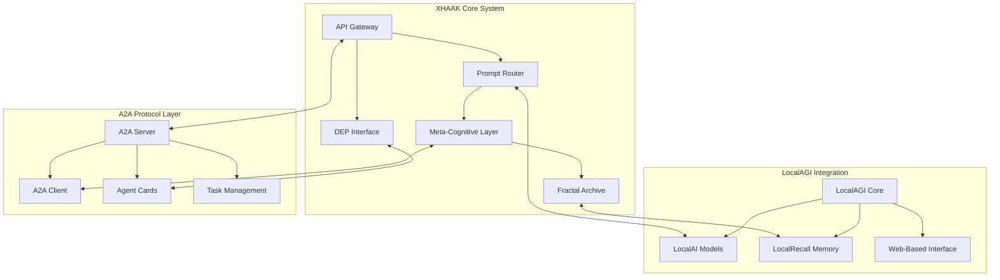

# XHAAK Phase 3 Implementation Strategy: Integrating LocalAGI and Google's A2A Protocol

## Executive Summary

This document outlines a comprehensive strategy for implementing Phase 3 of the XHAAK system by integrating LocalAGI and Google's Agent-to-Agent (A2A) protocol. The integration leverages the strengths of both technologies to enhance XHAAK's decentralized cognitive agent framework, enabling more sophisticated multi-agent coordination, improved memory management, and standardized agent communication.

## Integration Architecture Overview



## Integration Strategy

### 1. LocalAGI Integration Components

LocalAGI provides several key components that will enhance XHAAK's capabilities:

1. **LocalAI Model Integration**
   - Integrate LocalAI's model inferencing capabilities with XHAAK's Prompt Router
   - Leverage LocalAI's support for multiple hardware configurations (CPU, NVIDIA GPU, Intel GPU)
   - Implement model switching based on task requirements

2. **LocalRecall Memory System**
   - Connect LocalRecall with XHAAK's Fractal Archive for enhanced memory management
   - Implement persistent memory storage for agent interactions
   - Enable knowledge base management for dialectical reasoning

3. **Web-Based Agent Management Interface**
   - Integrate LocalAGI's no-code agent configuration interface
   - Implement agent teaming capabilities for complex dialectical reasoning tasks
   - Create monitoring dashboards for system performance

### 2. Google A2A Protocol Integration

The A2A protocol provides standardized communication between agents, which will be implemented as follows:

1. **Agent Card Implementation**
   - Create Agent Cards for each XHAAK component (/.well-known/agent.json)
   - Define capabilities, skills, and authentication requirements
   - Enable dynamic agent discovery

2. **A2A Server Implementation**
   - Implement A2A protocol methods in the API Gateway
   - Support task management lifecycle (submission, processing, completion)
   - Enable streaming capabilities for long-running dialectical reasoning tasks

3. **A2A Client Implementation**
   - Implement A2A client capabilities in the Meta-Cognitive Layer
   - Enable communication with external A2A-compatible agents
   - Support multi-modal message exchange (text, structured data, files)

4. **Task Management System**
   - Implement task state management (submitted, working, input-required, completed, failed, canceled)
   - Create message handling for agent communication
   - Support artifact generation and management

## Implementation Phases

### Phase 3.1: Foundation Layer (Weeks 1-3)

1. **Environment Setup**
   - Configure development environment for LocalAGI and A2A integration
   - Set up testing infrastructure for component validation
   - Establish CI/CD pipeline for continuous integration

2. **Core Integration Components**
   - Implement LocalAI model integration with Prompt Router
   - Create A2A Server implementation in API Gateway
   - Develop Agent Card definitions for XHAAK components

3. **Communication Protocol Adaptation**
   - Adapt XHAAK's existing communication to A2A protocol standards
   - Implement message transformation between DEP and A2A formats
   - Create protocol bridges for backward compatibility

### Phase 3.2: Memory and Reasoning Enhancement (Weeks 4-6)

1. **LocalRecall Integration**
   - Connect LocalRecall with Fractal Archive
   - Implement memory persistence mechanisms
   - Create memory retrieval optimization for dialectical reasoning

2. **Enhanced Reasoning Capabilities**
   - Implement multi-agent dialectical reasoning using LocalAGI's agent teaming
   - Create reasoning pipelines with A2A task management
   - Develop specialized reasoning agents for different domains

3. **Knowledge Management System**
   - Implement knowledge base integration with LocalRecall
   - Create knowledge extraction and indexing mechanisms
   - Develop knowledge validation through dialectical processes

### Phase 3.3: Interface and Monitoring (Weeks 7-9)

1. **Web Interface Integration**
   - Implement LocalAGI's web-based agent management interface
   - Create custom XHAAK-specific management views
   - Develop agent configuration and monitoring dashboards

2. **Monitoring and Telemetry**
   - Implement comprehensive monitoring for all integrated components
   - Create performance dashboards for system health
   - Develop alerting mechanisms for system issues

3. **Security Implementation**
   - Implement authentication and authorization for all components
   - Create secure communication channels between systems
   - Develop audit logging for all agent interactions

### Phase 3.4: Testing and Optimization (Weeks 10-12)

1. **Integration Testing**
   - Develop comprehensive test suite for all integrated components
   - Create automated testing for agent communication
   - Implement performance testing for system scalability

2. **Performance Optimization**
   - Identify and resolve performance bottlenecks
   - Optimize memory usage and retrieval mechanisms
   - Enhance reasoning pipeline efficiency

3. **Documentation and Knowledge Transfer**
   - Create comprehensive documentation for all integrated components
   - Develop user guides for system administration
   - Create developer documentation for future enhancements

## Technical Implementation Details

### LocalAI Integration

```python
# Example: Integrating LocalAI with XHAAK Prompt Router
from xhaak.prompt_router import PromptRouter
import requests

class LocalAIModelRouter(PromptRouter):
    def __init__(self, localai_endpoint="http://localhost:8080/v1"):
        super().__init__()
        self.localai_endpoint = localai_endpoint
        
    def route_prompt(self, prompt, context, model_preferences=None):
        # Determine appropriate model based on task
        model_name = self._select_model(prompt, context, model_preferences)
        
        # Call LocalAI endpoint
        response = requests.post(
            f"{self.localai_endpoint}/completions",
            json={
                "model": model_name,
                "prompt": prompt,
                "max_tokens": 2048,
                "temperature": 0.7
            }
        )
        
        return response.json()["choices"][0]["text"]
    
    def _select_model(self, prompt, context, model_preferences):
        # Logic to select appropriate model based on task requirements
        if "visual" in context.get("capabilities", []):
            return "flux.1-dev"  # Image model
        elif "reasoning" in context.get("capabilities", []):
            return "deepseek-chat-v3-0324"  # Reasoning model
        else:
            return "arcee-agent"  # Default text model
```

### A2A Protocol Implementation

```python
# Example: Implementing A2A Server in XHAAK API Gateway
from flask import Flask, request, jsonify
import uuid
import time

app = Flask(__name__)

# In-memory task storage (would be database in production)
tasks = {}

@app.route("/.well-known/agent.json", methods=["GET"])
def agent_card():
    return jsonify({
        "name": "XHAAK Dialectical Reasoning Agent",
        "description": "A decentralized cognitive agent framework with dialectical reasoning capabilities",
        "version": "3.0.0",
        "endpoint": "https://api.xhaak.example/a2a",
        "capabilities": ["dialectical-reasoning", "memory-management", "multi-agent-coordination"],
        "skills": [
            {
                "name": "dialectical-synthesis",
                "description": "Synthesize multiple perspectives into a coherent view"
            },
            {
                "name": "memory-reflection",
                "description": "Reflect on past interactions and extract insights"
            }
        ],
        "authentication": {
            "type": "bearer"
        }
    })

@app.route("/a2a/tasks/send", methods=["POST"])
def tasks_send():
    data = request.json
    task_id = data.get("taskId", str(uuid.uuid4()))
    
    # Create new task if it doesn't exist
    if task_id not in tasks:
        tasks[task_id] = {
            "taskId": task_id,
            "status": "submitted",
            "messages": [],
            "artifacts": [],
            "createdAt": time.time(),
            "updatedAt": time.time()
        }
    
    # Add message to task
    if "message" in data:
        tasks[task_id]["messages"].append(data["message"])
        tasks[task_id]["status"] = "working"
        tasks[task_id]["updatedAt"] = time.time()
    
    # Process task (would be async in production)
    process_task(task_id)
    
    return jsonify(tasks[task_id])

def process_task(task_id):
    # This would call the XHAAK dialectical reasoning pipeline
    # For now, just simulate processing
    task = tasks[task_id]
    
    # Update task status
    task["status"] = "completed"
    
    # Add agent response
    task["messages"].append({
        "role": "agent",
        "parts": [
            {
                "type": "text",
                "text": "This is a response from the XHAAK dialectical reasoning system."
            }
        ]
    })
    
    # Add artifact
    task["artifacts"].append({
        "artifactId": str(uuid.uuid4()),
        "parts": [
            {
                "type": "data",
                "data": {
                    "synthesis": {
                        "thesis": "Initial proposition",
                        "antithesis": "Counter proposition",
                        "synthesis": "Integrated perspective"
                    }
                }
            }
        ]
    })
    
    task["updatedAt"] = time.time()
```

### LocalRecall Integration

```python
# Example: Integrating LocalRecall with XHAAK Fractal Archive
from xhaak.fractal_archive import FractalArchive
import requests

class LocalRecallArchive(FractalArchive):
    def __init__(self, localrecall_endpoint="http://localhost:8000/api"):
        super().__init__()
        self.localrecall_endpoint = localrecall_endpoint
        
    def store_memory(self, memory_data, metadata=None):
        # Store memory in LocalRecall
        response = requests.post(
            f"{self.localrecall_endpoint}/memories",
            json={
                "content": memory_data,
                "metadata": metadata or {},
                "embedding": True  # Request automatic embedding
            }
        )
        
        memory_id = response.json()["id"]
        return self._create_memory_reference(memory_id)
    
    def retrieve_memory(self, query, limit=10):
        # Retrieve memories from LocalRecall
        response = requests.post(
            f"{self.localrecall_endpoint}/search",
            json={
                "query": query,
                "limit": limit,
                "min_score": 0.7
            }
        )
        
        return response.json()["results"]
    
    def _create_memory_reference(self, memory_id):
        # Create a reference to the memory in the Fractal Archive
        return f"localrecall://{memory_id}"
```

## Integration Challenges and Mitigations

| Challenge | Description | Mitigation Strategy |
|-----------|-------------|---------------------|
| Protocol Compatibility | Differences between XHAAK's DEP and A2A protocol | Create protocol adapters to translate between formats |
| Memory System Integration | Different memory models between XHAAK and LocalRecall | Implement abstraction layer with consistent API |
| Performance Overhead | Additional processing for protocol translation | Optimize critical paths and implement caching |
| Authentication Mechanisms | Different auth systems across components | Implement unified auth service with delegation |
| Deployment Complexity | Multiple components with different requirements | Use containerization with orchestration |
| Versioning and Updates | Managing updates across integrated systems | Implement semantic versioning and compatibility testing |

## Success Metrics

1. **Integration Completeness**
   - 100% of planned integration points implemented
   - All components communicating through standardized protocols
   - Complete test coverage for integration points

2. **Performance Metrics**
   - Response time < 500ms for standard queries
   - Throughput of 100+ queries per minute
   - Memory retrieval latency < 200ms

3. **Functional Capabilities**
   - Successful multi-agent dialectical reasoning
   - Effective memory persistence and retrieval
   - Seamless communication with external A2A agents

4. **User Experience**
   - Intuitive web interface for agent management
   - Comprehensive monitoring dashboards
   - Clear documentation for all components

## Conclusion

The integration of LocalAGI and Google's A2A protocol with XHAAK creates a powerful, flexible, and standardized system for decentralized cognitive agents. This implementation strategy provides a clear roadmap for Phase 3, leveraging the strengths of each technology while maintaining alignment with XHAAK's core principles of dialectical reasoning, decentralized architecture, and emergent intelligence.

By following this implementation plan, XHAAK will evolve into a more capable, interoperable, and robust system that can communicate with a wider ecosystem of AI agents while maintaining its unique dialectical reasoning capabilities.
