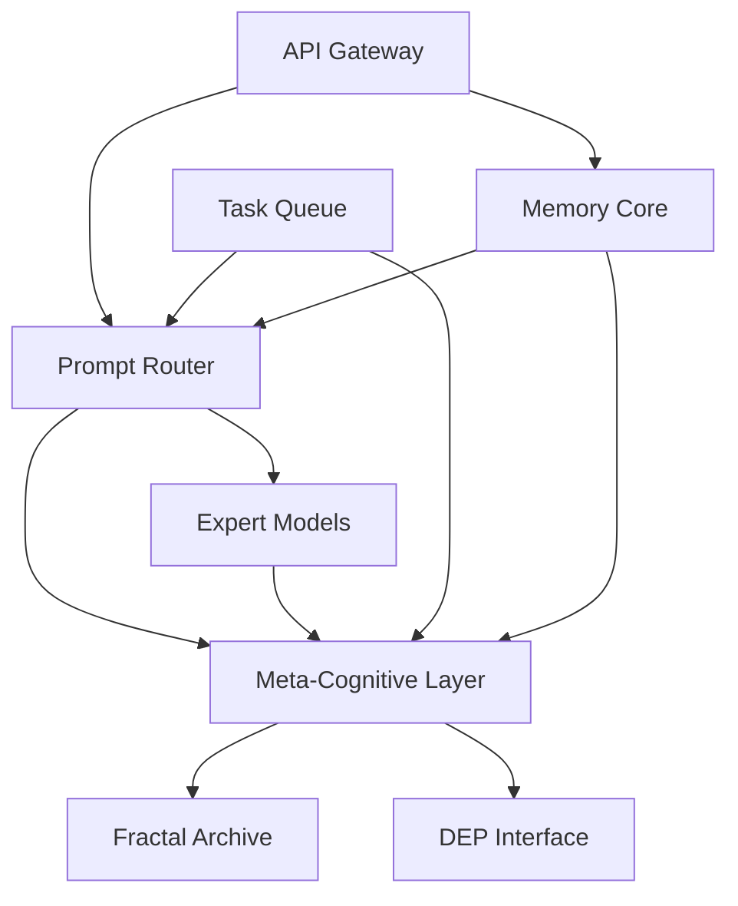
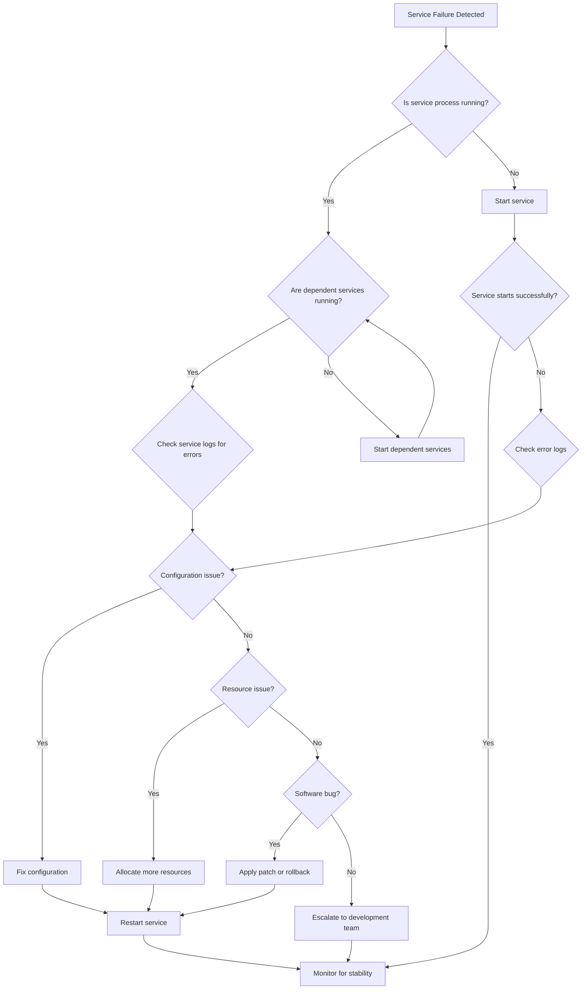
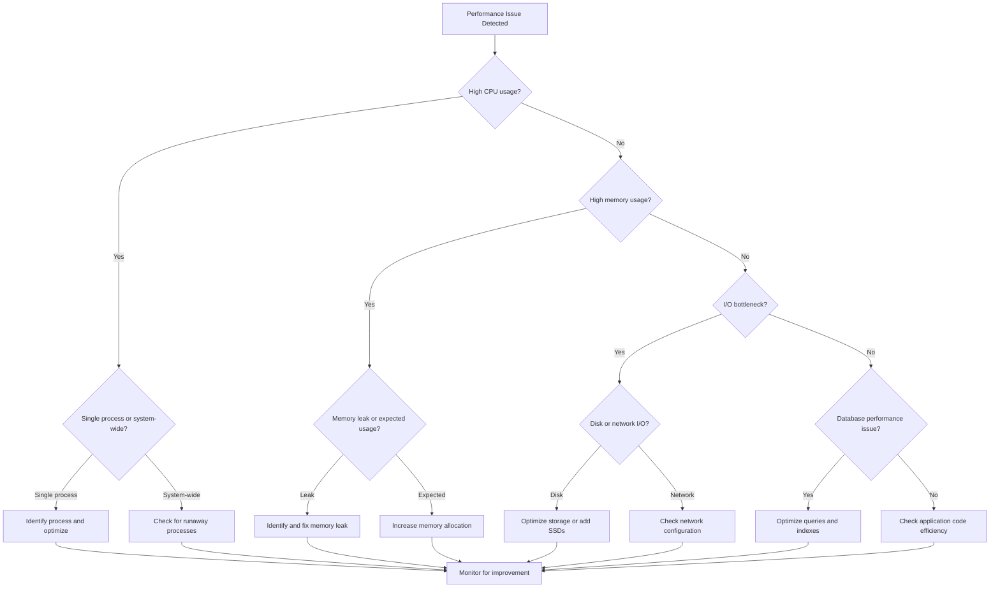

# XHAAK System Maintenance and Administration Guide

## Introduction

This document provides comprehensive guidance for maintaining and administering the XHAAK system (formerly Cerebus). It covers routine maintenance procedures, troubleshooting common issues, monitoring system health, and implementing updates. This guide is intended for system administrators and technical personnel responsible for the ongoing operation of the XHAAK system.

## System Architecture Overview

The XHAAK system is a sophisticated AI platform built on a Mixture-of-Experts (MoE) architecture that implements dialectical reasoning capabilities. The system consists of the following core components:



### Core Components

1. **API Gateway**: Entry point for all requests, handles authentication, rate limiting, and request routing
2. **Prompt Router**: MoE-based router that directs queries to appropriate expert models
3. **Memory Core**: Vector database using ChromaDB for storing and retrieving contextual information
4. **Meta-Cognitive Layer**: Handles reflection, synthesis, and strategy evolution
5. **Expert Models**: Specialized AI models for different tasks (dialectical reasoning, vision, coding, etc.)
6. **DEP Interface**: Dual Expression Protocol translator for consistent communication
7. **Fractal Archive**: Memory snapshot system for long-term storage
8. **Task Queue**: Asynchronous task management with Redis

## Routine Maintenance Procedures

### Daily Maintenance Tasks

| Task | Description | Command/Procedure |
|------|-------------|-------------------|
| Check System Status | Verify all services are running | `systemctl status xhaak-*` |
| Monitor Resource Usage | Check CPU, memory, and disk usage | `htop`, `df -h` |
| Review Error Logs | Check for errors in system logs | `journalctl -u xhaak-* --since "24 hours ago" \| grep -i error` |
| Backup Verification | Verify daily backups completed successfully | `cat /var/log/xhaak/backup.log` |

### Weekly Maintenance Tasks

| Task | Description | Command/Procedure |
|------|-------------|-------------------|
| Database Optimization | Optimize ChromaDB performance | `/opt/xhaak/scripts/optimize_db.sh` |
| Security Updates | Apply security patches | `apt update && apt upgrade -y` |
| Log Rotation | Ensure logs are properly rotated | `logrotate -f /etc/logrotate.d/xhaak` |
| Performance Analysis | Review performance metrics | Access Grafana dashboard at `https://<server-ip>/grafana` |

### Monthly Maintenance Tasks

| Task | Description | Command/Procedure |
|------|-------------|-------------------|
| Full System Backup | Create complete system backup | `/opt/xhaak/scripts/full_backup.sh` |
| Certificate Renewal | Check and renew SSL certificates | `certbot renew` |
| Security Audit | Perform security vulnerability scan | `nmap -sV --script vuln <server-ip>` |
| Model Performance Review | Analyze model performance metrics | Access analytics dashboard at `https://<server-ip>/analytics` |

## Monitoring System Health

### Key Metrics to Monitor

1. **System Metrics**
   - CPU usage (target: <80% sustained)
   - Memory usage (target: <90% sustained)
   - Disk usage (target: <85% capacity)
   - Network throughput

2. **Application Metrics**
   - Request latency (target: <500ms average)
   - Request throughput
   - Error rate (target: <1%)
   - Queue length (target: <100 pending requests)

3. **Model Metrics**
   - Inference time (target: <2s average)
   - Token generation rate
   - Expert utilization balance
   - Reasoning quality scores

### Monitoring Tools

The XHAAK system uses the following monitoring tools:

1. **Prometheus**: Collects and stores metrics
   - Access: `https://<server-ip>:9090`
   - Configuration: `/etc/prometheus/prometheus.yml`

2. **Grafana**: Visualizes metrics and provides dashboards
   - Access: `https://<server-ip>/grafana`
   - Default dashboards:
     - System Overview
     - Service Performance
     - Model Performance
     - Error Analysis

3. **Alertmanager**: Manages alerts and notifications
   - Access: `https://<server-ip>:9093`
   - Configuration: `/etc/alertmanager/alertmanager.yml`

### Alert Configuration

Alerts are configured to notify administrators of potential issues before they impact system performance. Key alert thresholds include:

| Metric | Warning Threshold | Critical Threshold | Action |
|--------|-------------------|-------------------|--------|
| CPU Usage | >70% for 5 minutes | >85% for 5 minutes | Investigate high CPU processes |
| Memory Usage | >80% for 5 minutes | >90% for 5 minutes | Check for memory leaks |
| Disk Usage | >75% | >90% | Clean up unnecessary files or expand storage |
| Service Down | Any service down | Multiple services down | Restart services or investigate system issues |
| Error Rate | >0.5% for 15 minutes | >2% for 5 minutes | Check logs for error patterns |
| Request Latency | >1s average for 10 minutes | >3s average for 5 minutes | Investigate performance bottlenecks |

## Troubleshooting Common Issues

### Service Failures

#### API Gateway Issues

| Issue | Possible Causes | Resolution Steps |
|-------|----------------|------------------|
| Gateway not responding | Service crashed, network issue | 1. Check service status: `systemctl status xhaak-api-gateway`<br>2. Restart service: `systemctl restart xhaak-api-gateway`<br>3. Check logs: `journalctl -u xhaak-api-gateway -n 100` |
| 502 Bad Gateway errors | Upstream service failure | 1. Verify all backend services are running<br>2. Check Nginx configuration: `/etc/nginx/sites-enabled/xhaak.conf`<br>3. Restart Nginx: `systemctl restart nginx` |
| Slow response times | High load, resource contention | 1. Check system resources with `htop`<br>2. Review request patterns in logs<br>3. Consider scaling resources if consistent |

#### Prompt Router Issues

| Issue | Possible Causes | Resolution Steps |
|-------|----------------|------------------|
| Routing failures | Model configuration issue, service crash | 1. Check service status: `systemctl status xhaak-prompt-router`<br>2. Verify model configuration: `/opt/xhaak/config/models.json`<br>3. Restart service: `systemctl restart xhaak-prompt-router` |
| Uneven expert utilization | Router imbalance, expert capacity issues | 1. Check expert utilization metrics in Grafana<br>2. Adjust capacity factors in `/opt/xhaak/config/router.json`<br>3. Restart router service |
| High latency | Complex routing decisions, resource constraints | 1. Check CPU and memory usage<br>2. Optimize router configuration<br>3. Consider scaling up resources |

#### Expert Model Issues

| Issue | Possible Causes | Resolution Steps |
|-------|----------------|------------------|
| Model loading failures | Memory issues, corrupted model files | 1. Check available memory: `free -h`<br>2. Verify model files integrity<br>3. Restart service: `systemctl restart xhaak-expert-<name>` |
| Poor model performance | Model degradation, configuration issues | 1. Review model performance metrics<br>2. Check model configuration<br>3. Consider model redeployment |
| Model timeout errors | Resource constraints, complex queries | 1. Adjust timeout settings in `/opt/xhaak/config/models.json`<br>2. Optimize query processing<br>3. Scale up resources if necessary |

### Database Issues

| Issue | Possible Causes | Resolution Steps |
|-------|----------------|------------------|
| ChromaDB connection failures | Service down, network issues | 1. Check service status: `systemctl status xhaak-chromadb`<br>2. Verify network connectivity<br>3. Restart service: `systemctl restart xhaak-chromadb` |
| Slow query performance | Index fragmentation, large dataset | 1. Run database optimization: `/opt/xhaak/scripts/optimize_db.sh`<br>2. Check index health<br>3. Consider database scaling |
| Data inconsistency | Replication issues, failed writes | 1. Check database logs: `/var/log/xhaak/chromadb.log`<br>2. Verify data integrity<br>3. Restore from backup if necessary |

### Network Issues

| Issue | Possible Causes | Resolution Steps |
|-------|----------------|------------------|
| Connection timeouts | Firewall issues, network congestion | 1. Check firewall rules: `ufw status`<br>2. Verify network connectivity: `ping`, `traceroute`<br>3. Check for network bottlenecks |
| SSL certificate errors | Expired certificates, misconfiguration | 1. Check certificate status: `certbot certificates`<br>2. Renew if needed: `certbot renew`<br>3. Verify Nginx SSL configuration |
| DNS resolution failures | DNS misconfiguration, provider issues | 1. Check DNS settings: `cat /etc/resolv.conf`<br>2. Test resolution: `nslookup <domain>`<br>3. Update DNS configuration if needed |

## System Updates and Upgrades

### Update Types

1. **Security Updates**: Critical security patches that should be applied immediately
2. **Bug Fix Updates**: Corrections to system issues that should be applied during maintenance windows
3. **Feature Updates**: New functionality that should be thoroughly tested before deployment
4. **Model Updates**: Updates to AI models that may affect system behavior

### Update Procedure

Follow these steps when applying updates to the XHAAK system:

1. **Pre-Update Checklist**
   - Create a full system backup: `/opt/xhaak/scripts/full_backup.sh`
   - Verify all services are running normally
   - Schedule maintenance window if needed
   - Notify relevant stakeholders

2. **Update Process**
   - Download updates to staging area: `/opt/xhaak/scripts/download_updates.sh`
   - Verify update integrity: `/opt/xhaak/scripts/verify_updates.sh`
   - Apply updates: `/opt/xhaak/scripts/apply_updates.sh`
   - Restart affected services

3. **Post-Update Verification**
   - Verify all services are running: `systemctl status xhaak-*`
   - Run system tests: `/opt/xhaak/scripts/run_tests.sh`
   - Monitor system performance for 24 hours
   - Document update results

### Rollback Procedure

If issues are detected after an update, follow these steps to roll back:

1. Stop affected services: `systemctl stop xhaak-<service>`
2. Execute rollback script: `/opt/xhaak/scripts/rollback.sh <update-id>`
3. Restart services: `systemctl start xhaak-<service>`
4. Verify system functionality
5. Document rollback and issues encountered

## Backup and Recovery

### Backup Strategy

The XHAAK system employs a comprehensive backup strategy:

1. **Daily Incremental Backups**
   - Schedule: Daily at 2:00 AM UTC
   - Retention: 14 days
   - Location: `/var/backups/xhaak/daily/`

2. **Weekly Full Backups**
   - Schedule: Sundays at 3:00 AM UTC
   - Retention: 8 weeks
   - Location: `/var/backups/xhaak/weekly/`

3. **Monthly Archive Backups**
   - Schedule: 1st of each month at 4:00 AM UTC
   - Retention: 12 months
   - Location: `/var/backups/xhaak/monthly/`

4. **External Backups**
   - Schedule: Weekly transfer to offsite storage
   - Retention: 6 months
   - Location: Secure cloud storage

### Backup Components

The following components are included in backups:

1. **Database**
   - ChromaDB data
   - Redis data
   - Configuration files

2. **Model Files**
   - Expert model weights
   - Model configuration files
   - Fine-tuning data

3. **System Configuration**
   - Service configuration files
   - Nginx configuration
   - SSL certificates
   - System settings

4. **Logs and Metrics**
   - System logs
   - Application logs
   - Performance metrics

### Recovery Procedures

#### Full System Recovery

In case of catastrophic failure, follow these steps to recover the entire system:

1. Provision a new server with the same specifications
2. Install base operating system (Ubuntu 22.04)
3. Install XHAAK dependencies: `/opt/xhaak/scripts/install_dependencies.sh`
4. Restore system configuration: `/opt/xhaak/scripts/restore_config.sh <backup-date>`
5. Restore database: `/opt/xhaak/scripts/restore_db.sh <backup-date>`
6. Restore model files: `/opt/xhaak/scripts/restore_models.sh <backup-date>`
7. Start all services: `systemctl start xhaak-*`
8. Verify system functionality: `/opt/xhaak/scripts/verify_system.sh`

#### Partial Recovery

For recovery of specific components:

1. **Database Recovery**
   ```bash
   systemctl stop xhaak-memory-core
   /opt/xhaak/scripts/restore_db.sh <backup-date>
   systemctl start xhaak-memory-core
   ```

2. **Configuration Recovery**
   ```bash
   /opt/xhaak/scripts/restore_config.sh <backup-date>
   systemctl restart xhaak-*
   ```

3. **Model Recovery**
   ```bash
   systemctl stop xhaak-prompt-router
   /opt/xhaak/scripts/restore_models.sh <backup-date>
   systemctl start xhaak-prompt-router
   ```

## Security Maintenance

### Security Best Practices

1. **Access Control**
   - Use SSH key authentication only (disable password authentication)
   - Implement multi-factor authentication for administrative access
   - Follow principle of least privilege for all accounts
   - Regularly audit user accounts and permissions

2. **Network Security**
   - Maintain restrictive firewall rules (allow only necessary ports)
   - Use VPN for administrative access
   - Implement rate limiting to prevent DoS attacks
   - Regularly scan for open ports and vulnerabilities

3. **Data Protection**
   - Encrypt sensitive data at rest and in transit
   - Implement proper data retention and deletion policies
   - Regularly audit data access patterns
   - Secure backup storage with encryption

4. **Update Management**
   - Apply security patches promptly
   - Maintain an inventory of all software and versions
   - Monitor security advisories for all components
   - Test security updates before applying to production

### Security Audit Procedure

Conduct monthly security audits following this procedure:

1. **System Scan**
   - Run vulnerability scan: `nmap -sV --script vuln <server-ip>`
   - Check for rootkits: `rkhunter --check`
   - Scan for malware: `clamscan -r /opt/xhaak/`

2. **Configuration Review**
   - Audit SSH configuration: `sshd -T | grep -E 'password|root|permit'`
   - Check firewall rules: `ufw status verbose`
   - Review service permissions: `find /opt/xhaak -type f -perm -4000`

3. **Log Analysis**
   - Check for unauthorized access attempts: `grep "Failed password" /var/log/auth.log`
   - Review sudo usage: `grep sudo /var/log/auth.log`
   - Analyze API access patterns for anomalies

4. **Compliance Verification**
   - Verify SSL certificate strength and expiration
   - Check password policy compliance
   - Ensure backup encryption is functioning
   - Verify data retention policies are enforced

## Performance Tuning

### System Optimization

1. **Operating System Tuning**
   - Adjust kernel parameters for high-performance networking:
     ```bash
     # Increase maximum number of open files
     echo "fs.file-max = 2097152" >> /etc/sysctl.conf
     # Increase TCP buffer sizes
     echo "net.ipv4.tcp_rmem = 4096 87380 16777216" >> /etc/sysctl.conf
     echo "net.ipv4.tcp_wmem = 4096 65536 16777216" >> /etc/sysctl.conf
     # Apply changes
     sysctl -p
     ```
   - Optimize I/O scheduler for SSD:
     ```bash
     echo "deadline" > /sys/block/sda/queue/scheduler
     ```

2. **Memory Management**
   - Configure swap space appropriately:
     ```bash
     # Set swappiness to reduce swap usage
     echo "vm.swappiness = 10" >> /etc/sysctl.conf
     sysctl -p
     ```
   - Adjust transparent huge pages for AI workloads:
     ```bash
     echo "always" > /sys/kernel/mm/transparent_hugepage/enabled
     ```

3. **Network Optimization**
   - Enable TCP BBR congestion control:
     ```bash
     echo "net.core.default_qdisc = fq" >> /etc/sysctl.conf
     echo "net.ipv4.tcp_congestion_control = bbr" >> /etc/sysctl.conf
     sysctl -p
     ```
   - Increase network buffer sizes:
     ```bash
     echo "net.core.rmem_max = 16777216" >> /etc/sysctl.conf
     echo "net.core.wmem_max = 16777216" >> /etc/sysctl.conf
     sysctl -p
     ```

### Application Optimization

1. **API Gateway Tuning**
   - Optimize Nginx configuration:
     ```nginx
     worker_processes auto;
     worker_rlimit_nofile 65535;
     events {
         worker_connections 16384;
         multi_accept on;
     }
     http {
         keepalive_timeout 65;
         keepalive_requests 100000;
         sendfile on;
         tcp_nopush on;
         tcp_nodelay on;
     }
     ```

2. **Database Optimization**
   - Optimize ChromaDB settings in `/opt/xhaak/config/chromadb.json`:
     ```json
     {
       "chroma_db_impl": "duckdb+parquet",
       "persist_directory": "/opt/xhaak/data/chromadb",
       "anonymized_telemetry": false,
       "allow_reset": false,
       "is_persistent": true
     }
     ```
   - Configure Redis for optimal performance in `/etc/redis/redis.conf`:
     ```
     maxmemory 4gb
     maxmemory-policy allkeys-lru
     appendonly yes
     appendfsync everysec
     ```

3. **Model Inference Optimization**
   - Enable model quantization where appropriate
   - Configure batch processing for high-throughput scenarios
   - Implement model caching for frequently used queries
   - Optimize tensor operations with hardware acceleration

## Scaling the System

### Vertical Scaling

To increase the capacity of the current server:

1. **CPU Scaling**
   - Upgrade to higher core count CPUs
   - Adjust process affinity for critical services:
     ```bash
     systemctl set-property xhaak-prompt-router.service CPUAffinity=0,2,4,6
     ```

2. **Memory Scaling**
   - Add additional RAM
   - Adjust memory limits for services:
     ```bash
     systemctl set-property xhaak-meta-cognitive.service MemoryLimit=8G
     ```

3. **Storage Scaling**
   - Add additional SSD storage
   - Implement storage tiering for different data types
   - Consider NVMe storage for database and model files

### Horizontal Scaling

For larger deployments, consider horizontal scaling:

1. **Load Balancing**
   - Implement Nginx load balancing across multiple API Gateway instances
   - Configure sticky sessions for consistent user experience
   - Implement health checks for automatic failover

2. **Service Replication**
   - Deploy multiple instances of stateless services
   - Configure service discovery using Consul or etcd
   - Implement circuit breakers for fault tolerance

3. **Database Sharding**
   - Implement database sharding for ChromaDB
   - Configure Redis cluster for distributed caching
   - Maintain data consistency across shards

### Scaling Strategy

Follow this strategy when scaling the XHAAK system:

1. **Identify Bottlenecks**
   - Monitor system metrics to identify resource constraints
   - Analyze request patterns and service utilization
   - Determine which components require scaling

2. **Plan Scaling Operations**
   - Choose appropriate scaling approach (vertical or horizontal)
   - Estimate resource requirements
   - Schedule scaling operations during low-traffic periods

3. **Implement Scaling**
   - Apply changes incrementally
   - Monitor system performance during scaling
   - Adjust configurations as needed

4. **Validate Results**
   - Verify system performance after scaling
   - Conduct load testing to ensure capacity meets requirements
   - Document scaling results and lessons learned

## Appendix

### Important File Locations

| Component | Configuration Files | Log Files | Data Files |
|-----------|---------------------|-----------|------------|
| API Gateway | `/opt/xhaak/config/api-gateway.json`<br>`/etc/nginx/sites-enabled/xhaak.conf` | `/var/log/xhaak/api-gateway.log`<br>`/var/log/nginx/error.log` | N/A |
| Prompt Router | `/opt/xhaak/config/prompt-router.json`<br>`/opt/xhaak/config/models.json` | `/var/log/xhaak/prompt-router.log` | `/opt/xhaak/data/router-cache/` |
| Memory Core | `/opt/xhaak/config/memory-core.json`<br>`/opt/xhaak/config/chromadb.json` | `/var/log/xhaak/memory-core.log` | `/opt/xhaak/data/chromadb/` |
| Meta-Cognitive | `/opt/xhaak/config/meta-cognitive.json` | `/var/log/xhaak/meta-cognitive.log` | `/opt/xhaak/data/meta-cognitive/` |
| Expert Models | `/opt/xhaak/config/experts/` | `/var/log/xhaak/experts/` | `/opt/xhaak/models/` |
| DEP Interface | `/opt/xhaak/config/dep-interface.json` | `/var/log/xhaak/dep-interface.log` | `/opt/xhaak/data/dep/` |
| Fractal Archive | `/opt/xhaak/config/fractal-archive.json` | `/var/log/xhaak/fractal-archive.log` | `/opt/xhaak/data/archive/` |
| Task Queue | `/opt/xhaak/config/task-queue.json`<br>`/etc/redis/redis.conf` | `/var/log/xhaak/task-queue.log` | `/opt/xhaak/data/queue/` |

### Service Management Commands

| Operation | Command |
|-----------|---------|
| Start all services | `systemctl start xhaak-*` |
| Stop all services | `systemctl stop xhaak-*` |
| Restart all services | `systemctl restart xhaak-*` |
| Check service status | `systemctl status xhaak-*` |
| Enable service at boot | `systemctl enable xhaak-<service>` |
| Disable service at boot | `systemctl disable xhaak-<service>` |
| View service logs | `journalctl -u xhaak-<service>` |
| Follow service logs | `journalctl -u xhaak-<service> -f` |

### Useful Maintenance Scripts

| Script | Description | Usage |
|--------|-------------|-------|
| `/opt/xhaak/scripts/health_check.sh` | Comprehensive system health check | `./health_check.sh [--verbose]` |
| `/opt/xhaak/scripts/optimize_db.sh` | Optimize database performance | `./optimize_db.sh [--full]` |
| `/opt/xhaak/scripts/backup.sh` | Manual backup creation | `./backup.sh [--full\|--incremental]` |
| `/opt/xhaak/scripts/restore.sh` | Restore from backup | `./restore.sh <backup-date> [--full\|--partial]` |
| `/opt/xhaak/scripts/update.sh` | Apply system updates | `./update.sh [--security\|--feature]` |
| `/opt/xhaak/scripts/monitor.sh` | Real-time system monitoring | `./monitor.sh [--duration <minutes>]` |
| `/opt/xhaak/scripts/cleanup.sh` | Clean temporary files and logs | `./cleanup.sh [--logs\|--temp\|--all]` |

### Troubleshooting Flowcharts

#### Service Failure Troubleshooting



#### Performance Issue Troubleshooting



### Contact Information

| Role | Contact | Responsibility |
|------|---------|----------------|
| Primary System Administrator | sysadmin@xhaak.example.com<br>+1-555-123-4567 | Day-to-day maintenance and monitoring |
| Backup System Administrator | backup-admin@xhaak.example.com<br>+1-555-123-4568 | Secondary support and weekend coverage |
| Security Officer | security@xhaak.example.com<br>+1-555-123-4569 | Security incidents and compliance |
| Development Team Lead | devlead@xhaak.example.com<br>+1-555-123-4570 | Software updates and bug fixes |
| Emergency Support | emergency@xhaak.example.com<br>+1-555-123-4571 | 24/7 critical issue support |

---

*This maintenance guide is designed for the XHAAK system based on its current architecture and deployment configuration. Updates to this guide should be made whenever significant changes are made to the system.*
