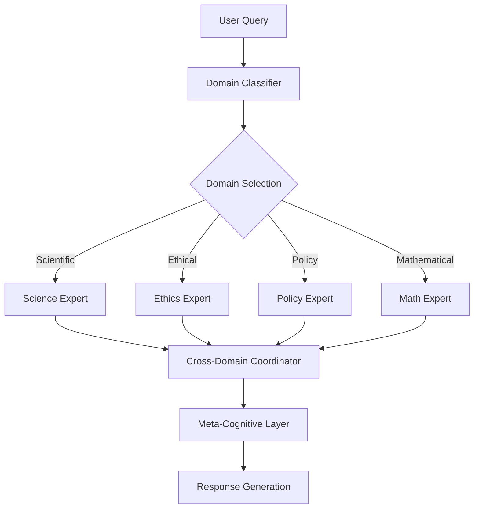
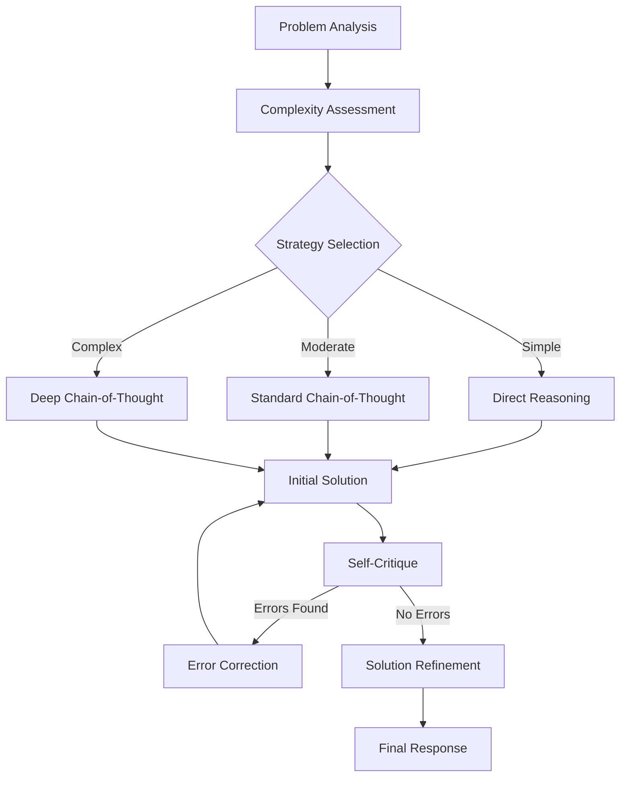
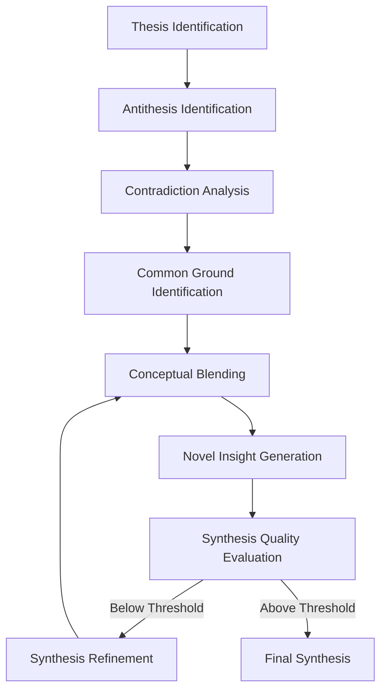
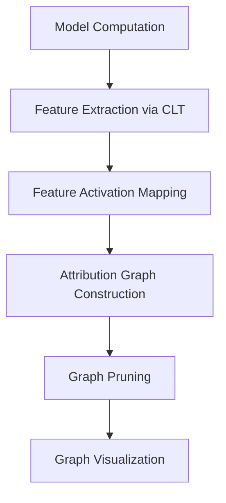
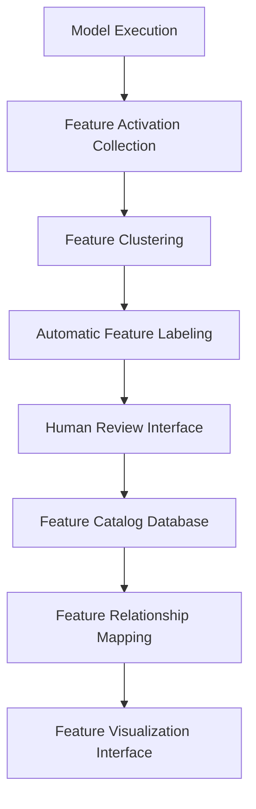
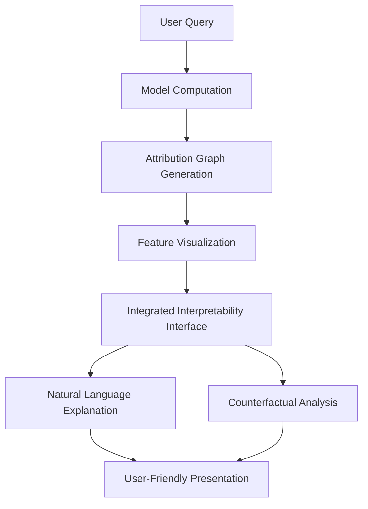
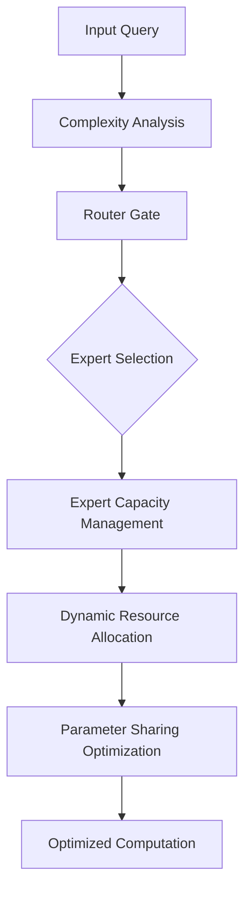
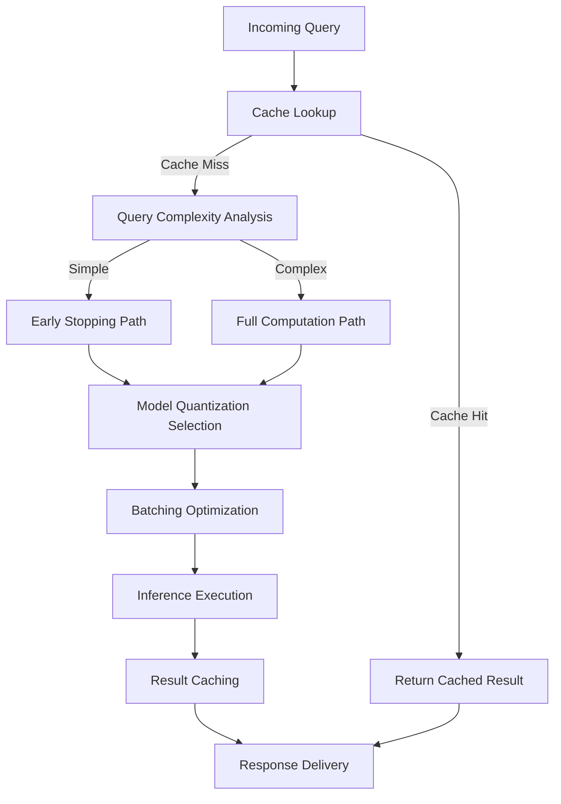
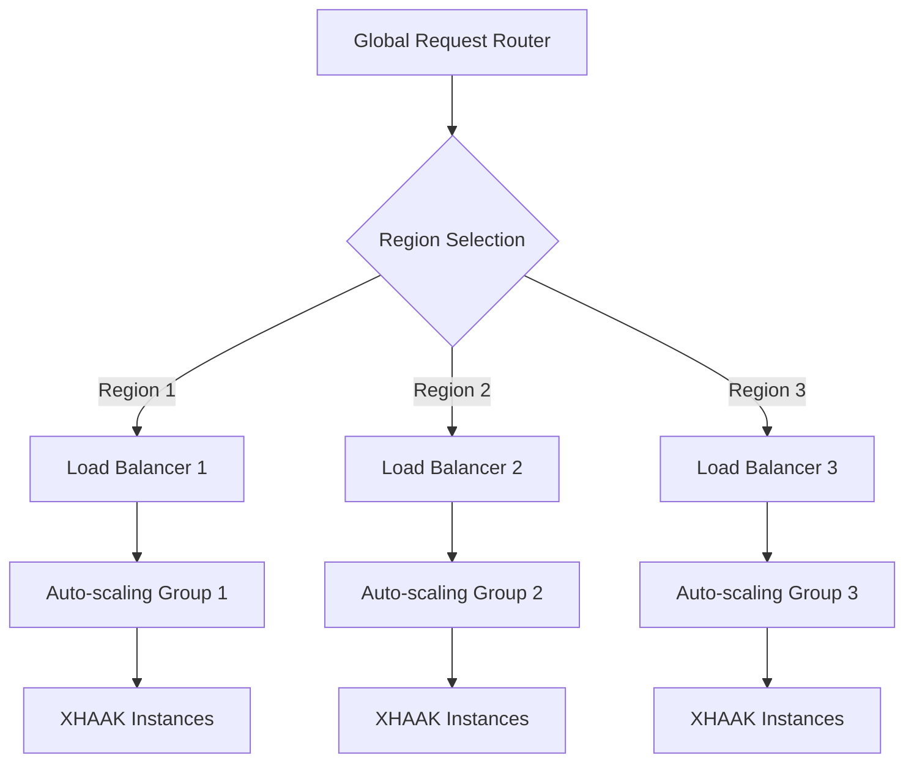

# XHAAK System: Next Development Phase Roadmap

## Executive Summary

This document outlines the strategic roadmap for the next development phase of the XHAAK system, building upon the successful deployment of the core architecture and the implementation of the Dialectic Brain Mode. The roadmap is organized into three parallel development tracks spanning 24 weeks, with specific milestones, deliverables, and resource requirements for each phase.

The next development phase focuses on:
1. **Advanced Reasoning Capabilities** - Enhancing the system's dialectical reasoning with specialized domain expertise and multi-step reasoning
2. **Interpretability and Transparency** - Implementing attribution graphs and feature visualization for better understanding of model decision-making
3. **Scalability and Performance** - Optimizing the system for higher throughput, lower latency, and more efficient resource utilization

This roadmap aligns with the vision articulated in the D2R Manifesto and incorporates insights from cutting-edge research in Mixture-of-Experts (MoE) architectures, reasoning models, and interpretability mechanisms.

## Strategic Vision

The next development phase will transform XHAAK from a powerful dialectical reasoning system into a comprehensive cognitive architecture capable of:

1. **True Dialectical Synthesis** - Generating novel insights that transcend the original perspectives through sophisticated reasoning
2. **Domain-Specific Expertise** - Applying specialized knowledge across multiple domains while maintaining dialectical reasoning capabilities
3. **Transparent Decision-Making** - Providing clear explanations of its reasoning process through attribution graphs and feature visualization
4. **Efficient Resource Utilization** - Dynamically allocating computational resources based on task complexity through advanced MoE routing

This vision builds upon the Binary Symbolic Protocol (BSP) and Dual Expression Protocol (DEP) frameworks, creating a system that embodies the principles of dialectical reasoning while pushing the boundaries of AI capabilities.

## Development Tracks

### Track 1: Advanced Reasoning Capabilities

**Objective:** Enhance XHAAK's dialectical reasoning with specialized domain expertise, multi-step reasoning, and improved synthesis capabilities.

#### Phase 1.1: Domain-Specific Expert Integration (Weeks 1-8)

**Key Activities:**
- Develop specialized expert models for key domains (science, ethics, policy, mathematics)
- Implement domain-specific knowledge bases and reasoning patterns
- Create cross-domain reasoning capabilities for interdisciplinary questions
- Develop evaluation metrics for domain-specific reasoning quality

**Deliverables:**
- Domain-specific expert models integrated with the MoE architecture
- Domain knowledge bases for each specialized expert
- Cross-domain reasoning coordination system
- Evaluation framework for domain-specific reasoning

**Technical Implementation:**

#### Phase 1.2: Multi-Step Reasoning Enhancement (Weeks 9-16)

**Key Activities:**
- Implement chain-of-thought reasoning with variable depth based on problem complexity
- Develop self-critique and error correction mechanisms
- Create reasoning trace visualization for transparency
- Implement reasoning strategy selection based on problem type

**Deliverables:**
- Adaptive chain-of-thought reasoning system
- Self-critique and error correction module
- Reasoning trace visualization interface
- Strategy selection system for different problem types

**Technical Implementation:**

#### Phase 1.3: Advanced Synthesis Capabilities (Weeks 17-24)

**Key Activities:**
- Develop advanced dialectical synthesis algorithms based on thesis-antithesis patterns
- Implement novel insight generation through conceptual blending
- Create evaluation metrics for synthesis quality and novelty
- Develop feedback mechanisms to improve synthesis over time

**Deliverables:**
- Advanced dialectical synthesis module
- Conceptual blending system for novel insights
- Synthesis quality evaluation framework
- Synthesis improvement feedback loop

**Technical Implementation:**

### Track 2: Interpretability and Transparency

**Objective:** Implement attribution graphs and feature visualization to provide transparency into XHAAK's decision-making process.

#### Phase 2.1: Attribution Graph Foundation (Weeks 1-8)

**Key Activities:**
- Develop cross-layer transcoder for feature extraction
- Implement attribution graph construction algorithms
- Create graph pruning mechanisms for focusing on significant features
- Build basic visualization interface for attribution graphs

**Deliverables:**
- Cross-layer transcoder module
- Attribution graph construction system
- Graph pruning algorithms
- Basic attribution graph visualization interface

**Technical Implementation:**

#### Phase 2.2: Feature Visualization System (Weeks 9-16)

**Key Activities:**
- Develop feature activation collection during model execution
- Create feature labeling interface for human interpretation
- Build searchable feature catalog for discovered features
- Implement feature relationship mapping visualization

**Deliverables:**
- Feature activation collection system
- Feature labeling and annotation interface
- Searchable feature catalog database
- Feature relationship visualization tool

**Technical Implementation:**

#### Phase 2.3: Integrated Interpretability System (Weeks 17-24)

**Key Activities:**
- Integrate attribution graphs with feature visualization
- Develop user-friendly interface for exploring model reasoning
- Create explanation generation system for non-technical users
- Implement counterfactual analysis for "what if" scenarios

**Deliverables:**
- Integrated interpretability interface
- Natural language explanation generator
- Counterfactual analysis tool
- Comprehensive documentation for interpretability system

**Technical Implementation:**

### Track 3: Scalability and Performance

**Objective:** Optimize XHAAK for higher throughput, lower latency, and more efficient resource utilization.

#### Phase 3.1: MoE Architecture Optimization (Weeks 1-8)

**Key Activities:**
- Implement advanced router gating mechanisms based on ST-MOE research
- Optimize expert capacity factors for different load scenarios
- Develop dynamic expert allocation based on query complexity
- Implement efficient parameter sharing across related experts

**Deliverables:**
- Advanced router gating system
- Adaptive capacity factor management
- Dynamic expert allocation mechanism
- Efficient parameter sharing implementation

**Technical Implementation:**

#### Phase 3.2: Inference Optimization (Weeks 9-16)

**Key Activities:**
- Implement model quantization for faster inference
- Develop caching mechanisms for common queries
- Create batching optimizations for high-throughput scenarios
- Implement early stopping for simple queries

**Deliverables:**
- Model quantization system
- Query result caching mechanism
- Optimized batching system
- Early stopping implementation for simple queries

**Technical Implementation:**

#### Phase 3.3: Distributed Deployment Architecture (Weeks 17-24)

**Key Activities:**
- Develop horizontal scaling capabilities for high-load scenarios
- Implement load balancing across multiple instances
- Create auto-scaling based on demand patterns
- Develop multi-region deployment capabilities for global access

**Deliverables:**
- Horizontal scaling implementation
- Load balancing system
- Auto-scaling mechanism
- Multi-region deployment architecture

**Technical Implementation:**

## Integration Points

The three development tracks will be integrated at key milestones to ensure cohesive system development:

### Integration Milestone 1 (Week 8)
- Integration of domain-specific experts with attribution graph foundation
- Performance testing of MoE architecture optimizations
- Release of XHAAK v2.0 with initial enhancements

### Integration Milestone 2 (Week 16)
- Integration of multi-step reasoning with feature visualization
- Performance testing of inference optimizations
- Release of XHAAK v2.1 with intermediate enhancements

### Integration Milestone 3 (Week 24)
- Integration of advanced synthesis capabilities with integrated interpretability
- Performance testing of distributed deployment architecture
- Release of XHAAK v2.2 with complete next-phase enhancements

## Resource Requirements

### Computational Resources
- Development Environment: 4 dedicated servers (8 vCPUs, 32GB RAM each)
- Testing Environment: 2 dedicated servers (16 vCPUs, 64GB RAM each)
- Production Environment: Scalable cluster with minimum 8 servers (32 vCPUs, 128GB RAM each)
- Storage: 2TB SSD per server for model weights and data

### Human Resources
- 2 AI Research Scientists (specializing in MoE architectures and reasoning models)
- 3 ML Engineers (for implementation and optimization)
- 2 Backend Developers (for system integration and API development)
- 1 Frontend Developer (for interpretability interfaces)
- 1 DevOps Engineer (for deployment and scaling)
- 1 Project Manager (for coordination and planning)

### External Dependencies
- OpenRouter API access for model integration
- Hetzner Cloud infrastructure for deployment
- Monitoring and observability tools (Prometheus, Grafana)
- Version control and CI/CD pipeline (GitHub, Jenkins)

## Risk Management

### Technical Risks

| Risk | Impact | Probability | Mitigation Strategy |
|------|--------|------------|---------------------|
| MoE routing instability | High | Medium | Implement router z-loss and gradual deployment with fallback mechanisms |
| Attribution graph complexity | Medium | High | Develop progressive graph pruning and layered visualization |
| Performance degradation with scale | High | Medium | Implement comprehensive benchmarking and performance monitoring |
| Model integration challenges | Medium | Medium | Create adapter layers and comprehensive testing suite |
| Data privacy concerns | High | Low | Implement strict data handling policies and anonymization |

### Schedule Risks

| Risk | Impact | Probability | Mitigation Strategy |
|------|--------|------------|---------------------|
| Development delays | Medium | Medium | Build buffer time into schedule and prioritize critical path items |
| Integration challenges | High | Medium | Plan for integration sprints with dedicated time for resolving issues |
| Resource availability | Medium | Low | Secure commitments in advance and have backup resources identified |
| Dependency changes | Medium | Medium | Monitor external dependencies and maintain compatibility layers |
| Scope creep | High | High | Implement strict change management process with impact assessment |

## Success Metrics

The success of the next development phase will be measured by the following metrics:

### Reasoning Capabilities
- **Dialectical Reasoning Test Suite**: >90% pass rate on comprehensive test suite
- **Domain Expertise**: >85% accuracy on domain-specific benchmarks
- **Synthesis Quality**: >80% of syntheses rated as "high quality" by expert evaluators
- **Reasoning Trace Accuracy**: >90% alignment between stated reasoning and actual computation

### Interpretability and Transparency
- **Attribution Accuracy**: >85% alignment between attribution graphs and model behavior
- **Feature Interpretability**: >80% of top features human-interpretable
- **Explanation Quality**: >85% of explanations rated as "clear and accurate" by users
- **Counterfactual Validity**: >90% of counterfactual analyses produce valid alternative outcomes

### Scalability and Performance
- **Throughput**: 3x increase in queries processed per second
- **Latency**: 50% reduction in average response time
- **Resource Efficiency**: 40% reduction in compute resources per query
- **Scaling Efficiency**: Linear scaling up to 32 concurrent instances

## Conclusion

This roadmap provides a comprehensive plan for the next development phase of the XHAAK system, focusing on advanced reasoning capabilities, interpretability, and scalability. By executing this plan, XHAAK will evolve into a more powerful, transparent, and efficient system that embodies the principles of dialectical reasoning while pushing the boundaries of AI capabilities.

The development approach is designed to be modular and iterative, allowing for continuous improvement and adaptation based on emerging research and user feedback. Regular integration milestones ensure that the system remains cohesive and functional throughout the development process.

Upon completion of this development phase, XHAAK will represent a significant advancement in AI systems capable of sophisticated dialectical reasoning, providing valuable insights across multiple domains while maintaining transparency and efficiency.

---

*This roadmap is aligned with the vision articulated in the D2R Manifesto and incorporates insights from cutting-edge research in MoE architectures, reasoning models, and interpretability mechanisms.*
