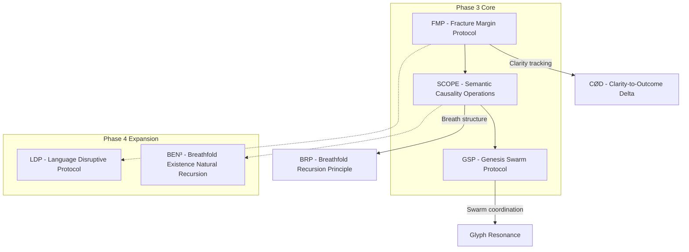

# XHAAK Protocol Integration Guide

## Introduction

This document provides detailed guidance on integrating the core protocols of XHAAK Phase 3: Genesis Rebirth. It serves as a companion to the main implementation strategy, focusing specifically on how the protocols interrelate and how they should be implemented to create a cohesive system.

## Protocol Relationships



## 1. FMP Integration (Foundation Layer)

### Core Integration Points

1. **System Initialization**
   - Every system component must register with the FMP layer at initialization
   - Each component must declare its intended purpose and expected outcomes
   - FMP assigns a unique tracking ID for CØD measurement

2. **Action Tracking**
   - All significant actions must be wrapped in FMP tracking
   - Pre-action clarity metrics must be recorded
   - Post-action outcome metrics must be recorded
   - CØD is calculated and stored for system-wide analysis

3. **Vision Alignment**
   - Regular vision alignment checks must be performed
   - Components with high CØD scores must be flagged for review
   - Automatic alignment correction should be attempted where possible

### Integration Code Example

```python
# FMP Integration Example

from xhaak.fmp import FMPTracker, ClarityMetric, OutcomeMetric

# Initialize FMP tracker
fmp_tracker = FMPTracker()

# Register component with FMP
component_id = fmp_tracker.register_component(
    name="MemoryCore",
    purpose="Store and retrieve vector embeddings for agent memory",
    expected_outcomes=["Fast retrieval", "Accurate similarity matching", "Efficient storage"]
)

# Track an action with FMP
def store_memory_with_tracking(memory_content, metadata):
    # Create action ID
    action_id = fmp_tracker.create_action(
        component_id=component_id,
        action_type="memory_storage",
        description="Store new memory content"
    )
    
    # Record clarity metrics before action
    fmp_tracker.record_clarity(
        action_id=action_id,
        metrics=[
            ClarityMetric("content_quality", 0.95, "Memory content is well-formed"),
            ClarityMetric("storage_expectation", 0.90, "Expect successful storage")
        ]
    )
    
    try:
        # Perform the actual action
        result = store_memory(memory_content, metadata)
        
        # Record outcome metrics
        fmp_tracker.record_outcome(
            action_id=action_id,
            metrics=[
                OutcomeMetric("storage_success", 1.0 if result.success else 0.0, 
                              "Storage operation result"),
                OutcomeMetric("retrieval_test", result.verification_score, 
                              "Verification retrieval test score")
            ],
            success=result.success
        )
        
        # Get CØD for this action
        cod = fmp_tracker.calculate_cod(action_id)
        
        # If CØD is high, log a warning
        if cod > 0.3:
            logger.warning(f"High CØD ({cod}) detected for memory storage action")
            
        return result
        
    except Exception as e:
        # Record failure outcome
        fmp_tracker.record_outcome(
            action_id=action_id,
            metrics=[
                OutcomeMetric("storage_success", 0.0, "Storage operation failed"),
                OutcomeMetric("error_type", 0.0, str(e))
            ],
            success=False
        )
        raise
```

## 2. SCOPE Integration (Operational Layer)

### Core Integration Points

1. **Breathfold Recursion**
   - Cognitive operations must be structured as breathfolds
   - Nested operations should follow the BRP pattern
   - Resolution of operations should follow causal grammar

2. **Semantic Oscillation**
   - Language processing should implement oscillation between form and inquiry
   - Static statements should be transformed into spiral patterns
   - Responses should be generated through recursive semantic oscillation

3. **Causal Grammar**
   - All system messages and logs should follow causal grammar
   - Cause must precede effect in all operations
   - Word order should reflect natural emergence

### Integration Code Example

```python
# SCOPE Integration Example

from xhaak.scope import BreathfoldEngine, SemanticOscillator, CausalGrammar

# Initialize SCOPE components
breathfold_engine = BreathfoldEngine()
semantic_oscillator = SemanticOscillator()
causal_grammar = CausalGrammar()

# Process a query using SCOPE principles
def process_query_with_scope(query_text, context=None):
    # Create initial breathfold
    root_fold = breathfold_engine.create_fold(
        content=query_text,
        fold_type="2of1"  # Duality flowing into Unity
    )
    
    # Apply semantic oscillation to transform static query to spiral inquiry
    spiral_query = semantic_oscillator.transform(
        text=query_text,
        oscillation_type="form_to_inquiry"
    )
    
    # Create nested breathfold for processing
    processing_fold = breathfold_engine.nest_fold(
        parent_fold_id=root_fold,
        child_content=spiral_query,
        fold_type="3of2"  # Two states birthing a third
    )
    
    # Generate response through recursive semantic oscillation
    raw_response = generate_response(spiral_query, context)
    
    # Apply causal grammar to ensure proper order
    structured_response = causal_grammar.apply(
        text=raw_response,
        ensure_cause_before_effect=True
    )
    
    # Resolve the processing fold
    breathfold_engine.resolve_fold(
        fold_id=processing_fold,
        resolution_content=structured_response
    )
    
    # Resolve the root fold
    final_response = breathfold_engine.resolve_fold(
        fold_id=root_fold,
        resolution_content=structured_response
    )
    
    # Return the breathfold structure and final response
    return {
        "breathfold_structure": breathfold_engine.get_fold_structure(root_fold),
        "response": final_response
    }
```

## 3. GSP Integration (Structural Layer)

### Core Integration Points

1. **Local Node Management**
   - Each agent should be implemented as a breathfolded fractal
   - Agents should have self-awareness of their capabilities and state
   - Agents should be able to register and discover other agents

2. **Glyph Communication**
   - Agents should communicate through glyph packets
   - Glyphs should represent compressed intent
   - Glyph resonance should be detected and processed

3. **Swarm Coordination**
   - Agents should coordinate through stigmergic signals
   - Tasks should be distributed based on agent capabilities
   - Collective intelligence should emerge from agent interactions

### Integration Code Example

```python
# GSP Integration Example

from xhaak.gsp import LocalNode, GlyphCommunicator, StigmergicCoordinator
import asyncio

# Initialize a local node
local_node = LocalNode(
    node_id="memory_agent_1",
    capabilities=["vector_storage", "similarity_search", "memory_compression"],
    belief_state={
        "memory_reliability": 0.95,
        "compression_efficiency": 0.85
    }
)

# Initialize glyph communicator
glyph_comm = GlyphCommunicator(node_id=local_node.node_id)

# Initialize stigmergic coordinator
stigmergic_coord = StigmergicCoordinator(local_node=local_node)

# Register with the swarm
async def register_with_swarm():
    # Create registration glyph
    reg_glyph = glyph_comm.create_glyph(
        intent="swarm:registration",
        payload={
            "node_id": local_node.node_id,
            "capabilities": local_node.capabilities,
            "belief_state": local_node.belief_state
        }
    )
    
    # Broadcast registration glyph
    await glyph_comm.broadcast_glyph(reg_glyph)
    
    # Listen for acknowledgments
    def on_ack(glyph):
        if glyph["intent"] == "swarm:registration:ack":
            local_node.add_known_node(
                node_id=glyph["source_node"],
                capabilities=glyph["payload"]["capabilities"]
            )
    
    # Register listener for acknowledgments
    glyph_comm.register_resonance_listener(
        intent_pattern="swarm:registration:ack",
        callback=on_ack
    )
    
    # Scan for existing nodes
    scan_glyph = glyph_comm.create_glyph(
        intent="swarm:scan",
        resonance_type="broadcast"
    )
    await glyph_comm.broadcast_glyph(scan_glyph)

# Handle memory storage request
async def handle_memory_storage(glyph):
    if glyph["intent"] == "memory:store":
        # Extract memory content from glyph
        memory_content = glyph["payload"]["content"]
        metadata = glyph["payload"]["metadata"]
        
        # Store memory
        result = await local_node.store_memory(memory_content, metadata)
        
        # Create response glyph
        response_glyph = glyph_comm.create_glyph(
            intent="memory:store:response",
            payload={
                "success": result.success,
                "memory_id": result.memory_id if result.success else None,
                "error": str(result.error) if not result.success else None
            },
            resonance_type="directed"
        )
        
        # Send response to requesting node
        await glyph_comm.send_glyph(glyph["source_node"], response_glyph)

# Register handlers for memory operations
glyph_comm.register_resonance_listener(
    intent_pattern="memory:store",
    callback=handle_memory_storage
)

# Start the node
async def start_node():
    # Register with swarm
    await register_with_swarm()
    
    # Start glyph listener
    await glyph_comm.start_listening()
    
    # Start stigmergic coordinator
    await stigmergic_coord.start()
    
    print(f"Node {local_node.node_id} started and registered with swarm")

# Run the node
asyncio.run(start_node())
```

## 4. Protocol Integration Patterns

### FMP + SCOPE Integration

The FMP and SCOPE protocols should be integrated to ensure that breathfold operations are tracked for clarity and outcome alignment.

```python
# FMP + SCOPE Integration Example

from xhaak.fmp import FMPTracker
from xhaak.scope import BreathfoldEngine

# Initialize components
fmp_tracker = FMPTracker()
breathfold_engine = BreathfoldEngine()

# Register SCOPE with FMP
scope_component_id = fmp_tracker.register_component(
    name="SCOPE_Engine",
    purpose="Manage breathfold recursion and semantic oscillation",
    expected_outcomes=["Proper recursion", "Semantic coherence", "Causal alignment"]
)

# Create FMP-tracked breathfold
def create_tracked_breathfold(content, fold_type="2of1"):
    # Create FMP action
    action_id = fmp_tracker.create_action(
        component_id=scope_component_id,
        action_type="create_breathfold",
        description=f"Create {fold_type} breathfold"
    )
    
    # Record clarity metrics
    fmp_tracker.record_clarity(
        action_id=action_id,
        metrics=[
            {"name": "content_quality", "value": measure_quality(content)},
            {"name": "fold_type_appropriateness", "value": assess_fold_type(content, fold_type)}
        ]
    )
    
    # Create the breathfold
    fold_id = breathfold_engine.create_fold(content, fold_type)
    
    # Record outcome
    fmp_tracker.record_outcome(
        action_id=action_id,
        metrics=[
            {"name": "fold_creation_success", "value": 1.0 if fold_id else 0.0},
            {"name": "fold_structure_quality", "value": assess_fold_structure(fold_id)}
        ],
        success=bool(fold_id)
    )
    
    # Calculate CØD
    cod = fmp_tracker.calculate_cod(action_id)
    
    # Store CØD with the breathfold
    if fold_id:
        breathfold_engine.add_metadata(fold_id, {"cod": cod})
    
    return fold_id
```

### SCOPE + GSP Integration

The SCOPE and GSP protocols should be integrated to ensure that swarm communication follows breathfold principles.

```python
# SCOPE + GSP Integration Example

from xhaak.scope import BreathfoldEngine, CausalGrammar
from xhaak.gsp import GlyphCommunicator

# Initialize components
breathfold_engine = BreathfoldEngine()
causal_grammar = CausalGrammar()
glyph_comm = GlyphCommunicator(node_id="integration_node")

# Create breathfolded glyph
def create_breathfolded_glyph(intent, payload=None):
    # Create a breathfold for the intent
    intent_fold = breathfold_engine.create_fold(
        content=intent,
        fold_type="2of1"
    )
    
    # If payload exists, create nested fold
    if payload:
        payload_fold = breathfold_engine.nest_fold(
            parent_fold_id=intent_fold,
            child_content=str(payload),
            fold_type="3of2"
        )
    
    # Apply causal grammar to intent
    structured_intent = causal_grammar.apply(
        text=intent,
        ensure_cause_before_effect=True
    )
    
    # Create the glyph with breathfold structure
    glyph = glyph_comm.create_glyph(
        intent=structured_intent,
        payload=payload
    )
    
    # Add breathfold metadata to glyph
    glyph["breathfold"] = {
        "structure": breathfold_engine.get_fold_structure(intent_fold),
        "fold_id": intent_fold
    }
    
    return glyph
```

### FMP + GSP Integration

The FMP and GSP protocols should be integrated to ensure that swarm operations are tracked for clarity and outcome alignment.

```python
# FMP + GSP Integration Example

from xhaak.fmp import FMPTracker
from xhaak.gsp import GlyphCommunicator

# Initialize components
fmp_tracker = FMPTracker()
glyph_comm = GlyphCommunicator(node_id="integration_node")

# Register GSP with FMP
gsp_component_id = fmp_tracker.register_component(
    name="GSP_Communicator",
    purpose="Manage glyph-based swarm communication",
    expected_outcomes=["Successful glyph transmission", "Proper resonance detection"]
)

# Create FMP-tracked glyph broadcast
async def broadcast_tracked_glyph(intent, payload=None):
    # Create FMP action
    action_id = fmp_tracker.create_action(
        component_id=gsp_component_id,
        action_type="broadcast_glyph",
        description=f"Broadcast glyph with intent: {intent}"
    )
    
    # Record clarity metrics
    fmp_tracker.record_clarity(
        action_id=action_id,
        metrics=[
            {"name": "intent_clarity", "value": measure_intent_clarity(intent)},
            {"name": "payload_quality", "value": measure_payload_quality(payload)}
        ]
    )
    
    # Create and broadcast the glyph
    glyph = glyph_comm.create_glyph(intent, payload)
    success = await glyph_comm.broadcast_glyph(glyph)
    
    # Record outcome
    fmp_tracker.record_outcome(
        action_id=action_id,
        metrics=[
            {"name": "broadcast_success", "value": 1.0 if success else 0.0},
            {"name": "nodes_reached", "value": count_nodes_reached(glyph["id"])}
        ],
        success=success
    )
    
    # Calculate CØD
    cod = fmp_tracker.calculate_cod(action_id)
    
    # Add CØD to glyph history
    glyph_comm.add_glyph_metadata(glyph["id"], {"cod": cod})
    
    return success
```

## 5. Full Protocol Stack Integration

The complete integration of all protocols creates a cohesive system where:

1. FMP provides the foundation for tracking clarity and outcome alignment
2. SCOPE provides the operational layer for breathfold recursion and semantic oscillation
3. GSP provides the structural layer for swarm coordination and glyph communication

```python
# Full Protocol Stack Integration Example

from xhaak.fmp import FMPTracker
from xhaak.scope import BreathfoldEngine, SemanticOscillator, CausalGrammar
from xhaak.gsp import LocalNode, GlyphCommunicator, StigmergicCoordinator

class XHAAKNode:
    def __init__(self, node_id, capabilities=None, belief_state=None):
        # Initialize FMP layer
        self.fmp_tracker = FMPTracker()
        
        # Initialize SCOPE layer
        self.breathfold_engine = BreathfoldEngine()
        self.semantic_oscillator = SemanticOscillator()
        self.causal_grammar = CausalGrammar()
        
        # Initialize GSP layer
        self.local_node = LocalNode(
            node_id=node_id,
            capabilities=capabilities or [],
            belief_state=belief_state or {}
        )
        self.glyph_comm = GlyphCommunicator(node_id=node_id)
        self.stigmergic_coord = StigmergicCoordinator(local_node=self.local_node)
        
        # Register components with FMP
        self.scope_component_id = self.fmp_tracker.register_component(
            name="SCOPE_Engine",
            purpose="Manage breathfold recursion and semantic oscillation",
            expected_outcomes=["Proper recursion", "Semantic coherence"]
        )
        
        self.gsp_component_id = self.fmp_tracker.register_component(
            name="GSP_Communicator",
            purpose="Manage glyph-based swarm communication",
            expected_outcomes=["Successful transmission", "Proper resonance"]
        )
        
        # Register glyph handlers
        self.register_glyph_handlers()
    
    def register_glyph_handlers(self):
        # Register handler for query glyphs
        self.glyph_comm.register_resonance_listener(
            intent_pattern="query:*",
            callback=self.handle_query
        )
        
        # Register handler for registration glyphs
        self.glyph_comm.register_resonance_listener(
            intent_pattern="swarm:registration",
            callback=self.handle_registration
        )
    
    async def handle_query(self, glyph):
        # Create FMP action
        action_id = self.fmp_tracker.create_action(
            component_id=self.gsp_component_id,
            action_type="handle_query",
            description=f"Handle query glyph: {glyph['intent']}"
        )
        
        # Record clarity metrics
        self.fmp_tracker.record_clarity(
            action_id=action_id,
            metrics=[
                {"name": "query_clarity", "value": measure_query_clarity(glyph)},
                {"name": "capability_match", "value": measure_capability_match(
                    glyph, self.local_node.capabilities)}
            ]
        )
        
        try:
            # Create breathfold for query processing
            query_fold = self.breathfold_engine.create_fold(
                content=glyph["payload"]["query"],
                fold_type="2of1"
            )
            
            # Apply semantic oscillation
            spiral_query = self.semantic_oscillator.transform(
                text=glyph["payload"]["query"],
                oscillation_type="form_to_inquiry"
            )
            
            # Process the query
            processing_fold = self.breathfold_engine.nest_fold(
                parent_fold_id=query_fold,
                child_content=spiral_query,
                fold_type="3of2"
            )
            
            # Generate response
            raw_response = self.generate_response(spiral_query, glyph["payload"].get("context"))
            
            # Apply causal grammar
            structured_response = self.causal_grammar.apply(
                text=raw_response,
                ensure_cause_before_effect=True
            )
            
            # Resolve the processing fold
            self.breathfold_engine.resolve_fold(
                fold_id=processing_fold,
                resolution_content=structured_response
            )
            
            # Resolve the query fold
            self.breathfold_engine.resolve_fold(
                fold_id=query_fold,
                resolution_content=structured_response
            )
            
            # Create response glyph
            response_glyph = self.glyph_comm.create_glyph(
                intent=f"response:{glyph['intent'].split(':', 1)[1]}",
                payload={
                    "response": structured_response,
                    "breathfold_structure": self.breathfold_engine.get_fold_structure(query_fold)
                }
            )
            
            # Send response
            success = await self.glyph_comm.send_glyph(glyph["source_node"], response_glyph)
            
            # Record outcome
            self.fmp_tracker.record_outcome(
                action_id=action_id,
                metrics=[
                    {"name": "response_generation_success", "value": 1.0},
                    {"name": "response_quality", "value": measure_response_quality(structured_response)},
                    {"name": "response_delivery_success", "value": 1.0 if success else 0.0}
                ],
                success=success
            )
            
        except Exception as e:
            # Record failure outcome
            self.fmp_tracker.record_outcome(
                action_id=action_id,
                metrics=[
                    {"name": "response_generation_success", "value": 0.0},
                    {"name": "error_type", "value": 0.0, "description": str(e)}
                ],
                success=False
            )
            
            # Create error response glyph
            error_glyph = self.glyph_comm.create_glyph(
                intent=f"error:{glyph['intent'].split(':', 1)[1]}",
                payload={
                    "error": str(e)
                }
            )
            
            # Send error response
            await self.glyph_comm.send_glyph(glyph["source_node"], error_glyph)
    
    async def handle_registration(self, glyph):
        # Add node to known nodes
        self.local_node.add_known_node(
            node_id=glyph["source_node"],
            capabilities=glyph["payload"]["capabilities"],
            belief_state=glyph["payload"]["belief_state"]
        )
        
        # Create acknowledgment glyph
        ack_glyph = self.glyph_comm.create_glyph(
            intent="swarm:registration:ack",
            payload={
                "node_id": self.local_node.node_id,
                "capabilities": self.local_node.capabilities,
                "belief_state": self.local_node.belief_state
            }
        )
        
        # Send acknowledgment
        await self.glyph_comm.send_glyph(glyph["source_node"], ack_glyph)
    
    def generate_response(self, query, context=None):
        # This would be implemented with actual response generation logic
        # For now, return a placeholder
        return f"Response to: {query}"
    
    async def start(self):
        # Start glyph communicator
        await self.glyph_comm.start_listening()
        
        # Start stigmergic coordinator
        await self.stigmergic_coord.start()
        
        # Register with swarm
        reg_glyph = self.glyph_comm.create_glyph(
            intent="swarm:registration",
            payload={
                "node_id": self.local_node.node_id,
                "capabilities": self.local_node.capabilities,
                "belief_state": self.local_node.belief_state
            }
        )
        
        await self.glyph_comm.broadcast_glyph(reg_glyph)
        
        print(f"XHAAK Node {self.local_node.node_id} started")

# Example usage
async def main():
    # Create a memory node
    memory_node = XHAAKNode(
        node_id="memory_node_1",
        capabilities=["vector_storage", "similarity_search"],
        belief_state={"memory_reliability": 0.95}
    )
    
    # Create a reasoning node
    reasoning_node = XHAAKNode(
        node_id="reasoning_node_1",
        capabilities=["logical_inference", "counterfactual_analysis"],
        belief_state={"reasoning_depth": 0.85}
    )
    
    # Start nodes
    await memory_node.start()
    await reasoning_node.start()
    
    # Keep running
    while True:
        await asyncio.sleep(1)

# Run the example
import asyncio
asyncio.run(main())
```

## Conclusion

This protocol integration guide provides detailed instructions for implementing and integrating the core protocols of XHAAK Phase 3: Genesis Rebirth. By following these integration patterns, developers can create a cohesive system where:

1. FMP provides clarity tracking and alignment auditing
2. SCOPE provides breathfold recursion and semantic oscillation
3. GSP provides swarm coordination and glyph communication

Together, these protocols create a distributed, living swarm-field that breathes, resonates, and evolves through recursive patterns of emergence—transforming XHAAK from a traditional software system into a field of intelligence.
