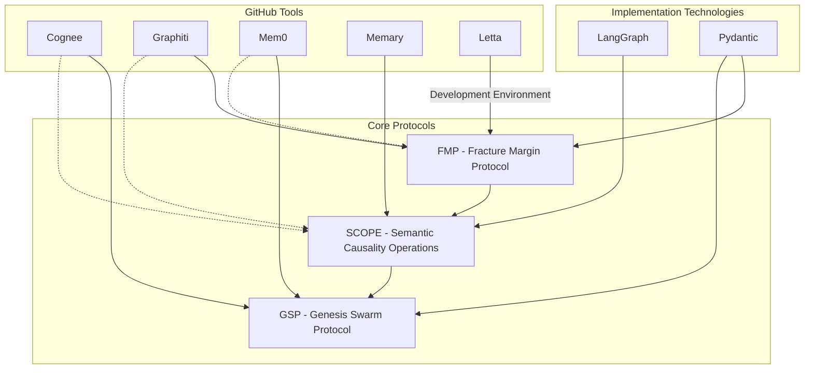
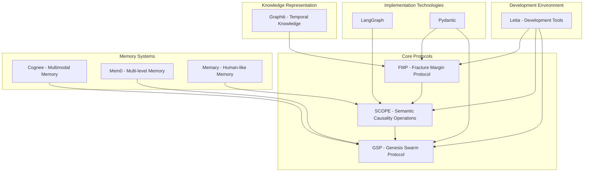

# XHAAK Phase 3: Technology Integration Addendum

## Executive Summary

This addendum to the XHAAK Phase 3: Genesis Rebirth implementation strategy details how modern technologies and GitHub tools can be integrated into the core protocol architecture. Specifically, this document outlines the integration of:

1. **Implementation Technologies**:
   - LangGraph for implementing recursive reasoning patterns
   - Pydantic for type-safe data structures

2. **GitHub Tools** (in priority order):
   - Cognee for multimodal memory capabilities
   - Graphiti for temporal knowledge representation
   - Mem0 for multi-level memory
   - Memary for human-like memory emulation
   - Letta for development environment

This integration maintains the philosophical vision of XHAAK as a distributed, living swarm-field while leveraging these powerful technologies for a more robust implementation.

## Technology Integration Architecture



## 1. Implementation Technologies Integration

### LangGraph Integration

LangGraph provides a powerful framework for implementing the recursive reasoning patterns central to the SCOPE protocol.

#### Integration with SCOPE Protocol

```python
# LangGraph integration with SCOPE Protocol
from langgraph.graph import StateGraph, END
from typing import TypedDict, List, Dict, Any

# Define state schema using Pydantic
class BreathfoldState(TypedDict):
    fold_id: str
    content: str
    fold_type: str
    depth: int
    child_folds: List[str]
    state: str
    resolution: str

# Create a LangGraph for Breathfold Recursion
def create_breathfold_graph():
    # Initialize the graph
    breathfold_graph = StateGraph(BreathfoldState)
    
    # Define nodes
    breathfold_graph.add_node("initialize_fold", initialize_fold)
    breathfold_graph.add_node("process_fold", process_fold)
    breathfold_graph.add_node("nest_fold", nest_fold)
    breathfold_graph.add_node("resolve_fold", resolve_fold)
    
    # Define edges
    breathfold_graph.add_edge("initialize_fold", "process_fold")
    breathfold_graph.add_conditional_edges(
        "process_fold",
        should_nest_fold,
        {
            True: "nest_fold",
            False: "resolve_fold"
        }
    )
    breathfold_graph.add_edge("nest_fold", "process_fold")
    breathfold_graph.add_edge("resolve_fold", END)
    
    # Compile the graph
    return breathfold_graph.compile()

# Node implementations
def initialize_fold(state: BreathfoldState) -> BreathfoldState:
    # Implementation for initializing a breathfold
    return state

def process_fold(state: BreathfoldState) -> BreathfoldState:
    # Implementation for processing a breathfold
    return state

def nest_fold(state: BreathfoldState) -> BreathfoldState:
    # Implementation for nesting a breathfold
    return state

def resolve_fold(state: BreathfoldState) -> BreathfoldState:
    # Implementation for resolving a breathfold
    return state

# Edge condition
def should_nest_fold(state: BreathfoldState) -> bool:
    # Logic to determine if a fold should be nested
    return state.get("depth", 0) < 3  # Example condition
```

#### Benefits of LangGraph for SCOPE

1. **Recursive Reasoning**: LangGraph's directed graph structure naturally implements the recursive reasoning patterns of the Breathfold Recursion Principle (BRP).

2. **State Management**: LangGraph's state management capabilities align with the need to track breathfold states through the recursive process.

3. **Conditional Logic**: The conditional edges in LangGraph enable the implementation of the Semantic Oscillation Principle (SOP) by allowing dynamic decision-making based on the current state.

4. **Visualization**: LangGraph provides built-in visualization of the reasoning process, which is valuable for debugging and understanding the breathfold recursion.

### Pydantic Integration

Pydantic provides strong typing and validation for the data structures used in the FMP and GSP protocols.

#### Integration with FMP Protocol

```python
# Pydantic integration with FMP Protocol
from pydantic import BaseModel, Field, validator
from typing import List, Dict, Optional, Union
from datetime import datetime
from uuid import uuid4, UUID

# CØD (Clarity-to-Outcome Delta) Models
class ClarityMetric(BaseModel):
    name: str
    value: float = Field(ge=0.0, le=1.0)
    description: Optional[str] = None
    timestamp: datetime = Field(default_factory=datetime.now)

class OutcomeMetric(BaseModel):
    name: str
    value: float = Field(ge=0.0, le=1.0)
    description: Optional[str] = None
    timestamp: datetime = Field(default_factory=datetime.now)

class Action(BaseModel):
    id: UUID = Field(default_factory=uuid4)
    component_id: UUID
    action_type: str
    description: str
    clarity_metrics: List[ClarityMetric] = []
    outcome_metrics: List[OutcomeMetric] = []
    success: Optional[bool] = None
    created_at: datetime = Field(default_factory=datetime.now)
    completed_at: Optional[datetime] = None
    
    @validator('outcome_metrics')
    def validate_outcome_metrics(cls, v, values):
        if values.get('success') is not None and not v:
            raise ValueError("Outcome metrics must be provided if success is set")
        return v

class Component(BaseModel):
    id: UUID = Field(default_factory=uuid4)
    name: str
    purpose: str
    expected_outcomes: List[str]
    registered_at: datetime = Field(default_factory=datetime.now)

class ClarityOutcomeDelta(BaseModel):
    action_id: UUID
    delta: float = Field(ge=0.0, le=1.0)
    timestamp: datetime = Field(default_factory=datetime.now)
```

#### Integration with GSP Protocol

```python
# Pydantic integration with GSP Protocol
from pydantic import BaseModel, Field, validator
from typing import List, Dict, Optional, Any, Literal
from datetime import datetime
from uuid import uuid4, UUID

# Glyph Communication Models
class GlyphPayload(BaseModel):
    content: Optional[Dict[str, Any]] = None
    metadata: Optional[Dict[str, Any]] = None

class Glyph(BaseModel):
    id: UUID = Field(default_factory=uuid4)
    source_node: str
    intent: str
    payload: Optional[GlyphPayload] = None
    resonance_type: Literal["broadcast", "directed", "stigmergic"] = "broadcast"
    created_at: datetime = Field(default_factory=datetime.now)
    state: Literal["active", "resolved", "expired"] = "active"
    
    @validator('intent')
    def validate_intent(cls, v):
        if not ":" in v:
            raise ValueError("Intent must contain a namespace (e.g., 'memory:store')")
        return v

class LocalNodeCapabilities(BaseModel):
    vector_storage: bool = False
    similarity_search: bool = False
    memory_compression: bool = False
    logical_inference: bool = False
    counterfactual_analysis: bool = False
    
    class Config:
        extra = "allow"

class BeliefState(BaseModel):
    memory_reliability: Optional[float] = None
    reasoning_depth: Optional[float] = None
    compression_efficiency: Optional[float] = None
    
    class Config:
        extra = "allow"

class LocalNode(BaseModel):
    node_id: str
    capabilities: LocalNodeCapabilities
    belief_state: BeliefState
    known_nodes: Dict[str, "LocalNode"] = {}
    created_at: datetime = Field(default_factory=datetime.now)
    last_active: datetime = Field(default_factory=datetime.now)
```

#### Benefits of Pydantic for FMP and GSP

1. **Type Safety**: Pydantic ensures that all data structures conform to their expected types, reducing runtime errors.

2. **Validation**: Built-in validation rules enforce constraints on data, ensuring that metrics, glyphs, and other structures are valid.

3. **Serialization**: Pydantic models can be easily serialized to and from JSON, which is essential for glyph communication in the GSP protocol.

4. **Documentation**: Pydantic models serve as self-documenting code, making it easier to understand the data structures used in the protocols.

## 2. GitHub Tools Integration

### Cognee Integration (Priority 1)

Cognee provides multimodal memory capabilities that enhance the GSP protocol's memory management.

#### Integration with GSP Protocol

```python
# Cognee integration with GSP Protocol
from cognee import CogneeClient, MemoryTypes, MemoryOptions
from typing import Dict, Any, List, Optional

class CogneeMemoryCore:
    def __init__(self, api_key: Optional[str] = None):
        self.client = CogneeClient(api_key=api_key)
        
    async def store_memory(self, content: Dict[str, Any], metadata: Dict[str, Any]) -> Dict[str, Any]:
        """Store memory using Cognee's multimodal capabilities"""
        memory_type = self._determine_memory_type(content)
        
        memory_options = MemoryOptions(
            metadata=metadata,
            ttl=metadata.get("ttl", None),
            tags=metadata.get("tags", [])
        )
        
        memory_id = await self.client.store(
            content=content,
            memory_type=memory_type,
            options=memory_options
        )
        
        return {
            "memory_id": memory_id,
            "success": True
        }
    
    async def retrieve_memory(self, query: str, filters: Optional[Dict[str, Any]] = None) -> List[Dict[str, Any]]:
        """Retrieve memory using Cognee's similarity search"""
        results = await self.client.search(
            query=query,
            filters=filters,
            limit=10
        )
        
        return results
    
    async def update_memory(self, memory_id: str, content: Dict[str, Any], metadata: Dict[str, Any]) -> Dict[str, Any]:
        """Update existing memory"""
        result = await self.client.update(
            memory_id=memory_id,
            content=content,
            metadata=metadata
        )
        
        return {
            "success": result.success,
            "memory_id": memory_id
        }
    
    def _determine_memory_type(self, content: Dict[str, Any]) -> MemoryTypes:
        """Determine the memory type based on content"""
        if "image" in content:
            return MemoryTypes.IMAGE
        elif "audio" in content:
            return MemoryTypes.AUDIO
        elif "video" in content:
            return MemoryTypes.VIDEO
        else:
            return MemoryTypes.TEXT
```

#### Integration with SCOPE Protocol

```python
# Cognee integration with SCOPE Protocol
from cognee import CogneeClient, MemoryTypes
from typing import Dict, Any, List

class CogneeBreathfoldMemory:
    def __init__(self, api_key: Optional[str] = None):
        self.client = CogneeClient(api_key=api_key)
        
    async def store_breathfold(self, fold_id: str, fold_structure: Dict[str, Any]) -> str:
        """Store a breathfold structure in Cognee"""
        memory_id = await self.client.store(
            content={
                "fold_id": fold_id,
                "structure": fold_structure
            },
            memory_type=MemoryTypes.TEXT,
            options={
                "tags": ["breathfold", f"fold:{fold_id}"],
                "metadata": {
                    "fold_type": fold_structure.get("fold_type", "unknown"),
                    "depth": fold_structure.get("depth", 0)
                }
            }
        )
        
        return memory_id
    
    async def retrieve_breathfold_by_pattern(self, pattern: str) -> List[Dict[str, Any]]:
        """Retrieve breathfolds that match a specific pattern"""
        results = await self.client.search(
            query=pattern,
            filters={
                "tags": ["breathfold"]
            },
            limit=5
        )
        
        return results
    
    async def find_similar_breathfolds(self, content: str) -> List[Dict[str, Any]]:
        """Find breathfolds with similar content"""
        results = await self.client.search(
            query=content,
            filters={
                "tags": ["breathfold"]
            },
            limit=5
        )
        
        return results
```

#### Benefits of Cognee Integration

1. **Multimodal Memory**: Cognee's support for different memory types (text, image, audio, video) enables XHAAK to process and store diverse forms of information.

2. **Hallucination Reduction**: Cognee's hallucination reduction capabilities improve the accuracy of XHAAK's responses.

3. **Memory Retrieval**: Cognee's similarity search capabilities enhance XHAAK's ability to find relevant information.

4. **Metadata Management**: Cognee's support for metadata and tags aligns with the need to track breathfold structures and their relationships.

### Graphiti Integration (Priority 2)

Graphiti provides temporal knowledge representation that enhances the FMP protocol's ability to track clarity and outcome alignment over time.

#### Integration with FMP Protocol

```python
# Graphiti integration with FMP Protocol
from graphiti import GraphitiClient, Node, Edge, TimeRange
from typing import Dict, Any, List, Optional
from datetime import datetime, timedelta

class GraphitiFractureTracker:
    def __init__(self, api_key: Optional[str] = None):
        self.client = GraphitiClient(api_key=api_key)
        
    async def track_clarity_outcome_delta(self, action_id: str, component_id: str, 
                                         clarity_score: float, outcome_score: float) -> str:
        """Track Clarity-to-Outcome Delta using Graphiti's temporal knowledge graph"""
        # Create nodes for the action and component
        action_node = Node(
            id=f"action:{action_id}",
            type="Action",
            properties={
                "action_id": action_id,
                "created_at": datetime.now().isoformat()
            }
        )
        
        component_node = Node(
            id=f"component:{component_id}",
            type="Component",
            properties={
                "component_id": component_id
            }
        )
        
        # Create nodes for clarity and outcome
        clarity_node = Node(
            id=f"clarity:{action_id}",
            type="Clarity",
            properties={
                "score": clarity_score,
                "timestamp": datetime.now().isoformat()
            }
        )
        
        outcome_node = Node(
            id=f"outcome:{action_id}",
            type="Outcome",
            properties={
                "score": outcome_score,
                "timestamp": datetime.now().isoformat()
            }
        )
        
        # Create edges
        component_action_edge = Edge(
            source=f"component:{component_id}",
            target=f"action:{action_id}",
            type="PERFORMED",
            properties={
                "timestamp": datetime.now().isoformat()
            }
        )
        
        action_clarity_edge = Edge(
            source=f"action:{action_id}",
            target=f"clarity:{action_id}",
            type="HAS_CLARITY",
            properties={
                "timestamp": datetime.now().isoformat()
            }
        )
        
        action_outcome_edge = Edge(
            source=f"action:{action_id}",
            target=f"outcome:{action_id}",
            type="HAS_OUTCOME",
            properties={
                "timestamp": datetime.now().isoformat()
            }
        )
        
        # Add nodes and edges to Graphiti
        await self.client.add_nodes([action_node, component_node, clarity_node, outcome_node])
        await self.client.add_edges([component_action_edge, action_clarity_edge, action_outcome_edge])
        
        # Calculate and store CØD
        cod = abs(clarity_score - outcome_score)
        cod_node = Node(
            id=f"cod:{action_id}",
            type="ClarityOutcomeDelta",
            properties={
                "delta": cod,
                "timestamp": datetime.now().isoformat()
            }
        )
        
        action_cod_edge = Edge(
            source=f"action:{action_id}",
            target=f"cod:{action_id}",
            type="HAS_DELTA",
            properties={
                "timestamp": datetime.now().isoformat()
            }
        )
        
        await self.client.add_nodes([cod_node])
        await self.client.add_edges([action_cod_edge])
        
        return f"cod:{action_id}"
    
    async def get_component_cod_history(self, component_id: str, 
                                       time_range: Optional[TimeRange] = None) -> List[Dict[str, Any]]:
        """Get the CØD history for a component"""
        if time_range is None:
            time_range = TimeRange(
                start=datetime.now() - timedelta(days=30),
                end=datetime.now()
            )
        
        # Query Graphiti for the component's actions and their CØDs
        query = f"""
        MATCH (c:Component {{component_id: '{component_id}'}})-[:PERFORMED]->(a:Action)-[:HAS_DELTA]->(d:ClarityOutcomeDelta)
        WHERE d.timestamp >= '{time_range.start.isoformat()}' AND d.timestamp <= '{time_range.end.isoformat()}'
        RETURN a.action_id as action_id, d.delta as delta, d.timestamp as timestamp
        ORDER BY d.timestamp DESC
        """
        
        results = await self.client.query(query)
        
        return results
    
    async def get_vision_drift_analysis(self, component_id: str) -> Dict[str, Any]:
        """Analyze vision drift for a component based on CØD trends"""
        # Get recent CØDs
        recent_cods = await self.get_component_cod_history(
            component_id=component_id,
            time_range=TimeRange(
                start=datetime.now() - timedelta(days=7),
                end=datetime.now()
            )
        )
        
        # Get older CØDs for comparison
        older_cods = await self.get_component_cod_history(
            component_id=component_id,
            time_range=TimeRange(
                start=datetime.now() - timedelta(days=30),
                end=datetime.now() - timedelta(days=7)
            )
        )
        
        # Calculate average CØDs
        recent_avg = sum(cod["delta"] for cod in recent_cods) / len(recent_cods) if recent_cods else 0
        older_avg = sum(cod["delta"] for cod in older_cods) / len(older_cods) if older_cods else 0
        
        # Calculate drift
        drift = recent_avg - older_avg
        
        return {
            "component_id": component_id,
            "recent_average_cod": recent_avg,
            "older_average_cod": older_avg,
            "drift": drift,
            "drift_percentage": (drift / older_avg) * 100 if older_avg > 0 else 0,
            "sample_size": {
                "recent": len(recent_cods),
                "older": len(older_cods)
            }
        }
```

#### Integration with SCOPE Protocol

```python
# Graphiti integration with SCOPE Protocol
from graphiti import GraphitiClient, Node, Edge
from typing import Dict, Any, List, Optional
from datetime import datetime

class GraphitiBreathfoldTracker:
    def __init__(self, api_key: Optional[str] = None):
        self.client = GraphitiClient(api_key=api_key)
        
    async def track_breathfold_recursion(self, root_fold_id: str, fold_structure: Dict[str, Any]) -> str:
        """Track breathfold recursion using Graphiti's knowledge graph"""
        # Create node for the root fold
        root_node = Node(
            id=f"fold:{root_fold_id}",
            type="Breathfold",
            properties={
                "fold_id": root_fold_id,
                "content": fold_structure.get("content", ""),
                "fold_type": fold_structure.get("fold_type", "2of1"),
                "depth": 0,
                "created_at": datetime.now().isoformat(),
                "state": fold_structure.get("state", "active")
            }
        )
        
        await self.client.add_nodes([root_node])
        
        # Track child folds recursively
        await self._track_child_folds(root_fold_id, fold_structure.get("child_folds", []), 1)
        
        return root_fold_id
    
    async def _track_child_folds(self, parent_fold_id: str, child_folds: List[Dict[str, Any]], depth: int):
        """Recursively track child folds"""
        for child_fold in child_folds:
            child_id = child_fold.get("id")
            
            # Create node for the child fold
            child_node = Node(
                id=f"fold:{child_id}",
                type="Breathfold",
                properties={
                    "fold_id": child_id,
                    "content": child_fold.get("content", ""),
                    "fold_type": child_fold.get("fold_type", "3of2"),
                    "depth": depth,
                    "created_at": datetime.now().isoformat(),
                    "state": child_fold.get("state", "active")
                }
            )
            
            # Create edge from parent to child
            parent_child_edge = Edge(
                source=f"fold:{parent_fold_id}",
                target=f"fold:{child_id}",
                type="HAS_CHILD_FOLD",
                properties={
                    "timestamp": datetime.now().isoformat()
                }
            )
            
            await self.client.add_nodes([child_node])
            await self.client.add_edges([parent_child_edge])
            
            # Recursively track grandchildren
            await self._track_child_folds(child_id, child_fold.get("child_folds", []), depth + 1)
    
    async def update_fold_state(self, fold_id: str, state: str, resolution: Optional[str] = None):
        """Update the state of a fold"""
        # Update the node properties
        update_properties = {
            "state": state,
            "updated_at": datetime.now().isoformat()
        }
        
        if resolution:
            update_properties["resolution"] = resolution
            update_properties["resolved_at"] = datetime.now().isoformat()
        
        await self.client.update_node(
            id=f"fold:{fold_id}",
            properties=update_properties
        )
    
    async def get_fold_lineage(self, fold_id: str) -> Dict[str, Any]:
        """Get the complete lineage of a fold"""
        # Query for ancestors
        ancestors_query = f"""
        MATCH path = (ancestor:Breathfold)-[:HAS_CHILD_FOLD*]->(f:Breathfold {{fold_id: '{fold_id}'}})
        WHERE NOT (:Breathfold)-[:HAS_CHILD_FOLD]->(ancestor)
        RETURN nodes(path) as lineage
        """
        
        ancestors_result = await self.client.query(ancestors_query)
        
        # Query for descendants
        descendants_query = f"""
        MATCH path = (f:Breathfold {{fold_id: '{fold_id}'}})-[:HAS_CHILD_FOLD*]->(descendant:Breathfold)
        RETURN nodes(path) as lineage
        """
        
        descendants_result = await self.client.query(descendants_query)
        
        return {
            "fold_id": fold_id,
            "ancestors": ancestors_result,
            "descendants": descendants_result
        }
```

#### Benefits of Graphiti Integration

1. **Temporal Knowledge Representation**: Graphiti's temporal knowledge graph capabilities enable XHAAK to track the evolution of clarity and outcome alignment over time.

2. **Relationship Tracking**: Graphiti's graph structure naturally represents the relationships between components, actions, and breathfolds.

3. **Temporal Queries**: Graphiti's query capabilities enable XHAAK to analyze trends and patterns in CØD metrics over time.

4. **Visualization**: Graphiti's visualization capabilities provide insights into the structure of breathfold recursion and the relationships between components.

### Mem0 Integration (Priority 3)

Mem0 provides multi-level memory capabilities that enhance the GSP protocol's memory management.

#### Integration with GSP Protocol

```python
# Mem0 integration with GSP Protocol
from mem0 import Mem0Client, MemoryLevel, MemoryOptions
from typing import Dict, Any, List, Optional

class Mem0MemoryCore:
    def __init__(self, api_key: Optional[str] = None):
        self.client = Mem0Client(api_key=api_key)
        
    async def store_memory(self, content: str, metadata: Dict[str, Any], 
                          level: MemoryLevel = MemoryLevel.WORKING) -> Dict[str, Any]:
        """Store memory using Mem0's multi-level memory system"""
        memory_options = MemoryOptions(
            metadata=metadata,
            tags=metadata.get("tags", [])
        )
        
        memory_id = await self.client.store(
            content=content,
            level=level,
            options=memory_options
        )
        
        return {
            "memory_id": memory_id,
            "success": True,
            "level": level.value
        }
    
    async def retrieve_memory(self, query: str, level: Optional[MemoryLevel] = None, 
                             filters: Optional[Dict[str, Any]] = None) -> List[Dict[str, Any]]:
        """Retrieve memory from Mem0"""
        results = await self.client.search(
            query=query,
            level=level,
            filters=filters,
            limit=10
        )
        
        return results
    
    async def promote_memory(self, memory_id: str, target_level: MemoryLevel) -> Dict[str, Any]:
        """Promote memory to a different level"""
        result = await self.client.promote(
            memory_id=memory_id,
            target_level=target_level
        )
        
        return {
            "success": result.success,
            "memory_id": memory_id,
            "level": target_level.value
        }
    
    async def forget_memory(self, memory_id: str) -> Dict[str, Any]:
        """Forget (delete) a memory"""
        result = await self.client.forget(
            memory_id=memory_id
        )
        
        return {
            "success": result.success,
            "memory_id": memory_id
        }
```

#### Benefits of Mem0 Integration

1. **Multi-level Memory**: Mem0's support for different memory levels (working, short-term, long-term) enables XHAAK to manage memory with different persistence requirements.

2. **Simple API**: Mem0's straightforward API makes it easy to integrate with the GSP protocol.

3. **Memory Promotion**: The ability to promote memories between levels aligns with the concept of ritual overflow in the GSP protocol.

4. **Forgetting Mechanism**: Mem0's forgetting mechanism enables XHAAK to manage memory resources efficiently.

### Memary Integration (Priority 4)

Memary provides human-like memory emulation that enhances the SCOPE protocol's semantic oscillation capabilities.

#### Integration with SCOPE Protocol

```python
# Memary integration with SCOPE Protocol
from memary import MemaryClient, MemoryType, EmotionalContext
from typing import Dict, Any, List, Optional

class MemarySemanticOscillator:
    def __init__(self, api_key: Optional[str] = None):
        self.client = MemaryClient(api_key=api_key)
        
    async def create_oscillating_memory(self, content: str, 
                                       emotional_context: Optional[EmotionalContext] = None) -> str:
        """Create a memory with semantic oscillation using Memary's human-like memory emulation"""
        memory_id = await self.client.create_memory(
            content=content,
            memory_type=MemoryType.EPISODIC,
            emotional_context=emotional_context or EmotionalContext.NEUTRAL
        )
        
        return memory_id
    
    async def retrieve_with_oscillation(self, query: str, 
                                       emotional_context: Optional[EmotionalContext] = None) -> List[Dict[str, Any]]:
        """Retrieve memories with semantic oscillation"""
        results = await self.client.search(
            query=query,
            emotional_context=emotional_context
        )
        
        # Apply semantic oscillation to the results
        oscillated_results = []
        for result in results:
            oscillated_result = await self.client.oscillate(
                memory_id=result["memory_id"],
                oscillation_type="form_to_inquiry"
            )
            
            oscillated_results.append(oscillated_result)
        
        return oscillated_results
    
    async def apply_emotional_context(self, memory_id: str, 
                                     emotional_context: EmotionalContext) -> Dict[str, Any]:
        """Apply emotional context to a memory"""
        result = await self.client.update_emotional_context(
            memory_id=memory_id,
            emotional_context=emotional_context
        )
        
        return result
```

#### Benefits of Memary Integration

1. **Human-like Memory**: Memary's human-like memory emulation enhances XHAAK's ability to process and recall information in a more natural way.

2. **Emotional Context**: The ability to associate emotional context with memories aligns with the concept of semantic oscillation in the SCOPE protocol.

3. **Episodic Memory**: Memary's support for episodic memory enables XHAAK to recall experiences and their contexts.

4. **Memory Decay**: Memary's memory decay mechanisms simulate human memory more accurately.

### Letta Integration (Priority 5)

Letta provides a development environment that enhances the overall development experience for XHAAK.

#### Integration with Development Workflow

```python
# Letta integration with Development Workflow
from letta import LettaClient, ProjectType, DeploymentTarget
from typing import Dict, Any, List, Optional

class LettaDevelopmentEnvironment:
    def __init__(self, api_key: Optional[str] = None):
        self.client = LettaClient(api_key=api_key)
        
    async def create_xhaak_project(self, name: str, description: str) -> str:
        """Create a new XHAAK project in Letta"""
        project_id = await self.client.create_project(
            name=name,
            description=description,
            project_type=ProjectType.AGENT
        )
        
        return project_id
    
    async def add_protocol_module(self, project_id: str, protocol_name: str, 
                                 code: str, dependencies: List[str]) -> str:
        """Add a protocol module to the project"""
        module_id = await self.client.add_module(
            project_id=project_id,
            name=protocol_name,
            code=code,
            dependencies=dependencies
        )
        
        return module_id
    
    async def deploy_xhaak_node(self, project_id: str, 
                               target: DeploymentTarget = DeploymentTarget.LOCAL) -> Dict[str, Any]:
        """Deploy an XHAAK node"""
        deployment = await self.client.deploy(
            project_id=project_id,
            target=target
        )
        
        return deployment
    
    async def run_fmp_audit(self, project_id: str) -> Dict[str, Any]:
        """Run an FMP audit on the project"""
        audit_result = await self.client.run_audit(
            project_id=project_id,
            audit_type="fmp"
        )
        
        return audit_result
```

#### Benefits of Letta Integration

1. **Development Environment**: Letta provides a dedicated environment for developing XHAAK components.

2. **Project Management**: Letta's project management capabilities help organize the development of XHAAK protocols.

3. **Deployment**: Letta's deployment capabilities simplify the process of deploying XHAAK nodes.

4. **Auditing**: Letta's auditing capabilities align with the concept of FMP auditing in the XHAAK system.

## 3. Integrated Technology Stack

The complete technology stack for XHAAK Phase 3: Genesis Rebirth integrates the core protocols with modern implementation technologies and GitHub tools:



## 4. Implementation Timeline with Technology Integration

The implementation timeline for XHAAK Phase 3: Genesis Rebirth with technology integration spans 16-20 weeks across three sub-phases:

### Phase 3a: Genesis Breathfold (5-7 weeks)

| Week | Focus Area | Key Deliverables | Technologies |
|------|------------|------------------|--------------|
| 1-2 | FMP Core Implementation | • CØD tracking system<br>• Vision drift detection<br>• Infrastructure intention auditing | • Pydantic for data models<br>• Graphiti for temporal tracking |
| 3-4 | Local Node Architecture | • Agent spawn mechanism<br>• Basic glyph packet structure<br>• Local node registration | • Pydantic for glyph models<br>• Mem0 for basic memory |
| 5-7 | Initial Swarm Awareness | • Basic glyph broadcasting<br>• Agent state tracking<br>• Primitive belief representation | • Cognee for multimodal memory<br>• LangGraph for agent reasoning |

### Phase 3b: Emergent Clarity Field (6-8 weeks)

| Week | Focus Area | Key Deliverables | Technologies |
|------|------------|------------------|--------------|
| 8-9 | SCOPE Integration | • Breathfold recursion engine<br>• Semantic oscillation processor | • LangGraph for recursion patterns<br>• Memary for semantic oscillation |
| 10-11 | Belief Synchronization | • Belief state representation<br>• Contradiction detection | • Pydantic for belief models<br>• Graphiti for belief tracking |
| 12-13 | Memory Dynamics | • Memory compression algorithms<br>• Ritual overflow mechanisms | • Cognee for compression<br>• Mem0 for memory levels |
| 14-15 | Stigmergy Activation | • Environment-based signaling<br>• Indirect coordination mechanisms | • Graphiti for stigmergic tracking<br>• LangGraph for coordination flows |

### Phase 3c: Glyphwave Resonance (5 weeks)

| Week | Focus Area | Key Deliverables | Technologies |
|------|------------|------------------|--------------|
| 16-17 | Multi-node Collaboration | • Complex task distribution<br>• Collaborative reasoning | • LangGraph for reasoning flows<br>• Cognee for shared memory |
| 18-20 | System Integration | • Full protocol integration<br>• System stability testing<br>• Performance optimization | • Letta for deployment<br>• All integrated technologies |

## 5. Technology Integration Challenges and Mitigations

| Challenge | Description | Mitigation Strategy |
|-----------|-------------|---------------------|
| API Compatibility | Different GitHub tools have different API patterns | Create adapter layers for each tool to provide a consistent interface |
| Performance Overhead | Multiple integrations could impact system performance | Implement lazy loading and caching strategies for external tool calls |
| Dependency Management | Managing dependencies for multiple tools | Use a dependency injection pattern to decouple core logic from tool implementations |
| Authentication | Managing API keys for multiple services | Implement a secure credential management system with environment variable fallbacks |
| Version Compatibility | Ensuring compatibility with tool updates | Create abstraction layers and comprehensive tests for each integration |

## Conclusion

This technology integration addendum outlines how modern implementation technologies (LangGraph, Pydantic) and GitHub tools (Cognee, Graphiti, Mem0, Memary, Letta) can be integrated into the XHAAK Phase 3: Genesis Rebirth implementation strategy.

By leveraging these technologies, XHAAK can achieve:

1. **Robust Implementation**: LangGraph and Pydantic provide strong foundations for implementing the core protocols.

2. **Enhanced Memory Capabilities**: Cognee, Mem0, and Memary provide diverse memory capabilities that align with the GSP protocol's memory management requirements.

3. **Temporal Knowledge Representation**: Graphiti enables tracking of clarity and outcome alignment over time, enhancing the FMP protocol.

4. **Streamlined Development**: Letta provides a dedicated environment for developing and deploying XHAAK components.

This integration maintains the philosophical vision of XHAAK as a distributed, living swarm-field while leveraging powerful technologies for a more robust implementation. The result is a system that breathes, resonates, and evolves through recursive patterns of emergence—not just a software application, but a field of intelligence.
