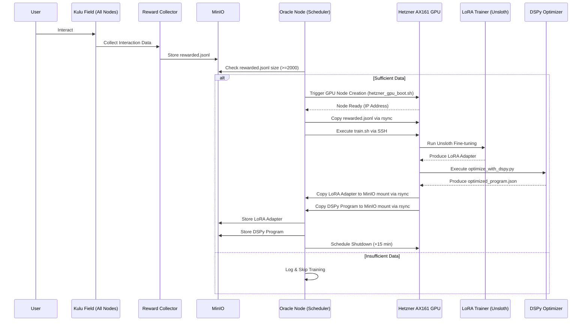
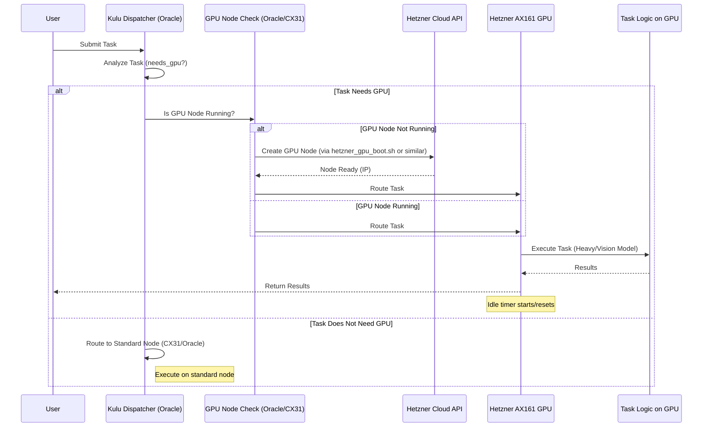
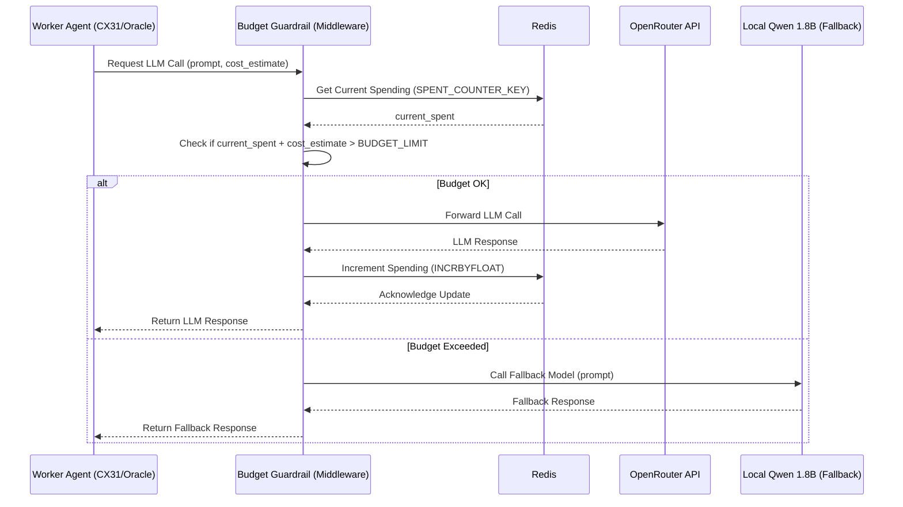

# Kulu Post-Deployment Enhancements: Master Build Document

**Version**: 1.0
**Date**: 2025-04-29

## 1. Introduction

This Master Build Document consolidates the core implementation scripts, configuration files, and architectural diagrams required to implement the post-deployment enhancements for the Kulu Node Orchestration System. These enhancements include nightly LoRA training, on-demand GPU bursting, OpenRouter budget control, and DSPy integration.

This document serves as a technical reference containing the actual code and visual representations of the system. It should be used in conjunction with the Comprehensive Build Guide, Backend Step-by-Step Guide, and Frontend Step-by-Step Guide.

## 2. Architectural Diagrams (Mermaid)

### 2.1 Overall Enhanced Infrastructure

```mermaid
graph TD
    subgraph Oracle Free Tier [Oracle Free Tier (Always-On)]
        direction LR
        O_Anchors[Anchor Agents]
        O_Controller[Field Breath Controller]
        O_Scheduler[Training Scheduler (check_and_train.py)]
        O_Dispatcher[Dispatcher]
        O_Model[Qwen 1.8B (Fallback)]
    end

    subgraph Hetzner CX31 [Hetzner CX31 (Persistent)]
        direction LR
        CX_Redis[Redis (State/Budget)]
        CX_MinIO[MinIO (Data/Adapters/DSPy)]
        CX_Fallback[Worker Fallback]
        CX_Gateway[API Gateway]
    end

    subgraph Hetzner AX161 [Hetzner AX161 GPU (On-Demand)]
        direction LR
        GPU_Trainer[LoRA Trainer (train.sh)]
        GPU_Optimizer[DSPy Optimizer (optimize_with_dspy.py)]
        GPU_Heavy[Heavy Workers]
        GPU_Vision[Vision Processor]
        GPU_Model_Heavy[Qwen 30B + LoRA]
        GPU_Model_Vision[Qwen-VL-Chat 14B]
    end

    subgraph External Services
        OpenRouter[OpenRouter API]
    end

    User[User] --> LocalNode[Local Node (Desktop App)]
    LocalNode --> CX_Gateway

    O_Scheduler -->|Triggers Boot| GPU_Trainer
    O_Dispatcher -->|Routes Task| CX_Fallback
    O_Dispatcher -->|Routes Task (GPU)| Hetzner AX161
    O_Dispatcher -->|Routes Task (Vision)| Hetzner AX161

    CX_Fallback -->|Budget OK| OpenRouter
    CX_Fallback -->|Budget Exceeded| O_Model
    CX_Fallback -->|State/Budget| CX_Redis

    Hetzner AX161 -->|State| CX_Redis
    Hetzner AX161 -->|Data/Adapters/DSPy| CX_MinIO

    O_Anchors -->|Pulses| CX_Redis
    O_Controller -->|Control| CX_Redis

    O_Scheduler -- Reads --> CX_MinIO
    GPU_Trainer -- Writes --> CX_MinIO
    GPU_Optimizer -- Writes --> CX_MinIO

    style Oracle Free Tier fill:#e6f7ff,stroke:#91d5ff
    style Hetzner CX31 fill:#f6ffed,stroke:#b7eb8f
    style Hetzner AX161 fill:#fffbe6,stroke:#ffe58f
    style External Services fill:#fafafa,stroke:#d9d9d9
```

### 2.2 LoRA Training Flow



### 2.3 GPU Burst Flow for Tasks



### 2.4 OpenRouter Budget Guardrail Flow



## 3. Implementation Files

### 3.1 GPU Node Management (`infra/gpu_boot/`)

**Purpose**: Scripts to manage the lifecycle of the on-demand Hetzner AX161 GPU node.

**`snapshot_id.txt`**
```text
# Replace with the actual ID of your Hetzner AX161 snapshot
YOUR_SNAPSHOT_ID_HERE
```
*Description*: Contains the Hetzner Snapshot ID used to create the GPU server. Must be created manually after preparing the snapshot.

**`hetzner_gpu_boot.sh`**
```bash
#!/usr/bin/env bash
set -euo pipefail

# --- Configuration ---
# Ensure HCLOUD_TOKEN is set in the environment where this script is run (e.g., systemd service)
# Ensure SSH key named 'default' is added to Hetzner Cloud project

# --- Paths & Variables ---
ROOT=$(dirname "$(readlink -f "$0")")
SNAPSHOT_ID_FILE="$ROOT/snapshot_id.txt"
TRAINER_SCRIPT="$ROOT/../trainer/train.sh"
OPTIMIZER_SCRIPT="$ROOT/../trainer/optimize_with_dspy.py" # Added DSPy script
LOCAL_REWARD_DATA="/data/rewarded.jsonl" # Path on the machine running this script (e.g., Oracle node MinIO mount)
REMOTE_DATA_DIR="/data"
REMOTE_REWARD_DATA="$REMOTE_DATA_DIR/rewarded.jsonl"
REMOTE_LORA_OUTPUT_DIR="$REMOTE_DATA_DIR/lora-new"
REMOTE_DSPY_OUTPUT_PATH="$REMOTE_DATA_DIR/dspy_optimized_program.json"
MINIO_ADAPTER_PATH="/mnt/minio/adapters/latest/" # Mount point for MinIO bucket
MINIO_DSPY_PATH="/mnt/minio/dspy/latest/"      # Mount point for MinIO bucket
SERVER_LABEL="role=gpu-burst"
SERVER_TYPE="ax161"
SERVER_LOCATION="fsn1"
SSH_USER="root"
SSH_KEY_NAME="default"
SHUTDOWN_DELAY="+15" # Shutdown delay in minutes after training finishes

# --- Input Validation ---
if [ ! -f "$SNAPSHOT_ID_FILE" ]; then
    echo "Error: Snapshot ID file not found at $SNAPSHOT_ID_FILE" >&2
    exit 1
fi

SNAPSHOT_ID=$(cat "$SNAPSHOT_ID_FILE")
if [ -z "$SNAPSHOT_ID" ]; then
    echo "Error: Snapshot ID is empty in $SNAPSHOT_ID_FILE" >&2
    exit 1
fi

if [ ! -f "$TRAINER_SCRIPT" ]; then
    echo "Error: Trainer script not found at $TRAINER_SCRIPT" >&2
    exit 1
fi

if [ ! -f "$OPTIMIZER_SCRIPT" ]; then
    echo "Error: DSPy optimizer script not found at $OPTIMIZER_SCRIPT" >&2
    exit 1
fi

if [ ! -f "$LOCAL_REWARD_DATA" ]; then
    echo "Error: Local reward data file not found at $LOCAL_REWARD_DATA" >&2
    exit 1
fi

# --- Server Creation ---
echo "Creating Hetzner GPU server ($SERVER_TYPE) from snapshot $SNAPSHOT_ID..."
SERVER_NAME="kulu-gpu-$(date +%s)"

SERVER_OUTPUT=$(hcloud server create --name "$SERVER_NAME" --type "$SERVER_TYPE" \
       --image "$SNAPSHOT_ID" --location "$SERVER_LOCATION" --ssh-key "$SSH_KEY_NAME" \
       --labels "$SERVER_LABEL" --format "{{ .ID }}:{{ .PublicNet.IPv4.IP }}")

if [ -z "$SERVER_OUTPUT" ] || [[ "$SERVER_OUTPUT" != *:* ]]; then
    echo "Error: Failed to create server or parse output." >&2
    exit 1
fi

SERVER_ID=$(echo "$SERVER_OUTPUT" | cut -d: -f1)
SERVER_IP=$(echo "$SERVER_OUTPUT" | cut -d: -f2)

echo "Server $SERVER_ID created with IP $SERVER_IP. Waiting for readiness..."
hcloud server wait "$SERVER_ID"
echo "Server $SERVER_ID is ready."

# --- Training & Optimization Execution --- 
# Use a function for cleanup on exit/error
cleanup() {
    echo "Initiating cleanup or shutdown for server $SERVER_ID ($SERVER_IP)..."
    # Attempt graceful shutdown with delay, ignore errors if already shutting down
    ssh -o StrictHostKeyChecking=no -o ConnectTimeout=10 "$SSH_USER@$SERVER_IP" "sudo shutdown -h $SHUTDOWN_DELAY" || echo "Shutdown command failed or server unreachable, manual check may be needed."
}
trap cleanup EXIT ERR

echo "Ensuring remote data directory exists: $REMOTE_DATA_DIR"
ssh -o StrictHostKeyChecking=no -o ConnectTimeout=10 "$SSH_USER@$SERVER_IP" "mkdir -p $REMOTE_DATA_DIR"

echo "Copying reward data to server $SERVER_ID ($SERVER_IP)..."
rsync -avq -e "ssh -o StrictHostKeyChecking=no -o ConnectTimeout=10" "$LOCAL_REWARD_DATA" "$SSH_USER@$SERVER_IP:$REMOTE_REWARD_DATA"

echo "Executing training script on server $SERVER_ID ($SERVER_IP)..."
ssh -o StrictHostKeyChecking=no -o ConnectTimeout=10 "$SSH_USER@$SERVER_IP" 'bash -s' < "$TRAINER_SCRIPT"
TRAIN_EXIT_CODE=$?

if [ $TRAIN_EXIT_CODE -ne 0 ]; then
    echo "Error: Training script failed with exit code $TRAIN_EXIT_CODE. Skipping DSPy optimization."
    # Cleanup trap will handle shutdown
    exit $TRAIN_EXIT_CODE
fi

echo "Training finished successfully. Executing DSPy optimization script..."
ssh -o StrictHostKeyChecking=no -o ConnectTimeout=10 "$SSH_USER@$SERVER_IP" 'bash -c "cd $(dirname $(readlink -f $(which python)))/../.. && python3 $(readlink -f '$OPTIMIZER_SCRIPT')"' # Ensure correct execution context for python
DSPY_EXIT_CODE=$?

if [ $DSPY_EXIT_CODE -ne 0 ]; then
    echo "Warning: DSPy optimization script failed with exit code $DSPY_EXIT_CODE. Proceeding with adapter copy."
    # Decide if this should be a fatal error
fi

echo "Copying LoRA adapter back from server $SERVER_ID ($SERVER_IP)..."
mkdir -p "$MINIO_ADAPTER_PATH"
rsync -avq -e "ssh -o StrictHostKeyChecking=no -o ConnectTimeout=10" "$SSH_USER@$SERVER_IP:$REMOTE_LORA_OUTPUT_DIR/" "$MINIO_ADAPTER_PATH"
echo "LoRA adapter copied to $MINIO_ADAPTER_PATH."

if [ $DSPY_EXIT_CODE -eq 0 ]; then
    echo "Copying optimized DSPy program back from server $SERVER_ID ($SERVER_IP)..."
    mkdir -p "$MINIO_DSPY_PATH"
    rsync -avq -e "ssh -o StrictHostKeyChecking=no -o ConnectTimeout=10" "$SSH_USER@$SERVER_IP:$REMOTE_DSPY_OUTPUT_PATH" "$MINIO_DSPY_PATH"
    echo "Optimized DSPy program copied to $MINIO_DSPY_PATH."
fi

echo "Training and optimization process complete. Server $SERVER_ID will shut down in $SHUTDOWN_DELAY minutes."

# Cleanup trap will handle the shutdown command
exit 0
```
*Description*: Creates GPU server, copies data, runs training (`train.sh`), runs DSPy optimization (`optimize_with_dspy.py`), copies results (LoRA adapter, DSPy program) back to MinIO mounts, and schedules server shutdown.

**`hetzner_gpu_shutdown.sh`**
```bash
#!/usr/bin/env bash
set -euo pipefail

# --- Configuration ---
# Ensure HCLOUD_TOKEN is set in the environment where this script is run
SERVER_LABEL="role=gpu-burst"

# --- Logic ---
echo "Searching for stopped servers with label '$SERVER_LABEL'..."

# Get IDs of servers that are off and have the specified label
SERVER_IDS=$(hcloud server list --selector "$SERVER_LABEL" --output json | jq -r '.[] | select(.status=="off") | .id')

if [ -z "$SERVER_IDS" ]; then
    echo "No stopped servers found with label $SERVER_LABEL. Nothing to delete."
    exit 0
fi

echo "Found stopped servers to delete:"
echo "$SERVER_IDS"

# Loop through IDs and delete each server
while IFS= read -r ID; do
    if [ -n "$ID" ]; then
        echo "Deleting server $ID..."
        hcloud server delete "$ID"
        if [ $? -eq 0 ]; then
            echo "Server $ID deleted successfully."
        else
            echo "Warning: Failed to delete server $ID. Manual check may be needed." >&2
        fi
    fi
done <<< "$SERVER_IDS"

echo "Cleanup process finished."
exit 0
```
*Description*: Finds and deletes stopped Hetzner servers tagged with `role=gpu-burst`.

### 3.2 LoRA Training & DSPy Optimization (`infra/trainer/`)

**Purpose**: Scripts and dependencies for fine-tuning the Qwen model and optimizing prompts with DSPy on the GPU node.

**`requirements.txt`**
```text
# Core dependencies for Unsloth LoRA training
unsloth[conda-new]>=2024.4 # Use conda version for potential compatibility

# Qwen model support (often included with unsloth, but explicit is safer)
transformers>=4.40.0

# Dependencies for 4-bit quantization and flash attention
# These are often installed via unsloth's setup, but listed for clarity
bitsandbytes>=0.43.0
accelerate>=0.29.3
xformers # Recommended by Unsloth for Flash Attention 2
# flash-attn # Usually installed via `pip install "unsloth[conda-new]" --no-deps` if needed, handled by unsloth install

# For validation script
torch>=2.1.1 # Match Unsloth's typical torch version

# DSPy Integration
dspy-ai>=2.4.3 # Add DSPy library

# Optional: For potential data processing or advanced features
# datasets # If using Hugging Face datasets library
# peft # If needing direct PEFT access (usually handled by unsloth)
```
*Description*: Lists Python dependencies required on the GPU node snapshot for training and DSPy optimization.

**`train.sh`**
```bash
#!/usr/bin/env bash
set -euo pipefail

# --- Configuration ---
CONDA_ENV_NAME="kulu-qwen" # Ensure this matches the environment on the snapshot
MODEL_NAME="Qwen/Qwen1.5-32B-Chat" # Base model identifier for Unsloth
DATASET_PATH="/data/rewarded.jsonl"
OUTPUT_DIR="/data/lora-new"
LORA_RANK=64
EPOCHS=1
MICRO_BATCH_SIZE=4
VALIDATION_SAMPLE_SIZE=20

# --- Environment Setup ---
echo "Activating Conda environment: $CONDA_ENV_NAME..."
# Attempt to source bashrc to get conda command, handle potential errors
source ~/.bashrc || echo "Warning: Failed to source ~/.bashrc. Conda command might not be available."

# Activate the environment
conda activate "$CONDA_ENV_NAME"
if [ $? -ne 0 ]; then
    echo "Error: Failed to activate Conda environment '$CONDA_ENV_NAME'. Ensure it exists on the snapshot." >&2
    exit 1
fi
echo "Conda environment activated."

# --- Training ---
echo "Starting Unsloth LoRA fine-tuning..."
unsloth finetune \
   --model "$MODEL_NAME" \
   --dataset "$DATASET_PATH" \
   --dataset_field "prompt" \ # Assuming JSONL has a "prompt" field containing the text
   --lora_rank "$LORA_RANK" \
   --load_in_4bit \
   --use_gradient_checkpointing \
   --lora_target_modules "all-linear" \
   --max_seq_length 2048 \
   --learning_rate 2e-4 \
   --fp16 \
   --logging_steps 1 \
   --optim "adamw_8bit" \
   --warmup_steps 10 \
   --num_train_epochs "$EPOCHS" \
   --per_device_train_batch_size "$MICRO_BATCH_SIZE" \
   --gradient_accumulation_steps 4 \
   --output_dir "$OUTPUT_DIR"

echo "Fine-tuning complete. Output saved to $OUTPUT_DIR."

# --- Validation (Optional but Recommended) ---
echo "Performing validation check on $VALIDATION_SAMPLE_SIZE samples..."
python - <<PY
import json, random, torch, sys
from transformers import AutoModelForCausalLM, AutoTokenizer

try:
    # Load tokenizer and model from the newly trained adapter directory
    tok = AutoTokenizer.from_pretrained("$OUTPUT_DIR")
    mod = AutoModelForCausalLM.from_pretrained(
        "$OUTPUT_DIR",
        torch_dtype=torch.float16,
        device_map="auto"
    )

    # Read dataset
    with open("$DATASET_PATH", 'r') as f:
        lines = f.readlines()

    if len(lines) < $VALIDATION_SAMPLE_SIZE:
        print(f"Warning: Dataset has fewer lines ({len(lines)}) than validation sample size ({$VALIDATION_SAMPLE_SIZE}). Using all lines.")
        sample_lines = lines
    else:
        sample_lines = random.sample(lines, $VALIDATION_SAMPLE_SIZE)

    total_loss = 0
    valid_samples = 0
    for line in sample_lines:
        try:
            data = json.loads(line)
            # Assuming the JSONL structure is {"prompt": "..."}
            prompt = data.get("prompt")
            if not prompt:
                print(f"Warning: Skipping line due to missing 'prompt' field: {line.strip()}")
                continue

            inputs = tok(prompt, return_tensors="pt").to("cuda")
            # Use input_ids as labels for causal LM loss calculation
            outputs = mod(**inputs, labels=inputs["input_ids"])
            loss = outputs.loss.item()
            total_loss += loss
            valid_samples += 1
            # print(f"Sample loss: {loss}") # Uncomment for detailed loss per sample
        except json.JSONDecodeError:
            print(f"Warning: Skipping invalid JSON line: {line.strip()}")
        except Exception as e:
            print(f"Warning: Error processing line: {line.strip()}. Error: {e}")

    if valid_samples > 0:
        avg_loss = total_loss / valid_samples
        print(f"Validation Average Loss ({valid_samples} samples): {avg_loss}")
    else:
        print("Error: No valid samples found for validation.")
        sys.exit(1) # Indicate validation failure

except Exception as e:
    print(f"Error during validation: {e}")
    sys.exit(1) # Indicate validation failure

print("Validation check finished.")
PY

if [ $? -ne 0 ]; then
    echo "Error: Validation script failed." >&2
    # Decide if failure should prevent adapter upload - currently it doesn't stop the script
    # exit 1 # Uncomment to make validation failure critical
fi

echo "Training script finished successfully."
exit 0
```
*Description*: Activates conda environment, runs Unsloth LoRA fine-tuning on Qwen-30B using `rewarded.jsonl`, and performs an optional validation loss check.

**`optimize_with_dspy.py`**
```python
#!/usr/bin/env python3
import dspy
import torch
import json
import random
import logging
import os
import shutil
from transformers import AutoModelForCausalLM, AutoTokenizer
from peft import PeftModel # To load LoRA adapter

# --- Configuration ---
BASE_MODEL_NAME = "Qwen/Qwen1.5-32B-Chat" # Must match train.sh
ADAPTER_PATH = "/data/lora-new" # Path where train.sh saves the adapter
DATASET_PATH = "/data/rewarded.jsonl"
DSPY_OUTPUT_PATH = "/data/dspy_optimized_program.json" # Where to save the optimized DSPy program
MINIO_DSPY_PATH = "/mnt/minio/dspy/latest/" # Mount point for MinIO bucket to save the final program

# DSPy Configuration
DSPY_TRAINSET_SIZE = 100 # Number of examples from rewarded.jsonl to use for DSPy optimization
DSPY_DEVSET_SIZE = 50   # Number of examples for validation during optimization

# --- Logging Setup ---
logging.basicConfig(level=logging.INFO, format='%(asctime)s - %(levelname)s - %(message)s')
logger = logging.getLogger(__name__)

# --- DSPy Program Definition (Example) ---
# Define a simple signature based on expected use case (e.g., code generation, financial analysis)
# This needs refinement based on the actual content of rewarded.jsonl
class KuluTaskSignature(dspy.Signature):
    """Given a context and a request, generate the appropriate response (e.g., code, analysis)."""
    context = dspy.InputField(desc="Relevant background information or previous conversation.")
    request = dspy.InputField(desc="The specific user request or task.")
    response = dspy.OutputField(desc="The generated code, analysis, or answer.")

# --- Data Loading for DSPy ---
def load_dspy_dataset(filepath, num_train, num_dev):
    """Loads data from JSONL and converts to DSPy Examples."""
    examples = []
    try:
        with open(filepath, "r") as f:
            for line in f:
                try:
                    data = json.loads(line)
                    # --- Adapt this based on rewarded.jsonl structure --- 
                    # Assuming structure like: {"context": "...", "request": "...", "response": "..."}
                    # Or maybe just {"prompt": "context+request", "completion": "response"}
                    # If it's just prompt/completion, we need to parse context/request
                    context = data.get("context", "") # Provide default if missing
                    request = data.get("request", data.get("prompt")) # Use prompt if request missing
                    response = data.get("response", data.get("completion"))

                    if request and response:
                        # Ensure response is treated as the gold standard label
                        examples.append(dspy.Example(context=context, request=request, response=response).with_inputs("context", "request"))
                    else:
                        logger.warning(f"Skipping line due to missing fields: {line.strip()}")
                except json.JSONDecodeError:
                    logger.warning(f"Skipping invalid JSON line: {line.strip()}")
    except FileNotFoundError:
        logger.error(f"Dataset file not found: {filepath}")
        return [], []
    except Exception as e:
        logger.error(f"Error loading dataset {filepath}: {e}")
        return [], []

    if not examples:
        logger.error("No valid examples loaded from dataset.")
        return [], []

    random.shuffle(examples)
    total_needed = num_train + num_dev
    if len(examples) < total_needed:
        logger.warning(f"Dataset size ({len(examples)}) is smaller than requested train+dev size ({total_needed}). Using all available data.")
        num_train = int(len(examples) * (num_train / total_needed)) if total_needed > 0 else 0
        num_dev = len(examples) - num_train

    trainset = examples[:num_train]
    devset = examples[num_train:num_train + num_dev]
    logger.info(f"Loaded {len(trainset)} training examples and {len(devset)} development examples for DSPy.")
    return trainset, devset

# --- Main Optimization Logic ---
def main():
    logger.info("Starting DSPy optimization process...")

    # 1. Load Data
    trainset, devset = load_dspy_dataset(DATASET_PATH, DSPY_TRAINSET_SIZE, DSPY_DEVSET_SIZE)
    if not trainset or not devset:
        logger.error("Cannot proceed without training and development data for DSPy.")
        return 1 # Indicate failure

    # 2. Configure Language Model (Load fine-tuned model)
    try:
        logger.info(f"Loading base model {BASE_MODEL_NAME}...")
        # Load base model in 4-bit
        model = AutoModelForCausalLM.from_pretrained(
            BASE_MODEL_NAME,
            torch_dtype=torch.float16,
            load_in_4bit=True,
            device_map="auto"
        )
        logger.info(f"Loading LoRA adapter from {ADAPTER_PATH}...")
        # Apply the LoRA adapter
        # Ensure the adapter is loaded correctly onto the base model
        model = PeftModel.from_pretrained(model, ADAPTER_PATH)
        model.eval() # Set to evaluation mode

        tokenizer = AutoTokenizer.from_pretrained(ADAPTER_PATH) # Load tokenizer from adapter dir

        # Configure DSPy HFModel
        llm = dspy.HFModel(model=model, tokenizer=tokenizer, is_client=False)
        dspy.settings.configure(lm=llm)
        logger.info("DSPy LM configured with fine-tuned Qwen model.")

    except Exception as e:
        logger.error(f"Failed to load model or configure DSPy LM: {e}")
        return 1 # Indicate failure

    # 3. Define DSPy Program
    # Simple Predict module for this example
    program = dspy.Predict(KuluTaskSignature)

    # 4. Define Evaluation Metric (Example: Exact Match on response)
    # Replace with a more suitable metric (e.g., ROUGE, BLEU, custom validation)
    # The metric function should compare prediction.response with gold.response
    def validate_response(gold, pred, trace=None):
        return gold.response == pred.response

    metric = validate_response

    # 5. Configure Optimizer (BootstrapFewShot with max_bootstrapped_demos=4)
    optimizer = dspy.BootstrapFewShot(metric=metric, max_bootstrapped_demos=4)

    # 6. Compile (Optimize) the Program
    try:
        logger.info("Compiling DSPy program with BootstrapFewShot optimizer...")
        optimized_program = optimizer.compile(program, trainset=trainset, valset=devset)
        logger.info("DSPy program compilation finished.")
    except Exception as e:
        logger.error(f"Error during DSPy compilation: {e}")
        return 1 # Indicate failure

    # 7. Save the Optimized Program
    try:
        optimized_program.save(DSPY_OUTPUT_PATH)
        logger.info(f"Optimized DSPy program saved to {DSPY_OUTPUT_PATH}")

        # Copy to MinIO mount point
        os.makedirs(MINIO_DSPY_PATH, exist_ok=True)
        final_save_path = os.path.join(MINIO_DSPY_PATH, os.path.basename(DSPY_OUTPUT_PATH))
        shutil.copyfile(DSPY_OUTPUT_PATH, final_save_path)
        logger.info(f"Optimized program copied to MinIO path: {final_save_path}")

    except Exception as e:
        logger.error(f"Failed to save or copy optimized DSPy program: {e}")
        return 1 # Indicate failure

    logger.info("DSPy optimization process completed successfully.")
    return 0 # Indicate success

if __name__ == "__main__":
    exit_code = main()
    exit(exit_code)
```
*Description*: Loads the newly trained LoRA adapter, prepares data, defines and optimizes a DSPy program using the fine-tuned model, saves the optimized program, and copies it to MinIO.

### 3.3 Training Trigger (`infra/oracle_timers/`)

**Purpose**: Components running on the Oracle node to check for training data and trigger the GPU node boot process.

**`check_and_train.py`**
```python
#!/usr/bin/env python3
import subprocess
import pathlib
import sys
import logging

# --- Configuration ---
# Path to the collected reward data file (adjust if needed, e.g., MinIO mount)
REWARD_DATA_PATH = pathlib.Path("/data/rewarded.jsonl")
# Minimum number of lines required in the reward data file to trigger training
MIN_LINES_THRESHOLD = 2000
# Path to the script that boots the GPU node and starts training
GPU_BOOT_SCRIPT_PATH = "/home/ubuntu/kulu_orchestration/infra/gpu_boot/hetzner_gpu_boot.sh"
# Log file location
LOG_FILE = "/var/log/kulu_train_check.log"

# --- Logging Setup ---
logging.basicConfig(
    level=logging.INFO,
    format='%(asctime)s - %(levelname)s - %(message)s',
    handlers=[
        logging.FileHandler(LOG_FILE),
        logging.StreamHandler(sys.stdout) # Also print to stdout/journal
    ]
)

# --- Main Logic ---
def main():
    logging.info("Starting check for LoRA training trigger.")

    # Check if the reward data file exists
    if not REWARD_DATA_PATH.exists():
        logging.warning(f"Reward data file not found at {REWARD_DATA_PATH}. Skipping training trigger.")
        sys.exit(0)

    # Count the number of lines in the file
    try:
        with REWARD_DATA_PATH.open("r") as f:
            line_count = sum(1 for _ in f)
        logging.info(f"Found {line_count} lines in {REWARD_DATA_PATH}.")
    except Exception as e:
        logging.error(f"Error reading reward data file {REWARD_DATA_PATH}: {e}")
        sys.exit(1)

    # Check if the line count meets the threshold
    if line_count >= MIN_LINES_THRESHOLD:
        logging.info(f"Line count ({line_count}) meets threshold ({MIN_LINES_THRESHOLD}). Triggering GPU training.")
        try:
            # Ensure the boot script is executable
            subprocess.run(["chmod", "+x", GPU_BOOT_SCRIPT_PATH], check=True)

            # Execute the GPU boot script
            result = subprocess.run(
                [GPU_BOOT_SCRIPT_PATH],
                check=True, # Raise exception on non-zero exit code
                capture_output=True, # Capture stdout/stderr
                text=True # Decode stdout/stderr as text
            )
            logging.info(f"GPU boot script executed successfully. Output:\n{result.stdout}")
            # Optionally, clear or archive the reward file after successful trigger
            # logging.info(f"Archiving or clearing {REWARD_DATA_PATH}...")
            # REWARD_DATA_PATH.unlink() # Example: Delete file

        except FileNotFoundError:
            logging.error(f"Error: GPU boot script not found at {GPU_BOOT_SCRIPT_PATH}")
            sys.exit(1)
        except subprocess.CalledProcessError as e:
            logging.error(f"Error executing GPU boot script {GPU_BOOT_SCRIPT_PATH}. Exit code: {e.returncode}")
            logging.error(f"Stdout:\n{e.stdout}")
            logging.error(f"Stderr:\n{e.stderr}")
            sys.exit(1)
        except Exception as e:
            logging.error(f"An unexpected error occurred while running the GPU boot script: {e}")
            sys.exit(1)
    else:
        logging.info(f"Line count ({line_count}) is below threshold ({MIN_LINES_THRESHOLD}). No training triggered.")

    logging.info("Check finished.")
    sys.exit(0)

if __name__ == "__main__":
    main()
```
*Description*: Checks if `rewarded.jsonl` (on MinIO mount) meets the line threshold and executes `hetzner_gpu_boot.sh` if it does.

**`kulu-train.service`**
```systemd
[Unit]
Description=Kulu Nightly GPU LoRA Training Trigger Service
After=network-online.target mnt-minio.mount # Ensure network and MinIO mount are ready
Requires=mnt-minio.mount

[Service]
Type=oneshot
User=ubuntu # Assuming the scripts and data are accessible by the ubuntu user
Group=ubuntu

# Environment variable for Hetzner Cloud API Token
# Option 1: Place token directly here (less secure)
# Environment=HCLOUD_TOKEN=YOUR_HCLOUD_TOKEN_HERE

# Option 2: Load from an environment file (more secure)
# Place HCLOUD_TOKEN=YOUR_HCLOUD_TOKEN_HERE in /etc/kulu/environment
# EnvironmentFile=/etc/kulu/environment

# Option 3: Use systemd credentials (most secure)
# LoadCredential=hcloud_token:/etc/kulu/hcloud_token.cred
# Environment=HCLOUD_TOKEN=%I{hcloud_token}

# --- IMPORTANT: Choose ONE Environment option above and configure it --- 
# --- Make sure the chosen file/credential exists and has correct permissions --- 

# Working directory (optional, if scripts use relative paths)
# WorkingDirectory=/opt/kulu/

# Command to execute the check script
ExecStart=/usr/bin/python3 /home/ubuntu/kulu_orchestration/infra/oracle_timers/check_and_train.py

# Optional: Add resource limits if needed
# MemoryLimit=1G
# CPUQuota=50%

[Install]
WantedBy=multi-user.target
```
*Description*: Systemd service unit to run `check_and_train.py`. Requires network and MinIO mount. Securely provide `HCLOUD_TOKEN`.

**`kulu-train.timer`**
```systemd
[Unit]
Description=Kulu Nightly GPU LoRA Training Timer
Requires=kulu-train.service

[Timer]
Unit=kulu-train.service

# Run daily at 02:00 server time
OnCalendar=*-*-* 02:00:00

# Add randomized delay up to 1 hour to avoid thundering herd
RandomizedDelaySec=3600

# Ensure the timer persists across reboots
Persistent=true

# Wake the system from suspend if necessary (may not apply to cloud VMs but good practice)
WakeSystem=true

# Accuracy within 1 minute
AccuracySec=1min

[Install]
WantedBy=timers.target
```
*Description*: Systemd timer unit to trigger `kulu-train.service` nightly. **Note**: Cannot be enabled directly in the current environment; requires an alternative trigger mechanism post-deployment.

### 3.4 Budget Guardrail (`core/budget_guardrail.py`)

**Purpose**: Controls spending on the OpenRouter API.

**`budget_guardrail.py`**
```python
#!/usr/bin/env python3
import redis
import os
import time
import logging
from functools import wraps

# --- Configuration ---
REDIS_HOST = os.getenv("KULU_REDIS_HOST", "localhost")
REDIS_PORT = int(os.getenv("KULU_REDIS_PORT", 6379))
REDIS_DB = int(os.getenv("KULU_REDIS_DB", 0))
REDIS_PASSWORD = os.getenv("KULU_REDIS_PASSWORD", None)

# Budget configuration
MONTHLY_BUDGET_USD = float(os.getenv("KULU_OPENROUTER_BUDGET_USD", 30.0))
SPENT_COUNTER_KEY = "kulu:openrouter_spent_usd"
LAST_RESET_KEY = "kulu:openrouter_last_reset"

# --- Logging ---
logger = logging.getLogger(__name__)
# Configure logger if needed, assuming Kulu has a central logging setup

# --- Redis Connection ---
def get_redis_connection():
    """Establishes a connection to Redis."""
    try:
        r = redis.Redis(
            host=REDIS_HOST,
            port=REDIS_PORT,
            db=REDIS_DB,
            password=REDIS_PASSWORD,
            decode_responses=True # Decode responses to strings
        )
        r.ping() # Verify connection
        logger.info(f"Connected to Redis at {REDIS_HOST}:{REDIS_PORT}")
        return r
    except redis.exceptions.ConnectionError as e:
        logger.error(f"Failed to connect to Redis at {REDIS_HOST}:{REDIS_PORT}: {e}")
        return None
    except Exception as e:
        logger.error(f"An unexpected error occurred during Redis connection: {e}")
        return None

# --- Budget Management ---
def check_and_reset_budget(r: redis.Redis):
    """Checks if the budget needs resetting (start of month) and resets if necessary."""
    current_month = time.strftime("%Y-%m")
    last_reset_month = r.get(LAST_RESET_KEY)

    if last_reset_month != current_month:
        logger.info(f"Start of new month ({current_month}). Resetting OpenRouter budget.")
        r.set(SPENT_COUNTER_KEY, "0.0")
        r.set(LAST_RESET_KEY, current_month)
        return 0.0
    else:
        spent_str = r.get(SPENT_COUNTER_KEY)
        return float(spent_str) if spent_str else 0.0

def get_current_spending(r: redis.Redis) -> float:
    """Gets the current spending for the month, resetting if necessary."""
    if r is None:
        logger.warning("Redis connection not available. Cannot check budget.")
        return 0.0 # Assume budget is available if Redis fails?
    return check_and_reset_budget(r)

def increment_spending(r: redis.Redis, cost_usd: float):
    """Increments the spending counter in Redis."""
    if r is None:
        logger.warning("Redis connection not available. Cannot update spending.")
        return
    try:
        # Use INCRBYFLOAT for atomic increment
        new_spent = r.incrbyfloat(SPENT_COUNTER_KEY, cost_usd)
        logger.info(f"Incremented OpenRouter spending by ${cost_usd:.4f}. New total: ${new_spent:.4f}")
    except Exception as e:
        logger.error(f"Failed to increment spending in Redis: {e}")

# --- Decorator/Wrapper --- 
def openrouter_budget_guard(cost_usd_per_call: float):
    """
    Decorator to wrap an OpenRouter API call function.

    Checks the budget before allowing the call. If over budget,
    it calls a fallback function instead.

    Args:
        cost_usd_per_call: Estimated cost of a single API call in USD.
                           (Note: This is an estimate; actual cost might vary).
    """
    def decorator(openrouter_func):
        @wraps(openrouter_func)
        def wrapper(*args, **kwargs):
            # Assumes the fallback function is available in the scope
            # or passed as an argument, e.g., kwargs["fallback_func"]
            fallback_func = kwargs.get("fallback_func", None)
            if fallback_func is None:
                 # Define a default fallback or raise an error
                 # This example assumes a function `local_qwen_small_fallback` exists
                 try:
                     # Adjust import path based on Kulu's structure
                     from kulu_orchestration.core.fallback_models import local_qwen_small_fallback
                     fallback_func = local_qwen_small_fallback
                 except ImportError:
                     logger.error("No fallback function provided or found. Cannot proceed.")
                     # Return a specific error or raise an exception
                     return {"error": "OpenRouter budget exceeded, no fallback available."}

            r = get_redis_connection()
            if r is None:
                logger.warning("Redis unavailable, falling back to local model.")
                return fallback_func(*args, **kwargs)

            current_spent = get_current_spending(r)

            if current_spent + cost_usd_per_call > MONTHLY_BUDGET_USD:
                logger.warning(f"OpenRouter budget limit (${MONTHLY_BUDGET_USD:.2f}) reached or exceeded (current: ${current_spent:.4f}, call cost: ${cost_usd_per_call:.4f}). Falling back.")
                return fallback_func(*args, **kwargs)
            else:
                logger.info(f"OpenRouter budget OK (current: ${current_spent:.4f}). Proceeding with API call.")
                try:
                    # Call the original OpenRouter function
                    result = openrouter_func(*args, **kwargs)
                    # Increment spending *after* a successful call
                    increment_spending(r, cost_usd_per_call)
                    return result
                except Exception as e:
                    logger.error(f"Error during OpenRouter API call: {e}")
                    # Decide if fallback should be called on error
                    # return fallback_func(*args, **kwargs)
                    raise # Re-raise the exception

        return wrapper
    return decorator

# --- Example Fallback (Needs to be in fallback_models.py or similar) ---
# File: kulu_orchestration/core/fallback_models.py
# def local_qwen_small_fallback(*args, **kwargs):
#     logger.info("Executing fallback using local Qwen 1.8B model.")
#     # Add logic to call the local Qwen 1.8B model (e.g., via Ollama on Oracle/CX31)
#     prompt = kwargs.get("prompt", args[0] if args else "")
#     # Replace with actual call
#     response = f"Fallback response for: {prompt[:50]}..."
#     return {"fallback_response": response}

```
*Description*: Provides a Python decorator to wrap OpenRouter calls, check spending against a budget stored in Redis, and trigger a fallback function if the budget is exceeded.

### 3.5 Dispatcher Rules (`config/dispatcher_rules.yaml`)

**Purpose**: Defines rules for routing tasks to the appropriate compute tier.

**`dispatcher_rules.yaml`**
```yaml
# Kulu Dispatcher Rules for GPU and Vision Tasks
# This configuration defines rules for routing tasks to the appropriate compute tier,
# specifically identifying tasks that require the on-demand Hetzner AX161 GPU node.

dispatch_rules:
  - rule_name: "heavy_trade_backtest"
    description: "Route heavy trading backtests to GPU node."
    match:
      domain: "trade"
      complexity: "high" # Assumes complexity is estimated or tagged
    action:
      target_node_type: "gpu_burst" # Route to AX161
      set_flags:
        needs_gpu: true
        needs_vision: false
      model_preference: "Qwen/Qwen1.5-32B-Chat-LoRA" # Prefer the fine-tuned model

  - rule_name: "large_code_changes"
    description: "Route tasks involving large code changes to GPU node for deeper analysis."
    match:
      domain: "code"
      # Assuming a metric like estimated lines changed or number of files
      files_changed: ">500" # Example threshold
    action:
      target_node_type: "gpu_burst"
      set_flags:
        needs_gpu: true
        needs_vision: false
      model_preference: "Qwen/Qwen1.5-32B-Chat-LoRA"

  - rule_name: "image_input_vision_task"
    description: "Route tasks with image input to GPU node with vision model."
    match:
      input_type: "image"
    action:
      target_node_type: "gpu_burst"
      set_flags:
        needs_gpu: true
        needs_vision: true
      model_preference: "Qwen/Qwen-VL-Chat-14B" # Specify the vision model

  - rule_name: "screenshot_analysis"
    description: "Route screenshot analysis tasks to GPU node with vision model."
    match:
      task_type: "screenshot_analysis"
    action:
      target_node_type: "gpu_burst"
      set_flags:
        needs_gpu: true
        needs_vision: true
      model_preference: "Qwen/Qwen-VL-Chat-14B"

  # --- Default Rule (Example) ---
  # This rule might catch tasks not matching above, routing them to standard nodes
  # - rule_name: "default_routing"
  #   description: "Default routing for tasks not requiring GPU."
  #   match: {}
  #   action:
  #     target_node_type: "standard" # e.g., Oracle or CX31 worker
  #     set_flags:
  #       needs_gpu: false
  #       needs_vision: false
  #     model_preference: "OpenRouter/Gemini-2.5" # Or Qwen-1.8B based on budget
```
*Description*: YAML file defining rules based on task attributes (domain, complexity, input type) to determine if a task requires the GPU node and/or vision capabilities.

## 4. Conclusion

This document provides the core code and configuration artifacts for the Kulu post-deployment enhancements. Refer to the accompanying guides for step-by-step instructions and architectural context.
