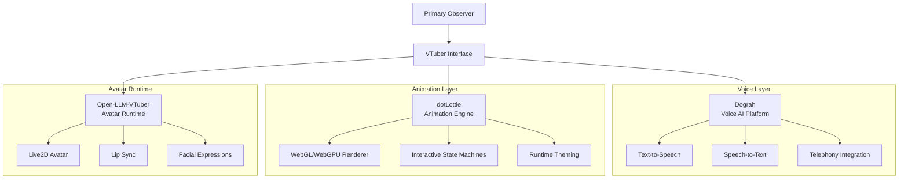

# 🎭 VTuber Integration

> **Status:** Infrastructure Ready | **Voice:** Dograh | **Animation:** dotLottie

---

## Overview

VTuber Integration provides the voice and visual interface for the Primary Observer (PO). It combines voice AI, animation, and avatar runtime into a unified embodiment layer.

---

## Architecture



---

## Components

### Open-LLM-VTuber (`Open-LLM-VTuber/`)
Avatar runtime system. Connects LLM output to Live2D avatar with lip sync and expressions.

- **Model:** Any OpenAI-compatible LLM
- **Avatar:** Live2D model support
- **Features:** Lip sync, facial expressions, voice cloning

### Dograh (`dograh/`)
Self-hosted voice AI platform. Fork of [dograh-hq/dograh](https://github.com/dograh-hq/dograh).

- **TTS/STT:** Multi-engine voice synthesis
- **Telephony:** Twilio, Vonage integration
- **MCP:** Native MCP server support
- **Self-hosted:** Docker compose, one command

```bash
cd dograh
docker compose up -d
# Open http://localhost:3010
```

### dotLottie (`dotlottie-web/`)
Lottie animation player. Fork of [LottieFiles/dotlottie-web](https://github.com/LottieFiles/dotlottie-web).

- **Renderers:** Software, WebGL2, WebGPU
- **Features:** State machines, runtime theming, audio sync
- **Frameworks:** React, Vue, Svelte, Solid, Web Component

---

## Integration Points

| Component | OCE Layer | Protocol |
|-----------|-----------|----------|
| Dograh | Voice API | HTTP REST |
| dotLottie | Frontend | npm package |
| Open-LLM-VTuber | PO Interface | WebSocket |

---

## Related Documents

- `../ARCHITECTURE.md` — Full system architecture
- `../oce/ARCHITECTURE.md` — OCE backend architecture
